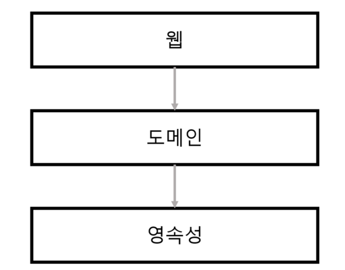
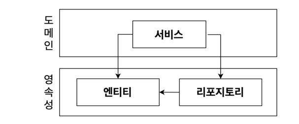
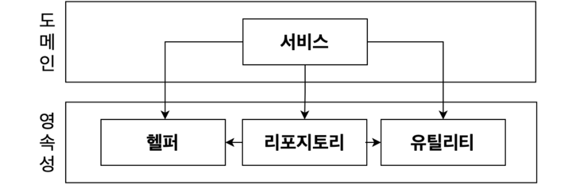
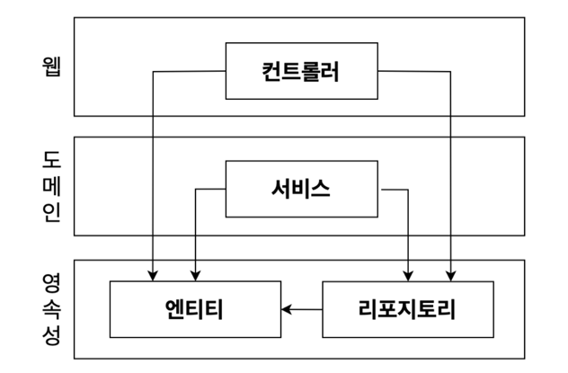
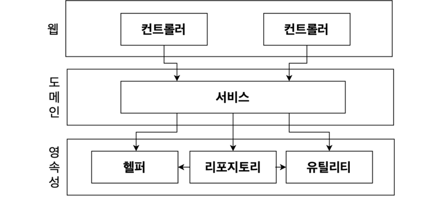

# 1일차 2024-06-20 p.1 ~ 11

##  01 계층형 아키텍처의 문제는 무엇일까?

계층을 이용하는 사고 방식은 컴퓨너 과학 수업이나 튜토리얼,
모범사례를 통해 우리에게 주입돼 왔다. 
심지어 <Software Architecture Patterns>  를 포함한 여러 책에서도 
계층에 대해 배웠다.

< 웹 계층 , 도메인 계층 , 영속성 계층으로 구성된 전통적인 웹 애플리케이션 구조 >

맨 위의 웹 계층에서는 요청을 받아 도메인 혹은 비즈니스 계층에 있는 서비스로 요청을 보낸다. 
서비스에서는 필요한 비즈니스 로직을 수행하고, 도메인 엔티티의 현재 상태를 조회하거나 변경하기 위해
영속성 계층의 컴포넌트를 호출한다. 

사실 계층형 아키텍처는 견고한 아키텍터 패턴이다. 
계층을 잘 이해하고 구성한다면 웹 계층이나 영속성 계층에 독립적으로 도메인 로직을
작성할 수 있다.
원한다면 도메인 로직에 영향을 주지 않고 웹 계층과 영속성 계층에 사용된 기술을 변경할 수 있다.

기존 기능에 영향을 주지 않고 새로운 기능을 추가할 수도 있다. 

잘 만들어진 계층형 아키텍처는 선택의 폭을 넓히고 변화하는 요구사항과 외부 요인에 빠르게 적응할 수 있게 해준다.

그렇다면 계층형 아키텍처의 문제점은 무엇일까?

내 경험에 의하면 계층형 아키텍처는 코드에 나쁜 습관들이 스며들기 쉽게 만들고 시간이 지날수록 소프트웨어를 점점 더
변경하기 어렵게 만드는 수많은 허점들을 노출한다. 

### 계층형 아키텍처는 데이터베이스 주도 설계를 유도한다.

정의에 따르면 전통적인 계층형 아키텍처의 토대는 데이터베이스다.

웹 계층은 도메인 계층에 의존하고, 도메인 계층은 영속성 계층에 의존하기 때문에 자연스레 데이터베이스에 의존하게 된다.

모든 것이 영속성 계층을 토대로 만들어진다. 이런 방식은 다양한 이유로 문제를 초래 한다.

우리가 만드는 대부분의 애플리케이션의 목적이 무엇인지 생각해보자. 
우리는 보통 비즈니스를 관장하는 규칙이나 정책을 반영한 모델을 만들어서 사용자가 이러한 규칙과 정책을 더욱 편리하게 활용할 수 있게 한다.

이때 우리는 상태가 아니라 행동을 중심으로 모델링한다. 어떤 애플리케이션이든 상태가 중요한 요소이긴 하지만 행동이 상태를 바꾸는 주체이기 때문에 행동이 비즈니스를 이끌어간다.

그렇다면 우리는 왜 '도메인 로직' 이 아닌 '데이터베이스'를 토대로 아키텍터를 만드는 걸까?

그동안 만들어 본 애플리케이션의 유스케이스를 한번 떠올려보자. 도메인 로직을 먼저 구현했는가 아니면 영속성 계층을 먼저 구현했는가? 
아마 데이터베이스의 구조를 먼저 생각하고, 이를 토대로 도메인 로직을 구현했을 것이다.

이는 전통적인 계층형 아키텍처에서는 합리적인 방법이다. 의존성의 방향에 따라 자연스럽게 구현한 것이기 때문이다.
하지만 비즈니스 관점에서는 전혀 맞지 않는 방법이다. 다른 무엇보다도 도메인 로직을 먼저 만들어야 한다. 그래야만 우리가 로직을 제대로 이해 했는지 확인 할 수 있다.

`그림 1.2 도메인 계층에서 데이터베이스 엔티티를 사용하는 것은 영속성 계층과의 강한 결합을 유발한다.`

그림1.2 와 같이 ORM 에 의해 관리되는 엔티티들은 일반적으로 영속성 계층에 둔다. 
계층은 아래 방향으로만 접근 가능하기 때문에 도메인 계층에서는 이러한 엔티티에 접근할 수 있다.
그리고 이러한 엔티티에 접근할 수 있다면 분명 사용되기 마련이다.

하지만 이렇게 되면 영속성 계층과 도메인 계층 사이에 강한 결합이 생긴다.
서비스는 영속성 모델을 비즈니스 모델처럼 사용하게 되고 이로 인해 도메인 로직뿐만 아니라 즉시로딩/지연로딩 , 데이터베이스 트랜잭션 , 캐기 플러시 등등
영속성 계층과 관련된 작업들을 해야만 한다.

영속성 코드가 사실상 도메인 코드에 녹아들어가서 둘 중 하나만 바꾸는 것이 어려워진다. 이는 유연하고 선택의 폭을 넓혀준다던 계층형 아키텍처의 목표와 정확히 반대되는 상황이다.

### 지름길을 택하기 쉬워진다.

전통적인 계층형 아키텍처에서 전체적으로 적용되는 유일한 규칙은, 특정한 계층에서는 같은 계층에 있는 컴포넌트나 아래에 있는 계층에만 접근 가능하다는 것이다.

개발 팀 내에서 합의한 다른 규칙들이 있을 수 있고, 그중 일부는 개발 도구를 이용해 강제화했을지도 모르지만, 계층형 아키텍처 자체는 위 규칙 외의 다른 규칙을
강제하지 않는다.

따라서 만약 상위 계층에 위치한 컴포넌트에 접근해야 한다면 간단하게 컴포넌트를 계층 아래로 내려버리면 된다.
그러면 접근 가능하게 되고, 깔끔하게 문제가 해결된다.

`그림 1.3 영속성 계층에서는 모든 것에 접근 가능하기 때문에 시간이 지나면서 점점 비대해진다.`

영속성 계층은 수년에 걸친 개발과 유지보수로 결국 그림 1.3 과 같이 될 확률이 높다.

영속성 계층은 (더 일반적인 용어로 , 최하단 계층 ) 컴포넌트를 아래 계층으로 내릴수록 
비대해진다. 어떤 계층에도 속하지 않는 것처럼 보이는 헬처 컴포넌트나 유틸리티 컴포넌트들이 이처럼 아래 계층으로 낼리 가능성이 큰 후보다.

그러나 아키텍처의 '지름길 모드'를 끄고 싶다면, 적어도 추가적인 아키텍처 규칙을 강제 하지 않는 한 계층은 최선의 선택은 아니다. 
그리고 여기서 '강제한다'는 것은 시니어 개발자가 코드 리뷰를 한다는 의미가 아니라 해당 규칙이 깨졌을 때 빌드가 실패하도록 만드는 규칙을 의미한다.

### 테스트하기 어려워진다.

계층형 아키텍처를 사용할 때 일반적으로 나타나는 변화의 형태는 계층을 건너뛰는 것이다. 엔티티의 필드를 단 하나만 조작하면 되는 경우에 
웹 계층에서 바로 영속성 계층에 접근하면 도메인 계층을 건드릴 필요가 없지 않을까?

다시 한번 말하지만 처음 몇 번은 괜찮게 느껴진다. 하지만 이런 일이 자주 일어난다면 두 가지 문제점이 생긴다.

첫 번째 문제는 단 하나의 필드를 조작하는 것에 불과하더라도 도메인 로직을 웹 계층에 구현하게 된다는 것이다.
만약 앞으로 유스케이스가 확장된다면 어떻게 될까? 아마도 더 많은 도메인 로직을 웹 계층에 추가해서 애플리케이션 전반에 걸쳐 책임을 섞이고 핵심 도메인
로직들이 퍼져나갈 확률이 높다. 

두 번째 문제는 웹 계층 테스트에서 도메인 계층뿐만 아니라 영속성 계층도 모킹 해야 한다는 것이다. 이렇게 되면 단위 테스트의 복잡도가 올라간다. 그리고 테스트 설정이
복잡해지는 것은 테스트를 전혀 작성하지 않는 방향으로 가는 첫걸음이다. 왜냐하면 복잡한 설정을 할 시간이 없기 때문이다.

시간이 흘러 웹 컴포넌트의 규모가 커지면 다양한 영속성 컴포넌트에 의존성이 많이 쌓이면서 테스트의 복잡도를 높인다. 어느 순간에는 실제로 테스트 코드를 작성하는 것보다
종속성을 이해하고 목을 만드는 데 더 많은 시간이 걸리게 된다.

### 유스케이스를 숨긴다. 

개발자들은 새로운 유스케이스를 구현하는 새로운 코드를 짜는 것을 선호한다. 그러나 실제로는 새로운 코드를 짜는 데 시간을 쓰기보다는 기존 코드를 바꾸는 데
더 많은 시간을 쓴다. 
이것은 비단 수십 년 된 코드로 구성된 끔찍한 레거시 프로젝트에만 해당되는 것은 아니고, 초창기 유스케이스만 구현된 따끈따끈한 신규 프로젝트에서도 마찬가지다.

기능을 추가하거나 변경할 적절한 위치를 찾는 일이 빈번하기 때문에 아키텍처는 코드를 빠르게 탐색하는 데 도움이 돼야 한다.
이런 관점에서 계층형 아키텍처는 어떻게 우리의 발목을 잡을까?

앞서 논의했듯이, 계층형 아키텍처에서는 도메인 로직이 여러 계층에 걸쳐 흩어지기 쉽다. 유스케이스가 '간단'해서 도메인 계층을 생략한다면 웹 계층에 존재할 수도 있고,
도메인 계층과 영속성 계층 모두에서 접근할 수 있도록 특정 컴포넌트를 아래로 내렸다면 영속성 계층에 존재할 수도 있다. 이럴 경우 새로운 기능을 추가할 적당한 위치를
찾는 일은 이미 어려워진 상태다. 

심지어 문제는 더 심각할 수도 있다. 계층형 아키텍터는 도메인 서비스의 '너비' 에 관한 규칙을 강제하지 않는다. 그렇기 때문에
시간이 지나면 그림 1.5 처럼 여러 개의 유스케이스를 담당하는 아주 넓은 서비스가 만들어지기도 한다. 

`그림 1.5 넓은 서비스는 코드 상에서 특정 유스케이스를 찾는 것을 어렵게 만든다.`

넓은 서비스는 영속성 계층에 많은 의존성을 갖게 되고, 다시 웹 레이어의 많은 컴포넌트가 이 서비스에 의존하게 된다. 그럼 서비스를 테스트하기도 어려워지고 작업해야 할 
유스케이스를 책임지는 서비스를 찾기도 어려워진다.

고도로 특화된 좁근 도메인 서비스가 유스케이스 하나만 담당하게 한다면 이런 작업들이 얼마나 수월해질까? 
UserService 에서 사용자 등록 유스케이스를 찾는 대신 RegisterUserService 를 바로 열어서 작업을 시작하는 것처러 말이다.

### 동시 작업이 어려워진다. 

일반적으로 경영진은 예산을 들이고 있는 소프트웨어가 특정 날짜에 완성되기를 바란다. 실제로는 
특정 예산 내에서 완성되기를 바라기도 하지만 논의를 복잡하게 만들지는 말자. 

그동안 소프트웨어 개발자로 일하면서 날짜에 맞춰 '완성된' 소프트웨어를 한번도 본 적이 없다는 사실은 차치하고, 특정 날짜까지 소프트웨어가 완성돼야 한다는 것은
여러 작업을 동시에 해야 한다는 것을 의미한다.

이는 (아직) 지연되지 않은 소프트웨어 프로젝트에 대해서도 어느 정도 적용되는 사실이다. 모든 상황에서 50명 정도 되는 큰 규모의 개발팀이
10정도 되는 작은 규모의 개발팀보다 5배 빠를 거라고 기대할 수는 없다. 여러 하위 팀으로 쪼개서 각기 분리된 파트를 
개발할 수 있는 아주 규모가 큰 애플리케이션을 만들고 있다면 그럴 수도 있겠지만 대부분의 경우에는 서로 도움을 주고받으며 개발해야 한다. 

하지만 적절한 규모에서는 프로젝트에 인원이 더 투입될 경우 확실히 더 빨라진다고 기대할 수 있다. 
경영진 역시도 그렇게 기대해도 된다. 

이러한 기대를 충족시키려면 아키텍처가 동시 작업을 지원해야 하지만 이렇게 하기란 쉽지는 않다. 
그리고 계층형 아키텍처는 이런 측면에서는 그다지 도움이 되지 않는다. 

애플리케이션에 새로운 유스케이스를 추가한다고 상상해보자. 개발자는 3명이 있다. 한 명은 웹 계층에 필요한 기능을 추가할 수 있고,
다른 한 명은 도메인 계층에, 그리고 나머지 개발자는 영속성 계층에 기능을 추가할 수 있다. 잠깐, 이렇게 하는 게 맞을까?

계층형 아키텍처에서는 이렇게 작업할 수 없다. 모든 것이 영속성 계층 위에 만들어지기 때문에 영속성 계층을 먼저 개발해야 하고,
그다음에 도메인 계층을 , 그리고 마지막으로 웹 계층을 만들어야 한다. 그렇기 때문에 특정 기능은 동시에 한 명의 개발자만 작업할 수 있다.

개발자들이 인터페이스를 먼저 같이 정의하고, 각 개발자들이 실제 구현을 기다릴 필요 없이 이 인터페이스들로 작업하면 된다고 이야기할 수 도 있다.
물론 가능하지만, 이전에 논의했듯이 데이터베이스 주도 설계를 하지 않는 경우에만 가능하다. 데이터베이스 주도 설계는 영속성 로직이 도메인 로직과 너무 뒤섞여서
각 측면을 개별적으로 작업할 수 없기 때문이다. 

코드에 넓은 서비스가 있다면 서로 다른 기능을 동시에 작업하기가 더욱 어렵다. 서로 다른 유스케이스에 대한 작업을 하게 되면 같은 서비스를 동시에 편집하는
상황이 발생하고, 이는 병합 충돌과 잠재적으로 이전 코드로 되돌려야 하는 문제를 야기하기 때문이다. 

### 유지보수 가능한 소프트웨어를 만드는 데 어떻게 도움이 될까?

과거에 계층형 아키텍터를 만들어봤다면 이번 장에서 논의한 단점들이 익숙하고, 심지어 다른 단점들도 더 겪어봤을 수도 있다.

올바르게 구축하고 몇 가지 추가적인 규칙들을 적용하면 계층형 아키텍처는 유지보수하기 매우 쉬워지며 코드를 쉽게 변경하거나 추가할 수 있게 된다.

그러나 앞에서 살펴봤듯이 계층형 아키텍처는 많은 것들이 잘못된 방향으로 흘러가도록 용인한다. 아주 엄격한 자기 훈련 없이는 시간이 지날수록 품질이 저하되고 유지보수하기가 어려워지기
쉽다. 그리고 이러한 자기 훈련은 보통 프로젝트 매니저가 개발팀에 새로운 마감일을 섫정할 때마다 조금씩 느슨해지기 마련이다. 

계층형 아키텍처로 만들든 다른 아키텍처 스타일로 만들든, 계층형 아키텍처의 함정을 염두에 두면 지름길을 택하지 않고 유지보수하기에 더 쉬운 솔루션을 
만드는 데 도움이 될 것이다.