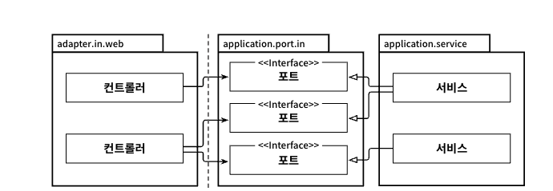
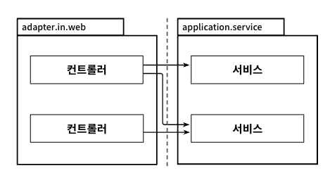
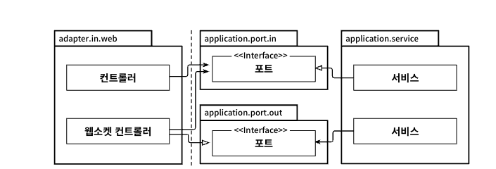

# 5일차 2024-06-24  p.53 ~ 62

## 05. 웹 어댑터 구현하기

오늘날의 애플리케이션은 대부분 웹 인터페이스 같은 것을 제공한다.
웹 브라우저를 통해 상호작용할 수 있는 UI나 다른 시스템에서 우리 애플리케이션으로 호출하는 방식으로
상호작용하는 HTTP API가 여기에 해당한다.

우리가 목표로 하는 아키텍처에서 외부 세계와의 모든 커뮤니케이션은 어댑터를 통해 이뤄진다.

### 의존성 역전

그림 5.1은 웹 어댑터와 관련된 아키텍처 요소 (어댑터 자체와 애플리케이션 코어와 상호작용 하는 포트) 에
조금 더 초점을 맞춘 그림이다.



`그림 5.1 인커밍 어댑터는 애플리케이션 서비스에 의해 구현된 인터페이스인 전용 포트를 통해 
애플리케이션 계층과 통신한다. `

웹 어댑터는 '주도하는' 혹은 '인커밍' 어댑터다. 외부로부터 요청을 받아 애플리케이션 코어를
호출하고 무슨 일을 해야 할지 알려준다. 이때 제어 흐름은 웹 어댑터에 있는 컨트롤러에서 
에플리케이션 계층에 있는 서비스로 흐른다. 

애플리케이션 계층은 웹 어댑터가 통신할 수 있는 특정 포트를 제공한다. 
서비스는 이 포트를 구현하고 , 웹 어댑터는 이 포트를 호출할 수 있다.

자세히 살펴보면 **의존성 역전 원칙** 이 적용된 것을 발견할 수 있다.
그림 5.2 와 같이 제어 흐름이 왼쪽에서 오른쪽으로 흐르기 때문에 웹 어댑터가 유스케이스를
직접 호출할 수 있다. 



`그림 5.2 포트 인터페이스를 삭제하고 서비스를 직접 호출할 수 있다.`

그럼 왜 어댑터와 유스케이스 사이에 또 다른 간접 계층을 넣어야 할까? 
애플리케이션 코어가 외부 세계와 통신할 수 있는 곳에 대한 명세가 포트이기 때문이다.
포트를 적절한 곳에 위치시키면 외부와 어떤 통신이 일어나고 있는지 정확히 알 수 있고, 
이는 레거시 코드를 다루는 유지보수 엔지니어에게는 무척 소중한 정보다.

이렇게 말하긴 했지만 인커밍 포트를 생략하고 애플리케이션 서비스를 직접 호출하고 싶은 생각도 들 것이다.

그럼에도 상호작용이 많이 일어나는 애플리케이션과 관련한 한 가지 의문이 남는다. 
웹 소켓을 통해 실시간 데이터를 사용자의 브라우저로 보낸다고 가정해보자. 
애플리케이션 코어에서는 이러한 실시간 데이터를 어떻게 웹 어댑터로 보내고, 웹 어댑터는 이 데이터를 
어떻게 사용자의 브라우저에 전송하는 것일까?

이 시나리오에서는 반드시 포트가 필요하다. 그림 5.3과 같이 이 포트는 웹 어댑터에서 구현하고 애플리케이션 코어에서 호출해야 한다.



`그림 5.3 만약 애플리케이션이 웹 어댑터에 능동적으로 알림을 줘야 한다면 의존성을 올바른 방향으로 유지하기 위해 아웃고잉 포트를 통과해야 한다.`

엄밀히 말하자면 이 포트는 아웃고잉 포트이기 때문에 이제 웹 어댑터는 인커밍 어댑터인 동시에
아웃고잉  어댑터가 된다. 하지만 한 어댑터가 동시에 두 가지 역할을 하지 못할 이유가 없다.

### 웹 어댑터의 책임

웹 어댑터는 일반적으로 다음과 같은 일을 한다.

- HTTP 요청을 자바 객체로 매핑
- 권한 검사
- 입력 유효성 검증
- 입력을 유스케이스의 입력 모델로 매핑
- 유스케이스 호출
- 유스케이스의 출력을 HTTP로 매핑
- HTTP 응답을 반환

우선 웹 어댑터는 URL , 경로 , HTTP 메서드 , 콘텐츠 타입과 같이 특정 기준을 만족하는
HTTP 요청을 수신해야 한다. 그러고 나서 HTTP 요청의 파라미터와 콘텐츠를 객체로
역직렬화해야 한다. 

보통은 웹 어댑터가 인증과 권한 부여를 수행하고 실패할 경우 에러를 반환한다. 

그러고 나면 들어오는 객체의 상태 유효성 검증을 할 수 있다. 
그런데 앞에서 입력 유효성 검증이 유스케이스 입력 모델의 책임이라고 이야기하지 않았는가?
유스케이스 입력 모델은 유스케이스의 맥락에서 유효한 입력만 허용해야 한다. 
그러나 여기서는 웹 어댑터의 입력 모델에 대해 이야기하고 있는 것이다.

유스케이스의 입력 모델과는 구조나 의미가 완전히 다를 수 있으므로 또 다른 유효성 검증을 수행해야 한다.

유스케이스 입력 모델에서 했던 유효성 검증을 똑같이 웹 어댑터에서도 구현해야 하는 것은 아니다.
대신 웹 어댑터의 입력 모델을 유스케이스의 입력 모델로 변환할 수 있다는 것을 검증해야 한다.
이 변환을 방해하는 모든 것이 유효성 검증 에러다.

이는 자연스럽게 웹 어댑터의 다음 책임, 즉 변환된 입력 모델로 특정한 유스케이스를 호출하는 것으로 연결된다. 
어댑터는 유스케이스의 출력을 반환받고 , HTTP 응답으로 직렬화해서 호출자에게 전달한다.

이 과정에서 한 군데서라도 문제가 생기면 예외를 던지고, 웹 어댑터는 에러를 호출자에게 보여줄 
메시지로 변환해야 한다. 

웹 어댑터의 어깨를 짓누를 정도로 책임이 많기는 하다. 하지만 이 책임들은 애플리케이션 계층이
신경 쓰면 안되는 것들이기도 하다. HTTP 와 관련된 것은 애플리케이션 계층으로
침투해서느 안 된다. 우리가 바깥 계층에서 HTTP를 다루고 있다는 것을 애플리케이션 코어가 알게 되면
HTTP를 사용하지 않는 또 다른 인커밍 어댑터의 요청에 대해 동일한 도메인 로직을 수행할 수 있는 선택지를 잃게 된다.
좋은 아키텍처에서는 선택의 여지를 남겨둔다.

웹 어댑터와 애플리케이션 계층 간의 이 같은 경계는 웹 계층에서부터 개발을 시작하는 대신
도메인과 애플리케이션 계층부터 개발하기 시작하면 자연스럽게 생긴다.
특정 인커밍 어댑터를 생각할 필요 없이 유스케이스를 먼저 구현하면 경계를 흐리게 만들 유혹에 빠지지 않을 수 있다.

### 컨트롤러 나누기

자바의 스프링 MVC 같은 대부분의 웹 프레임워크에서는 앞서 논의한 책임들을 수행할
컨트롤러 클래스를 생성할 수 있다. 그러면 모든 요청에 응답할 수 있는 하나의 컨트롤러를 만듦면 될까?
그럴 필요가 없다. 웹 어댑터는 한 개 이상의 클래스로 구성해도 된다.

하지만 3장에서 이야기했듯이 클래스들이 같은 소속이라는 것을 표현하기 위해 같은 패키지 수준
(hierarchy) 에 놓아야 한다.

그럼 컨트롤러를 몇 개 만들어야 할까? 너무 적은 것보다는 너무 많은 게 낫다.
각 컨트롤러가 가능한 한 좁고 다른 컨트롤러와 가능한 한 적게 공유하는 웹 어댑터 조각을 구현해야 한다.

BuckPal 애플리케이션의 Account 엔티티의 연산들을 예로 들어보자. 
자주 사용되는 방식은 AccountController 를 하나 만들어서 계좌와 관련된 모든 요청을
받는 것이다. 
Rest API를 제공하는 스프링 컨트롤러는 다음과 같을 것이다.


```java
@RestController
@RequiredArgsConstructor
 class AccountController {

 private final GetAccountBalanceQuery getAccountBalanceQuery;
 private final ListAccountQuery listAccountQuery;
 private final LoadAccountQuery loadAccountQuery;

 private final SendMoneyUseCase sendMoneyUseCase;
 private final CreateAccountUseCase createAccountUseCase;
 
 @GetMapping("/accounts")
 List<AccountResource> listAccounts() {
  ...
 }
 
 @GetMapping("/accounts/{accountId}")
 AccountResource getAccount(@PathVariable("accountId") Long accountId) {}
 ...
}

@GetMapping("/accounts/{accountId}/balance")
long getAccountBalance(@PathVariable("accountId") Long accountId) {
 ...
}

@PostMapping("/accounts")
AccountResource createAccount(@RequestBody AccountResource account) {
 ...

}

@PostMapping("/account/send/{sourceAccountId}/{targetAccountId}/{amount}") 
void sendMoney(
        @PathVariable("sourceAccountId") Long sourceAccountId ,
        @PathVariable("targetAccountId") Long targetAccountId ,
        @PathVariable("amount") Long amount
) {
 ...

}

}

```

계좌 리소스와 관련된 모든 것이 하나의 클랙스에 모여 있으며 괜찮아 보인다. 
하지만 이 방식의 단점을 한번 살펴보자.

먼저, 클래스마다 코드는 적을수록 좋다. 가장 큰 클래스가 30,000 줄이었던 레거시 프로젝트를
담당했던 적이 있다. 사실 30,000 줄이 하나의 클래스에 있게 된 것은 의도적인 아키텍처 결정이었다.
시스템을 재배포 없이 런타임에 변경하기 위해 컴파일된 자바 바이트코드를 하나의 .class 파일오 올려야 했단 것이다.
또한 단 하나의 파일만 올릴 수 있었기 때문에 이 파일에 모든 코드가 들어 있어야 했다.

시간이 지나면서 컨트롤러에 200줄만 늘어나도 50줄을 파악하는 것에 비해 난이도가 높아진다.
아무리 메서드로 깔끔하게 분리돼 있어도 쉽지 않은 일이다. 

테스트 코드도 마찬가지다. 컨트롤러에 코드가 많으면 그에 해당하는 테스트 코드도 많을 것이다. 
그리고 보통 테스트 코드는 더 추상적이라서 프로덕션 코드에 비해 파악하기가 어려울 때가 많다.
따라서 특정 프로덕션 코드에 해당하는 테스트 코드를 찾기 쉽게 만들어야 하는데,
클래스가 작을수록 더 찾기가 쉽다. 

하지만 이것만큼 중요한 또 다른 점은 모든 연산을 단일 컨트롤러에 넣는 것이 데이터 구조의
재활용을 촉진한다는 데 있다. 앞의 예제 코드에서 많은 연산들이 AccountResource 모델 클래스를
공유한다. AccountResource 가 모든 연산에서 필요한 모든 데이터를 담고 있는 큰 통인 것이다.
아마 AccountResource 에는 id 필드가 있을 것이다. 그렇지만 이 id 는 create 연산에서는
필요 없기 때문에 도움이 되기보다는 헷갈릴 수 있다. Account 가 User 객체와 일대다 관계를 맺고 있다고 가정해보자.
계좌를 생성하거나 업데이트할 때 User 객체도 필요할까? list 연산에 사용자 정보도 같이 반환해야 할까? 
아주 간단한 사례이긴 하지만 토이 프로젝트가 아닌 한 프로젝트에서 언젠가 맞닥뜨릴 질문이다.

그래서 나는 각 연산에 대해 가급적이면 별도의 패키지 안에 별도의 컨트롤러를 만드는 방식을 선호한다.
또한 가급적 메서드와 클래스명은 유스케이스를 최대한 반영해서 지어야 한다.


```java
@RestController
@RequiredArgsConstructor
 class SendMoneyController {
    private final SendMoneyUseCase sendMoneyUseCase;
    
    @PostMapping("/accounts/send/{sourceAccountId}/{targetAccountId}/{amount}")
    void sendMoney(@PathVariable("sourceAccountId") Long sourceAccountId,
                   @PathVariable("targetAccountId") Long targetAccountId,
                   @PathVariable("amount") Long amount
                   ) {
        SendMoneyCommand command = new SendMoneyCommand(
                new AccountId(sourceAccountId),
                new AccountId(targetAccountId),
                Money.of(amount));
        
        sendMoneyUseCase.sendMoney(command);
    }
}

```
또한 각 컨트롤러가 CreateAccountResource 나 UpdateAccountResource 같은 
컨트롤러 자체의 모델을 가지고 있거나, 앞의 예제 코드처럼 원시값을 받아도 된다.

이러한 전용 모델 클래스들은 컨트롤러의 패키지에 대해 private 으로 선언할 수 있기 때문에
실수로 다른 곳에서 재사용될 일이 없다. 컨트롤라끼리는 모델을 공유할 수 있지만 
다른 패키지에 있는 덕분에 공유해서 사용하기 전에 다시 한번 생각해볼 수 있고, 다시 생각해봤을 때,
필드의 절반은 사실 필요없다는 걸 깨달아서 결국 컨트롤러레 맞는 모델을 새로 만들게 될 확률이 높다.

또, 컨트롤러명과 서비스명에 대해서도 잘 생각해봐야 한다. 
예를 들어, CreateAccount 보다는 RegisterAccount 가 더 나은 이름 같지 않는가?
BuckPal 예제에서 계좌를 생성하는 유일한 방법은 사용자가 계좌를 등록하는 방법뿐이다.

그러나 이 의미를 드러내기 위해서는 'register'라는 단어가 더 명확하다.

이렇게 나누는 스타일의 또 다른 장점은 서로 다른 연산에 대한 동시 작업이 쉬워진다는 것이다.
두 명의 개발자가 서로 다른 연산에 대한 코드를 짜고 있다면 병합 충돌이 일어나지 않을것이다.

### 유지보수 가능한 소프트웨어를 만드는 데 어떻게 도움이 될까?

애플리케이션의 웹 어댑터를 구현할 때는 HTTP 요청을 애플리케이션의 유스케이스에 대한
메서드 호출로 변환하고 결과를 다시 HTTP로 변환하고 어떤 도메인 로직도 수행하지 않는 어댑터를 
만들고 있다는 점을 염두에 둬야 한다.  

반면 애플리케이션 계층은 HTTP에 대한 상세 정보를 노출시키지 않도록 HTTP와 관련된 작업을 해서는 안 된다.
이렇게 하면 필요할 경우 웹 어댑터를 다른 어댑터로 쉽게 교체할 수 있다.

웹 컨트롤러를 나눌 때는 모델을 공유하지 않는 여러 작은 클래스들을 만드는 것을 두려워해서는 안 된다.
작은 클래스들은 더 파악하기 쉽고, 더 테스트하기 쉬우며, 동시 작업을 지원한다.
이렇게 세분화된 컨트롤러를 만드는 것은 처음에는 조금 더 공수가 들겠지만 유지보수하는 동안에는
분명히 빛을 발할 것이다.
