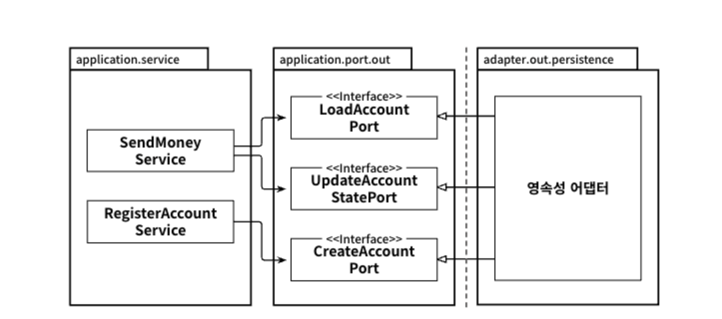

# 6일차 2024-06-25 p.63 ~ 79

## 06. 영속성 어댑터 구현하기

### 의존성 역전

영속성 계층 대신 애플리케이션 서비스에 영속성 기능을 제공하는 영속성 어댑터에 대해 이야기 하겠다.

그림 6.1 은 영속성 어댑터가 애플리케이션 서비스에 영속성 기능을 제공하기 위해 어떻게 의존성 역전 원칙을 적용할 수 았을지 보여준다. 


`그림 6.1 코어의 서비스가 영속성 어댑터에 접근하기 위해 포트를 사용한다. `

애플리케이션 서비스에서는 영속성 기능을 사용하기 위해 포트 인터페이스를 호출한다. 
이 포트는 실제로 영속성 작업을 수행하고 데이터베이스와 통신할 책임을 가진 영속성 어댑터 클래스에 의해 구현된다.

육각형 아키텍처에서 영속성 어댑터는 '주도되는' 혹은 '아웃고잉' 어댑터다. 애플리케이션에 의해 호출될 뿐, 애플리케이션을 호출하지는 않기 때문이다.

포트는 사실상 애플리케이션의 서비스와 영속성 코드 사이의 간접적인 계층이다. 
영속성 문제에 신경 쓰지 않고 도메인 코드를 개발하기 위해, 즉 영속성 계층에 대해 코드 의존성을 없애기 위해 이러한 간접 계층을 추가하고 있다는 사실을 
잊지 말자. 이렇게 되면 영속성 코드를 리팩터링하더라도 코어 코드를 변경하는 결과로 이어지지 않을 것이다.

자연스럽게 런타임에도 의존성은 애플리케이션 코어에서 영속성 어댑터로 향한다.
예를 들어, 영속성 계층의 코드를 변경하는 중에 버그가 생기면 애플리케이션 코어의 기능은 망가질 것이다
하지만 포트가 계약을 만족하는 한, 코어에 영향을 미치지 않으면서 영속성 코드를 마음껏 수정할 수 있다.


### 영속성 어댑터의 책임

영속성 어댑터가 일반적으로 어떤 일들을 하는지 살펴보자.

- 입력을 받는다.
- 입력을 데이터베이스 포맷으로 매핑한다.
- 입력을 데이터베이스로 보낸다. 
- 데이터베이스 출력을 애플리케이션 포맷으로 매핑한다.
- 출력을 반환한다.

영속성 어댑터는 포트 인터페이스를 통해 입력을 받는다. 
입력 모델은 인터페이스가 지정한 도메인 엔티티나 특정 데이터베이스 연산 적용 객체가 될 것이다.

그러고 나서 영속성 어댑터는 데이터베이스를 쿼리하거나 변경하는 데 사용할 수 있는 포맷으로 입력 모델을 매핑한다.
자바 프로젝트에서는 데이터베이스와 통신할 때 일반적으로 JPA (Java Persistence API) 를 사용하기 때문에 입력 모델을 데이터베이스 테이블 구조를 반영한
JPA 엔티티 객체로 매핑할 것이다. 맥락에 따라 입력 모델을 JPA 엔티티로 매핑하는 것이 들이는 노력에 비해 얻는 것이 많지 않은 일이 될 수도 있으므로 8장에서는
매핑하지 않는 전략에 대해서도 살펴보겠다.

JPA 나 다른 객체-관계 매핑 프레임워크 대신, 데이터베이스와 통신하기 위해 어떤 기술을 사용해도 상관없다. 입력 모델을 평범한 SQL 구문에 매핑해서 
데이터베이스에 보내도 되고, 들어오는 데이터를 파일로 직렬화해서 그것으로부터 데이터를 읽어와도 된다.

핵심은 영속성 어댑터의 입력 모델이 영속성 어댑터 내부에 있는 것이 아니라 애플리케이션 코어에 있기 때문에 영속성 어댑터 내부를 변경하는 것이 코어에 영향을 미치지 않는다는 것이다.

다음으로 영속성 어댑터는 데이터베이스에 쿼리를 날리고 쿼리 결과를 받아온다.

마지막으로, 데이터베이스 응답을 포트에 정의된 출력 모델로 매핑해서 반환한다. 
다시 한번 말하지만,
출력 모델이 영속성 어댑터가 아니라 애플리케이션 코어에 위치하는 것이 중요하다.

입출력 모델이 영속성 어댑터가 아니라 애플리케이션 코아에 있다는 점을 제외하면 책임은 전통적인 영속성 계층의 책임과 크게 다르지 않다.

그라나 영속성 어댑터를 앞에서 이야기한 것과 같이 구현하면 전통적인 영속성 계층을 구현할 때는 없었던 몇 가지 의문들이 생긴다.
전통적인 영속성 계층이 워낙 익숙해서 생각해본 적이 없었을 의문들 말이다.

### 포트 인터페이스 나누기

서비스를 구현하면서 생기는 의문은 데이터베이스 연산을 정의하고 있는 포트 인터페이스를 어떻게 나눌 것인가다.

그림 6.2 처럼 특정 엔티티가 필요로 하는 모든 데이터베이스 연산을 하나의 리포지토리 인터페이스에 넣어 두는 게 일반적인 방법이다.


`그림 6.2 하나의 아웃고잉 포트 인터페이스에 모든 데이터베이스 연산을 모아두면 모든 서비스가 실제로는 필요하지 않은 메서드에 의존하게 된다.`

그럼 데이터베이스 연산에 의존하는 각 서비스는 인터페이스에서 단 하나의 메서드만 사용하더라도 하나의 "넓은" 포트 인터페이스에 의존성을 갖게 된다. 
코드에 불필요한 의존성이 생겼다는 뜻이다.

맥락 안에서 필요하지 않은 메서드에 생긴 의존성은 코드를 이해하고 테스트하기 어렵게 만든다. 
그림 6.2 에 나온 RegisterAccountService 의 단위 테스트를 작성한다고 생각해보자.
AccountRepository 인터페이스의 어떤 메서드를 모킹해야 할까? 먼저 서비스가 실제로 AccountRepository 의 어떤 메서드를 호출하는지 찾아야 한다. 
인터페이스의 일부만 모킹하는 것은 또 다른 문제로 이어지는데, 다음에 이 테스트에서 작업하는 사람은 인터페이스 전체가 모킹됐다고 기대하는 바람에 에러를 보게 될 수 있기 때문이다.

로버트 C. 마틴의 표현을 빌리자면 다음과 같다. 

> "필요 없는 화물을 운반하는 무언가에 의존하고 있으면 예상하지 못했던 문제가 생길 수 있다. "

인터페이스 분리 원칙(Interface Segregation Principle , ISP )은 이 문제의 답을 제시한다. 
이 원칙은 클라이언트가 오로지 자신이 필요로 하는 메서드만 알면 되도록 넓은 인터페이스를 특화된 인터페이스로 분리해야 한다고 설명한다.

이 원칙을 예제의 아웃고잉 포트에 적용해보면 그림 6.3 과 같은 결과를 얻을 수 있다. 



`그림 6.3 인터페이스 분리 원칙을 적용하면 불필요한 의존성을 제거하고 기존 의존성을 눈에 더 잘 띄게 만들 수 있다.`

이제 각 서비스는 실제로 필요한 메서드에만 의존한다. 나아가 포트의 이름이 포트의 역핧을 명확하게 잘 표현하고 있다.
테스트에서는 어떤 메서드를 모킹할지 고민할 필요가 없다. 왜냐하면 대부분의 경우 포트당 하나의 메서드만 있을 것이기 때문이다.

이렇게 매우 좁은 포트를 만드는 것은 코딩을 플러그 앤드 플레이 (plug-and-play)
 경험으로 만든다. 서비스 코드를 짤 때는 필요한 포트에 그저 "꽂기만" 하면 된다. 
운반할 다른 화물이 없는 것이다.

물론 모든 상황에 '포트 하나당 하나의 메서드'를 적용하지는 못할 것이다.
응집성이 높고 함께 사용될 때가 많기 때문에 하나의 인터페이스에 묶고 싶은 데이터베이스 연산들이 있을 수 있다.

### 영속성 어댑터 나누기

이전 그림에서는 모든 영속성 포트를 구현한 단 하나의 영속성 어댑터 클래스가 있었다.
그러나 모든 영속성 포트를 구현하는 한, 하나 이상의 클래스 생성을 금지하는 규칙은 없다.

예를 들어, 그림 6.4와 같이 영속성 연산이 필요한 도메인 클래스 하나당 하나의 영속성 어댑터를 구현하는 방식을 선택할 수 있다.


`그림 6.4 하나의 애그리거트당 하나의 영속성 어댑터를 만들어서 여러 개의 영속성 어댑터를 만들 수도 있다.`

이렇게 하면 영속성 어댑터들은 각 영속성 기능을 이용하는 도메인 경계를 따라 자동으로 나눠진다.

영속성 어댑터를 훨씬 더 많은 클래스로 나눌 수도 있다. 예를 들어 JPA나 OR 매퍼를 이용한 영속성 포트도 구현하면서
성능을 개선하기 위해 평범한 SQL 을 이용하는 다른 종류의 포트도 함께 구현하는 경우가 여기에 해당한다.
그 후에 JPA 어댑터 하나와 평이한 SQL 어댑터 하나를 만들고 각각이 영속성 포트의 일부분을 구현하면 된다. 

도메인 코드는 영속성 포트에 의해 정의된 명세를 어떤 클래스가 충족시키는지에 관심 없다는 사실을 기억하자. 
모든 포트가 구현돼 있기만 한다면 영속성 계층에서 하고 싶은 어떤 작업이든 해도 된다.

'애그리커드당 하나의 영속성 어댑터' 접근 방식 또한 나중에 여러 개의 바운디드 컨텍스트의 영속성 요구사항을 분리하기 위한 좋은 토대가 된다.
이 책의 후반부에서 청구 유스케이스를 책임지는 바운디드 컨텍스트를 정의할 것이다. 

그림 6.5 는 이 시나리오의 개요를 보여준다.


`그림 6.5 바운디드 컨텍스트 간의 겅계를 명확하게 구분하고 싶다면 각 바운디드 컨텍스트가 영속성 어댑터을 하나씩 가지고 있어야 한다.`

각 바운디드 컨텍스트는 영속성 어댑터를 하나씩 가지고 있다. '바운디드 컨텍스트' 라는 표현은 경계를 암시한다. 
account 맥락의 서비스가 billing 맥락의 영속성 컨텍스트에 접근하지 않고, 반대로 billing 의 서비스도 
account 의 영속성 어댑터에 접근하지 않는다는 의미다. 어떤 맥락이 다른 맥락에 있는 무엇인가를 필요로 한다면 전용 인커밍 포트를 통해 접근해야 한다.

### 스프링 데이터 JPA 예제

잎의 그림에서 본 AccountPersistenceAdapter 를 구현한 코드를 살펴보자. 이 어댑터는 데이터베이스로부터 계좌를 가져오거나 저장할 수 있어야 한다.

```java
@AllArgsConstructor(access = AccessLevel.PRIVATE)
public class Account {

    @Getter private final AccountId id;
    @Getter private final Money baselineBalance;
    private final ActivityWindow activityWindow;
    
    public static Account withoudId(
            Money baselineBalance,
            ActivityWindow activityWindow
    ) {
        return new Account(null, baselineBalance, activityWindow);
    }
    
    public static Account withId(
            AccountId accountId,
            Money baselineBalance,
            ActivityWindow activityWindow) {
        return new Account(accountId , baselineBalance, activityWindow);    
    }
    

    public Money calculateBalance() {
       /// ....
    }
    
}

```

Account 클래스는 getter 와 setter 만 가진 간단한 데이터 클래스가 아니며 최대한 불변성을 유지하려 한다는 사실을 상기하자.
유효한 상태의 Account 엔티티만 생성할 수 있는 팩토리 메서드를 제공하고 출금 전에 계좌의 잔고를 확인하는 일과 같은 유효성 검증을 모든 상태 변경 매서드에서 수행하기
때문에 유효하지 않은 도메인 모델을 생성할 수 없다.

데이터베이스와의 통신에 스프링 데이터 JPA 를 사용할 것이므로 계좌의 데이터베이스 상태를 표현하는 @Entity 애너테이션이 추가된 클래스도 필요하다.

```java
@Entity
@Table(name = "account")
@Data
@AllArgsConstructor
@NoArgsConstructor
class AccountJpaEntity {

    @Id
    @GeneratedValue
    private Long id;

}
```

다음은 activity 테이블을 표현하기 위한 코드다.

```java
@Entity
@Table(name = "activity")
@Data
@AllArgsConstructor
@NoArgsConstructor
class ActivityJpaEntity {

    @Id
    @GeneratedValue
    private Long id;

    @Column
    private LocalDateTime timestamp;

    @Column
    private Long ownerAccountId;

    @Column
    private Long sourceAccountId;

    @Column
    private Long targetAccountId;

    @Column
    private Long amount;

}
```

이 단계에서는 계좌의 상태가 ID 하나만으로 구성 돼있다. 나중에 사용자 ID 같은 필드가 추가될 것이다. 
좀 더 흥미로운 엔티티는 특정 계좌에 대한 모든 활동을 들고 있는 ActivityJpaEntity 다. JPA 의 @ManyToOne 이나 @OneToMany 애너테이션을 
이용해 ActivityJpaEntity 와 AccountJpaEntity 를 연결해 관계를 표현할 수도 있었겠지만 데이터베이스 쿼리에 부수효과가 생길 수 있기 때문에
일단 이 부분은 제외하기로 결정했다. 
사실 이 단계에서는 JPA 보다는 조금 더 간단한 ORM 을 이용하는 편이 영속성 어댑터를 구현허기가 더 쉽지만 
앞으로 JPA 가 제공하는 다른 기능이 필요할 수도 있기 때문에  어쨋든 사용하기로 했다.

```java
@RequiredArgsConstructor
@Component
class AccountPersistenceAdapter implements LoadAccountPort , UpdateAccountStatePort {
     private final SpringDataAccountRepository accountRepository;
     private final ActivityRepository activityRepository;
     private final AccountMapper accountMapper;

     @Override
     public Account loadAccount(
             AccountId accountId,
             LocalDateTime baselineDate) {

          AccountJpaEntity account =
                  accountRepository.findById(accountId.getValiue())
                          .orElseThrow(EntityNotFoundException::new);

          List<ActivityJpaEntity> activities = activityRepository.findByOwnerSince(
                  accountId.getValiue(),
                  baselineDate
          );

          Long withdrawalBalance = orZero(activityRepository
                  .getWithdrawalBalanceUntil(
                  accountId.getValiue(),
                  baselineDate
          ));

          Long depositBalance = orZero(activityRepository
                  .getDepositBalanceUntil(
                          accountId.getValiue(),
                          baselineDate
                  ));


          return accountMapper.mapToDomainEntity(
                  account,
                  activities,
                  withdrawalBalance,
                  depositBalance
          );
     }

     private Long orZero(Long value) {
          return value == null ? 0L : value;
     }

     @Override
     public void updateActivities(Account account) {
          for (Activity activity : account.getActivityWindow().getActivities()) {
               if (activity.getId() == null) {
                    activityRepository.save(accountMapper.mapToJpaEntity(activity));
               }
          }
     }
}

```

영속성 어댑터는 애플리케이션에 필요한 LoadAccountPort 와 UpdateAccountStatePort 라는 
2개의 포트를 구현했다.

데이터베이스로부터 계좌를 가져오기 위해 AccountRepository 로 계좌를 불러온 다음, 
ActivityRepository 로 해당 계좌의 특정 시간 범위 동안의 활동을 가져온다.

유효한 Account 도메인 엔티티를 성생하기 위해서는 이 활동창 시작 직전의 계좌 잔고가
필요하다. 그래야 데이터베이스로부터 모든 출금과 입금 정보를 가져와 합할 수 있다.
마지막으로 이 모든 데이터를 Account 도메인 엔티티에 매핑하고 호출자에게 반환한다. 

계좌의 상태를 업데이트하기 위해서는 Account 엔티티의 모든 활동을 순회하며 ID 가 있는지 확인해야 한다.
만약 ID가 없다면 새로운 활동이므로 ActivityRepository 를 이용해 저장해야 한다.

앞에서 설명한 시나리오에서는 Account 와 Activity 도메인 모델, AccountJpaEntity 와 
ActivityJpaEntity 데이터베이스 모델 간에 양방향 매핑이 존재한다. 
왜 굳이 이런 수고를 해야 할까? 그냥 JPA 애너테이션을 Account 와 Activity 클래스로 옮기고 
이걸 그대로 데이터베이스에 엔티티로 저장하면 안 되는 걸까?

8장에서 살펴보겠지만 이런 '매핑하지 않기' 전략도 유효한 전력일 수도 있다. 그러나 이 전략에서는 JPA
로 인해 도메인 모델을 타협할 수 밖에 없다. 예를 들어, JPA 엔티티는 기본 생성자를 필요로 한다. 
또, 영속성 계층에서는 성능 측면에서 @ManyToOne 관계를 설정하는 것이 적절할 수 있지만,
예제에서는 항상 데이터의 일부만 가져오기를 바라기 때문에 도메인 모델에서는 이 관계가 반대가 되기를 원한다.

그러므로 영속성 측면과의 타협 없이 풍부한 도메인 모델을 생성하고 싶다면 도메인 모델과 영속성 모델을
매핑하는 것이 좋다. 

### 데이터베이스 트랜잭션은 어떻게 해야 할까?

아직 데이터베이스 트랜잭션 이야기는 꺼내지도 않았다. 트랜잭션 경계는 어디에 위치시켜야 할까?

트랜잭션은 하나의 특정한 유스케이스에 대해서 일어나는 모든 쓰기 작업에 걸쳐 있어야 한다. 
그래야 그중 하나라도 실패할 경우 다 같이 롤백될 수 있기 때문이다.

영속성 어댑터는 어떤 데이터베이스 연산이 같은 유스케이스에 포함되는지 알지 못하기 때문에
언제 트랜잭션을 열고 닫을지 결정할 수 없다. 이 책임은 영속성 어댑터 호출을 관장하는 서비스에 위임해야 한다.

자바의 스프링에서 가장 쉬운 방법은 @Transactional 애너테이션을 애플리케이션 서비스 클래스에
붙여서 스프링이 모든 public 메서드를 트랜잭션으로 감싸게 하는 것이다.

```java
@Transactional
public class SendMoneyService implements SendMoneyUseCase {

 ...

```

만약 서비스가 @Transactional 애너테이션으로 오염되지 않고 깔끔하게 유지되길 원한다면
AspectJ 같은 도구를 이용해 관점 지향 프로그래밍(aspect-oriented programming) 으로 트랜잭션 경계를 코드에 위빙할 수 있다.

### 유지보수 가능한 소프트웨어를 만드는 데 어떻게 도움이 될까?

도메인 코드에 플러그인 처럼 동작하는 영속성 어댑터를 만들면 도메인 코드가 영속성과 관련된 것들로부터
분리되어 풍부한 도메인 모델을 만들 수 있다.

좁은 포트 인터페이스를 사용하면 포트마다 다른 방식으로 구현할 수 있는 유연함이 생긴다.
심지어 포트 뒤에서 애플리케이션이 모르게 다른 영속성 기술을 사용할 수도 있다.
포트의 명세만 지켜진다면 영속성 계층 전체를 교체할 수도 있다.
