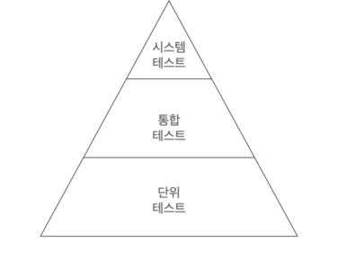

# 7일차 2024-06-27 p.80 ~ 

##  07. 아키텍처 요소 테스트 하기

### 테스트 피라미드

그림 7.1 은 몇 개의 테스트와 어떤 종류의 테스트를 
목표로 해야 하는지 결정하는 데 도움을 준다.



`그림 7.1 테스트 피라미드에 따르면 비용이 많이 드는 테스트는 지양하고 비용이 적게 드는 테스트를 많이 만들어야 한다.`

기본 전제는 만드는 비용이 적고, 유지보수하기 쉽고, 빨리 실행되고, 안정적인 작은 크기의 테스트들에 대해 높은 커버리지를 유지해야 한다는 것이다.
이 테스트는 하나의 '단위 (일반적으로 하나의 클래스)' 가 제대로 동작하는지 확인할 수 있는 단위 테스트들이다.

여러 개의 단위와 단위를 넘는 경계, 아키텍처 경계 , 시스템 경계를 결합하는 테스트는 만드는 비용이 더 비싸지고,
실행이 더 느려지며 (기능 에러가 아닌 설정 에러로 인해 ) 깨지기 더 쉬워진다. 
테스트 피라미드는 테스트가 비싸질수록 테스트의 커버리지 목표는 낮게 잡아야 한다는 것을 보여준다. 
그렇지 않으면 새로운 기능을 만드는 것보다 테스트를 만드는 데 시간을 더 쓰게 되기 때문이다.

맥락에 따라 테스트 피라미드에 포함되는 계층은 달라질 수 있다.
육각형 아키텍처를 테스트하기 위해 내가 선택한 계층들을 한번 살펴보자. '단위 테스트' , '통합 테스트' , '시스템 테스트' 의
정의는 맥락에 따라 다르다는 것을 알아두자.
프로젝트마다 다른 의미를 가질 수 있다는 것이다. 다음의 정의는 이번 장에서 사용하는 의미다.

단위 테스트는 피라미드의 토대에 해당한다. 일반적으로 하나의 클래스를 인스턴스화하고 해당 클래스의 인터페이스를 통해
기능들을 테스트한다. 만약 테스트 중인 클래스가 다른 클래스에 의존한다면 의존되는 클래스들은 인스턴스화 하지 않고 테스트 하는 동안
필요한 작업들을 흉내 내는 목(mock)으로 대체한다.

피라미드의 다음 계층은 통합 테스트다. 이 테스트는 연결된 여러 유닛을 인스턴스화하고 시작점이 되는 클래스의 인터페이스로 데이터를
보낸 후 유닛들의 네트워크가 기대한 대로 잘 동작하는지 검증한다.

시스템 테스트 위에는 애플리케이션의 UI를 포함하는 엔드투엔드 (ent-to-end) 테스트 층이 있을 수 있다. 
하지만 이 책에서는 백엔드 아키텍처에 대해서 논의 하고 있으므로 엔드투엔드 테스트에 대해서는 고려하지 않기로 한다.


### 단위테스트로 도메인 엔티티 테스트하기

먼저 육각형 아키텍처의 중심인 도메인 엔티티를 살펴보자. 
4장에서 본 Account 엔티티를 떠올려보자. Account 의 상태는 과거 특정 지점의 계좌 잔고(baselineBalance)와 그 이후의
입출금 내역(activity)로 구성돼 있다. withdraw() 메서드가 기대한 대로 동작하는지 검증해보자.

```java
  @Test
    void widthdrawalSucceeds() {
        AccountId accountId =  new AccountId(1L);
        Account account = defaultAccount()
                .withAccountId(accountId)
                .withBaselineBalance(Money.of(555L))
                .withActivityWindow(new ActivityWindow(
                        defaultActivity()
                                .withTargetAccount(accountId)
                                .withMoney(Money.of(999L)).build(),
                        defaultActivity()
                                .withTargetAccount(accountId)
                                .withMoney(Money.of(1L)).build()
                ))
                .build();

        boolean success = account.withdraw(Money.of(555L), new AccountId(99L));

        assertThat(success).isTrue();
        assertThat(account.getActivityWindow().getActivities()).hasSize(3);
        assertThat(account.calculateBalance()).isEqualTo(Money.of(1000L));

    }
```

위 코드는 특정 상태의 Account 를 인스턴스화하고 withdraw() 매서드를 호출해서 출금을 성공했는지 검증하고, 
Account 객체의 상태에 대해 기대되는 부수효과들이 잘 일어났는지 확인하는 단순한 단위 테스트다.

이 테스트는 만들고 이해하는 것도 쉬운 편이고, 아주 빠르게 실행된다. 테스트가 이보다 간단할 수는 없다.
이런 식의 단위 테스트가 도메인 엔티티에 녹아 있는 비즈니스 규칙을 검증하기에 가장 적절한 방법이다. 
도메인 엔티티의 행동은 다른 클래스에 거의 의존하지 않기 때문에 다른 종류의 테스트는 필요하지 않다.

### 단위 테스트로 유스케이스 테스트하기

계층의 바깥쪽으로 나가서, 다음으로 테스트할 아키텍처 요소는 유스케이스다. 

SendMoney 유스케이스는 출금 계좌의 잔고가 다른 트랜잭션에 의해 변경되지 않도록 락(lock)을 건다.
출금 계좌에서 돈이 출금되고 나면 똑같이 입금 계좌에 락을 걸고 돈을 입금시킨다. 그러고 나서 두 계좌에서 모두 
락을 해제한다.

다음 코드는 트랜잭션이 성공했을 때 모든 것이 기대한 대로 동작하는지 검증한다.


```java
  @Test
    void transactionSucceeds() {
        Account sourceAccount = givenSourceAccount();
        Account targetAccount = giventTargetAccount();

        givenWithdrawalWillSucceed(sourceAccount);
        givenDepositWillSucceed(targetAccount);

        Money money = Money.of(500L);

        SendMoneyCommand command = new SendMoneyCommand(
                sourceAccount.getId().get(),
                targetAccount.getId().get(),
                money
        );


        boolean success = sendMoneyService.sendMoney(command);

        assertThat(success).isTrue();

        AccountId sourceAccountId = sourceAccount.getId().get();
        AccountId targetAccountId = targetAccount.getId().get();

        then(accountLock).should().lockAccount(eq(sourceAccountId));
        then(sourceAccount).should().withdraw(eq(money) ,eq(targetAccountId));
        then(accountLock).should().releaseAccount(eq(sourceAccountId));

        then(accountLock).should().lockAccount(eq(targetAccountId));
        then(targetAccount).should().deposit(eq(money),eq(sourceAccountId));
        then(accountLock).should().releaseAccount(eq(targetAccountId));

        thenAccountsHaveBeenUpdated(sourceAccountId, targetAccountId);


    }
```

테스트의 가독성을 높이기 위해 행동-주도-개발 (behavior driven development) 에서
일반적으로 사용되는 방식대로 given/when/then 섹션으로 나눴다.


테스트는 Mockito 라이브러리를 이용해 given..() 메서드의 목 객체를 생성한다.
Mockito 는 목 객체에 대해 특정 메서드가 호출됐는지 검증할 수 있는 then() 메서드도 제공한다.

테스트 중인 유스케이스 서비스는 상태가 없기 (stateless) 때문에
'then' 섹션에서 특정 상태를 검증할 수 없다. 대신 테스트는 서비스가 (모킹된) 의존 대상의
특정 메서드와 상호작용 했는지 여부를 검증한다. 
이는 테스트가 코드의 행동 변경 뿐만 아니라 코드의 구조 변경에도 취약해진다는 의미다.
자연스럽게 코드가 리팩터링되면 테스트도 변경될 확률이 높아진다.

그렇기 때문에, 테스트에서 어떤 상호작용을 검증하고 싶은지 신중하게 생각해야 한다.
앞의 예제처럼 모든 동작을 검증하는 대신 중요한 핵심만 골라 집중해서 테스트하는 것이 좋다.
만약 모든 동작을 검증하려고 하면 클래스가 조금이라도 바뀔 때마다 테스트를 변경해야 한다.
이는 테스트의 가치를 떨어뜨리는 일이다.

이 테스트는 단위 테스트이긴 하지만 의존성의 상호작용을 테스트하고 있기 때문에 통합 테스트에 가깝다.
그렇지만 목으로 작업하고 있고 실제 의존성을 관리해야 하는 것은 아니기 때문에
완전한 통합 테스트에 비해 만들고 유지보수하기가 쉽다.

### 통합 테스트로 웹 어댑터 테스트하기

한 계층 더 바깥으로 나가면 어댑터에 도착한다. 웹 어댑터를 테스트 해보자.

웹 어댑터는 JSON 문자열 등의 형태로 HTTP를 통해 입력을 받고,
입력에 대한 유효성 검증을 하고, 유스케이스에서 사용할 수 있는 포맷으로 매핑하고,
유스케이스에 전달한다. 그러고 나서 다시 유스케이스의 결과를 JSON으로 매핑하고 
HTTP 응답을 통해 클라이언트에 반환한다.


```java
@WebMvcTest(SendMoneyController.class)
class SendMoneyControllerTest {

    @Autowired
    private MockMvc mockMvc;

    @MockBean
    private SendMoneyUseCase sendMoneyUseCase;

    @Test
    void testSendMoney() throws Exception {

        mockMvc.perform(
                post("/accounts/send/{sourceAccountId}/{targetAccountId}/{amount}",
                        41L,42L,500
                ).header("Content-Type", "application/json"))
                .andExpect(status().isOk());

        then(sendMoneyUseCase).should()
                .sendMoney(eq(new SendMoneyCommand(
                        new AccountId(41L),
                        new AccountId(42L),
                        Money.of(500L)
                )));

    }
}
```

웹 어댑터의 책임 대부분은 이 테스트로 커버된다.

MockMvc 객체를 이용해 모킹했기 때문에 실제로 HTTP 프로토콜을 통해 
테스트한 것은 아니다. 프레임워크가 HTTP 프로토콜에 맞게 모든 것을 적절히
잘 변환한다고 믿는 것이다.

그러나 입력을 JSON 에서 SendMoneyCommand 객체로 매핑하는 전 과정은 다루고 있다.

그럼 왜 이 테스트가 단위 테스트가 아닌 통합 테스트일까? 
이 테스트에서는 하나의 웹 컨트롤러 클래스만 테스트 한 것처럼 보이지만,
사실 보이지 않는 곳에서 더 많은 이들이 벌어지고 있다. 
@WebMvcTest 애너테이션은 스프링이 특정 요청 경로, 자바와 JSON 간의 매핑,
HTTP 입력 검증 등에 필요한 전체 객체 네트워크를 인스턴스화하도록 만든다.
그리고 테스트에서는 웹 컨트롤러가 이 네트워크의 일부로서 잘 동작하는지 검증한다.

웹 컨트롤러가 스프링 프레임워크에 강하게 묶여 있기 때문에 격리된 상태로 테스트하기 보다는
이 프레임워크와 통합된 상태로 테스트하는 것이 합리적이다. 
웹 컨트롤러를 평범한 단위 테스트로 테스트하면 모든 매핑, 유효성 검증, HTTP 항목에 대한
커버리지가 낮아지고, 프레임워크를 구성하는 이런 요소들이 프로덕션 환경에서 정상적으로 작동할지 확신할 수 없게 된다.

### 통합 테스트로 영속성 어댑터 테스트하기

비슷한 이유로 영속성 어댑터의 테스트에는 단위 테스트보다는 통합 테스트를 적용하는 것이 합리적이다.
단순히 어댑터의 로직만 검증하고 싶은 게 아니라 데이터베이스 매핑도 검증하고 싶기 때문이다.

```java
@DataJpaTest
@Import({AccountPersistenceAdapter.class , AccountMapper.class})
class AccountPersistenceAdapterTest {

    @Autowired
    private AccountPersistenceAdapter adapterUnderTest;

    @Autowired
    private ActivityRepository activityRepository;

    @Test
    @Sql("AccountPersistenceAdapterTest.sql")
    void loadAccount() {
        Account account = adapterUnderTest.loadAccount(
                new AccountId(1L),
                LocalDateTime.of(2018,8,10,0,0)
        );

        assertThat(account.getActivityWindow().getActivities()).hasSize(2);
        assertThat(account.calculateBalance()).isEqualTo(Money.of(500L));

    }

    @Test
    void updateActivities() {
        Account account = defaultAccount()
                .withBaselineBalance(Money.of(555L))
                .withActivityWindow(new ActivityWindow(
                        ActivityTestData.defaultActivity()
                                .withId(null)
                                .withMoney(Money.of(1L)).build()
                )).build();

        adapterUnderTest.updateActivities(account);

        assertThat(activityRepository.count()).isEqualTo(1);

        ActivityJpaEntity savedActivity = activityRepository.findAll().get(0);
        assertThat(savedActivity.getAmount()).isEqualTo(1L);
        
    }
}
```

@DataJpaTest 애너테이션으로 스프링 데이터 리포지토리들을 포함해서 데이터베이스
접근에 필요한 객체 네트워크를 인스턴스화해야 한다고 스프링에 알려준다.
@Import 애너테이션을 추가해서 특정 객체가 이 네트워크에 추가됐다는 것을 명확하게 표현할 수 있다.
이 객체들은 테스트 상에서 어댑터가 도메인 객체를 데이터베이스 객체로 매핑하는 등의 작업에 필요하다.

### 시스템 테스트로 주요 경로 테스트하기

파라미터의 최상단에 있는 시스템 테스트는 전체 애플리케이션을 띄우고 API를 통해 요청을 보내고,
모든 계층이 조화롭게 잘 동작하는지 검증한다. 

'송금하기' 유스케이스의 시스템 테스트에서는 애플리케이션의 HTTP 요청을 보내고 계좌의 잔고를
확인하는 것을 포함해서 응답을 검증한다.

```java

@SpringBootTest(webEnvironment = SpringBootTest.WebEnvironment.RANDOM_PORT)
class SendMoneySystemTest {

    @Autowired
    private TestRestTemplate restTemplate;

    @Autowired
    private LoadAccountPort loadAccountPort;

    @Test
    @Sql("SendMoneySystemTest.sql")
    void sendMoney() {
        Money initialSourceBalance = sourceAccount().calculateBalance();
        Money initialTargetBalance = sourceAccount().calculateBalance();


        ResponseEntity response = whenSendMoney(
                sourceAccountId(),
                targetAccountId(),
                transferredAmount());

        then(response.getStatusCode())
                .isEqualTo(HttpStatus.OK);

        then(sourceAccount().calculateBalance())
                .isEqualTo(initialSourceBalance.minus(transferredAmount()));

        then(targetAccount().calculateBalance())
                .isEqualTo(initialTargetBalance.plus(transferredAmount()));

    }

    private ResponseEntity whenSendMoney(
            AccountId sourceAccountId,
            AccountId targetAccountId,
            Money amount) {
        HttpHeaders headers = new HttpHeaders();
        headers.add("Content-Type", "application/json");
        HttpEntity<Void> request = new HttpEntity<>(null, headers);

        return restTemplate.exchange(
                "/accounts/send/{sourceAccountId}/{targetAccountId}/{amount}",
                HttpMethod.POST,
                request,
                Object.class,
                sourceAccountId.getValue(),
                targetAccountId.getValue(),
                amount.getAmount());
    }
}
 
```

@SpringBootTest 애너테이션은 스프링이 애플리케이션을 구성하는 모든 객체 네트워크를
띄우게 한다. 또한 랜덤 포트로 이 애플리케이션을 띄우도록 설정하고 있다.

test 메서드에서는 요청을 생성해서 애플리케이션에 보내고 응답 상태와 계좌의 새로운
잔고를 검증한다.

여기서는 웹 어댑터에서처럼 MockMvc 를 이용해 요청을 보내는 것이 아니라 
TestRestTemplate 을 이용해서 요청을 보낸다. 테스트를 프로덕션 환경에 조금 더
가깝게 만들기 위해 실제 HTTP 통신을 하는 것이다.

실제 HTTP 통신을 하는 것처럼 실제 출력 어댑터도 이용한다. 
예제에서 출력 어댑터는 애플리케이션과 데이터베이스를 연결하는 영속성 어댑터 뿐이다.
다른 시스템과 통신하는 애플리케이션의 경우에는 다른 출력 어댑터들도 있을 수 있다.
시스템 테스트라고 하더라도 언제나 서드파티 시스템을 실행해서 테스트할 수 있는 것은
아니기 때뭉네 결국 모킹을 해야 할 때도 있다. 
육각형 아키텍처는 이러한 경우 몇 개의 출력 포트 인터페이스만 모킹하면 되기 때문에
아주 쉽게 이 문제를 해결할 수 있다.

이전 절에서 이야기한 바와 같이 단위 테스트와 통합 테스트를 만들었다면 시스템 테스트는 앞서 커버한 코드와 겹치는 부분이
많을 것이다. 그럼 추가적인 다른 장점도 있을까?
물론이다. 일반적으로 시스템 테스트는 단위 테스트와 통합 테스트가 발견하는 버그와는 또 다른
종류의 버그를 발견해서 수정할 수 있게 해준다. 
예를 들어, 단위 테스트나 통합 테스트만으로는 알아차리지 못했을 계층 간 매핑 버그 같은 것들 말이다.


### 얼마만큼의 테스트가 충분할까?

나는 얼마나 마음 편하게 소프트웨어를 배포할 수 있느냐를 테스트의 성공 기준으로
삼으면 된다고 생각한다. 테스트를 실행한 후에 소프트웨어를 배포해도 될 만큼
테스트를 신뢰한다면 그것으로 된 것이다. 
더 자주 배포할수록 테스트를 더 신뢰할 수 있다. 일 년에 두 번만 배포한다면
테스트를 신뢰할 수 없을 것이다. 왜냐하면 일 년에 두 번만 검증되기 때문이다.


하지만 우리가 만들어야 할 테스트를 정의하는 전략으로 시작하는 것도 좋다.
다음은 육각형 아키텍처에서 사용하는 전략이다. 


- 도메인 엔티티를 구현할 때는 단위 테스트로 커버하자
- 유스케이스를 구현할 때는 단위 테스트로 커버하자
- 어댑터를 구현할 때는 통합 테스트로 커버하자
- 사용자가 취할 수 있는 중요 애플리케이션 경로는 시스템 테스트로 커버하자


하지만 새로운 필드를 추가할 때마다 테스트를 고치는 데 한 시간을 써야 한다면 
뭔가 잘못된 것이다. 
아마도 테스트가 코드의 구조적 변경에 너무 취약할 것이므로 어떻게 개선할지 살펴봐야 한다.
리팩터링할 때마다 테스트 코드도 변경해야 한다면 테스트는 테스트로서의 가치를 잃는다.

### 유지보수 가능한 소프트웨어를 만드는 데 어떻게 도움이 될까?

육각형 아키텍처는 도메인 로직과 바깥으로 향한 어댑터를 깔끔하게 분리한다. 
덕분에 핵심 도메인 로직은 단위 테스트로, 어댑터는 통합 테스트로 처리하는 명확한 테스트 전략을 정의할 수 있다.

입출력 포트는 테스트에서 아주 뚜렷한 모킹 지점이 된다. 각 포트에 대해 모킹할지,
실제 구현을 이용할지 선택할 수 있다. 만약 포트가 아주 작고 핵심만 담고 있다면 
모킹하는 것이 아주 쉬울 것이다. 포트 인터페이스가 더 적은 메서드를 제공할수록
어떤 메서드르 모킹해야 할지 덜 헷갈린다.

모킹하는 것이 너무 버거워지거나 코드의 특정 부분을 커버하기 위해 어떤 종류의 테스트를 써야 할지
모르겠다면 이는 경고 신호다. 이런 측면에서 테스트는 아키텍처의 문제에 대해 경고하고
유지보수 가능한 코드를 만들기 위한 올바른 길로 인도하는 카나리아의 역할도 한다고 할 수 있다. 