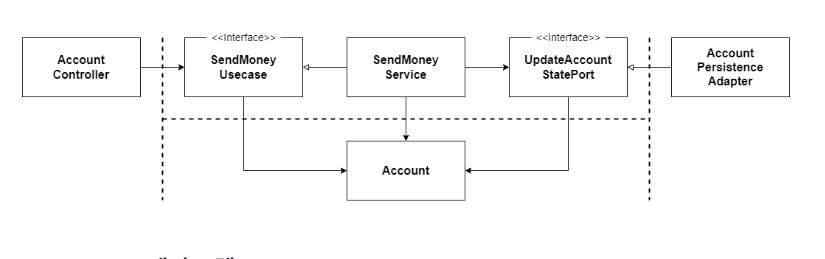

# 8일차 2024-06-29 p.97 ~ 

## 08. 경계 간 매핑하기

이 책의 전반부에서는 웹, 애플리케이션, 도메인 , 영속성 계층이 무엇이고, 하나의 유스케이스를 
구현하기 위해 각 계층이 어떤 역할을 하는지에 대해 다뤘다. 

그런데 늘상 겪는 문제인 각 계층의 모델을 매핑하는 것에 대해서는 다루지 않았다.
여러분도 매퍼 구현을 피하기 위해 두 계층에서 같은 모델을 사용하는 것에 대해 논의해 본적이 있을 것이다.

아마 논쟁은 이런 식으로 진행됐을 것이다.

**매핑에 찬성하는 개발자**

: 두 계층간에 매핑을 하지 않으면 양 계층에서 같은 모델을 사용해야 하는데 이렇게 두 계층이 강하게 결합됩니다.

**매핑에 반대하는 개발자**

: 하지만 두 계층 간에 매핑을 하게 되면 보일러플레이트 코드를 너무 많이 만들게 돼요.
유스케이스 들이 오직 CRUD 만 수행하고 계층에 걸쳐 같은 모델을 사용하기 때문에 계층 사이의 매핑은 과합니다.

두 개발자 모두 일정 부분 맞다. 이 개발자들이 결정하는 데 도움이 되도록 몇 가지 매핑 전략을 
장단점과 함께 알아보자.

### '매핑하지 않기' 전략

첫 번째 전략은 '매핑하지 않기(No Mapping)' 전략이다.

`그림 8.1 포트 인터페이스가 도메인 모델을 입출력 모델로 사용하면 두 계층 간의 매핑을 할 필요가 없다.`

그림 8.1 은 예제의 '송금하기' 유스케이스와 관련된 요소들이다.

웹 계층에서는 웹 컨트롤러가 SendMoneyUseCase 인터페이스를 호출해서 유스케이스를 실행한다.
이 인터페이스는 Account 객체를 인자로 가진다. 즉, 웹 계층과 애플리케이션 계층 모두 
Account 클래스에 접근해야 한다는 것을 의미한다.

반대쪽의 영속성 계층과 애플리케이션 계층도 같은 관계다. 모든 계층이 같은 모델을 사용하니
계층 간 매핑을 전혀 할 필요가 없다.

그런데 이 설계의 결과는 어떨까?

웹 계층과 영속성 계층은 모델에 대해 특별한 요구사항이 있을 수 있다. 
예를 들어, 웹 계층에서 REST 로 모델을 노출시켰다면 모델을 JSON 으로 직렬화하기 위한
애너테이션을 모델 클래스의 특정 필드에 붙여야 할 수도 있다. 
영속성 걔층에 대해서도 마찬가지이다. 
ORM 프레임워크를 사용한다면 데이터베이스 매핑을 위한 특정 애너테이셩니 필요할 것이다.

도메인과 애플리케이션 계층은 웹이나 양속성과 관련된 특수한 요구사항에 관심이 없음에도 불구하고 
Account 도메인 모델 클래스는 이런 모든 요구사항을 다뤄야 한다.

Account 클래스는 웹 , 애플리케이션 , 영속성 계층과 관련된 이유로 인해 변경돼야 하기 때문에
단일 책임 원칙을 위반한다.