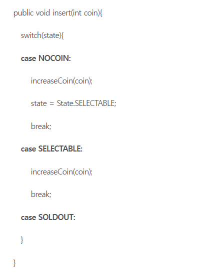
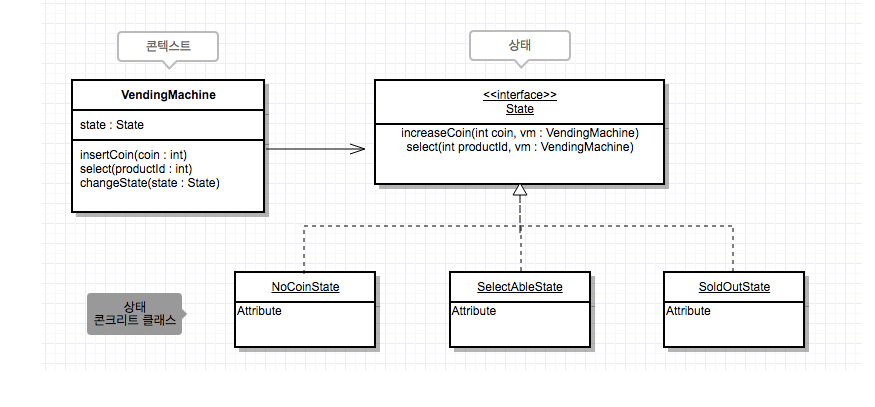

# 10일차 2024-04-18  p.182 ~ 197

## 템플릿 메서드 (Template Method) 패턴

프로그램을 구현하다 보면, 완전히 동일한 절차를 가진 코드를 작성하게 될 때가 있다.

심지어 이 코드들은 절차 중 일부 과정의 구현만 다를 뿐 나머지 구현은 똑같을 때가 있다.

```java
public class DbAuthenticator {
    
    private  UserDao userDao;
    public Auth authenticate(String id, String pw) {
        User user = userDao.selectById(id);
        boolean auth = user.equalPassword(pw);
        if (!auth) {
            throw createException();
        }
        return new Auth(id,user.getName());
    }

    private AuthException createException() {
        return new AuthException();
    }
}

```
DB 데이터와 LDAP 을 이용해서 인증을 처리하는 클래스는 

정보를 가져오는 부분의 구현만 다를 뿐 인증을 처리하는 과정은 완전히 동일하다.

```java
public class LdapAuthenticator {
    
    private  LdapClient ldapClient;
    public Auth authenticate(String id, String pw) {
     
        boolean auth = ldapClient.authenticate(id,pw);
        if (!auth) {
            throw createException();
        }
        LdapContext ctx = ldapClient.find(id);
        return new Auth(id,ctx.getAttribute("name"));
    }

    private AuthException createException() {
        return new AuthException();
    }
}

```

실행 과정/단계는 동일 한데 각 단계 중 일부의 구현이 다른 경우에 사용할 수 있는 패턴이 
템플릿 메서드 패턴이다. 

템플릿 메서드 패턴은 다음과 같이 두 가지로 구성 된다.

- 실행 과정을 구현한 상위 클래스
- 실행 과정의 일부 단계를 구현한 하위 클래스

상위 클래스는 실행 과정을 구현한 메서드를 제공한다.

이 메서드는 기능을 구현하는데 필요한 각 단계를 정의하며 
이 중 일부 단계는 추상 메서드를 호출하는 방식으로 구현된다. 

이때 추상 메서드는 구현이 다른 단계에 해당된다.

```java
public abstract class Authenticator {
    
    // 템플릿 메서드
    public Auth authenticate(String id , String pw) {
        if (!doAuthenticate(id , pw))
            throw  createException();
        
        return createAuth(id);
    }
    
    protected abstract boolean doAuthenticate(String id, String pw);
    
    protected RuntimeException createException() {
        return new AuthException();
    }
    
    protected abstract Auth createAuth(String id);
}
```

authenticate() 메서드는 DbAuthenticator 와 LdapAuthenticator 에서 동일했던 실행 과정을 구현하고 있고,
두 클래스에서 차이가 나는 부분은 별도의 추상 메서드로 분리하였다. 

예를 들어, id/pw 를 이용해서 인증 여부를 확인하는 단계는 doAuthenticate() 추상 메서드로 분리하였고,

Auth 객체를 생성하는 단계는 createAuth() 추상 메서드로 분리하였다.

authenticate() 메서드는 모든 하위 타입에 동일하게 적용되는 실행 과정을 제공하기 때문에,
이 메서드를 템플릿 메서드라고 부른다. 


Authenticator 클래스를 상속받은 하위 클래스는 authenticate() 메서드에서 호출하는 다른 메서드만 알맞게 재정의해주 주면 된다. 

`템플릿 메서드 패턴을 적용한 LdapAuthenticator 의 구현`

```java
public class LdapAuthenticator extends Authenticator {

    private LdapClient ldapClient;
    @Override
    protected boolean doAuthenticate(String id, String pw) {
        return ldapClient.authenticate(id,pw);
    }

    @Override
    protected Auth createAuth(String id) {
        LdapContext ctx = ldapClient.find(id);
        return new Auth(id, ctx.getAttribute("name"));
    }
}
```

LdapAuthenticator 클래스는 이제 전체 실행 과정 구현을 제공하지 않고 일부 과정의 구현만을 제공한다. 

전체 실행 과정은 상위 타입인 Authenticator 의 authenticate() 메서드에서 제공하게 된다.

템플릿 메서드 패턴을 사용하게 되면, 동일한 실행 과정의 구현을 제공하면서 동시에 하위 타입에서 일부 단계를 구현하도록 할 수 있다.

이는 각 타입에서 코드가 중북되는 것을 방지 한다.

템플릿 메서드 패턴을 적용하기 전에 DbAuthenticator 와 LdapAuthenticator 는 완전히 동일한 구조를 갖고 있었다. 
차이점이라면 DB를 사용하느냐 LDAP을 사용하느냐 일뿐, 실행 과정 자체는 완전히 동일하다. 

새로운 인증 방식이 추가되더라도 이 과정은 완전히 동일하기 때문에 거의 비슷한 코드가 중복될 것이다. 
중복된 코드가 출현한다는 것은 그 만큼 유지 보수를 어렵게 만드는데, 템플릿 메서드 패턴을 사용함으로써 
코드 중복 문제를 제거하면서 동시에 코드를 재사용할 수 있게 된다.


### 상위 클래스가 흐름 제어 주체

템플릿 메서드 패턴의 특징은 하위 클래스가 아닌 상위 클래스에서 흐름 제어를 한다는 것이다.
일반적인 경우 하위 타입이 상위 타입의 기능을 재사용할지 여부를 결정하기 때문에, 흐름 제어를 하위 타입이 하게 된다.

예를 들어, 아래 코드에서 SuperCar 클래스의 turnOn() 메서드는 상위 클래스의 turnOn() 메서드를 재사용할 지 여부를 자신이 결정한다.

```java
public class SuperCar extends ZetEngine {

    private boolean notReady;

    @Override
    void turnOn() {
        // 하위 클래스에서 흐름 제어
        if (notReady) {
            beep();
        } else {
            super.turnOn();
        }
    }

    private void beep() {
    }
}
```

반면에 템플릿 메서드 패턴에서는 상위 타입의 템플릿 메서드가 모든 실행 흐름을 제어하고,
하위 타입의 메서드는 템플릿 메서드에서 호출되는 구조를 갖게 된다.


#### 훅 메서드

> 상위 클래스에서 실행 시점이 제어되고, 기본 구현을 제공하면서, 하위 클래스에서 알맞게 확장할 수 있는
> 메서드를 훅(hook) 메서드라고 부른다.


## 상태(State) 패턴

단일 상품을 판매하는 자판기에 들어갈 소프트웨어

요구 사항

|동작|조건|실행|결과|
|---|---|----|----|
|동전을 넣음| 동전 없음 이면| 금액을 증가 | 제품 선택 가능|
|동전을 넣음 | 제품 선택 가능이면 | 금액을 증가 | 제품 선택 가능|
|제품 선택| 동전 없음 이면| 아무 동작 하지 않음 | 동전 없음 유지|
|제품 선택 | 제품 선택 기능이면 | 제품 주고 잔액 감소 | 잔액 있으면 제품 선택 가능 , 잔액 없으면 동전 없음|


`조건문을 이용한 자판기 프로그램 구현`

```java

public class VendingMachine {
    
    public static enum State {
        NOCOIN , SELECTABLE
    }
    
    private State state = State.NOCOIN;
    
    public void insertCoin(int coin) {
        switch (state){
            case NOCOIN:
                increaseCoin(coin);
                state = State.SELECTABLE;
                break;
            case SELECTABLE:
                increaseCoin(coin);
        }
    }
    
    
    public void select(int productId) {
        switch (state) {
            case NOCOIN:
                break;
            case SELECTABLE:
                provideProduct(productId);
                decreaseCoin();
                if (hasNoCoin()){
                    state = State.NOCOIN;
                }
        }
    }

   // .... 
}
```

자판기 프로그램을 구현하는 도중에 다음과 같은 새로운 요구 사항이 들어왔다.

- 자판기에 제품이 없는 경우에는 동전을 넣으면 바로 동전을 되돌려 준다.


```java
public class VendingMachine {

    public static enum State {
        NOCOIN, SELECTABLE, SOLDOUT
    }

    private State state = State.NOCOIN;

    public void insertCoin(int coin) {
        switch (state) {
            case NOCOIN:
                increaseCoin(coin);
                state = State.SELECTABLE;
                break;
            case SELECTABLE:
                increaseCoin(coin);
            case SOLDOUT:
                returnCoin();
        }
    }
}
```

또 다시, '자동 세척' 중일 때에도 동전을 넣으면 바로 돌려줘야 한다는 요구 사항이 추가되었다.

이 요구 사항을 충족하기 위해 insertCoin() 메서드와 select() 메서드에 또 다른 조건문이 추가 될 것이다.

insertCoin() 메서드와 select() 메서드는 동일한 구조의 조건문을 갖고 있다.

이는  상태가 많아질수록 복잡해지는 조건문이 여러 코드에서 중복해서 출현하고, 그 만큼 코드 변경을 어렵게 만든다는 것을 의미한다.
(예를 들어, 새로운 상태를 추가하거나 기존 상태를 빼려면 모든 조건문을 찾아서 수정해 줘야 한다. )


VendingMachine 클래스의 코드를 살펴 보면 조건문은 다음과 같은 의미를 내포하고 있다.

- 상태에 따라 동일한 기능 요청의 처리를 다르게 한다.





예를 들어, insertCoin() 메서드는 상태가 NOCOIN 이냐 , SELECTABLE 이냐 , 또는 SOLDOUT 에 따라서 다르게 동작 하고 있다.


기능이 상태에 따라 다르게 동작해야 할 때 사용할 수 있는 패턴이 상태(State) 패턴이다.




상태 패턴테서 중요한 점은 상태 객체가 기능을 제공한다는 점이다. State 인터페이스는 동전 증가 처리와 제품 선택 처리를 할 수 있는
두 개의 메서드를 정의하고 있다. 이 두 메서드는 모든 상태에 동일하게 적용되는 기능이다. 


콘텍스트는 필드로 상태 객체를 갖고 있다.

콘텍스트는 클라이언트로부터 기능 실행 요청을 받으면 , 상태 객체에 처리를 위임하는 방식으로 구현한다. 


`상태 패턴을 적용한 VendingMachine 구현`

```java
public class VendingMachine {
    
    private State state;

    public VendingMachine() {
        this.state = new NoCoinState();
    }
    
    public void insertCoin(int coin) {
        state.increaseCoin(coin, this);
    }
    
    public void select(int productId) {
         state.select(productId,this);
    }
    
    public void changeState(State newState) {
        this.state = newState;
    }
}
```

`동전 없음 상태일 때의 동작을 구현한 NoCoinState 클래스`


```java
public class NoCoinState implements State {
    @Override
    public void increaseCoin(int coin, VendingMachine vm) {
        vm.increaseCoin(coin);
        vm.changeState(new SelectableState());
    }

    @Override
    public void select(int productId, VendingMachine vm) {
        SoundUtil.beep();
    }
}

```

NoCoinState 클래스의 select() 메서드는 에러 음을 발생시킨다. 이는 동전 없는 상태에서 음료를 선택하면
에러 음을 발생시킨다는 것을 뜻한다. 

`음료 가능 상태의 동작 방식을 구현한 SelectableState 클래스`

```java
public class SelectableState implements State {
    @Override
    public void increaseCoin(int coin, VendingMachine vm) {
        vm.increaseCoin(coin);
    }

    @Override
    public void select(int productId, VendingMachine vm) {
        vm.provideProduct(productId);
        vm.decreaseCoin();
        
        if (vm.hasNoCoin()){
            vm.changeState(new NoCoinState());
        }
    }
}

```

NoCoinState 클래스와 SelectableState 클래스를 보면 , 상태 패턴을 적용함으로써 VendingMachine 클래스에 구현되어 있는
상태 별 동작 구현 코드가 각 상태의 구현 클래스로 이동함을 알 수 있다.


상태 별 처리 코드를 상태로 분리함으로써 콘텍스트의 코드가 간결해지고 변경의 유연함을 얻게 된다.

상태 패턴의 장점은 새로운 상태가 추가되더라도 콘텍스트 코드가 받는 영향은 최소화 된다는 점이다.

상태가 많아 질 경우 조건문을 이용한 방식은 코드가 복잡해져서 유지 보수를 어렵게 만들지만,
상태 패턴의 경우 상태가 많아지더라도 (클래스의 개수가 증가하지만) 코드의 복잡도는
증가하지 않기 때문에 유지 보수에 유리하다.


상태 패턴의 두 번째 장점은 상태에 따른 동작을 구현한 코드가 각 상태 별로
구분 되기 때문에 상태 별 동작을 수정하기가 쉽다는 점이다.

조건문을 이용한 방식을 사용할 경우 동전 없음 상태의 동작을 수정하려면
각 메서드를 찾아 다니면서 수정해 주어야 하는 반면에, 상태 패턴을 적용한 경우 동전 없음  상태를 표현하는
NoCoinState 클래스를 수정해 주면 된다.

관련된 코드가 한 곳에 모여 있기 때문에 안전하고 더 빠르게 구현을 변경할 수 있게 된다.

### 상태 변경은 누가?

상태 변경을 하는 주체는 콘텍스트나 상태 객체 둘 중 하나가 된다. 

콘텍스트의 상태 변경을 누가 할지는 주어진 상황에 알맞게 정해 주어야 한다.
먼저 콘텍스트에서 상태를 변경하는 방식은 비교적 상태 개수가 적고
상태 변경 규칙이 거의 바뀌지 않는 경우에 유리하다.

왜냐면 상태 종류가 지속적으로 변경되거나 상태 변경 규칙이 자주 바뀔 경우
콘텍스트의  상태 변경 처리 코드가 복잡해질 가능성이 높기 때문이다. 

상태 변경 처리 코드가 복잡해질수록 상태 변경의 유연함이 떨어지게 된다.


반면에 상태 객체에서 콘텍스트의 상태를 변경할 경우, 콘텍스트에 영향을 주지 않으면서
상태를 추가하거나 상태 변경 규칙을 바꿀 수 있게 된다.
하지만, 상태 변경 규칙이 여러 클래스에 분산되어 있기 때문에,
상태 구현 클래스가 많아질수록 상태 변경 규칙을 파악하기가 어려워지는
단점이 있다. 
또한, 한 상태 클래스에서 다른 상태 클래스에 대한 의존도 발생한다.

두 방식은 명확하게 서로 상반되는 장단점을 갖고 있기 때문에, 
상태 패턴을 적용할 때에는 주어진 상황에 알맞은 방식을 선택해야 한다.