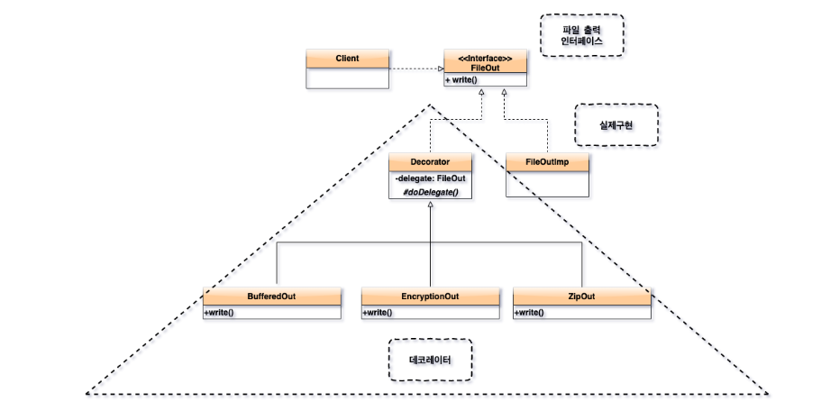
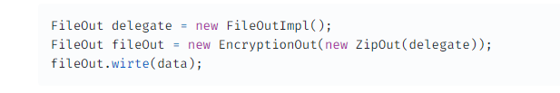
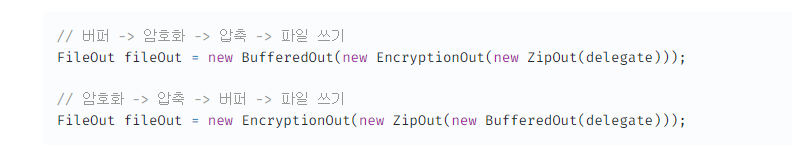
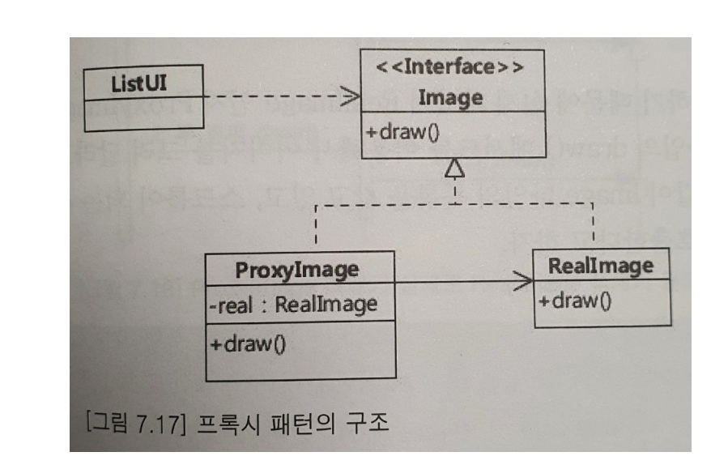

# 11일차  2024-04-19  p.197 ~

## 데코레이터(Decorator) 패턴

상속은 기능을 확장하는 방법을 제공한다.

상속을 이용한 기능 확장 방법이 쉽긴 하지만, 다양한 조합의 
기능 확장이 요구 될 때 클래스가 불필요하게 증가하는 문제가 
발생된다. 

버퍼 기능과 압축 기능을 함께 제공해야 한다거나, 압축 한 뒤
암호화 기능을 제공해야 한다거나, 또는 버퍼 기능과 암호화 기능을 
함께 제공해야 한다면 클래스가 증가하고 계층 구조가 복잡해진다.



이런 경우에 사용할 수 있는 패턴이 데코레이터 패턴이다.

데코레이터 패턴은 상속이 아닌 위임을 하는 방식으로
기능을 확장해 나간다. 


Decorator 클래스는 모든 데코레이터를 위한 기반 기능을
제공하는 추상 클래스이다. 


```java
public abstract class Decorator {
    
    private FileOut delegate;

    public Decorator(FileOut delegate) {
        this.delegate = delegate;
    }
    
    protected void doDelegate(byte[] data) {
        delegate.write(data);
    }
}

```

BufferedOut 클래스, EncryptionOut 클래스, ZipOut 클래스는
모두 데코레이터 클래스로서 Decorator 클래스를 상속 받고 있다.

이들 클래스는 자신의 기능을 수행한 뒤에 상위 클래스의 doDelegate() 메서드를 
이용해서 파일 쓰기를 위임하도록 구현한다. 

```java
public class EncryptionOut extends Decorator {
    public EncryptionOut(FileOut delegate) {
        super(delegate);
    }
    
    public void write(Byte [] data) {
        byte[] encryptedData = encrypt(data);
        super.doDelegate(encryptedData);
    }

    private byte[] encrypt(Byte[] data) {
        return new byte[0];
    }
}

```

파일에 데이터를 암호화해서 쓰는 기능이 필요한 곳의 코드


```java
FileOut delegate = new FileOutImpl();
FileOut fileOut = new EncryptionOut(delegate);
fileOut.write(data);
```

기존 기능에 새로운 기능을 추가해 준다는 의미에서 
EncryptionOut 객체를 데코레이터 라고 부른다.

데코레이터 패턴의 장점은 데코레이터를 조합하는 방식으로 기능을 확장할 수 있는데에 있다.



데이터를 압축 한 뒤에 암호화를 해서 파일에 쓰고 싶다면, 
두 개의 데코레이터 객체를 조합해서 사용하면 된다.

기능 적용 순서의 변경도 쉽다.



데코레이터 패턴을 사용하면 각 확장 기능들의 구현이 별도의 클래스로
분리되기 때문에,
각 확장 기능 및 원래 기능을 서로 영향 없이 변경할 수 있도록 
만들어 준다. 

FileOutImpl 클래스의 구현을 변경하더라도 EncryptionOut 클래스나
BufferedOut 클래스는 영향을 받지 않으며 , 
EncryptionOut 클래스가 내부 알호화 알고리즘을 변경하더라도

다른 데코레이터나 FileOutImpl 클래스는 영향을 받지 않는다.

즉, 데코레이터 패턴은 단일 책임 원칙을 지킬 수 있도록 만들어 준다.


### 데코레이터 패턴을 적용할 때 고려할 점

데코레이터 패턴을 구현할 때 고려할 점은 데코레이터 대상이 되는
타입의 기능 개수에 대한 것이다.

정의되어 있는 메서드가 증가하게 되면 그 만큼 데코레이터의 구현도 복잡해진다.

데코레이터 구현에서 고려해야 할 또 다른 사항은 데코레이터 객체가 비정상적으로 동작할 때 어떻게 처리할 것이냐에 대한 것이다.

예를 들어, 게시글 작성 이후 생성된 게시글 데이터를 외부 메시지 서버에
전송해 주는 기능을 별도의 데코레이터로 구현했다고 하자.

이때 외부의 메시지 서버에 장애가 발생하면

이 전까지는 정상적으로 실행이 되어 트랜잭션이 커밋되었기 때문에
DB에는 새로운 데이터가 정상적으로 추가 된다. 

이 경우, 메세지 전송에 문제가 발생했다고 해서 클라이언트에
익셉션을 발생시키는 것이 올바른지 고민해 봐야 한다. 

왜냐면, 클라이언트가 요구하는 기능인 게시글 등록 자체는 정상적으로 실행되었기 때문이다.

이런 경우 메시지 전송 데코레이터는 외부 메시지 서버에 데이터 전송에 실패하더라도 익셉션을 발생시키는 대신
실패 로그를 남기는 방법을 선택할 수 있다.

이렇게 함으로써 외부 메시지 서버 연동에 실패하더라도 클라이언트는 에러 결과가 아닌 
정상 결과를 볼 수 있으며, 향후에 실패 로그를 이용해서 데이터 재전송과 같은 사후 처리를 할 수 있게 된다.


## 프록시(proxy) 패턴

제품 목록을 보여주는 GUI 프로그램은 

일부를 화면에 보여주고, 스크롤을 할 때 나머지 목록을 화면에 표시할 수 있다.

제품 목록을 구성할 때 관련된 모든 이미지를 로딩하도록 구현할 수 있는데, 
이 경우 불필요하게 메모리를 사용하는 문제가 발생할 수 있다.


목록 하단에 위치한 이미지는 실제로 스크롤을 하기 전까지는 화면에 
보이지 않음에도 불구하고 목록을 구성할 때 메모리에 이미지 정보를 로딩하게 된다.

특히 이미지를 로컬 파일 시스템이 아닌 웹에서 읽어 온다면 이미지 로딩으로 인해 
제품 목록을 보여주기 까지 대기 시간이 길어지게 된다.

불필요한 이미지 로딩에 따른 메모리 낭비와 이미지 로딩에 따른 화면 출력 대기 시간이 길어지는 문제를 
해결하는 방법은 이미지가 실제로 화면에 보여 질 때 이미지 데이터를 로딩하는 것이다.

이미지가 필요할 때 이미지 데이터를 로딩하는 기능을 추가하는 가장 쉬운 방법은 필요 시점에 Image 클래스를 이용해서 
이미지를 로딩하는 DynamicLoadingImage 클래스를 추가하고 

목록을 보여주는 클래스에서 Image 클래스 대신 DynamicLoadingImage 를 사용하게 만드는 것이다.



이런 상황에서 ListUI 변경 없이 이미지 로딩 방식을 교체할 수 있도록 해주는 패턴이 프록시 패턴이다.

Image 인터페이스는 이미지를 표현하며 ListUI는 Image 타입을 이용해서
화면에서 이미지를 표시한다. RealImage 클래스는  실제로 이미지 데이터를 로딩해서 
메모리에 보관하는 콘크리트 클래스이다.

여기서 중요한 것은 ProxyImage 클래스이다.

```java
public class ProxyImage implements Image {
    private String path;
    private RealImage image;

    public ProxyImage(String path) {
        this.path = path;
    }
    
    public void draw() {
        if (image == null) {
            image =  new RealImage(path);
        }
        image.draw();
    }
}
```

ListUI 클래스는 Image 타입을 사용하기 때문에 실제 타입이 RealImage 인지
ProxyImage 인지 여부는 모른다.

단지, Image 타입의 draw() 메서드를 이용해서 이미지를 그려 달라고
할 뿐이다. 

ListUI 클래스가 다음과 같이 Image 타입의 목록을 갖고 있고,
스크롤이 되는 시점에 Image 객체의 draw() 를 호출한다고 하자.