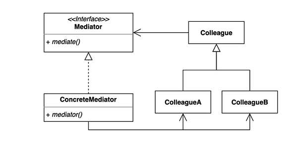

# 13일차 2024-04-21 p.228 ~ 235

## 미디에이터 (Mediator) 패턴

비디오 플레이어

- 동영상 목록에서 특정 제목을 클릭하면, 제목에 해당하는 동영상이 플레이 영역에 표시되고, 제목 표시 영역에 해당 제목을 표시한다.
- 영상 제어 영역에서 제어/멈춤 버튼을 누르면 영상 플레이 영역은 영상을 재생하거나 멈추고, 시간 이동 조작을 하면 영상 플레이 영역은 알맞은 시점으로 영상을 제어한다.
- 영상 제어 영역에서 다음/이전 버튼을 영상 목록에서 다음이나 이전 영상을 재생한다.
- 영상 플레이 화면을 터치하면 플레이가 멈추고 다시 터치하면 재생된다. 이때 영상 제어 부분의 UI 도 중지/시작 모양으로 알맞게 변경 된다.

여기서 비디오가 아닌 Mp3를 위한 플레이어에서

MediaController 를 재사용하고 싶다.

불필요한 클래스를 제거하고 싶다면, 소스 코드 수준에서 필요한 코드만
추려 내야만 한다.

또 다른 단점은 함께 사용되는 클래스가 증가할수록 개별 클래스의 수정이 어려워진다는 점이다.

다음과 같은 요구사항이 추가 되었다.

- 플레이 화면 좌측에 시스템이 추천한 영상 목록을 표시
- 영상 자막 존재 시, 자막 표시

책임에 따라 알맞게 객체를 분리함으로써 객체의 재사용을 높일 수 있을 거라 기대했지만,

역할게 맞게 객체를 분리했음에도 불구하고 오히려 전체 클래스가 하나의 단일 구조가 되어
변경이나 재사용이 어렵게 되는 상황이 발생하였다.

이런 문제가 발생한 이유는 객체 간의 의존이 직접 연결되어 있기 때문이다.

MediaController 클래스의 시간 이동 관련 코드는 VideoPlayer 클래스의 메서드를 
직접 실행하고, VideoPlayer 클래스는 다시 CaptionUI 클래스의 메서드를 직접 실행 한다.
이렇게 객체 간의 메시지 흐름을 각 클래스에 직접적인 의존으로 구현하게 되면,
개별 클래스의 재사용이 어려워지고 메시지 흐름을 변경하려면 관련된 클래스들을 모두 변경해주어야 하는 
문제가 발생하게 된다.

미디에이터(Mediator) 패턴을 사용하면 이런 문제를 해소할 수 있다.

미디에이터 패턴은 각 객체들이 직접 메시지를 주고 받는 대신, 중간에 중계 역할을 수행하는 미디에이터 객체를 두고 미디에이터를 통해서
각 객체들이 간접적으로 메시지를 주고받도록 한다. 

중간에 위치한 VideoMediator 클래스가 미디에이터 역할을 하며,
나머지 VideoPlayer , MediaController , VideoListUI , 
TitleUI 는 협업 대상(Colleague) 역할을 수행한다.
이들 협업 대상 객체들은 서로 직접적인 의존을 맺기 보다는, 미디에이터 객체를 통해서
간접적으로 연결 된다.

VideoListUI 클래스는 VideoPlayer 클래스에 직접적으로 의존하지 않는 대신,
VideoMediator 클래스에 대한 의존만 갖고 있다.

VideoListUI 객체는 목록에서 특정 비디오가 선택되면,

VideoListUI 객체는 VideoMediator 객체의 메서드를 호출한다.

VideoListUI 객체로 부터 재생할 비디오 정보를 받은 VideoMediator 
객체는 그 정보를 VideoPlayer 객체에 전달해서 영상을 재생하도록 하고 TitleUI 객체에 전달해서
제목을 변경하도록 한다.

비슷하게 다른 협업 객체들도 모든 요청을 미디에이터에 보내며,
미디에이터는 그 요청을 처리할 알맞은 객체를 실행한다.

이렇게 각 협업 객체가 서로 알 필요 없이 미디에이터 각 객체 간의
메시지 흐름을 제어하기 때문에,
새로운 협업 객체가 추가되더라도 기존 클래스를 수정할 필요 없이

미디에이터 클래스만 수정해 주면 된다.

물론 메시지 흐름이 변경되더라도 메시지 흐름을 실제로
제어하는 건 미디에이터이므로 미디에이터만 수정 될 뿐 각 협업 클래스를 수정할 필요는 없으며
수정하더라도 변경 범위가 최소화된다.

미디에이터 패턴은 각 협업 클래스에 흩어져 있는 흐름 제어를 
미디에이터로 모으기 때문에, 각 협업 클래스의 코드는
단순해진다. 

각 협업 클래스는 미디에이터에만 의존하거나 또는 미디에이터나 
다른 협업 클래스에 의존하지 않기 때문에, 개별 협업 클래스를
수정하거나 확장하거나 재사용하기가 쉬워진다. 

또한, 미디에이터에 각 협업 객체의 흐름 제어 코드가 모여 있기 때문에
전체 협업 객체 간의 메시지 흐름을 이해하고 수정하고 확장하는 것을
상대적으로 쉽게 만들어 준다.

반면에, 미디에이터 패턴을 사용할 때의 단점은 협업 클래스의 개수가
증가할수록 미디에이터의 코드는 복잡해지기 때문에, 미디에이터 자체를 유지 보수하는 것은 협업 클래스에 비해 
어려워진다는 것이다.

### 추상 미디에이터 클래스의 재사용

미디에이터 패턴을 적용할 때 협업 객체 간의 동일한 메시지 흐름이 서로 다른 기능에서
반복해서 사용될 경우,  미디에이터 추상 클래스를 사용함으로써
미디에이터 자체의 재사용을 높일 수 있다.

PlayerMediator 는 추상 클래스로 select() 메서드는 
협업 객체 간의 흐름 제어를 제공하므로 하위 클래스에서
select() 메서드를 재사용해서 기능을 확장한다.

volumeChanged() 메서드는 추상 메서드 이르모 흐름 제어를
재사용하기 보다는 하위 클래스에서 알맞게 기능을 구현한다.

