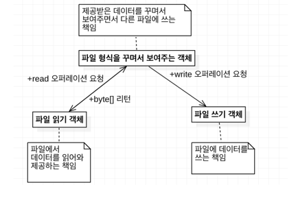
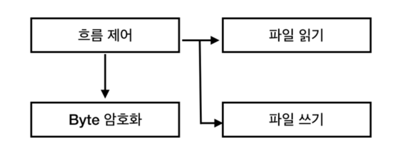
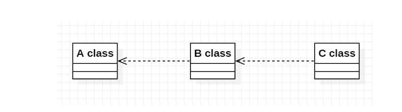

# 2일차  2024-04-02 (p.29 ~ 44)

# Chapter 02. 객체 지향

객체 지향을 잘 하려면 이와 대조되는 기법인 절차 지향적으로 프로그램을 작성하면 안 된다. 

## 1.절차 지향과 객체 지향

### 1.1 절차 지향

소프트웨어를 구현한다는 것은 결국 최종적으로는 소프트웨어를 구성하는 데이터와 데이터를 조작하는 코드를 작성하는 것이다.
데이터를 조작하는 코드를 별도로 분리해서 함수나 프로시저와 같은 형태로 만들고, 각 프로시저들이 데이터를 조작하는 방식으로 코드를 작성할 수 있을 것이다.
프로시저는 다른 프로시저를 사용할 수도 있고, 각각의 프로시저가 같은 데이터를 사용할 수도 있다.
이렇게 프로시저(procedure)로 프로그램을 구성하는 기법을 절차 지향(Procedural Oriented) 프로그래밍이라고 부른다. 


> **노트**
> <br/>
> 절차 지향이라고 해서 뭔가 순서에 따라 프로그래밍하는 방식을 생각할 수 있으나, 
> 사실 여기서의 절차는 영어 단어 Procedural 을 우리말로 옮긴 것뿐이다. 여기서 Procedural 은 프로시저 (procedure) 를 이용한
> 프로그래밍 기법을 의미하기 때문에, 사실 'Procedural Oriented' 라는 단어는 '프로시저 지향'이라고
> 부르는 것이 더 의미에 맞는다. 하지만, 절차 지향이라는 단어가 널리 사용되고 있으므로, 본 책에서는 
> 'Procedural Oriented ' 를 표현할 때 절차 지향이라고 부르도록 하겠다.


`그림 2.1 절차 지형은 데이터를 중심으로 한 프로시저로 구성된다.`


[그림 2.1] 은 절차 지향 방식의 전형적인 구조를 보여주고 있다.
각 프로시저는 데이터를 사용해서 기능을 구현하며, 필요에 따라 다른 프로시저를 사용하기도 한다. 또한, 여러 프로시저가 동일한 데이터를 공유한다. 


시험 성적 관리 프로그램을 생각 해보자. 이 프로그램은 성적 평균을 계산하고 
출력하기 위해 다음과 같은 방식으 구현을 할 수 있을 것이다.

- 평균 계산 프로시저 
- 화면 출력 프로시저

여기서 평균 계산 프로시저와 화면 출력 프로시저는 데이터를 공유해서 사용한다. 

다수의 프로시저들이 데이터를 공유하는 방식으로 만들어지기 때문에, 절차 지향 프로그램은 자연스럽게 데이터를 중심으로 구현하게 된다. 


데이터와 그 데이터를 사용하는 프로시저를 작성하는 것은 자연스러운 과정이기 때문에, 최초에 절차 지향적으로 코드를 구현하는 것은 쉽다.

하지만, 프로그램 규모가 커져서 데이터 종류가 증가하고 이를 사용하는 프로시저가 증가하게 되면 , 다음과 같은 문제들이 발생하게 된다.


- 데이터 타입이나 의미를 변경해야 할 때, 함께 수정해야 하는 프로시저가 증가한다.
- 같은 데이터를 프로시저들이 서로 다른 의미로 사용하는 경우가 발생한다.

한 데이터를 사용하는 프로시저가 많아질수록 그 데이터의 타입을 변경하기 어려워진다. 예를 들어, 전자 장비의 꺼짐/켜짐 상태를 저장하기 위해
boolean 타입이고 이름이 isOn이라는 데이터를 사용한다고 가정하자.

이 데이터를 사용하는 프로시저는 모두 isOne 을 boolean 타입으로 처리 할 거이다. 그런데, 요구 사항이 변경되어서 
꺼짐/켜짐 상태 뿐만 아니라 대기 상태를 추가해야 한다고 해보자. 


이 요구 사항을 반영하기 위해 isOn 데이터의 타입을 boolean 타입에서 열거 타입으로 변경하게 되면, 이 데이터를 사용하는 모든 프로시저도 함께
수정해 주어야 한다.


이것보다 더 안좋은 경우는 프로그램 규모가 커질수록 같은 데이터를 서로 다른 의미로 사용하는 경우가 발생할 가능성이 높다는 것이다.
최초에 서비스 만료일 데이터가 null인 경우 이를 오유로 처리하도록 만료 확인 프로시저를 만들었는데, 회원 정보 수정 프로시저에서 서비스를 무한정
사용한다는 의미로 서비스 만료일 데이터의 값을 null 로 설정할 수 있다. 이 경우, 만료 확인 프로시저는 잘못 들어간 null 값 때문에 
예기치 않은 오류를 발생하게 될 것이다. 

앞의 두 경우는 단순한 예제이긴 하지만, 절차 지향적으로 프로그램을 구성할 때 매우 흔하게 발생되는 문제들이다. 
이로 인해 새로운 요구 사항이 생겨서 프로그램의 한 곳을 수정하게 되면, 다른 곳에서 문제가 발생하고, 다시 그곳을 수정하면 또 다른 곳에서
문제가 발생하는 악순환이 발생하기도 한다. 이는 결국 코드의 수정을 어렵게 만들며, 새로운 기능을 추가하는 데 많은 구현 시간을 투입하게 만든다.


### 1.2 객체 지향


절차 지향과 달리 객체 지향은 데이터 및 데이터와 관련된 프로시저를 객체라고 불리는 단위로 묶는다.
객체는 프로시저를 실행하는데 필요한 만큼의 데이터를 가지며, 객체들이 모여 프로그램을 구성한다.


[그림 2.2 객체 지향 기법을 적용한 프로그램은 데이터와 프로시저를 함께 갖는 객체들의 네트워크로 구성된다.]


각 객체는 자신만의 데이터와 프로시저를 갖는다. 객체는 자신만의 기능을 제공하며, 각 객체들은 서로 연결되어 다른 객체가 제공하는 기능을 사용할 수 있게 된다.

객체는 다른 객체에 기능을 제공하기 위해 프로시저를 사용하는데, 이때 프로시저는 자신이 속한 객체의 데이터에만 접근할 수 있으며, 
다른 객체에 속한 데이터에는 접근할 수 없다.


모든 프로시저가 데이털르 공유하는 절차 지향과 달리 객체 지향은 객체 별로 데이터와 프로시저를 알맞게 정의해야 하고, 앞서 1장에서 봤던
예제 처럼 프로그램의 규모가 작을 때엔느 절차 지향 방식보다 복잡한 구조를 갖게 된다. (즉, 절차 지향적으로 설계하는 것 보다 객체지향 적으로 설계하는 것이 더 어렵다.)

하지만, 객체 지향적으로 만든 코드에서는 객체의 데이터를 변경하더라도 해당 객체로만 변화가 집중되고 다른 객체에는 영향을 주지 않기 때문에,
요구 사항의 변화가 발생했을 때 절차 지향 방식 보다 프로그램을 더 쉽게 변경할 수 있는 장점을 갖는다. 


소프트웨어가 계속 사용되는 한 소프트웨어에 요구되는 기능은 계속 바뀐다. 그런데, 절차지향은 처음에는 쉬울지 몰라도 시간이 흐를수록 프로그램을 수정하기 어렵게
만드는 구조이기 때문에 변화된 요구 사항을 반영하기가 힘들어진다. 반면에 객체 지향은 최초에는 객체지향적으로 설계하는 데 더 많은 노력이 
들어갈 수 있지만 프로그램을 상대적으로 쉽게 수정할 수 있는 유연함을 제공하기 때문에, 변화된 요구 사항으 빠르게 반영할 수 있도록 만들어준다.

##  2. 객체 (Object)

### 2.1 객체의 핵심은 기능을 제공하는 것

객체 지향의 가장 기본은 객체다. 앞서 객체는 데이터와 그 데이터를 조작하는 프로시저(오퍼레이션, 메서드 ,함수)로 구성된다고 했는데,

이는 객체의 물리적인 특징일 뿐이다. 실제로 객체를 정의할 때 사용되는 것은 객체가 제공해야 할 기능이며, 객체가 내부적으로 어떤 데이터를 
갖고 있는 지로는 정의되지 않는다.

예를 들어, 소리 크기 제어 객체가 있다고 하자. 이 객체는 소리 크기를 제어하는 기능을 제공하며, 아마도 이 객체가 제공하는 기능은 다음과 같을 것이다.

- 소리 크기 증가
- 소리 크기 감소
- 음 소거

이 객체가 내부적으로 소리 크기를 어떤 데이터 타입 값으로 보관하는지는 중요하지 않다. 
또한, 실제로 객체가 어떻게 소리 크기를 증가시키거나 감소시키는지는 알 수 없다. 단지, 소리 크기 제어 객체는
'소리 크기 증가' , '소리 크기 감소', '음 소거' 라는 세 개의 기능을 제공한다는 것이 중요할 뿐이다. 

### 2.2 인터페이스와 클래스 

객체는 객체가 제공하는 기능으로 정의된다.  보통 객체가 제공하는 기능을 오퍼레이션(operation)이라고 부른다.
즉 , 객체는 오퍼레이션으로 정의가 된다. 
객체가 제공하는 기능을 사용한다는 것은 결국 객체의 오퍼레이션을 사용한다는 의미가 된다.
그런데, 객체가 제공하는 오퍼레이션을 사용할 수 있으려면, 그 오퍼레이션의 사용법을 알아야 한다.

예를 들어, 소리 크기 제어 객체의 소리 크기 증가 기능을 제공하는 오퍼레이션을 사용하려면 이 오퍼레이션의 사용법을 
알아야 하는 것이다.
오퍼레이션의 사용법은 일반적으로 다음과 같이 세 개로 구성되며, 이 세 가지를 합쳐서 시그니처(Signature)라고 부른다.

- 기능 식별 이름
- 파라미터 및 파라미터 타입
- 기능 실행 결과 값

객체가 제공하는 모든 오퍼레이션 집합을 객체의 '인터페이스(interface) ' 라고 부르며, 서로 다른 인터페이스를 구분할 때
 사용되는 명칭이 바로 타입(type)이다. 여기서 말하는 인터페이스는 자바 언어나 C# 언어에 포함되어 있는 인터페이스가 아니라, 객체 지향에서
오퍼레이션 집합을 표현할 때 사용되는 용어다. 인터페이스는 객체를 사용하기 위한 일종의 명세나 규칙이라고 생각하면 된다.

인터페이스는 객체가 제공하는 기능에 대한 명세서일 뿐, 실제 객체가 기능을 어떻게 구현하는지에 대한 내용은 포함하고 있지 않다.
실제 객체의 구현을 정의하는 것은 클래스(class)이다.
이 클래스에는 오퍼레이션을 구현하는 데 필요한 데이터 및 오퍼레이션의 구현이 포함된다. 

> **인터페이스**
> <br/>
> 개념적으로 인터페이스와 클래스는 구분되어 있지만, 실제로 자바나 C# 등의 언어는 인터페이스와 클래스가 
> 각 언어에서 클래스라고 부르는 것에 함께 정의되어 있다.


### 2.3 메시지

객체 지향은 기능을 제공하는 여러 객체들이 모여서 완성된 어플리케이션을 구성하게 된다. 
예를 들어, 파일에서 데이터를 읽어 오는 객체가 있고, 데이터를 암호화 해주는 객체가 있고, 파일에 데이터를 쓰는 객체가 있다고 하자.

이 경우, 특정 파일에서 데이터를 읽어 와 암호화 한 뒤에 다른 파일에 쓰는 프로그램은 세 개의 객체로 구성된다.


파일 읽기 객체가 제공하는 인터페이스가 다음과 같은 오퍼레이션을 제공한다고 하자.

- 오퍼레이션 이름 : read
- 파라미터 : 없음
- 리턴 타입 : byte 배열

이 경우 , 암호화 처리 객체는 파일 읽기 객체에게 read 오퍼레이션을 실행해달라는 요청을 전달하며, 
요청을 받은 파일 읽기 객체는 해당 요청에 해당 하는 기능을 실행한 뒤에 응답을 전달 하게 된다.

이때 , 오퍼레이션의 실행을 요청 하는 것을 '메시지'를 보낸다. 고 표현한다.

자바와 같은 언어에서는 메서드를 호출하는 것이 메시지를 보내는 과정에 해당된다.

## 3. 객체의 책임과 크기 

객체는 객체가 제공하는 기능으로 정의된다고 했는데, 이는 다시 말하면 객체마다 자신만의 책임이 있다는 의미를 갖는다. 

한 객체가 갖는 책임을 정의한 것이 바로 타입/인터페이스라고 생각하면 된다. 



`그림 2.5 각 객체는 알맞은 책임을 갖는다.`

- 암호화 처리 객체
  - 제공받은 데이터를 암호화해서 다른 파일에 보내는 책임
- 파일 읽기 객체
  - 파일에서 데이터를 읽어와 제공하는 책임
- 파일 쓰기 객체
  - 파일에 데이터를 쓰는 책임

한 객체가 갖는 책임을 정의한 것이 바로 타입/인터페이스라고 생각하면 된다. 그럼, 객체가 갖는 책임은 
어떻게 결정할까? 이 결정을 하는 것이 바로 객체 지향 설계의 출발점이다.


[그림 2.5] 에서는 세 개의 객체가 서로 다른 책임을 지는데, 이런 책임 할당이 처음부터 바로 결정된 것은 아니다. 
처음에는 프로그램을 만들기 위해 필요한 기능 목록을 정리해야 한다. 

기능 목록을 정리한 예

- 파일의 byte 데이터를 제공한다.
- 파일에 byte 데이터를 쓴다.
- byte 데이터를 암호화해서 새로운 byte 데이터를 생성한다.
- 전체 흐름을 제어한다.

객체 지향적으로 프로그래밍할 때 , 가장 어려우면서 가장 중요한 것이 바로 객체마다 기능을 할당하는 과정이다. 기능이 몇 개 안 되는 경우에도
다양한 조합의 구성이 가능하기 때문에, 이런 다양한 조합 중에서 알맞은 구성을 찾아내는 것은 쉽지 않다. 

상황에 따라 객체가 가져야 할 기능의 종류와 개수가 달라지기 때문에, 모든 상황에 들어맞는 객체-책임 구성 규칙이 존재하는 것은 아니다.
하지만, 객체가 얼마나 많은 기능을 제공할 것인가에 대한 확실한 규칙이 하나 존재하는데, 그 규칙은 바로 객체가 갖는 책임의 크기는
작으면 작을수록 좋다는 것이다. 객체가 갖는 책임이 작아야 한다는 것은 객체가 제공하는 기능의 개수가 적다는 걸 의미한다.


이 규칙이 왜 중요한지는 반대 상황을 생각해 보면 이해하기가 더 쉬워진다.

`[그림 2.7] 한 객체에 기능이 많아지면 절차 지향적인 구조를 갖게 된다.`


[그림 2.7] 과 같이 한 객체에 많은 기능이 포함 되면, 그 기능과 관련된 데이터들도 한 객체에 모두 포함된다. 

이 구조는 객체에 정의된 많은 오퍼레이션들이 데이터들을 공유하는 방식으로 프로그래밍된다는 것을 의미하는데, 이는 곧 데이터를 
중심으로 개발되는 절차 지향 방식과 동일한 구조가 된다. 따라서 객체가 갖는 책임이 커질수록 절차 지향적으로 구조가 변질되며,
절차 지향의 가장 큰 단점인 기능 변경의 어려움 문제(즉, 경직성 문제)가 발생하게 된다.

따라서 객체가 갖는 책임의 크기는 작아질수록 객체 지향의 장점인 변경의 유연함을 얻을 수 있게 된다.
객체의 크기와 관련된 원칙이 있는데 그 원칙은 바로 단일 책임 원칙이다. 단일 책임 원칙은 이름에서 알 수 있듯이
객체는 단 한개의 책임만을 가져야 한다는 원칙이다. 이 원칙에 따르면 [그림 2.7] 의 객체 구조는 다음과 같이
네 개의 객체가 각각 한 개의 책임만을 갖도록 재구성 된다.



`[그림 2.8] 한 객첸느 한 개의 책임을 갖도록 구성한다.`

- 흐름 제어
- 파일 읽기
- byte 암호화
- 파일 쓰기

단일 책임 원칙을 따르다 보면 자연스럽게 기능의 세부 내용이 변경 될 때, 변경해야 할 부분이 한 곳으로 집중된다.

예를 들어, 파일을 읽어 오는 방법을 변경해야 한다면 '파일 읽기' 책임을 가진 객체의 코드만 수정되며, 다른 객체의 코드를 수정해야 할 가능성은
낮아진다. 비슷하게 암호화 알고리즘을 변경해야 할 경우. 'byte 암호화' 객체의 코드만 변경될 뿐 다른 객체의 코드가 변경될 가능성은 줄어든다.
즉, 단일 책임 원칙은 변경의 유연함을 얻기 위한 가장 기본 원칙이 된다.

### 4. 의존

객체 지향적으로 프로그램을 구현하다 보면, 다른 객체가 제공하는 기능을 이용해서 자신의 기능을 완성하는 객체가 출현하게 된다.
예를 들어, 앞서 [그림 2.8] 에서 '흐름 제어' 객체는 'byte 암호화' 객체와 '파일 읽기 ' 객체 ,
'파일 쓰기' 객체를 이용해서 파일 데이터 암호화 프로그램의 실행 흐름 기능을 완성하였다.


한 객체가 다른 객체를 이용한다는 것은, 실제 구현에서는 한 객체의 코드에서 다른 객체를 생성하거나 다른 객체의 메서드를 호출한다는 것을
뜻한다.  '흐름 제어' 객체의 실제 코드는 다음과 같이 다른 객체의 메서드를 호출해서 기능을 완성해 나갈 것이다.

```java
public class FlowController {

    // 필드 생략
    private String fileName;

    public void process() {
        FileDataReader reader = new FileDataReader(fileName); // 객체 생성
        byte[] plainBytes = reader.read(); // 메서드 호출

        ByteEncryptor encryptor = new ByteEncryptor(); // 객체 생성
        byte[] encryptedBytes = encryptor.encrypt(plainBytes); // 메서드 호출

        FileDataWriter writer = new FileDataWriter(); // 객체 생성
        writer.write(encryptedBytes); // 메서드 호출
    }
}
```

이렇게 한 객체가 다른 객체를 생성하거나 다른 객체의 메서드를 호출할 때, 이를 그 객체에 의존(dependency)한다고 표현한다.

위 코드에서 FlowController 가 FileDataReader 에 의존한다고 표현할 수 있다. 객체를 생성하거나 메서드를 호출하는 것 뿐만 아니라
파라미터로 전달받는 경우에도 의존한다고 볼 수 있다.

예를 들어, 아래 코드와 같이 ByteEncrytor 를 파라미터로 받으면, 메서드 구현 과정에서 파라미터로 전달받은 ByteEncrytor 객체를
사용할 가능성이 높기 때문에, 이는 process() 메서드가 ByteEncrytor에 의존한다고 볼 수 있다.

```java
public void process(ByteEncrytor encrytor) {
    // 내부에서 encryptor 를 사용할 가능성이 높다.    
}
```

객체를 생성하든 메서드를 호출하든 또는 파라미터로 전달받든 다른 타입에 의존을 한다는 것은 의존하는 타입에 변경이 발생할 때 
나도 함께 변경될 가능성이 높다는 것을 뜻한다. 예를 들어, FileDataWriter 의 생성자가 String 타입으로 파일 경로를 받도록 수정된다면,
FlowController 클래스의 코드에서 FileDataWriter 를  생성하는 코드도 알맞게 수정해 주어야 한다. 

```java
public class FlowController {

    // 필드 생략
    private String fileName;
    // outFileName 필드 초기화를  위한 코드 추가 발생

    public void process() {
        FileDataReader reader = new FileDataReader(fileName);
        byte[] plainBytes = reader.read();

        ByteEncryptor encryptor = new ByteEncryptor();
        byte[] encryptedBytes = encryptor.encrypt(plainBytes);

//        FileDataWriter writer = new FileDataWriter() ;  기존 코드
        FileDataWriter writer = new FileDataWriter(outFileName); // 변경 발생
        writer.write(encryptedBytes);
    }
}

```

의존의 영향은 꼬리에 꼬리를 문 것처럼 전파되는 특징을 갖는다. 
예를 들어, [그림 2.9] 와 같이 C 클래스가 B 클래스에 의존하고, B 클래스가 A클래스에 의존한다고 하자.
이 경우, A 클래스의 변경은 B 클래스에 영향을 줄 가능성이 높고, 이는 다시 C 클래스에 영향을 주게 된다.




`[그림 2.9 ] 변경은 의존 관계를 따라 전이한다.`


의존의 이런 특성 때문에 의존이  순환해서 발생할 경우 다른 방법이 없는지 고민해야 한다.
[그림 2.10] 에서 A 클래스의 변화는 C 클래스까지 영향을 줄 수 있는데, 
C 클래스의 변화는 다시 A 클래스에 영향을 줄 수 있다. 이는 결국 A 클래스를 변경한 여파가
다시 A 클래스의 또 다른 변화를 유발할 수 있다는 것을 뜻한다. 


` [그림 2.10] 순환 의존은 변경의 여파가 나 자신 에게 다시 영향을 줄 수 있다.`


순환 의존의 이런 특징 때문에, 순환 의존이 발생한 경우 적극적으로 이를 해소하는 방법을 찾아야 한다. 
순환 의존이 발생하지 않도록 하는 원칙 중의 하나로 의존 역전 원칙이 있다.


### 4.1 의존의 양면성

```java
public class Authenticator {
    
    public boolean authenticate(String id , String password) {
        Member m = findMemberById(id);
        if (m==null)return false;
        return m.equalPassword(password);
    }
    
}

```

Authenticator 클래스를 사용하는 코드는 다음과 같이 authenticate() 메서드를 이용해서 사용자가 입력한 암호가 올바른지
여부를 판단할 것이다.

```java
public class AuthenticationHandler {
    
    public void handleRequest(String inputId, String inputPassword) {
        Authenticator auth = new Authenticator();
        if (auth.authenticate(inputId,inputPassword)){
            // 
        }else {
            //
        }
    }
}
```

위 코드에서 AuthenticationHandler 클래스는 Authenticator 클래스를 사용하고 있다.
즉, AuthenticaionHandler 클래스가 Authenticator 클래스에 의존하고 있고, 

Authenticator 클래스에 변화가 생기면 AuthenticationHandler 클래스도 영향을 받게 된다. 


그런데, 잘못된 아이디를 입력한 것인지 아니면 암호가 틀린 것이지 여부를 확인해서 시스템 상에 로그로 남겨 달라는 
요구가 추가되었다. 이 요구를 충족시키려면 Authenticator 의 authenticate() 메서드는 단순히 boolean 값을 리턴하면 안된다.

아이디가 잘못되었는지 암호가 잘못되었는지 여부를 알려줄 수 있어야 한다. 예를 AuthenticationHandler 클래스의 코드는 
익셉션을 통해서 인증 실패 이유를 구분할 수 있어야 한다.

```java
public class AuthenticationHandler {

    public void handleRequest(String inputId, String inputPassword) {
        Authenticator auth = new Authenticator();
        try {
            auth.authenticate(inputId,inputPassword);
            // 아이디/암호가 일치하는 경우 처리
        }catch (MemberNotFoundException ex) {
            // 아이디가 잘못된 경우의 처리
        }catch (InvalidPasswordException ex) {
            // 암호가 잘못된 경우의 처리
        }
    }
}

```

AuthenticationHandler 클래스를 위와 같이 작성하려면 Authenticator 클래스의 authenticate() 메서드가
다음과 같이 변경되어야만 한다.

```java

public class Authenticator {

    public void authenticate(String id , String password) {
        Member m = findMemberById(id);
        if (m==null) throw new MemberNotFoundException();
        if (!m.equalPassword(password)) throw new InvalidPasswordException();
    }

    /// ...
}

```


AuthenticationHandler 클래스가 Authenticator 클래스에 의존하고 있는 상황에서, AuthenticationHandler 클래스의 변경 요구 때문에
Authenticator 클래스에 변화가 발생 한 것이다. 이는 의존이 다음과 같이 상호간에 영향을 준다는 것을 보여준다.

- 내가 변경되면 나에게 의존하고 있는 코드에 영향을 준다.
- 나의 요구가 변경되면 내가 의존하고 있는 타입에 영향을 준다.