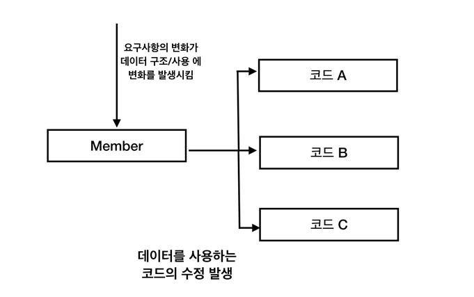
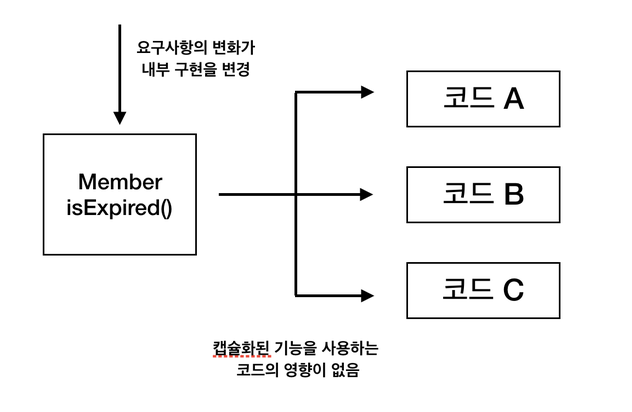
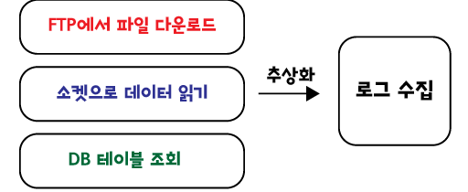
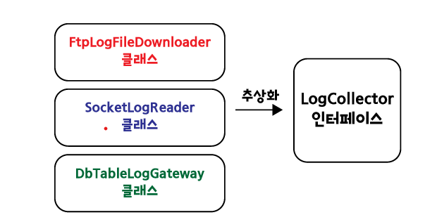
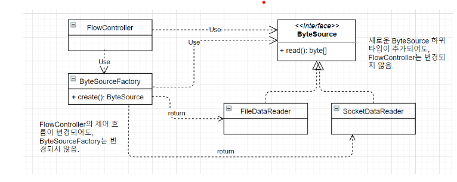

# 3일차 2024-04-03 (p.45 ~ 77)

## 캡슐화

객체 지향의 장점은 한 곳의 구현 변경이 다른 곳에 변경을 가하지 않도록 해준다는데 있다.
즉, 수정을 좀 더 원활하게 할 수 있도록 하는 것이 객체 지향적으로 프로그래밍을 하는 이유인 것이다.

객체 지향은 기본적으로 캡슐화를 통해서 한 곳의 변화가 다른 곳에 미치는 영향을 최소화 한다.

캡슐화는 객체가 내부적으로 기능을 어떻게 구현하는지를 감추는 것이다.
이를 통해 내부의 기능 구현이 변경되더라도 그 기능을 사용하는 코드는 영향을 받지 않도록 만들어 준다.

즉, 내부 구현 변경의 유연함을 주는 기법이 바로 캡슐화이다.


### 절차 지향 방식 코드

회원의 서비스 만료 날짜 여부에 따라 서비스를 제공하거나 안내 페이지를 보여줘야 한다고 하자.

```java
public class Member {
    private Date expiryDate;
    private boolean male;

    public Date getExpiryDate() {
        return expiryDate;
    }

    public boolean isMale() {
        return male;
    }
}
```

Member 객체를 이용해서 만료 여부를 확인하는 코드는 Member 가 제공하는 expiryDate 데이터의 값과 현재 시간을 비교하게 된다.

```java
if(member.getExpireDate() != null &&
	member.getExpireDate().getDate() < System.currentTimeMillis()) {
	// 만료되었을때 처리
}
```


여기서 요구 사항이 변경되어 여성 회원인 경우 만료 기간이 지났어도 30일 간은 서비스를 사용할 수 있도록 정책이 변경되었다고 가정해보자

만료 여부를 확인하는 규칙이 변경되었으므로 이를 코드에 반영 해주어야 한다. 

```java
long day30 = 1000 * 60 * 60 * 24 * 30; //30일
if((
	member.getExpireDate() != null &&
	member.getExpireDate().getDate() < System.currentTimeMillis()
	)
	||
	(
		!member.isMale() && member.getExpireDate() != null &&
		member.getExpireDate().getDate() < System.currentTimeMillis -day30
	)) {
	// 만료되었을때 처리
}
```

변경되는 코드는 복잡해질 것이다.


만료 여부를 확인하는 코드는 이미 여러 곳에서 사용되는 중이기 때문에, 그 코드들을 모두 찾아서 변경 해줘야 한다.





### 캡술화 된 기능 구현

```java
public class Member {
    private Date expiryDate;
    private boolean male;

    public Date getExpiryDate() {
        return expiryDate;
    }

    public boolean isMale() {
        return male;
    }

    public boolean isExpired() {
        return expiryDate != null && expiryDate.getDate() < System.currentTimeMillis();
    }
}
```

Member 클래스의 isExpired() 메서드는 만료 여부 확인 기능을 제공하는데, 다른 클래스에서는 Member 클래스가
isExpired() 메서드를 어떻게 구현했는지 알지 못ㄱ한다. 

만약에 만료 여부 규칙이 변경되어도 

Member 클래스의 isExpired() 메서드가 새로운 요구 사항을 따르도록 수정한다.

```java
public class Member {
    private static final long DAY30 = 1000 * 60 * 60 * 24 * 30;
    private Date expiryDate;
    private boolean male;

    public Date getExpiryDate() {
        return expiryDate;
    }

    public boolean isMale() {
        return male;
    }

    public boolean isExpired() {
        if (male) {
            return expiryDate != null && expiryDate.getDate() < System.currentTimeMillis();
        }
        return expiryDate != null && expiryDate.getDate() < System.currentTimeMillis() - DAY30;
    }
}
```

isExpired 메서드를 수정했으니, isExpired 메서드를 사용한 곳을 수정할 차례 이다.

근데 수정할 곳이 없다.





### 캡슐화의 결과는 내부 구현 변경의 유연성 획득

기능 구현을 캡슐화하면 내부 구현이 변경되더라도, 기능을 사용하는 곳의 영향을 최소화할 수 있다.
앞서 isExpired()의 예에서는 아예 영향을 주지 않았다. 이는 캡슐화를 통해서 내부 기능 구현 변경의 유연함을 얻을 수 있다는 것을 의미한다.

죽, 캡슐화를 잘 할 수록 보다 쉽게 구현을 변경할 수 있게 된다.


### 캡슐화를 위한 두 개의 규칙

- Tell, Don't Ask
- 데미테르의 법칙 (Law of Demeter)

"Tell, Don't Ask"  규칙은 간단하다. 데이터를 물어보지 않고, 기능을 실행해 달라고 말하라는 규칙이다.

앞서 회원 만료 여부를 확인하는 코드를 다시 떠올려 보자. 절차 지향 방식은 만료 일자 데이터를 가져와서 , 직접 만료 여부를 확인했다.

```java
if(member.getExpireDate() != null &&
	member.getExpireDate().getDate() < System.currentTimeMillis()) {
	// 만료되었을때 처리
}
```

데이터를 읽는 것은 데이터를 중심으로 코드를 작성하게 만드는 원인이 되며, 따라서 절차 지향적인 코드를 유도하게 된다.

데이터 대신에 기능을 실행해달라고 명령을 내리려면 만료 일자 데이터를 가진 객체에게 만료 여부를 확인해 달라고 해야 한다.

즉, 아래 코드와 같이 기능 실행을 요청하는 방식으로 코드를 작성하게 된다.

```java
if(member.isExpired()){
    // 만료에 따른 처리
}
```

기능 실행을 요청하는 방식으로 코드를 작성하다 보면, 자연스럽게 해당 기능을 어떻게 구현했는지 여부가 감춰진다. 
즉, 기능 구현이 캡슐화되는 것이다.


데미테르의 법칙은 "Tell, Don't Ask" 규칙을 따를 수 있도록 만들어 주는 또 다른 규칙이다.

- 메서드에서 생성한 객체의 메서드만 호출
- 파라미터로 받은 객체의 메서드만 호출
- 필드로 참조하는 객체의 메서드만 호출

```java
public void processSome(Member member) {
    if(member.getDate().getTime() < ...) // 데미테르 법칙 위법    
}
```

이때 위 코드는 데미테르의 법칙을 어긴 것이다. 데미테르의 법칙에 따르면 파라미터로 전달 받은 객체의 메서드만 호출하도록 되어 있는데, 
위 코드의 경우 파라미터로 전달받은 member 의 getDate() 메서드를 호출 한 뒤에, 다시 getDate()가 리턴한 Date 객체의 getTime() 메서드를
호출했기 때문이다.

따라서 데미테르의 법칙을 따르려면, 위 코드를 member 객체에 대한 한 번의 메서드 호출로 변경해 주어야 한다. 이는 결국 데이터 중심이 아닌
기능 중심으로 코드를 작성하도록 유도하기 때문에, 기능 구현의 캡슐화를 향상 시켜 준다. 


### 객체 지향 설계 과정

- 제공해야 할 기능을 찾고 또는 세분화하고, 그 기능을 알맞은 객체에 할당한다.
  - 기능을 구현하는데 필요한 데이터를 객체에 추가한다. 객체에 데이터를 먼저 추가하고 그 데이터를 이용하는 기능을 넣을 수도 있다.
  - 기능은 최대한 캡슐화해서 구현한다.
- 객체 간에 어떻게 메시지를 주고받을 지 결정한다.
- 과정 1과 과정 2를 개발하는 동안 지속적으로 반복한다. 


파일 데이터 암호화 예시 

기능 목록

- 파일에서 데이터 읽기
- 데이터를 암호화하기
- 파일에 데이터 쓰기

기능을 찾으면 이들 기능을 제공할 객체 후보를 찾고, 각 객체가 어떻게 연결되는지 그려본다. 
이 과정에서 객체가 기능을 제공할 때 사용할 인터페이스가 도출된다.

객체의 크기는 한 번에 완성되기 보다는 구현을 진행하는 과정에서 점진적으로 명확해진다.

객체 설계는 한 번에 완성되지 않고 구현을 진행해 나가면서 점진적으로 완성된다. 
이는 최초에 만든 설계가 완벽하지 않으며, 개발이 진행되면서 설계도 함께 변경된다는 것을 의미한다.

따라서 설계를 할 때에는 변경되는 부분을 고려한 유연한 구조를 갖도로 노력해야 한다. 

## 다형성과 추상 타입


### 상속

상속은 한 타입을 그대로 사용하면서 구현을 추가할 수 있도록 해주는 방법을 제공한다. 

```java
public class Coupon {
    private int discountAmount;

    public Coupon(int discountAmount) {
        this.discountAmount = discountAmount;
    }

    public int getDiscountAmount() {
        return discountAmount;
    }

    public int calculateDiscountPrice(int price) {
        if (price < discountAmount) return 0;
        return price - discountAmount;
    }
}

```

Coupon 객체를 이용해서 할인된 금액을 구하는 코드 

```java
Coupon coupon = new Coupon(3000);
int price= coupon.calculateDiscountPrice(product.getPrice());
```


금액 할인 쿠폰 중, 상품 금액이 지정한 금액 이상인 경우에만 할인을 받도록 하는 쿠폰을 새로 만들고 싶다.
이미 Coupon 클래스가 쿠폰의 기본적인 기능을 제공하고 있으므로 이 기능을 확장해서 새로운 쿠폰 기능을 구현하면 좀 더 수월하게 새로운 쿠폰
기능을 제공할 수 있을 것 같다.

```java
public class LimitPriceCoupon extends Coupon{
  private int limitPrice;

  public LimitPriceCoupon(int limitPrice, int discountAmount) {
    super(discountAmount);
    this.limitPrice = limitPrice;
  }

  public int getLimitPrice() {
    return limitPrice;
  }

  @Override
  public int calculateDiscountPrice(int price) { // 재정의
    if (price < limitPrice) return price;
    return super.calculateDiscountPrice(price);
  }
}

```

자식 클래스는 부모 클래스에 정의된 구현을 물려받는다. 

### 다형성과 상속

다형성은 한 객체가 여러 가지 모습을 갖는다는 것을 의미한다. 

여기서 모습이란 타입을 뜻하는데, 즉, 다형성이란 한 객체가 여러 타입을 가질 수 있다는 것을 뜻한다.

자바와 같은 정적 타입 언어에서는 타입 상속을 통해서 다형성을 구현한다.

```java
public class Plane {
    
    public void fly(){
        // 비행
    }
}

public interface Turbo {

  void boost();
}


public class TurboPlane extends Plane implements Turbo {

  @Override
  public void boost() {
    // 가속
  }
}
```

위의 자바 코드에는 두 개의 클래스와 한 개의 인터페이스가 있다. 이 중 TurboPlane 클래스는 Plane 클래스를 상속받고 있고,
Turbo 인터페이스도 상속받고 있다. 이런 타입 상속 관계를 갖는 경우 다음과 같이 TurboPlane 타입의 객체에 Plane 타입이나 Turbo 타입에 
정의된 메서드의 실행을 요청할 수 있다.

```java
TurboPlane tp = new TurboPlane();
tp.fly(); // Plane 에 정의/구현된 메서드 실행
tp.boost(); // Turbo에 정의되고 TurboPlane 에 구현된 메서드 실행
```

또한, TurboPlane 타입의 객체를 Plane 타입이나 Turbo 타입에 할당하는 것도 가능하다. 

```java
TurboPlane tp = new TurboPlane();
Plane p =tp;
p.fly();
        
Turbo t = tp;
t.boost();
```

즉, TurboPlane 타입의 객체는 Plane 타입도 되고 Turbo 타입도 될 수 있으며, Plane 타입과 Turbo 타입에 정의된 모든 기능을 제공하게 된다.

### 추상 타입과 유연함

추상화는 데이터나 프로세스 등을 의미가 비슷한 개념이나 표현으로 정의하는 과정이다. 

프로그램을 만드는 데 다음과 같은 세 개의 기능이 있다고 하자

- FTP 에서 파일을 다운로드
- 소켓에서 데이터 읽기
- DB 테이블의 데이터를 조회

로그를 수집하기 위해서 원격 서버에 있는 로그 파일을 FTP 를 이용해서 가져오거나, TCP 서버를 이용해서 로그 데이터를 읽어 오거나,
DB 테이블에 보관된 로그 데이터를 조회하는 것이다.



위 세 가지 기능은 모두 로그를 수집하기 위한 기능이었다.


모두 '로그 수집' 이라는 프로세스를 처리하는 과정이다.


추상화된 타입은 오퍼레이션의 시그니처만 정의할 뿐 실제 구현을 제공하지는 못한다.


추상 타입만으로는 FTP 에서 로그 파일을 다운로드 할지, 소켓에서 데이터를 읽어 올 지, DB 테이블에서 데이터를 읽어 올 지 여부를 알 수 없다.


추상 타입은 구현을 제공 할 수 없기 때문에, 보통 구현을 제공하지 않는 타입-자바의 인터페이스나 C++의 추상 메서드로만 구성된 추상 클래스-을
이용해서 추상 타입을 정의한다.


#### 추상 타입과 실제 구현의 연결



각 하위 타입들은 모두 상위 타입인 LogCollector 인터페이스에 정의된 기능을 실제로 구현하는데, 이들 클래스들은 
실제 구현을 제공한다는 의미에서 '콘크리트 클래스'라고 부른다.

##### 추상 타입을 이용한 구현 교체의 유연함

```java
SocketLogReader reader = new SocketLogReader();
reader.collect();
```

콘크리트 클래스를 직접 사용해도 문제가 없는데, 왜 추상 타입을 사용하는 것일까?

```java
public class FlowController {

    // 필드 생략
    private String fileName;

    public void process() {
        FileDataReader reader = new FileDataReader(fileName);
        byte[] plainBytes = reader.read();

        ByteEncryptor encryptor = new ByteEncryptor();
        byte[] encryptedBytes = encryptor.encrypt(plainBytes);

        FileDataWriter writer = new FileDataWriter();
        writer.write(encryptedBytes);
    }
}

```

새로운 요구 사항이 들어와 파일 뿐만 아니라 소켓을 통해서 데이터를 읽어 와 암호화할 수 있도록 해달라고 한다.

그러면 if else 블록을 통해서 파일을 읽어 올지 소켓을 통해서 읽어 올지 결정 한다. 


FlowController 자체는 파일이건 소켓이건 상관 없이 데이터를 읽어 오고 이를 암호화해서 특정 파일에 기록 하는 책임을 진다. 

그런데, FlowController 의 본연의 책임과 상관없는 데이터 읽기 구현의 변경 때문에 FlowController 도 함께 바뀌는 것이다.


- 기존 요구 사항: 파일에서 바이트 데이터를 읽어와...
- 추가 요구 사항 : 소켓에서 바이트 데이터를 읽어와...

공통점은 바로 어딘가에서 데이터를 읽어 오는 것이 공통점인 것이다.

```java
public interface ByteSource {
    byte[] read();
}
```

추상 타입을 만들었기 때문에 FileDataReader 와 SockerDataReader 는 모두 ByteSource 타입을 상속 받도록 바꿀 수 있다.


```java
ByteSource source = null;
if (useFile){
    source = new FileDataReader();
}else {
    source = new SocketDataReader();
}
```

코드가 조금 단순해졌지만 , 여전히 if -else 블록이 남아 있다.

ByteSource 의 콘크리트 클래스를 이용해서 객체를 생성하는 부분이 if-else 블록으로 들어가 있는데, 
이 부분을 처리하지 않으면 FlowController 는 여전히 사용할 ByteSource 의 콘크리트 클래스가 변경될 때마다 함께 변경된다.

ByteSource 의 종류가 변경 되더 라도 FlowController 가 바뀌지 않도록 하는 방법에는 다음의 두 가지가 존재한다.

- ByteSource 타입의 객체를 생성하는 기능을 별도 객체로 분리한 뒤, 그 객체를 사용해서 ByteSource 생성
- 생성자 (또는 다른 메서드)를 이용해서 사용할 ByteSource 를 전달받기


첫 번째 방법은 객체를 생성하는 기능을 별도로 분리하는 것이다. 

```java
public class ByteSourceFactory {

    public ByteSource create() {
        if (useFile()) {
            return new FileDataReader();
        }
        return new SocketDataReader();
    }

    private boolean useFile() {
        String userFileVal = System.getProperty("useFile");
        return userFileVal != null && Boolean.parseBoolean(userFileVal);
    }

    private static ByteSourceFactory instance = new ByteSourceFactory();

    public static ByteSourceFactory getInstance() {
        return instance;
    }

    private ByteSourceFactory() {
    }
}

```

ByteSourceFactory 클래스는 ByteSource 타입의 객체를 생성하는 과정을 추상화 했다.

```java
public class FlowController {
    
    private boolean useFile;

    public FlowController(boolean useFile) {
        this.useFile = useFile;
    }

    // 필드 생략
    private String fileName;

    public void process() {
        ByteSource source = ByteSourceFactory.getInstance().create();
        
        byte[] data = source.read();
        
        
    }
}
```

이제 HTTP 를 이용해서 암호화 할 데이터를 읽어 와야 하는 새로운 요구가 발생햇다고 가정 해 보자.

새로운 ByteSource 구현 클래스가 추가 되겠지만, FlowController 클래스의 코드는 영향을 받지 않는다.

변경되는 클래스는 ByteSourceFactory 이다. 이는 FlowController 의 코드는 변경하지 않으면서 동시에 ByteSource 를 변경할 수 있는
유연함을 얻었다는 것을 의미한다. 


추상화 과정을 통해서 얻은 두 가지 유연함

- ByteSource 의 종류가 변경되면, ByteSourceFactory만 변경될 뿐, FlowController 클래스느 변경되지 않는다.
- FlowController 의 제어 흐름을 변경할 때, ByteSource 객체를 생성 하는 부분은 영향을 주지 않으면서 FlowController 만 변경 하면 된다.


객체는 책임을 작게 가질수록 변경에 대한 유연함을 가질 수 있는데, 

기존 FlowController 코드는 데이터를 읽어 오는 객체를 생성하는 책임과 흐름을 제어하는 책임르 동시에 갖고 있다.

따라서 제어 흐름이 변경되거나 데이터를 읽기 위한 객체의 생성 방식에 변화가 생길 때 모두 FlowController 코드를 수정해 주어야 하는 상황이 
발생하게 된다. 

FlowController 에서 책임을 분리할 수 있었던 것은  추상화를 한 덕분이었다. 

다음과 같이 두 번의 추상화를 진행했다.

- 바이트 데이터 읽기 : ByteSource 인터페이스 도출
- ByteSource 객체를 생성하기 : ByteSourceFactory 도출 

추상화는 공통된 개념을 도출해서 추상 타입을 정의해 주기도 하지만, 또한 많은 책임을 가진 객체로부터 책임을 분리하는 촉매제가 되기도 한다.

