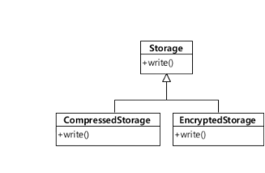

# 5일차  2024-04-05  p.87 ~ 102

## 재사용 : 상속 보단 조립

객체 지향의 주요 특징으로 재사용을 말하면서 그 예로 상속을 드는 경우가 있다.

물론, 상속을 사용하면 상위 클래스에 구현된 기능을 그대로 재사용할 수 있기 때문에, 상속을 사용하면 재사용을 쉽게 할 수 있는 것은 분명하다.

하지만, 상속을 사용할 경우 몇 가지 문제점이 있다.

## 상속과 재사용

스프링 MVC 의 2.x 버전은 웹 요청을 처리하기 위해 아래와 같은 클래스를 제공하고 있다.


- AbstractController : 웹 요청을 처리하는데 필요한 가장 기본적인 구현 제공
- BaseCommandController : 파라미터를 읽어 와 객체로 변환해 주기 위한 기능 제공
- AbstractCommandController : 파라미터를 커맨드 객체로 처리하는 기능 제공


BaseCommandController 클래스는 AbstractController 클래스가 제공하는 기능을 재사용하면서, 파라미터를 객체로 
변환하기 위한 기반 기능을 추가로 제공한다. 

즉, BaseCommandController 클래스가 AbstractController 클래스의 기능을 확장하고 있는 것이다. 
이와 비슷하게 AbstractCommandController 클래스와 AbstractFormController 클래스는 각가 BaseCommandController 클래스가 제공하는
파라미터 처리 기능을 재사용하면서, 각자 자신만의 기능을 추가로 제공하고 있다.

이렇듯 상속을 사용하면 쉽게 다른 클래스의 기능을 재사용하면서 추가 기능을 확장할 수 있기 때문에, 상속은 기능을 재사용하는 매력적인 방법이다.
하지만, 상속은 변경의 유연함이라는 측면에서 치명적인 단점을 갖는다.


### 상속을 통함 재사용의 단점 1. 상위 클래스 변경의 어려움

상속은 상위 클래스의 변경을 어렵게 만든다. 예를 들어, AbstractController 클래스의 구현을 일부 변경했거나 
일부 메서드의 시그니처를 변경했다고 하자.

이 경우 AbstractController 클래스의 변경에 의해 AbstractUrlViewController  클래스와 BaseCommandController 클래스가 변경될 수 있다.

어떤 클래스를 상속받는다는 것은 그 클래스에 의존한다는 뜻이다. 따라서 의존하는 클래스의 코드가 변경되면 영향을 받을 수 있는 것이다. 

동일하게 BaseCommandController 클래스가 변경되면, 이 클래스를 상속받은 AbstractCommandController 클래스와 AbstractFormController
클래스가 영향을 받게 된다. 


상속 계층을 따라 상위 클래스의 변경이 하위 클래스에 영향을 주기 때문에, 최악의 경우 상위 클래스의 변화가 모든 하위 클래스에 영향을 줄 수 있다.
이는 클래스 계층도에 있는 클래스들을 한 개의 거대한 단일 구조처럼 만들어 주는 결과를 초래한다.


### 상속을 통한 재사용의 단점 2. 클래스의 불필요한 증가

상속을 통한 기능 재사용의 두 번째 문제점은 유사한 기능을 확장하는 과정에서 클래스의 개수가 불필요하게 증가할 수 있다는 것이다.

파일 보관소를 구현한 Storage 클래스, 제품이 출시된 이후 보관소의 용량을 아낄 수 있는 방법을 제공해 달라는 요구가 발생

이 요구를 수용하기 위해 Storage 클래스를 상속받아 압축 기능을 추가한 CompressStorage 클래스를 만들었다. 또 보안이 문제가 되서
파일을 암호화해서 저장해주는 EncryptedStorage 클래스를 추가하였다.



그런데, 만약 압축을 먼저 하고 암호화 하는 저장소가 필요하다면 어떻게 해야할까? 
또는 암호화를 먼저 하고 압축을 해 달라고 하면 어떻게 해야할까? 그리고 성능 향상을 위해 캐시를 제공하는 저장소가 필요하고,
추가로 암호화된 저장소에 캐시를 적용하려면 어떻게 될까?

상속을 통해서 이 기능들을 구현하면 아래와 같은 클래스 계층이 만들어진다. 


다중 상속을 할 수 없는 자바에서는 한 개의 클래스만 상속받고 다른 기능은 별도로 구현해야 한다. 

필요한 기능의 조합이 증가할 수록 , 클래스의 개수는 함께 증가하게 된다.


### 상속을 통한 재사용의 단점 3. 상속의 오용

상속을 통한 기능 재사용의 세 번째 문제점은 상속 자체를 잘못 사용할 수 있다는 점이다. 

컨테이너의 수화물 목록을 관리하는 클래스

- 수화물을 넣는다.
- 수화물을 뺀다.
- 수화물을 넣을 수 있는지 확인한다.

이 기능을 구현해야 할 개발자는 목록 관리 기능을 직접 구현하지 않고 ArrayList 클래스가 제공하는 기능을 상속 받아서 사용하기로 결정

```java
public class Container extends ArrayList<Luggage> {

    private int maxSize;
    private int currentSize;

    public Container(int maxSize) {
        this.maxSize = maxSize;
    }
    
    public void put(Luggage lug) throws NotEnoughSpaceException {
        if (!canContain(lug)){
            throw new NotEnoughSpaceException();
        }
        super.add(lug);
        currentSize += lug.size();
    }
    public void extract(Luggage lug){
        super.remove(lug);
        this.currentSize-= lug.size();
    }
    
    public boolean canContain(Luggage lug){
        return maxSize >= currentSize + lug.size();
    }
}
```

여기서 일부 개발자들이 잘못된 방법으로 이 클래스를 사용할 수 있다.

개발 도구로 이클립스를 사용하고 있으면 코드 자동 완성 기능을 이요하게 되어

Container 에 있는 put 메서드 대신에  이클립스의 자동 완성 기능이 제공한 add 메서드를 이용할 수 있다.

하지만, Container 클래스는 목록 기능을 제공하는 ArrayList로 사용하기 위해 만들어진 것이 아니다.

Container 는 사실 ArrayList 가 아니다. 

상속은 IS-A 관계가 성립할 때에만 사용해야 하는데, "컨테이너는 ArrayList 이다" 는 IS-A 관계가 아니다.

Container 는 수화물을 보관하는 책임을 갖는 반면에, ArrayList 는 목록을 관리하는 책임을 갖는다.

즉, 둘은 서로 다른 책임을 갖는 것이다. 이렇게 같은 종류가 아닌 클래스의 구현을 재사용하기 위해 상속을 받게 되면, 잘못된 사용으로
인한 문제가 발생하게 된다.


## 조립을 이용한 재사용

객체 조립(composition) 은 여러 객체를 묶어서 더 복잡한 기능을 제공하는 객체를 만들어 내는 것이다.

객체 지향 언어에서 객체 조립은 보통 필드에서 다른 객체를 참조하는 방식으로 구현된다.


한 객체가 다른 객체를 조립해서 필드로 갖는다는 것은 다른 객체의 기능을 사용한다는 의미를 내포한다.

```java
public class FlowController {

    private Encryptor encryptor = new Encryptor();
    
    public void process() {
        //...
        byte[] encryptedData = encryptor.encrypt(data);
        //,,,
    }
}

```

조립을 통한 재사용은 앞서 상속을 통한 재사용에서 발생했던 문제들을 해소해 준다.


만약 압축 기능 제공 객체와 암호화 기능 제공 객체를 Storage에 조립하는 방법으로 구현하면 

클래스 구조는 다음 과 같이 변경 된다.


Storage 클래스를 상속받은 하위 클래스가 증가했던 방식과 비교해 봤을 때, 
조립을 이용하면 불필요한 클래스 증가를 방지할 수 있다.

또한, Compressor 클래스나 Encryptor 클래스는 Storage 클래스에 의존하지 않기 때문에
Storage 클래스를 쉽게 변경할 수 있다. 앞서 상속에서 발생했던 상위 클래스 변경이 어려워지는 문제가 발생하지 않는 것이다.

물론 모든 상황에서 객체 조립을 사용해야 한다는 얘기는 아니며, 상속을 사용하다 보면 변경의 관점에서 
유연함이 떨어질 가능성이 높으니 객체 조립을 먼저 고민하라는 뜻이다.


### 위임

위임 (delegation) 은 내가 할 일을 다른 객체에게 넘긴다는 의미를 담고 있으며, 보통 조립 방식을 이용해서 위임을 구현한다.


예를 들어, 이미지 편집 툴을 만들 경우 마우스 포인터의 위치가 특정 도형이 차지하는 영역에 포함되어 있는지 확인하는 기능이 필요할 것이다.

그런데, 도형과 관련된 Bounds 클래스가 이 기능을 이미 제공하고 있다면, 도형을 표현하는 Figure 클래스의 contains() 메서드는 
Bounds 객체에게 포함 여부 확인 여부를 대신 확인해달라고 위임 할 수 있다.

```java
public abstract class Figure {

    private Bounds bounds = new Bounds();
    
    //...
    public void changeSize() {
        // 크기 변경 코드 위치
        bounds.set(x, y, width, height);
    }
    public boolean contains(Point point){
        // bounds 객체에 처리를 위임함
        return  bounds.contains(point.getX() ,point.getY());
    }

}
```

보통 위임은 조립과 마찬가지로 요청을 위임할 객체를 필드로 연결한다. 하지만, 꼭 필드로 정의해야 하는 것은 아니다.
위임의 의도는 다른 객체에게 내가 할 일을 넘긴다는 데 있으므로, 객체를 새로 생성해서 요청을 전달한다 해도
위임이란 의미에서 벗어나지 않는다.


객체 지향은 책임에 따라 객체들이 세분화되는 특징을 갖는다. 따라서 객체 지향적으로 구현을 하면 자연스럽게 많은 객체들이
만들어지고, 이 과정에서 조립과 위임을 통해 객체를 재사용하게 된다.

> **노트** <br/>
> 위임을 사용하면 내가 바로 실행할 수 있는 걸, 다른 객체에 한 번 더 요청하게 된다. 이 과정에서 메서드 호출이
> 추가되기 때문에 실행 시간은 다소 증가한다. 연산 속도가 매우 중요한 시스템에서는 많은 위임 코드가 성능에 문제를 일으킬 수 있지만,
> 대부분의 경우에는 위임으로 인해 발생하는 (미세한) 성능 저하 보다 위임을 통해서 얻을 수 있는 유연함/재사용의 장점이 크다.


### 상속은 언제 사용하나?

상속을 사용할 때에는, 재사용이라는 관점이 아닌 기능의 확장이라는 관점에서 상속을 적용해야 한다. 또한 추가로 명확한 IS-A 관계가 성립되어야 한다.

하위로 내려갈수록 상위 클래스의 기본적인 기능은 그대로 유지하면서, 그 기능을 확장해 나가야 한다.

상속은 명확한 IS-A 관계에서 점진적으로 상위 클래스의 기능을 확장해 나갈 때 사용할 수 있다.

단, 최초에는 명확한 IS-A 관계로 보여서 상속을 이용해서 기능을 확장했다고 하더라도, 이후에 클래스의 개수가 불필요하게 증가하는 문제가 발생하거나
상위 클래스의 변경이 어려워지는 등 상위 클래스를 상속 받을 때의 단점이 발생한다면, 조립으로 전환하는 것을 고려해야 한다.


