# 6일차  2024-04-06 p.104 ~ 136

# 설계 원칙 : SOLID

- 단일 책임 원칙 (Single responsibility principle : SRP)
- 개방-폐쇄 원칙 (Open- closed principle : OCP)
- 리스코프 치환 원칙 (Liskov substitution principle : LSP)
- 인터페이스 분리 원칙 (Interface segregation principle : ISP)
- 의존 역전 원칙 (Dependency inversion principle : DIP)

## 단일 책임 원칙 (Single responsibility principle )

- 클래스는 단 한 개의 책임을 가져야 한다.

클래스가 여러 책임을 갖게 되면 그 클래스는 각 책임마다 변경되는 이유가 발생하기 때문에,
클래스가 한 개의 이유로만 변경되려면 클래스는 한 개의 책임만을 가져야 한다. 이런 이유로

이 원칙은 다른 말로 "클래스를 변경하는 이유는 단 한 개여야 한다."고로 표현한다.

### 단일 책임 원칙 위반이 불러오는 문제점

HTTP 프로토콜을 이용해서 데이터를 읽어 와 화면에 보여주는 기능

```java
public class DataViewer {

  public void display() {
    String data = loadHtml();
    updateGui(data);

  }

  public String loadHtml() {
    HttpClient client = new HttpClient();
    client.connect(url);
    return client.getResponse();

  }

  private void updateGui(String data) {
    GuiData guiModel = parseDataToGuiData(data);
    tableUI.changeData(guiModel);

  }

  private GuiData parseDataToGuiData(String data) {
    ... // 파싱 처리 코드

  }

  ... // 기타 필드 등 다른 코드

}
```

DataViewer 를 잘 사용하고 있는 도중에 데이터를 제공하는 서버가 HTTP 프로토콜에서 소켓 기반의 프로토콜로 변경되었다.

이 프로토콜은 응답 데이터로 byte 배열을 제공한다.

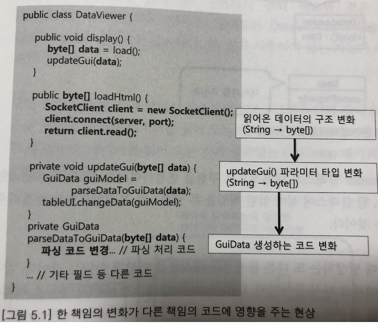

위와 같은 연쇄적인 코드 수정은 두 개의 책임 : 데이터를 읽는 책임 , 화면에 보여주는 책임 이 한 클래스에 아주 밀접하게
결합되어 있어서 발생한 증상이다.

책임의 개수가 많아질수록 한 책임의 기능 변화가 다른 책임에 주는 영향은 비례해서 증가하게 되는데, 이는 결국 코드를 절차 지향적으로 
만들어 변경을 어렵게 만든다.


해결 방안

- 데이터 읽기와 데이터를 화면에 보여주는 책임을 두 개의 객체로 분리
- 둘 간에 주고받을 데이터를 저수준의 String 이 아닌 알맞게 추상화된 타입을 사용

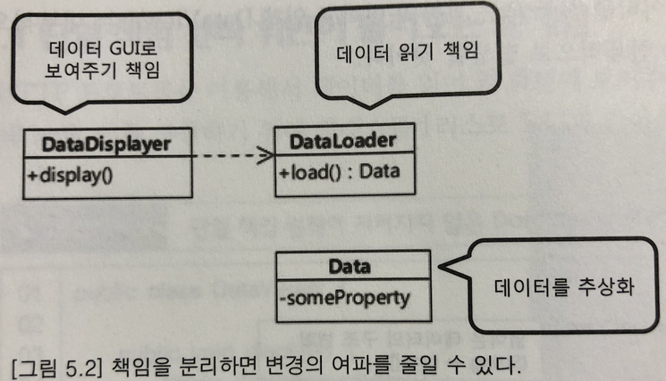


단일 책임 원칙을 어길 때 발생하는 또 다른 문제점은 재사용을 어렵게 한다는 것이다.

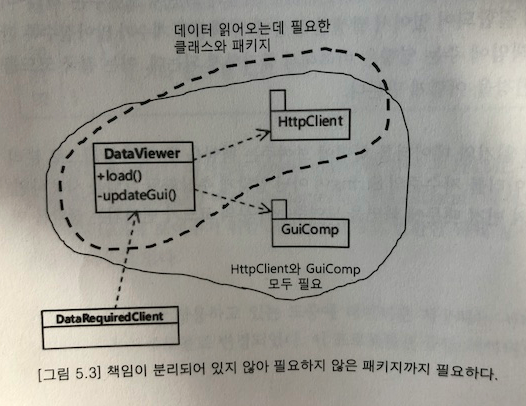


단일 책임 원칙을 준수하면 재사용성을 높일 수 있다.

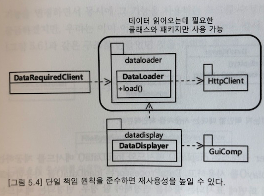

### 책임이란 변화에 대한 것

책임의 단위는 변화되는 부분과 관련 되어 있다.

각각의 책임은 서로 다른 이유로 변경되고, 서로 다른 비율로 변경되는 특징이 있다. 

예를 들어, 데이터를 읽어 오는 책임의 기능이 변경 될 때 데이터를 보여주는 책임은 변경되지 않는다. 

반대로 데이터를 테이블에서 그래프로 바꿔서 보여주더라도 데이터를 읽어 오는 기능은 변경 되지 않는다.

따라서 서로 다른 이유로 바뀌는 책임들이 한 클래스에 함께 포함 되어 있다면 이 클래스는 단일 책임 원칙을 어기고 있다고 볼 수 있다.


## 개방 폐쇄 원칙 (Open-closed principle)

> 확장에는 열려 있어야 하고, 변경에는 닫혀 있어야 한다.

- 기능을 변경하거나 확장할 수 있으면서
- 기 기능을 사용하는 코드는 수정하지 않는다. 

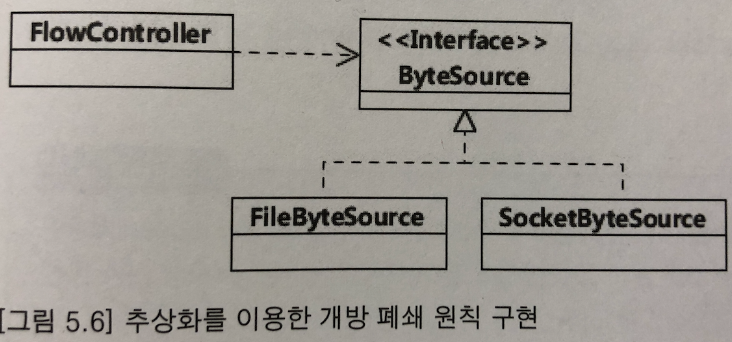

메모리에서 byte 를 읽어 오는 기능을 추가해야 할 경우, ByteSource 인터페이스를 상속 받은 MemoryByteSource 를 구현함으로써

기능 추가가 가능하다. 그리고 새로운 기능이 추가되었지만, 이 새로운 기능을 사용할 FlowController 클래스의 코드는 변경되지 않는다.

즉, 기능을 확장하면서도 기능을 사용하는 기존 코드는 변경되지 않는 것이다.

개방 폐쇄 원칙을 구현할 수 있는 이유는 확장 되는 부분을 추상화 해서 표현했기 때문이다.

변화되는 부분은 byte 데이터를 읽어 오는 기능이었다.

FlowController  클래스 입장에서 변화되는 부분을 ByteSource 인터페이스로 추상화 함으로써 byte 읽기 기능을 고정시킬 수 있게 되었다.


개방 폐쇄 원칙을 구현하는 또 다른 방법은 상속을 이용하는 것이다. 상속은 상위 클래스의 기능을 그대로 사용하면서 
하위 클래스에서 일부 구현을 오버라이딩 할 수 있는 방법을 제공한다.

```java
public class ResponseSender {
  private Data data;
  public ResponseSender(Data data) {
    this.data = data;

  }

  public Data getData() {
    return data;

  }

  public void send() {
    sendHeader();
    sendBody();

  }

  protected void sendHeader() {
    // 헤더 데이터 전송

  }

  protected void sendBody() {
    // 텍스트로 데이터 전송

  }

}
```

만약 압축해서 데이터를 전송하는 기능을 추가하고 싶다면 어떻게 하면 될까?

```java
public class ZippedResponseSender extends ResponseSender {
    public ZippedResponseSender(Data data) {
        super(data);
    }

    @Override
    protected void sendBody() {
        //데이터 압축 처리
    }
}

```

ResponseSender 클래스를 상속 받은 클래스에서 sendHeader 메서드와 sendBody 메서드를 오버라이딩 하면 된다.


ResponseSender 클래스의 코드는 바뀌지 않았다. 

즉, ResponseSender 클래스는 확장에는 열려 있으면서 변경에는 닫혀 있다.

#### 개방 폐쇄 원칙이 깨질 때의 주요 증상

추상화와 다형성을 이용해서 개방 폐쇄 원칙을 구현하기 때문에, 추상화와 다형성이 제대로 지켜지지 않은 코드는 개방 폐쇄 원칙을 어기게 된다.
개방 폐쇄 원칙을 어기는 코드의 전형적인 특징은 다음과 같다.

- 다운 캐스팅을 한다.

```java
public void drawCharacter(Character character) {
  if(character instanceof Missile) {  // 타입 확인
    Missile missile = (Missile) character; // 타입 다운 캐스팅
    missile.drawSpecific();

  } else {
    character.draw();

  }

}
```

위 코드는 character 파라미터의 타입이 Missile인 경우 별도 처리를 하고 있다.


instanceof 와 같은 타입 확인 연산자가 사용된다면 해당 코드는 개방 폐쇄 원칙을 지키지 않을 가능성이 높다. 

이런 경우에는 타입 캐스팅 후 실행하는 메서드가 변화 대상인지 확인해봐야 한다.


개방 폐쇄 원칙을 깨뜨리는 코드의 또 다른 특징

- 비슷한 if-else 블록이 존재한다.

```java
ublic class Enemy extends Character {
  private int pathPattern;
  public Enemy(int pathPattern) {
    this.pathPattern = pathPattern;

  }

  public void draw() {
    if(pathPattern == 1) {
      x += 4;

    } else if(pathPattern == 2) {
      y += 10;

    } else if(pathPattern == 4) {
      x += 4;
      y += 10;

    }

    ...;  // 그려 주는 코드

  }

}
```
 
Enemy 클래스에 새로운 경로 패턴을 추가해야 할 경우 Enemy 클래스의 draw() 메서드에는 새로운 if 블록이 추가된다.

즉,경로를 추가하는데 Enemy 클래스가 닫혀 있지 않은 것이다. 

이를 개방 폐쇄 원칙을 따르도록 하려면 경로 패턴을 추상화 하고 Enemy 에서 추상화 타입을 사용하는 구조로 변경 해야 한다.

```java
public class Enemy extends Character {
  private PathPattern pathPattern;
  public Enemy(PathPattern pathPattern) {
    this.pathPattern = pathPattern;

  }

  public void draw() {
    int x = pathPattern.nextX();
    int y = pathPattern.nextY();

    ...; // 그려 주는 코드

  }

}
```

이제 새로운 이동 패턴이 생기더라도 Enemy 클래스의 draw() 메서드는  변경 되지 않으며, 
새로운 타입의 PathPattern 구현 클래스를 추가해 주기만 하면 된다. 


#### 개방 폐쇄 원칙은 유연함에 대한 것

개방 폐쇄 원칙은 변경의 유연함과 관련된 원칙이다. 만약 기존 기능을 확장하기 위해 기존 코드를 수정해 주어야 한다면,
새로운 기능을 추가하는 것이 점점 힘들어진다. 
즉, 확장에는 닫히고 변경에는 열리는 반대 상황이 발생하는 것이다.


개방 폐쇄 원칙은 변화가 예상되는 것을 추상화 해서 변경의 유연함을 얻도록 해준다.
이 말은 변화되는 부분을 추상화하지 못하면 개방 폐쇄 원칙을 지킬 수 없게 되어  시간이 흐를수록 기능 변경이나
확장을 어렵게 만든다는 것을 뜻한다.


## 리스코프 치환 원칙 (Liskov substitution principle )

리스코프 치환 원칙은 개방 폐쇄 원칙을 받쳐 주는 다형성에 관한 원칙을 제공한다. 
리스코프 치환 원칙은 다음과 같다.

- 상위 타입의 객체를 하위 타입의 객체로 치환해도 상위 타입을 사용하는 프로그램은 정상적으로 동작 해야 한다.


상위 타입 SuperClass 와 하위 타입 SubClass 가 있다고 하자.

```java
public void someMethod(SuperClass sc) {
    sc.someMethod();
}
```

someMethod() 는 상위 타입인 SuperClass 타입의 객체를 사용하고 있는데, 이 메서드에 다음과 같이
하위 타입의 객체를 전달해도 someMethod()가 정상적으로 동작해야 한다는 것이 리스코프 치환 원칙이다.

```java
someMethod(new SubClass());
```

리스코프 치환 원칙이 제대로 지켜지지 않으면 다형성에 기반한 개방 폐쇄 원칙 역시 지켜지지 않기 때문에, 리스코프 치환 원칙을 지키는 것이 매우 중요하다.


### 리스코프 치환 원칙을 지키지 않을 때의 문제

```java
public class Rectangle {
    private int width;
    private int height;

    public int getWidth() {
        return width;
    }

    public void setWidth(int width) {
        this.width = width;
    }

    public int getHeight() {
        return height;
    }

    public void setHeight(int height) {
        this.height = height;
    }
}
```

정사각형을 직사가형의 특수한 경우로 보고 정사각형을 표현하기 위한 Square 클래스가 Rectangle 클래스를 상속받도록 구현 했다고 하자.

정사각형은 가로와 세로가 모두 동일한 값을 가져야 하므로, Square 클래스는 Rectangle 클래스의 setWidth() 메서드와 setHeight() 메서드를 
재정의 해서 가로와 세로 값이 일치되도록 구현하였다.


```java
public class Square extends Rectangle {

    @Override
    public void setWidth(int width) {
        super.setWidth(width);
        super.setHeight(width);
        
    }

    @Override
    public void setHeight(int height) {
        super.setHeight(height);
        super.setWidth(height);
    }
}

```


instanceOf 연산자를 사용한다는 것 자체가 리스코프 치환 원칙 위반이 되고, 
이는 increaseHeight() 메서드가 Rectangle 의 확장에 열려 있지 않다는 것을 뜻한다.


```java
    public void increaseHeight(Rectangle rec)  {
        if (rec instanceof Square){
            throw new CantSupportSquareException();
        }
        
        if (rec.getHeight() <= rec.getHeight()){
            rec.setHeight(rec.getHeight() +10) ;
        }
    }
```


직사각형-정사각형 문제는 개념적으로 상속 관계에 있는 것처럼 보일지라도 실제 구현에서는 상속 관계가 아닐 수도 있다는 것을 보여준다.

개념상 정사각형은 높이와 폭이 같은 직사각형이므로, Rectangle 클래슬를 상속받아 Square 클래스를 구현하는 것이 합리적으로 보일 수 있으나,
실제 프로램 에서는 이 둘을 상속 관계로 묶을 수 없는 것이다.

### 리스코프 치환 원칙은 계약과 확장에 대한 것

리스코프 치환 원칙은 긴으의 명세에 대한 내용이다.

setHeight() 메서드를 호출하는 코드는 높이 값만 변경될 뿐 폭은 바뀌지 않을 거라고 가정하는데,
Square 클래스의 setHeight() 메서드는 높이와 폭을 함께 변경한다. 따라서 setHeight() 메서드를 사용하는 코드는 
전혀 상상하지 못했던 결과로 인해 예상과 다리 비 정상적으로 동작할 수 이 ㅆ다.

기능 실행의 계약과 관련해서 흔히 발생하는 위반 사례

- 명시된 명세에서 벗어난 값을 리턴한다.
- 명시된 명세에서 벗어난 익셉션을 발생한다.
- 명시된 명세에서 벗어난 기능을 수행한다.

리턴 값은 0 이나 또는 그 이상을 리턴하도록 정의 되어 있는데 하위 타입에서 음수 값을 리턴한다거나, IOException 만 발생시킨다고
정의 했는데 IllegalArgumentException 을 발생 시킨다든가 하는 식이다.

리스코프 치환 원칙은 확장에 대한 것이다.

리스코프 치환 원칙을 어기면 개방 폐쇄 원칙을 어길 가능성이 높아진다.

```java
public class Coupon {
    
    private int discountRate;
    
    public int calculateDiscountAmount(Item item){
        return item.getPrice() * discountRate;
    }
}
```

Item 클래스를 상속 받는 SpecialItem 클래스 

```java
public class Coupon {
    
    private int discountRate;
    
    public int calculateDiscountAmount(Item item){
        if (item instanceof SpecialItem) return 0;
        return item.getPrice() * discountRate;
    }
}

```

위 코드는 리스코프 치환 원칙 위반 사례이다.

instanceOf 연산자를 사용해서 SpecialItem 타입인지의 여부를 확인하고 있다.
즉, 하위 타입인 SpecialItem 이 상위 타입인 Item 을 완벽하게 대체하지 못하는 상황이 발생하고 있다.

타입을 확인하는 기능을 사용하는 것은 전형적인 리스코프 치환 원칙을 위반 할 때 발생하는 증상이다.

리스코프 치환 원칙을 어기게 된 이유는 Item 에 대한 추상화가 덜 되었기 때문이다.

변화되는 부분을 Item 클래스에 추가함으로써 리스코프 치환 원칙을 지킬 수 있게 된다.


```java
public class Item {
    private int price;
    
    public boolean isDiscountAvailable() {
        return true;
    }
    
}

```


```java
public class SpecialItem extends Item {

    @Override
    public boolean isDiscountAvailable() {
        return false;
    }
}

```

이제 instanceOf 연산자를 사용하던 코드를 Item 클래스만 사용하도록 구현할 수 있게 되었다.

```java
public class Coupon {

    private int discountRate;

    public int calculateDiscountAmount(Item item){
       if (!item.isDiscountAvailable()) return 0;
        return item.getPrice() * discountRate;
    }
}

```

리스코프 치환 원칙이 지켜지지 않으면 쿠폰 예제에서 봤듯이 개방 폐쇄 원칙을 지킬 수 없게 된다.

개방 폐쇄 원칙을 지키지 않으면 기능 확장을 위해 더 많은 부분을 수정해야 하므로, 
리스코프 치환 원칙을 지켜지지 않으면 기능을 확장하기가 어렵게 된다.


## 인터페이스 분리 원칙 (Interface segregation principle)

- 인터페이스는 그 인터페이스를 사용하는 클라이언트를 기준으로 분리해야 한다.

### 인터페이스 변경과 그 영향

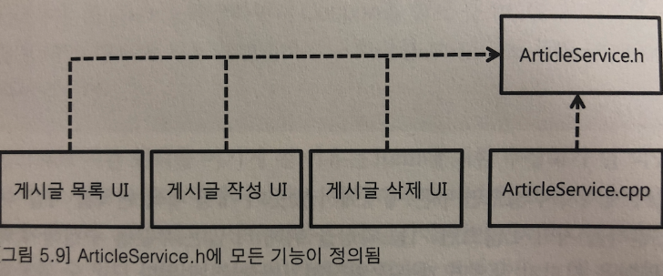

게시글 작성, 게시글 목록, 게시글 삭제 기능

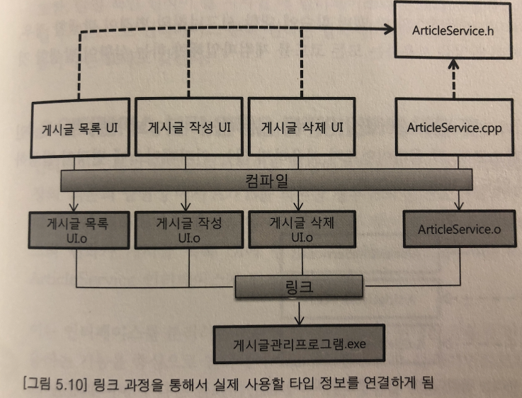

ArticleService 클래스의 목록 읽기 기능과 관련된 멤버 함수의 시그니처에 변경이 발생했다고 하자.

 이 경우 ArticleService.h 헤더 파일과 ArticleService.cpp 파일에 변경을 반영한 뒤에 컴파일 해서 ArticleService.o 오브젝트
 파일을 생성할 것이다. 
 그리고 게시글 목록 기능에 변경이 발생했으므로, 게시글 목록 UI 소스를 변경한 뒤에 컴파일해서 게시글 목록 UI 오브젝트 파일을 생성할 것이다.
 
그런데, 변경은 여기서 끝나지 않는다. ArticleService.h 파일이 변경되었기 때문에 이 헤더 파일을 사용하는 게시글 작성 UI 와 
게시글 삭제 UI의 소스 코드도 다시 컴파일해서 오브젝트 파일을 만들어 주어야 한다. 게시글 작성 UI 및 게시글 삭제 UI 와 상관없는 
게시글 목록 기능에 변경이 발생했음에도 불구하고 소스 코드를 다시 컴파일 한 것이다. 

### 인터페이스 분리 원칙

인터페이스 분리 원칙은 자신이 사용하는 메서드에만 의존해야 한다는 원칙이다.

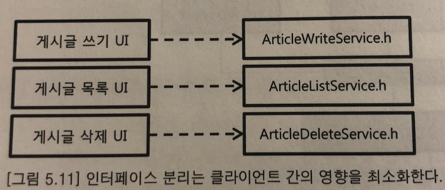

ArticleService 인터페이스를 각 클라이언트가 필요로 하는 인터페이스들로 분리함으로써, 각 클라이언트가 사용하지 않는 인터페이스에 변경이
발생하더라도 영향을 받지 않도록 만들어야 한다.


### 인터페이스 분리 원칙은 클라이언트에 대한 것

인터페이스 분리 원칙은 클라이언트 입장에서 인터페이스를 분리하라는 원칙이다.

인터페이스를 분리하는 기준이 클라이언트가 된다.

각 클라이언트가 사용하는 기능을 중심으로 인터페이스를 분리함으로써, 클라이언트로부터 발생하는 인터페이스 변경의 여파가 다른 클라이언트에
미치는 영향을 최소화 할 수 있게 된다.

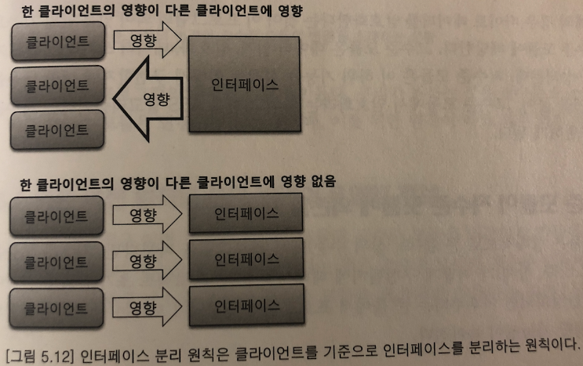

## 의존 역전 원칙 (Dependency inversion principle)

- 고수준 모듈은 저수준 모듈의 구현에 의존해서는 안 된다. 저수준 모듈이 고수준 모듈에서 정의한 추상 타입에 의존해야 한다.

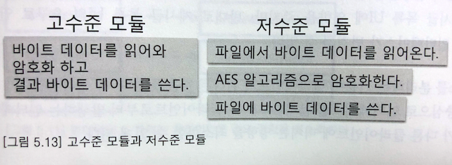

암호화 예의 경우 바이트 데이터를 암호화 한다는 것이 이 프로그램의 의미 있는 단일 기능으로서 고수준 모듈에 해당한다.
고수준 모듈은 데이터 읽기, 암호화 , 데이터 쓰기 라는 하위 기능으로 구성되는데, 저수준 모듈은 데이터 읽기, 암호화 , 데이터 쓰기라는
하위 기능으로 구성되는데, 저수준 모듈은 이 하위 기능을 실제로 어떻게 구현할지에 대한 내용을 다룬다. 

예를 들어, 고수준 모듈에서 암호화라는 하위 기능을 AES 암고리즘이라는 저수준 모듈로 구현하게 된다.


### 고수준 모듈이 저수준 모듈에 의존할 때의 문제

고수준 모듈은 상대적으로 큰 틀에서 프로그램을 다룬다면, 저수준 모듈은 각 개별 요소가 어떻게 구현될지에 대해서 다룬다.
프로젝트 초기에 요구 사항이 어느 정도 안정화 되면 이후부터는 큰 틀에서 프로그램이 변경되기 보다는 상세 수준에서의 변경이 발생할 가능성이 높아진다.

예를 들어, 상품의 가격을 결정하는 정책을 생각해 보면 상위 수준에서 다음과 같이 결정이 내렬 질 수 있을 것이다.

- 쿠폰을 적용해서 가격 할인을 받을 수 있다.
- 쿠폰은 동시에 한 개만 적용 가능하다.


상세 내용으로 들어가 보면 일정 금액 할인 쿠폰에서 비율 할인 쿠폰 등 다양한 쿠폰이 존재할 수 있다.

상위 수준에서의 쿠폰 정책은 한 번 안정화되면 쉽게 변하지 않지만, 쿠폰은 상황에 따라 다양한 종류가 추가 될 수 있다.


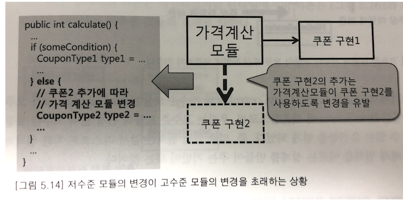

이런 상황은 프로그램의 변경을 어렵게 만든다. 우리가 원하는 것은 저수준 모듈이 변경되더라도 고수준 모듈은 변경되지 않는 것인데,
이를 위한 원칙이 바로 의존 역전 원칙이다.


### 의존 역전 원칙을 통한 변경의 유연함 확보

고수준 모듈에서 저수준 모듈을 사용한다는 것은 고수준 모듈이 저수준 모듈에 의존한다는 의미인데, 
어떻게 저수준 모듈이 고수준 모듈을 의존하게 만든다는 것일까? 답은 추상화에 있다.

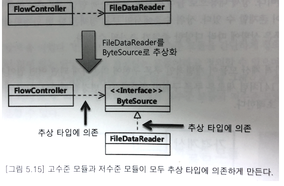

고수준 모듈인 FlowController 와 저수준 모듈인 FileDataReader 가 모두 추상화 타입인 ByteSource 에 의존함으로써,
우리는 고수준 모듈의 변경 없이 저수준 모듈을 변경할 수 있는 유연함을 얻게 되었다. 즉, 의존 역전 원칙은 앞서 리스코프 치환 원칙과 함께
개방 폐쇄 원칙을 따르는 설계를 만들어 주는 기반이 되는 것이다.

### 소스 코드 의존과 런타임 의존

의존 역전 원칙은 소스 코드에서의 의존을 역전시키는 원칙이다. 의존 역전 원칙을 적용하기 전에 FlowController 클래스의 
소스 코드는 FileDataReader 를 의존하고 있었다.

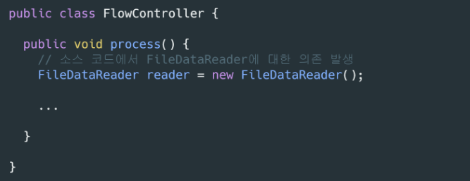

이 코드에 의존 역전 원칙을 적용함으로써 오히려 FileDataReader 클래스의 소스 코드가 
추상화 타입인 ByteSource 에 의존하게 되었다.

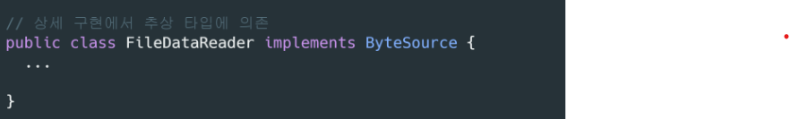

소스 코드 상에서의 의존은 역전되었지만 런타임에서의 의존은 고수준 모듈의 객체에서 저수준 모듈의 객체로 향한다.

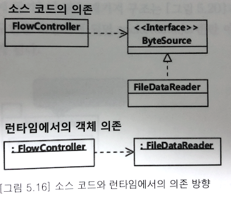

의존 역전 원칙은 런타임의 의존이 아닌 소스 코드의 의존을 역전시킴으로써 변경의 유연함을 확보 할 수 있도록 만들어주는 원칙이지,
런타임에서의 의존을 역전시키는 것은 아니다.


### 의존 역전 원칙과 패키지

의존 역전 원칙을 적용하기 전, 데이터 읽기 타입은 FileDataReader 를 소유한 패키지가 소유하고 있었다.

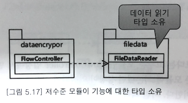

의존 역전 원칙을 적용 해서 데이터 읽기 기능을 위한 타입을 고수준 모듈이 소유하게 된다.

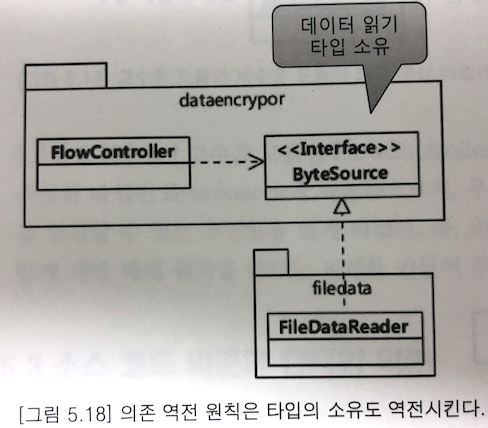

타입의 소유 역전은 각 패키지를 독립적으로 배포할 수 있도록 만들어 준다.

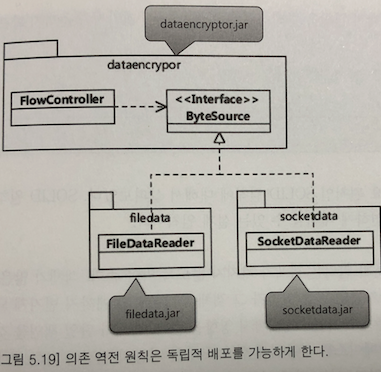

만약 타입의 소유가 고수준 모듈로 이동하지 않고 filedata 패키지에 그대로 있었다면 어떻게 될까?

이 경우 패키지 구조는 아래와 같이 구성될 텐데,

기존 파일 구현 대신 소켓 구현을 사용하게 되면 socketdata.jar 뿐만 아니라 기능상 필요 없는 filedata.jar 도 필요하게 된다.

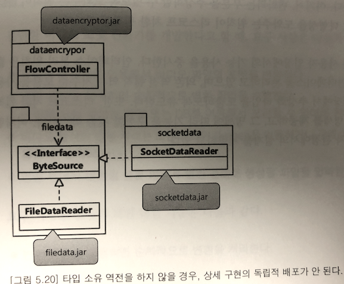

의존 역전 원칙은 개방 폐쇄 원칙을 클래스 수준 뿐만 아니라 패키지 수준까지 확장시켜 주는 디딤돌이 된다.


