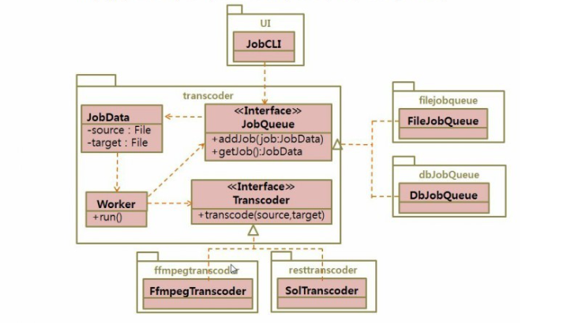
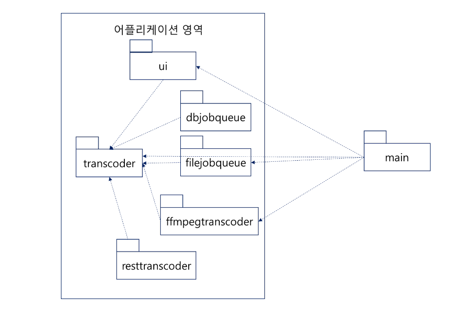

# 7일차 2024-04-07 p.137 ~152

# DI (Dependency Injection) 와 서비스 로케이터

밥 아저씨 (Uncle Bob) 로 유명한 로버트 C 마틴 (Robert C. Martin) 은 소프트웨어를 두 개의 영역으로 구분해서 설명하고 있는데,
한 영역은 고수준 정책 및 저수준 구현을 포함한 어플리케이션 영역이고 또 다른 영역은 어플리케이션이 동작하도록 각 객체들을 연결 해 주는
메인 영역이다.


## 어플리케이션 영역과 메인 영역

간단한 비디오 포맷 변환기

- 파일의 확장자를 이용해서 비디오 파일의 포맷을 변환한다.
- 변환 요청을 등록하면 순차적으로 변환 작업을 수행한다.
  - 변환 요청 정보는 파일 또는 DB를 이용해서 보관할 수 있어야 한다.
- 비디오 형식의 변환 처리는 오픈 소스인 ffmpeg 을 이용하거나 구매 예정인 변환 솔루션을 사용할 수 있어야 한다.
- 명령 행에서 변환할 원본 파일과 변환 결과로 생성될 파일을 입력한다. 

요구 사항을 분석 해보면 핵심 기능은 다음과 같다.

- 변환 작업을 요청하면 순차적으로 변환을 처리한다.

위 기능을 제공하는 데 있어 변화가 발생하는 부분은 다음의 두 가지이다.

- 변환 요청 정보 저장 : 파일에 보관한다 또는 DB에 보관하낟.
- 변환 처리 : ffmpeg 을 사용한다 또는 솔루션을 사용한다.



JobQueue 와 Transcoder 는 변화되는 부분을 추상화한 인터페이스로서,  transcoder 패키지의 다른 코드에
영향을 주지 않으면서 확장할 수 있는 구조를 갖고 있다.  (즉, 개방 폐쇄 원칙을 따른다.)


JobQueue 는 파일을 이용하는 구현과 DB를 이용하는 구현의 두 가지가 제공되며,
Transcoder 역시 ffmpeg과 솔루션을 이용하는 두 가지 버전의 구현이 제공된다.

JobQueue 와 Transcoder 를 구현한 콘크리트 클래스들은 이 두 인터페이스를 상속 받아 구현하였기 때문에,
Worker 클래스는 이들 콘크리트 클래스에 의존하지 않는다.


```java
public class Locator {
    private static Locator instance;
    public static Locator getInstance(){
        return instance;
    }
    
    public static void init(Locator locator) {
        instance = locator;
    }
    
    private JobQueue jobQueue;
    private Transcoder transcoder;

    public Locator(JobQueue jobQueue, Transcoder transcoder) {
        this.jobQueue = jobQueue;
        this.transcoder = transcoder;
    }

    public JobQueue getJobQueue() {
        return jobQueue;
    }

    public Transcoder getTranscoder() {
        return transcoder;
    }
}

```


Locator 클래스는 Worker 와 JobCLI가 사용할 JobQueue 객체와 Transcoder 객체를 제공하는 기능을 정의하고 있다.


Locator 객체를 이용해서 JobQueue 객체와 Transcoder 객체를 설정해 주면, Worker와 JobCLI 는 설정한 객체를 사용하게 된다.

그러면 과연 누가 Locator 객체를 초기화 해줄 것인가? 그리고 JobCLI 객체와 Worker 객체를 생성하고 실행 해 주는 건 누구인가?

메인 영역은 다음 작업을 수행한다.

- 어플리케이션 영역에서 사용될 객체를 생성한다.
- 각 객체 간의 의존 관계를 설정한다.
- 어플리케이션을 실행한다.

```java
public class Main {
    public static void main(String[] args) {
        // 상위 수준 모듈인 transcoder 패키지에서 사용할
        // 하위 수준 모듈 객체 생성
        JobQueue jobQueue = new FileJobQueue();
        Transcoder transcoder = new FfmpegTransCoder();
        
        // 상위 수준 모듈이 하위 수준 모듈을 사용할 수 있도록 Locator 초기화 
        Locator locator = new Locator(jobQueue ,transcoder);
        Locator.init(locator);
        
        // 상위 수준 모듈 객체를 생성하고 실행
        final Worker worker = new Worker();
        Thread t = new Thread(new Runnable() {
            @Override
            public void run() {
                worker.run();
            }
        });
        JobCLI cli = new JobCLI();
        cli.interact();
    }
}

```



메인 영역은 어플리케이션 영역의 객체를 생성하고, 설정하고, 실행하는 책임을 갖기 때문에,
어플리케이션 영역에서 사용할 하위 수준의 모듈을 변경하고 싶다면 메인 영역을 수정하게 된다. 

예를 들어, FileJobQueue 객체 대신 DbJobQueue 객체를 사용하고 싶다면 메인 영역에서 FileJobQueue 대신 DbJobQueue 객체를
생성하고 조립해 주면 된다.

모든 의존은 메인 영역에서 어플리케이션 영역으로 향한다는 것이다.
반대의 경우인 어플리케이션 영역에서 메인 영역으로의 의존은 존재하지 않는다.


이는 메인 영역을 변경한다고 해도 여플리케이션 영역은 변경되지 않는다는 것을 뜻한다. 
따라서 어플리케이션에서 사용할 객체를 교체하기 위해 메인 영역의 코드를 수정하는 것은 어플리케이션 영역에는 어떠한 영향도 끼치지 않는다.


Worker 객체와 JobCLI 객체는 Locator 를 이용해서 필요한 객체를 가져온 뒤에 원하는 기능을 실행하였다.
이렇게 사용할 객체를 제공하는 책임을 갖는 객체를 서비스 로케이터(Service Locator) 라고 부른다..


서비스 로케이터 방식은 로케이터를 통해서 필요로 하는 객체를 직접 찾는 방식인데, 이 방식에는 몇 가지 단점이 존재한다.
그래서, 서비스 로케이터를 사용하기 보다는 외부에서 사용할 객체를 주입해 주는 DI(Dependency Injection) 방식을 사용하는 것이 일반적이다.


### DI (Dependency Injection) 을 이용한 의존 객체 사용

사용할 객체를 직접 생성할 경우, 아래 코드 처럼 콘크리트 클래스에 대한 의존이 발생하게 된다.

```java
public class Worker {
    public void run() {
        // 작성 , 콘크리트 클래스를 사용
        JobQueue jobQueue = new FileJobQueue(); // DIP 위반
    }
}
```

콘크리트 클래스를 직접 사용해서 객체를 생성하게 되면 의존 역전 원칙을 위반하게 되며,
결과적으로 확장 폐쇄 원칙을 위반하게 된다.

SOLID 원칙에서 설명했듯이 이는 변화에 경직된 유연하지 못한 코드를 만들게 된다.

또한, 서비스 로케이터를 사용하면 서비스 로케이터를 통해서 의존 객체를 찾게 된다.

반면에 DI(Dependency Injection) 는 필요한 객체를 직접 생성하거나 찾지 않고 외부에서 넣어 주는 방식이다. 
DI 자체의 구현은 매우 간단한데, 사용할 객체를 전달받을 수 있는 방법을 제공하면 DI를 적용하기 위한 모든 준비가 끝난다.

예를 들어, Worker 클래스에 사용할 객체를 전달받을 수 있는 생성자를 추가하는 것으로 DI 를 적용할 수 있게 된다.

```java
public class Worker {
   
    private JobQueue jobQueue;
    private Transcoder transcoder;

    public Worker(JobQueue jobQueue, Transcoder transcoder) {
        this.jobQueue = jobQueue;
        this.transcoder = transcoder;
    }

   
    public void run() {
        while (someRunnongCondition) {
            JobData jobData = jobQueue.getJob();
            transcoder.transcode(jobData.getSource() , jobData.getTarget());
        }
    }
}
```

Main 클래스 변경

```java
public class Main {
    public static void main(String[] args) {
        // 상위 수준 모듈인 transcoder 패키지에서 사용할
        // 하위 수준 모듈 객체 생성
        JobQueue jobQueue = new FileJobQueue();
        Transcoder transcoder = new FfmpegTransCoder();
        
        // 상위 수준 모듈 객체를 생성하고 실행
        final Worker worker = new Worker(jobQueue, transcoder);
        Thread t = new Thread(new Runnable() {
            @Override
            public void run() {
                worker.run();
            }
        });
        JobCLI cli = new JobCLI();
        cli.interact();
    }
}
```

수정된 Main 클래스를 보면 Worker 생성자를 호출할 때, Worker 객체가 사용할 JobQueue 객체와 Transcoder 객체를 전달하고 있다.

동일하게 JobCLI 객체를 생성할 때에도, 이 객체가 사용할 JobQueue 객체를 전달하고 있다. 여기서 알 수 있는 건 Worker 객체나
JobCLI 객체는 스스로 의존하는 객체를 찾거나 생성하지 않고, main()  메서드에서 생성자를 통해 이들이 사용할 객체를 주입한다는 점이다.

이렇게 누군가 외부에서 의존하는 객체를 넣어 주기 때문에, 이런 방식을 의존 주입이라고 부르는 것이다.

DI를 통해서 의존 객체를 관리할 때에는 객체를 생성하고 각 객체들을 의존 관계에 따라 연결해 주는 조립 기능이 필요하다.
위 코드에서는 Main 클래스가 조립기의 역할을 함께 하고 있는데, 
조립기를 별도로 분리하면 향후에 조립기 구현 변경의 유연함을 얻을 수 있다.

```java
public class Assembler {
    private Worker worker;
    private JobCLI jobCLI;
    
    public void createAndWire(){
        JobQueue jobQueue = new FileJobQueue();
        Transcoder transcoder = new FfmpegTransCoder();
        this.worker = new Worker(jobQueue,transcoder);
        this.jobCLI = new JobCLI(jobQueue);
    }

    public Worker getWorker() {
        return worker;
    }

    public JobCLI getJobCLI() {
        return jobCLI;
    }
}

```

이제 Main 클래스는 Assembler 에게 객체 생성과 조립 책임을 위임한 뒤에 Assembler 가 생성한 Worker 객체와 JobCLI 객체를 구하는 방식으로
변경된다.


```java
public class Main {
    public static void main(String[] args) {
        Assembler assembler = new Assembler();
        assembler.createAndWire();
        Worker worker = assembler.getWorker();
        JobCLI jobCLI = assembler.getJobCLI();
    }
}

```

이렇게 객체 조립 기능이 분리되면, 이후에 XML 파일을 이용해서 객체 생성과 조립에 대한 정보를 설정하고, 
이 XML 파일을 읽어 와 초기화 해주도록 구현을 변경할 수 있을 것이다.

스프링 프레임워크가 바로 객체를 생성하고 조립 해 주는 기능을 제공하는 DI 프레임워크이다. 


### 생성자 방식과 설정 메서드 방식

DI 를 적용하는 두 가지 방식

- 생성자 방식
- 설정 메서드 방식

생성자 방식은 생성자를 통해서 의존 객체를 전달 받는 방식이다 .

```java
public class JobCLI {
    private JobQueue jobQueue;
    
    public JobCLI(JobQueue jobQueue) {
        this.jobQueue = jobQueue;
        
    }
    
    public void interact() {
       
    }
}

```

생성자를 통해 전달받은 객체를 필드에 보관한 뒤, 메서드에서 사용하게 된다.

설정 메서드 방식은 메서드를 이용해서 의존 객체를 전달받는다.

```java
public class Worker {
    public Worker() {
    }

    private JobQueue jobQueue;
    private Transcoder transcoder;
    

    public void setJobQueue(JobQueue jobQueue) {
        this.jobQueue = jobQueue;
    }

    public void setTranscoder(Transcoder transcoder) {
        this.transcoder = transcoder;
    }

    public void run() {
        while (someRunnongCondition) {
            JobData jobData = jobQueue.getJob();
            transcoder.transcode(jobData.getSource() , jobData.getTarget());
        }
       
    }
}
```

set 메서드는 파라미터로 전달받은 의존 객체를 필드에 보관하며, 다른 메서드에서는 필드를 사용해서 의존 객체의 기능을 실행한다.

설정 메서드를 어떻게 구현할 지 여부는 사용할 DI 프레임워크에 따라 달라질 수 있다.

생성자 방식이나 설정 메서드 방식을 이용해서 의존 객체를 주입 할 수 있게 되었다면, 조립기는 생성자와 설정 메서드를 이용해서 의존 객체를 
전달하게 된다.

```java
public class Assembler {
    private Worker worker;
    private JobCLI jobCLI;
    
    public void createAndWire(){
        JobQueue jobQueue = new FileJobQueue();
        Transcoder transcoder = new FfmpegTransCoder();
        
        this.worker = new Worker();
        // 설정 메서드로 의존 객체 받음
        this.worker.setJobQueue(jobQueue);
        this.worker.setTranscoder(transcoder);
        
        // 생성자로 의존 객체 받음
        this.jobCLI = new JobCLI(jobQueue);
    }

    public Worker getWorker() {
        return worker;
    }

    public JobCLI getJobCLI() {
        return jobCLI;
    }
}
```

#### 각 방식의 장단점

DI 프레임워크가 의존 객체 주입을 어떤 방식까지 지원하느냐에 따라 달라지겠지만, 필자는 생성자 방식과 설정 메서드 방식 중에서
생성자 방식을 더 선호한다. 그 이유는 생성자 방식은 객체를 생성하는 시점에 필요한 모든 의존 객 체를 준비할 수 있기 때문이다.
생성자 방식은 생성자를 통해서 필요한 의존 객체를 전달받기 때문에, 객체를 생성하는 시점에서 의존 객체가 정상인지 확인할 수 있다.

```java
public class JobCLI {
    private JobQueue jobQueue;

    public JobCLI(JobQueue jobQueue) {
        // 생성자 방식은 객체 생성 시점에서 의존 객체가 완전한지 확인할 수 있다.
        if (jobQueue == null) {
            throw new IllegalArgumentException();
        }
        this.jobQueue = jobQueue;

    }
}
```

생성 시점에 의존 객체를 모두 받기 때문에, 한 번 객체가 생성되면 객체가 정상적으로 동작함을 보장할 수 있게 된다. 

생성자 방식을 사용하려면 의존 객체가 먼저 생성되어 있어야 하므로, 의존 객체를 먼저 생성할 수 없다면 생성자 방식을 사용할 수 없게 된다.

생성자 방식과 달리 설정 메서드 방식은 객체를 생성한 뒤에 의존 객체를 주입하게 된다. 
이 경우 의존 객체를 설정하지 못한 상태에서 객체를  사용할 수 있게 되므로. 객체의 메서드를 실행하는 과정에서 
NullPointerException 이 발생할 수 있게 된다.

```java
Worker worker = new Worker();
// 객체 생성 후 , 의존 객체를 실수로 설정하지 않음
worker.setJobQueue(jobQueue);
worker.setTranscoder(transcoder);
       
// jobQueue 와 transcoder 가 null 이므로, NullPointerException 발생
worker.run();
```

생성자 방식과 달리 설정 메서드 방식은 객체를 생성한 이후에 의존 객체를 설정할 수 있기 때문에,
어떤 이유로 인해 의존할 객체가 나중에 생성된다면 설정 메서드 방식을 사용해야 한다.

또 의존할 객체가 많은 경우, 설정 메서드 방식은 메서드 이름을 통해서 어떤 의존 객체가 설정 되는지 (생성자 방식에 비해) 보다
쉽게 알 수 있으며, 이는 코드 가독성을 높여 주는 효과가 있다.

```java
Worker worker = new Worker();
worker.setJonQueue(...) // 메서드 이름으로 의존 객체를 알 수 있다.
worker.setTranscoder(...);
worker.setLogSender(...);
worker.setStateListener(...);
```