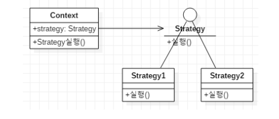
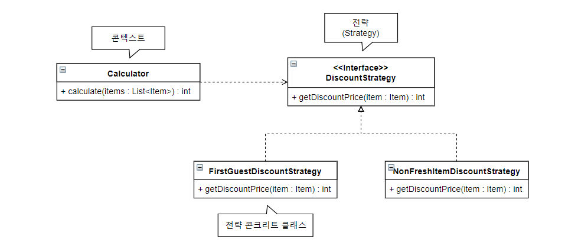

# 9일차 2024-04-17 p.174 ~ 181

## 1. 디자인 패턴이란?

객체 지향 설계는 소프트웨어로 해결하고자 하는 문제를 다루면서, 동시에 재설계 없이 또는 재설계를 최소화 하면서
요구 사항의 변화를 수용할 수 있도록 만들어 준다. 객체 지향 설계를 하다 보면, 이전과 비슷한 상황에서 사용했던 설계를 재사용하는 경우가
종종 발생한다. 

이런 설계는 특정 상황에 맞는 해결책을 빠르게 찾을 수 있도록 도와주는데, 이렇게 반복적으로 사용되는 설계는 클래스, 객체의 구성, 
객체 간 메시지 흐름에서 일정한 패턴을 갖는다. 

이런 패턴을 잘 습득하면 다음과 같은 이득을 얻을 수 있게 된다.

- 상황에 맞는 올바른 설계를 더 빠르게 적용할 수 있다.
- 각 패턴의 장단점을 통해서 설계를 선택하는 데 도움을 얻을 수 있다.
- 설계 패턴에 이름을 붙임으로써 시스템의 문서화, 이해, 유지 보수에 도움을 얻을 수 있다. 

이 분야에서 자주 사용되는 패턴들을 모아서 집대성한 다양한 책이 존재하는데, 그 중에서도 
GoF (Gang of Four ) 의 디자인 패턴은 많은 프로그래머 들에게 도움을 주었다. 
이 책은 객체 지향 프로그래밍에서 발견된 여러 패턴들을 모아 놓은 책으로서, 소프트웨어 개발에서 자주 만나게 되는 일반적인 문제를 해결해 주는 설계를 제시하고 있다.
GoF 의 디자인 패턴은 객체의 생성 , 기능의 확장 , 기능의 변경 , 구조 등과 관련된 약 20여 개에 이르는 패턴을 정리하고 있다.


본 장에서는 GoF 패턴 중에서도 영역에 상관없이 자주 사용되는 패턴을 소개할 것이다. 
이들 패턴은 다음과 같다.

- 전략 패턴 / 템플릿 메서드 패턴 / 상태 패턴
- 데코레이터 패턴 / 프록시 패턴 / 어댑터 패턴
- 옵저버 패턴 / 미디에이터 패턴 / 파사드 패턴
- 추상 팩토리 패턴 / 컴포지트 패턴


## 2. 전략 (Strategy) 패턴

한 과일 매장은 상황에 따라 다른 가격 할인 정책을 적용하고 있다. 매장을 열자마자 들어온 첫 손님을 위한 '첫 손님 할인' 정책과 저녁 시간대에 신선도가 떨어진 과일에 대한
'덜 신선한 과일 할인' 정책이 있다면 , [리스트 7.1] 처럼 가격을 계산하는 모듈에 이런 가격 할인 정책을 적용하기 위한 if-else 블록이 포함될 것이다.


`리스트 7.1 가격 계산 모듈에 할인 정책 구현이 포함된 코드`

```java
public class Calculator {
    
    public int calculate(boolean firstGuest, List<Item> items) {
        int sum = 0;
        for (Item item : items) {
            if (firstGuest)
                sum += (int) (item.getPrice() * 0.9); // 첫 손님 10 % 할인
            else if(!item.isFresh())
                sum += (int) (item.getPrice() * 0.8); // 덜 신선한 것은 20 % 할인
            else 
                sum += item.getPrice();
        }
        return sum;
    }
}

```

[리스트 7.1] 은 비교적 간단 하지만 다음의 문제를 포함 하고 있다.

- 서로 다른 계산 정책들이 한 코드에 섞여 있어, 정책이 추가될수록 코드 분석을 어렵게 만든다.
- 가격 정책이 추가 될 때마다 calculate 메서드를 수정하는 것이 점점 어려워진다. 

이 문제를 해결하기 위한 방법 중 하나는 가격 할인 정책을 별도 객체로 분리하는 것이다.



`[그림 7.1] 전략 패턴을 적용한 요금 계산기 설계`

- DiscountStrategy 인터페이스는 상품의 할인 금액 계산을 추상화 하였다.
- 각 콘크리트 클래스는 상황에 맞는 할인 계산 알고리즘을 제공한다.
- Calculator 클래스는 가격 합산 계산의 책임을 진다.
- 가격 할인 알고리즘을 추상화하고 있는 DiscountStrategy 를 전략 이라고 부르고 가격 계산 기능 자체의 책임을 갖고 있는 Calculator 를 콘텍스트라고 부른다.
- 특정 콘텍스트에서 알고리즘을 별도로 분리하는 설계 방법이 전략 패턴이다.



[그림 7.1] 에서 DiscountStrategy 인터페이스는 상품의 할인 금액 계산을 추상화하였고, 
각 콘크리트 클래스는 상황에 맞는 할인 계산 알고리즘을 제공한다. 
Calculator 클래스는 가격 합산 계산의 책임을 진다. 여기서 가격 할인 알고리즘을 추상화하고 있는 
DiscountStrategy 를 전략(Strategy) 이라고 부르고 가격 계산 기능 자체의 책임을 갖고 있는 Calculator 를 
콘텍스트(Context) 라고 부르는데, 이렇게 특정 콘텍스트에서 알고리즘을 별도로 분리한느 설계 방법이 전략 패턴이다. 


전략 패턴에서 콘텍스트는 사용할 전략을 직접 선택하지 않는다. 대신, 콘텍스트의 클라이언트가 콘텍스트에 사용할 전략을 전달해 준다.
즉, DI 를 이용해서 콘텍스트에 전략을 전달 해준다.
그리고 전략이 어떤 메서드를 제공할 지의 여부는 콘텍스트가 전략을 어떤 식으로 사용하느냐에 따라 달라진다.


앞서 예제에서 [그림 7.1] 처럼 금액 할인 정책을 DiscountStrategy 로 분리한 경우, [리스트 7.2] 처럼 Calculator 를 구현할 수 있을 것이다.

`라스트 7.2 전략 패턴을 적용한 Calculator 구현`

```java
public class Calculator {

    private DiscountStrategy discountStrategy;

    public Calculator(DiscountStrategy discountStrategy) {
        this.discountStrategy = discountStrategy;
    }

    public int calculate(List<Item> items) {
        int sum = 0;
        for (Item item : items) {
            sum += discountStrategy.getDiscountPrice(item);
        }
        return sum;
    }
}

```

[리스트 7.2] 에서 Calculator 클래스는 생성자를 통해서 사용할 전략 객체를 전달받고,
calculate() 메서드에서 각 Item의 가격을 계산할 때 전략 객체를 사용하고 있다.
위 코드에서 Calculator 는 각 Item 별로 할인 정책을 적용하고 있으므로 DiscountStrategy 인터페이스는 
[리스트 7.3] 과 같이 정의될 것이다.


`리스트 7.3 Calculator 에서 사용하는 전략 인터페이스`

```java
public interface DiscountStrategy {
    int getDiscountPrice(Item item);
}

```

만약 각 아이템 별로 할인 정책이 있고 전체 금액에 대한 할인 정책이 별도로 필요하다면,
DiscountStrategy 의 인터페이스에 전체 금액 할인을 위한 메서드가 추가 될 것이다.

```java
public interface DiscountStrategy {
    int getDiscountPrice(Item item);
    int getDiscountPrice(int totalPrice);
}

```

또는 , 전체 금액 할인 정책을 위한 전략을 별도 인터페이스로 분리할 수도 있을 것이다.

```java
public interface ItemDiscountStrategy {
    int getDiscountPrice(Item item);
}

```

```java
public interface TotalPriceDiscountStrategy {
    
    int getDiscountPrice(int totalPrice);
}
```


전략 객체는 콘텍스트를 사용하는 클라이언트에서 직접 생성한다. 
예를 들어,  첫 번째 손님에 대해 할인 해주는 FirstGuestDiscountStrategy 구현 클래스를 
[리스트 7.4] 와 같이 구현했다고 하자.


`리스트 7.4 DiscountStrategy 인터페이스를 구현한 콘크리트 클래스`

```java
public class FirstGuestDiscountStrategy implements DiscountStrategy{
    @Override
    public int getDiscountPrice(Item item) {
        return (int) (item.getPrice() *0.9);
    }
}

```

첫 번째 손님이 들어 와서 계산을 하면, 계산기에서 첫 번째 손님 할인 적용 버튼을 누른 뒤에
계산 버튼을 누를 것이다. 

이를 처리 하는 코드

```java
 private DiscountStrategy strategy;
    
    public void onFirstGuestButtonClick() {
        strategy = new FirstGuestDiscountStrategy();
    }
    
    public void onCalculationButtonClick() {
        Calculator cal = new Calculator(strategy);
        int price = cal.calculate(items);
    }
```

위 코드를 보면 Calculator 를 사용하는 코드에서 FirstGuestDiscountStrategy 클래스의 
객체를 생성하는 것을 알 수 있다. 이는 콘텍스트를 사용하는 클라이언트가 [그림 7.2] 처럼 
전략의 상세 구현에 대한 의존이 발생한다는 것을 뜻한다.

`[그림 7.2] 콘텍스트의 클라이언트가 전략의 상세 구현을 알게 됨`

콘텍스트의 클라이언트가 전략의 인터페이스가 아닌 상세 구현을 안다는 것이 문제처럼 보일 수 있으나, 
이 경우에는 전략의 콘크리트 클래스와 클라이언트의 코드가 쌍을 이루기 때문에 유지 보수 문제가 발생할 가능성이 줄어든다. 

예를 들어, 덜 신선한 과일 할인 정책을 추가하려면 클라이언트에 덜 신선한 과일 할인 정책 적용 버튼 클릭을 처리하는 코드가 생기고
이 코드에서 NonFreshItemDiscountStrategy 객체를 생성해 주게 된다. 또한, 기능이 제거될 때에도 함께 제거 된다.
따라서 클라이언트의 버튼 처리 코드에서 전략 객체를 직접 생성하는 것은 오히려 코드 이해를 높이고 코드 응집을 높여 주는 효과를 갖는다.


전략 패턴을 적용할 때 이점은 콘텍스트 코드의 변경 없이 새로운 전략을 추가 할 수 있다는 점이다. 
앞서 예제에서 마지막 손님 대폭 할인 정책을 추가하는 경우, 계싼의 틀을 제공하는 Calculator 클래스의 코드는 변경되지 않는다.
단지 새로운 할인 정책을 구현한 LastGuestDiscountStrategy 클래스를 추가하고, 마지막 손님 대폭 할인 버튼 클릭을 처리하는 코드에서
LastGuestDiscountStrategy 의 객체를 생성해 주기만 하면 된다.


전략 패턴을 적용함으로써 Calculator 클래스는 할인 정책 확장에는 열려 있고 변경에는 닫혀 있게 된다. 
즉, 개방 폐쇄 원칙을 따르느 구조를 갖게 된다. 

일반적으로 if-else 로 구성된 코드 블록이 비슷한 기능을 수행하는 경우에 전략 패턴을 적용함으로써 
코드를 확장 가능하도록 변경할 수 있다.
본 예제에서도 [그림 7.3] 과 같이 calculate() 메서드의 if-else 블록에 전략 패턴을 적용함으로써 
새로운 할인 정책을 보다 쉽게 추가할 수 있도록 만들었다.

`[그림 7.3] 비슷한 코드를 실행하는 if-else 블록은 전략 패턴 적용 대상이다.`

완전히 동일한 기능을 제공하지만 성능의 장단점에 따라 알고리즘을 선택해야 하는 경우에도 전략 패턴을 사용한다.

XML 을 파싱해서 객체를 생성하는 기능을 사용해야 한다고 가정해 보자. 이 경우 [그림 7.4] 와 같이 
XML 을 파싱하는 알고리즘을 Unmarshaller 타입으로 분리하고 성능 요구에 따라 DOM 이나 
StAX 를 사용하는 콘크리트 Unmarshaller 를 선택하도록 구현할 수 있을 것이다.

`[그림 7.4] 전략 패턴은 동일한 기능의 알고리즘 변경이 필요할 때 사용된다.`