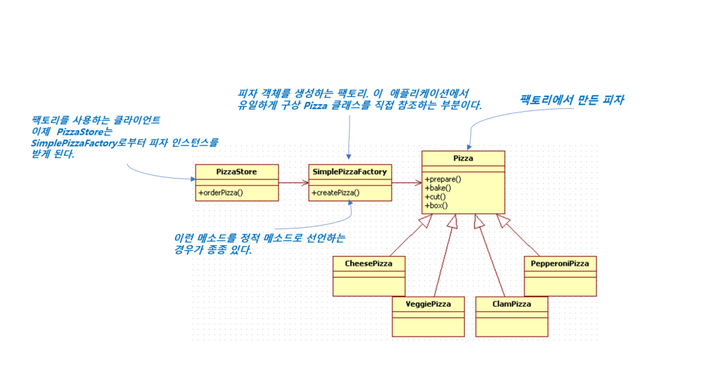

# 10일차 : 2023-08-10 (p.140 ~ 152)

## 요약

**chapter 04 - 객체지향 빵 굽기 팩토리 패턴**

‘new’ 연산자를 사용하면 구상 클래스의 인스턴스가 만들어진다.

⇒  인터페이스가 아닌 특정 구현을 사용하는 것이다.

구상 클래스를  바탕으로 코딩하면 나중에 코드를 수정해야 할 가능성이 커지고, 유연성이 떨어진다.

```java
        Duck duck;
        if (picnic) {
            duck = new MallardDuck();
        }else if(hunting) {
            duck = new DecoyDuck();
        }else if(inBathTub){
            duck = new RubberDuck();
        }
```

- 구상 클래스의 인스턴스가 여러 개 있다.
- 인스턴스의 형식은 실행 시에 주어진 조건에 따라 결정된다
- 위 코드를 변경하거나 확장해야 할 때는 코드를 다시 확인하고 새로운 코드를 추가하거나 기존 코드를 제거해야 한다.

⇒ 위 코드는 관리와 갱신이 어려워지고 오류가 생길 가능성이 높아진다.

어떻게 해야할까??

⇒ **인터페이스에 맞춰서 코딩해야 한다.**

인터페이스에 맞춰서 코딩하면 시스템에서 일어날 수 있는 여러 변화에 대응 할 수 있다.

why?

인터페이스를 바탕으로 만들어진 코드는 다형성 덕분에 어떤 클래스든 특정 인터페이스만 구현하면 사용할 수 있기 때문이다.

구상 클래스를 많이 사용하면 새로운 구상 클래스가 추가 될 때마다 코드를 고쳐야 하기 때문에 많은 문제가 생길 수 있다.

⇒ **변경에 닫혀 있는** 코드가 된다.

새로운 구상 형식을 써서 확장해야 할 때는 어떻게 해서든 다시 열 수 있게 만들어야 한다.

**최첨단 피자 코드 만들기**

```java
Pizza orderPizza(){
     Pizza pizza = new Pizza();
        
      pizza.prepare();
      pizza.bake();
      pizza.cut();
      pizza.box();
      return pizza;
  }
```

피자 종류가 하나만 있지 만

피자 종류를 고르고 피자를 만드는 코드를 추가 해보자

```java
Pizza orderPizza(String type) {
        Pizza pizza;
        if (type.equals("cheese")) {
            pizza = new CheesePizza();
        } else if (type.equals("greek")) {
            pizza = new GreekPizza();
        } else {
            pizza = new PepperoniPizza();
        }

        pizza.prepare();
        pizza.bake();
        pizza.cut();
        pizza.box();
        return pizza;
    }
```

**피자 코드 추가하기**

만약에 피자 메뉴가 추가 된다면??

그리고 인기 없는 메뉴를 제외시킨다면??

위의 코드는 변경에 닫혀 있지 않다.

메뉴를 변경하면  “  if   else if  “  부분 코드를 직접 고쳐야 한다.

즉, 문제가 되는 부분은 **인스턴스를 만드는 구상 클래스를 선택하는 부분**이다.

**객체 생성 부분 캡슐화하기**

```java
				if (type.equals("cheese")) {
            pizza = new CheesePizza();
        } else if (type.equals("greek")) {
            pizza = new GreekPizza();
        } else {
            pizza = new PepperoniPizza();
        }
```

객체 생성 코드를 따로 빼서 피자 객체를 만드는 일만 전담하는 객체에 넣어보자

**새로 만들 객체를 팩토리라고 부르자**

: 객체 생성을 처리하는 클래스를 **팩토리(Factory)**라고 부른다.

**객체 생성 팩토리 만들기**

피자 객체 생성 부분을 전담할 클래스를 정의해보자

```java
public class SimplePizzaFactory {

    public Pizza createPizza(String type) {
        Pizza pizza = null;

        if (type.equals("cheese")) {
            pizza = new CheesePizza();
        } else if (type.equals("pepperoni")) {
            pizza = new PepperoniPizza();
        } else if (type.equals("clam")) {
            pizza = new ClamPizza();
        }
        return pizza;
    }
}
```

- SimplePizzaFactory 클래스가 하는 일은 단 하나 ! 클라이언트가 받을 피자 만들기

Q. 팩토리 클래스를 통해서 캡슐화 했지만,  아까 문제를 그냥 다른 객체로 넘겼을 뿐인데??

A.  SimplePizzaFactory 를 사용하는 클래스가 매우 많다면?

구현을 변경 할 때 여기 저기 고칠 필요 없이 팩토리 클래스 하나만 고치면 된다.

**클라이언트 코드 수정하기**

```java
public class PizzaStore {
    
    SimplePizzaFactory factory;

    public PizzaStore(SimplePizzaFactory factory) {
        this.factory = factory;
    }
    
    public Pizza orderPizza(String type) {
        Pizza pizza;
        
        pizza = factory.createPizza(type);
        
        pizza.prepare();
        pizza.bake();
        pizza.cut();
        pizza.box();
        
        return pizza;
    }
}
```

- new 연산자 대신 팩토리 객체에 있는 create 메소드를 사용했다. 이제 더 이상 구상 클래스의 인스턴스를 만들 필요가 없다.

**‘간단한 팩토리’ 의 정의**

간단한 팩토리는 디자인 패턴이라기 보다는 프로그래밍에서 자주 쓰이는 관용구에 가깝다.



## 메모

구상 클래스(Concrete Class)

<aside>
💡 추상 클래스의 반대 개념으로, 실제로 인스턴스화 될 수 있는 클래스

</aside>

- 구상 클래스는 추상 클래스의 추상 메서드를 모두 구현하거나 오버라이딩하여 실제 동작을 가지고 있는 클래스