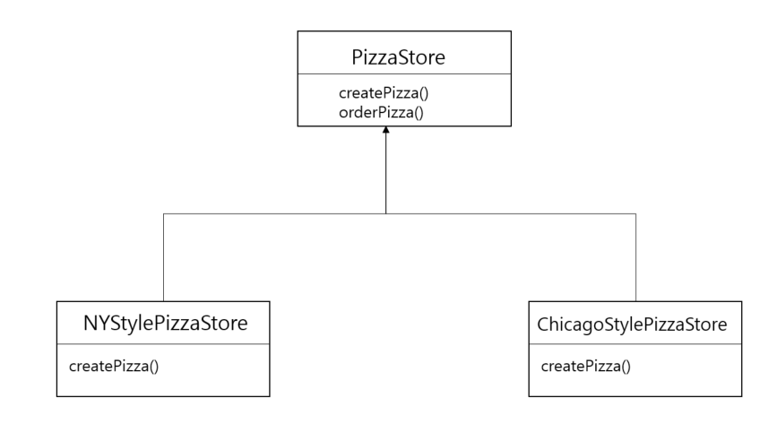
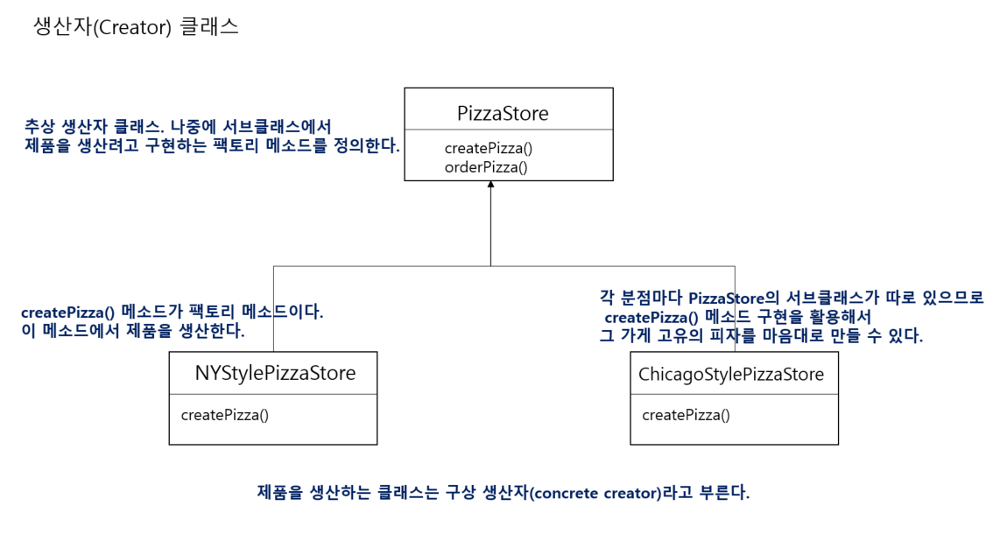
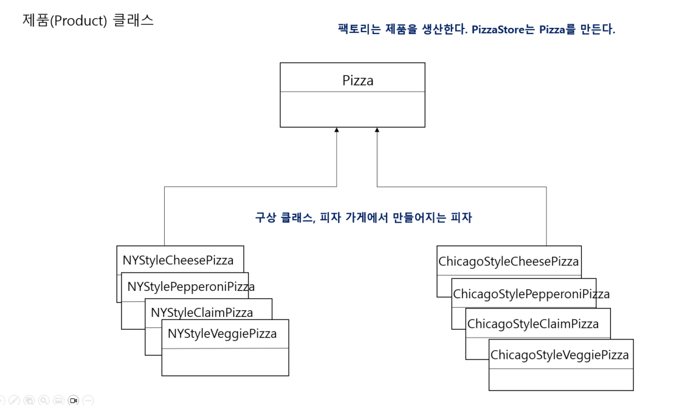

# 10일차 : 2023-08-11 (p.153 ~ 165)

## 요약

**다양한 팩토리 만들기**

피자 가게가 인기가 많아지면서 지점을 낼 때가 왔다.

각 지점마다 그 지역의 특성과 입맛을 반영한 다양한 스타일의 피자를 만들어야 한다.

```java
				
// 뉴욕 스타일 피자를 만드는 팩토리 생성
NYPizzaFactory nyFactory = new NYPizzaFactory();
PizzaStore nyStore = new PizzaStore(nyFactory);
// PizzaStore를 생성하면서 NYPizzaFactory 객체를 인자로 전달한다.
nyStore.orderPizza("Veggie");

				
ChicagoPizzaFactory chicagoFactory = new ChicagoPizzaFactory();
PizzaStore chicagoStore = new PizzaStore(chicagoFactory);
chicagoStore.orderPizza("Veggie");
```

하지만 !! 지점들을 조금 더 제대로 관리해야 한다.

지점에서 팩토리로 피자를 만들지만, 굽는 방식이 달라진다거나 피자를 자르는 것을 까먹기도 하는 일이 발생한다.

⇒ PizzaStore 와 피자 제작 코드 전체를 하나로 묶어주는 프레임워크를 만들어야 한다.

```java
public abstract class PizzaStore {
    
    public Pizza orderPizza(String type) {
        Pizza pizza;
        
        // 팩토리 객체가 아닌 PizzaStore에 있는 createPizza를 호출한다.
        pizza = createPizza(type);
        pizza.prepare();
        pizza.bake();
        pizza.cut();
        pizza.box();
        
        return pizza;
    }
    
    // 팩토리 객체 대신 이 메소드를 사용한다.
    abstract Pizza createPizza(String type);

}
```

**서브클래스가 결정하는 것 알아보기**



각 서브클래스는 createPizza() 메소드를 오버라이드하지만, createPizza() 메소드는 PizzaStore에서 정의한 내용을 그대로 사용한다. 우리가 정의한 메소드를 고쳐 쓸 수 없게 하고 싶다면 orderPizza() 메소드를 final로 선언하면 된다.

orderPizza()에서 createPizza()를 호출하면 Pizza의 서브클래스가 그 호출을 받아서 피자를 만든다.

어떤 종류의 피자가 만들어질까? 그건 피자를 주문하는 피자 가게에 따라 다르다.

NYStylePizzaStore에서 주문을 하면 뉴욕 스타일 피자가 만들어지고,

ChicagoStylePizzaStore에서 주문을 하면  시카고 스타일 피자가 만들어진다.

피자의 종류는 **어떤 서브클래스를 선택했느냐**에 따라 결정된다.

**피자 스타일 서브클래스 만들기**

```java
public class NYPizzaStore extends PizzaStore{
    @Override
    Pizza createPizza(String item) {
        if (item.equals("cheese")){
            return new NYStyleCheesePizza();
        } else if (item.equals("veggie")) {
            return new NYStyleVeggiePizza();            
        } else if (item.equals("clam")) {
            return new NYStyleClamPizza();
        } else if (item.equals("pepperoni")) {
            return new NYStylePepperoniPizza();
        }
        return null;
    }
}
```

- NYPizzaStore 은 PizzaStore를 확장하기에 orderPizza() 메소드도 자동으로 상속받는다.
- createPizza()는 PizzaStore에서 추상메소드로 선언되었으므로 구상 클래스에서 반드시 구현해야 한다.
- createPizza()는 Pizza 객체를 리턴하며, Pizza의 서브클래스 가운데 어느 구상 클래스 객체의 인스턴스를 만들어서 리턴할지는 전적으로 PizzaStore 의 서브클래스에 의해 결정된다.

※ 슈퍼클래스에 있는 orderPizza() 메소드는 어떤 피자가 만들어지는지 전혀 알 수 없다.

그 메소드는 피자를 준비하고, 굽고, 자르고 , 포장하는 작업을 처리할 뿐이다.

**Pizza 클래스 만들기**

Pizza 추상 클래스를 만든 다음 이 클래스를 확장해서 구상 클래스를 만들자

```java
public abstract class Pizza {
    String name;
    String dough;
    String sauce;
    
    List<String> toppings = new ArrayList<String>();
    
    public void prepare(){
        System.out.println("준비 중 : "+name);
        System.out.println("도우를 돌리는 중...");
        System.out.println("소스를 뿌리는 중...");
        System.out.println("토핑을 올리는 중 : ");
        for (String topping : toppings) {
            System.out.println(" "+ topping);
        }
    }

    public void bake() {
        System.out.println("175도에서 25분 간 굽기");
    }

    public void cut() {
        System.out.println("피자를 사선으로 자르기");
    }

    public void box() {
        System.out.println("피자를 상자에 담기");
    }

    public String getName() {
        return name;
    }
}
```

구상 서브 클래스를 만들자

```java
public class NYStyleCheesePizza extends Pizza {
    public NYStyleCheesePizza() {
        name = "뉴욕 스타일 소스와 치즈 피자";
        dough = "씬 크러스트 도우";
        sauce = "마리나라 소스";
        
        toppings.add("잘게 썬 레지아노 치즈");
    }
}
```

뉴욕 스타일 치즈 피자의 토핑은 “잘게 썬 레지아노 치즈” 1가지 뿐이다.

```java
public class ChicagoStyleCheesePizza extends Pizza{

    public ChicagoStyleCheesePizza() {
        name = "시카고 스타일 딥 디쉬 치즈 피자";
        dough = "아주 두꺼운 크러스트 도우";
        sauce = "플럼토마토 소스";
        
        toppings.add("잘게 조각낸 모짜렐라 치즈");
    }

    @Override
    public void cut() {
        System.out.println("네모난 모양으로 피자 자르기");
    }
}
```

시카고 스타일 피자는 cut() 메소드도 오버라이드 한다.

피자를 네모난 모양으로 잘라야 하기 때문이다.

**최첨단 피자 코드 테스트**

```java
public class PizzaTestDrive {

    public static void main(String[] args) {
        PizzaStore nyStore = new NYPizzaStore();
        PizzaStore chicagoStore = new ChicagoPizzaStore();

        Pizza pizza = nyStore.orderPizza("cheese");
        System.out.println("에단이 주문한 " + pizza.getName() + " \n");

        pizza = chicagoStore.orderPizza("cheese");
        System.out.println("조엘이 주문한 " + pizza.getName() + " \n");
    }
}
```

**팩토리 메소드 패턴 살펴보기**

모든 팩토리 패턴은 객체 생성을 캡슐화한다. 팩토리 메소드 패턴은 서브클래스에서 어떤 클래스를 만들지 결정함으로써 객체 생성을 캡슐화한다.





## 발췌

> 팩토리 메소드는 객체 생성을 서브클래스에 캡슐화할 수 있다. 그러면 슈퍼클래스에 있는 클라이언트 코드와 서브클래스에 있는 객체 생성 코드를 분리할 수 있다.
>

## 메모

팩토리 패턴

<aside>
💡 객체를 생성하는 과정을 추상화하여 객체 생성을 단순화하고 유연성을 높이는 방법을 제공하는 패턴

</aside>

구성 요소

- **제품 인터페이스 :** 생성될 객체들이 구현해야 할 공통 인터페이스
- **구체적인 제품 클래스 :**  제품 인터페이스를 구현하여 실제로 생성될 구체적인 객
- **팩토리 클래스** : 객체를 생성하는 메서드를 제공하며, 이 메서드는 생성할 객체의 구체적인 타입을 알고 있다.

제품 인터페이스

```java
public interface Shape {
    void draw();
}
```

구체적인 제품 클래스

```java
public class Rectangle implements Shape {
    @Override
    public void draw() {
        System.out.println("Drawing a rectangle");
    }
}

public class Circle implements Shape {
    @Override
    public void draw() {
        System.out.println("Drawing a circle");
    }
}
```

팩토리 클래스

```java
public class ShapeFactory {
    public Shape createShape(String type) {
        if (type.equalsIgnoreCase("rectangle")) {
            return new Rectangle();
        } else if (type.equalsIgnoreCase("circle")) {
            return new Circle();
        }
        return null;
    }
}
```