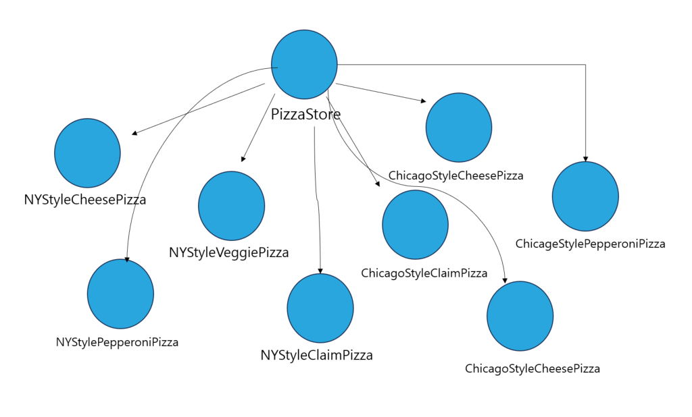
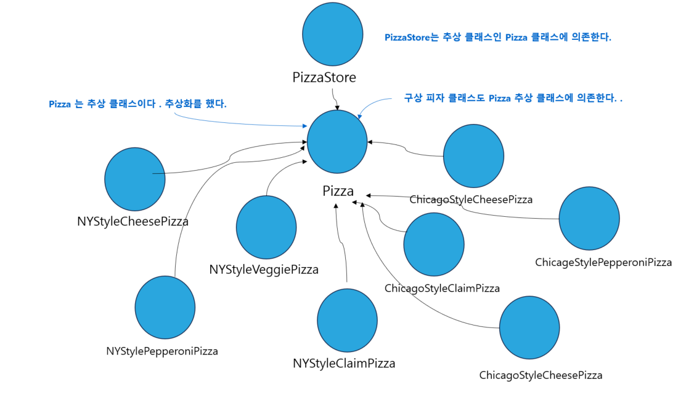

# 10일차 : 2023-08-12 (p.166 ~ 179)

## 요약

**팩토리 메소드 패턴**

<aside>
💡 객체를 생성할 때 필요한 인터페이스를 만든다. 어떤 클래스의 인스턴스를 만들지는 서브클래스에서 결정한다. 팩토리 메소드 패턴을 사용하면 클래스 인스턴스 만드는 일을 서브클래스에게 맡기면 된다.

</aside>

팩토리 패턴을 사용했을 때 장점

: 객체 생성 코드를 전부 한 객체 또는 메소드에 넣으면 코드에서 중복된느 내용을 제거할 수 있고, 나중에 관리할 때도 한 군데에만 신경을 쓰면 된다. 그리고 객체 인스턴스를 만들 때 인터페이스만 있으면 된다. 이 방법을 사용하면 인터페이스를 바탕으로 프로그래밍 할 수 있어 유연성과 확장성이 뛰어난 코드를 만들 수 있다.

**객체 의존성 살펴보기**

: 객체 인스턴스를 직접 만들면 구상 클래스에 의존해야 한다.

- 모든 피자 객체를 직접 생성해야 하므로, 이 PizzaStore는 모든 피자 객체에 직접 의존하게 된다.
- 피자 구성 클래스가 변경되면 PizzaStore 까지도 바꿔야 할 수 있으므로,  “PizzaStore 는 피자 클래스 구현에 의존한다” 라고 말할 수 있다.
- 피자 종류를 새로 추가하면 PizzaStore는 더 많은 피자 객체에 의존하게 된다.

**의존성 뒤집기 원칙**

고수준 구성 요소가 저수준 구성 요소에 의존하면 안 되며, 항상 추상화에 의존하게 만들어야 한다.

PizzaStore는 **고수준 구성 요소**라고 할 수 있고, 피자 클래스는 **저수준 구성 요소**라고 할 수 있다.

**의존성 뒤집기 원칙 적용하기**

PizzaStore 의 가장 큰 문제점은 PizzaStore 가 모든 종류의 피자에 의존한다는 점이다.

팩토리 메소드 패턴을 적용하면 고수준 구성 요소인 PizzaStore 와 저수준 구성 요소인 피자 객체 모두가 추상 클래스인 Pizza에 의존한다는 사실을 알 수 있다.

**의존성 뒤집기 원칙을 지키는 방법**

- 변수에 구상 클래스의 레퍼런스를 저장하지 말자
    - new 연산자를 사용하면 구상 클래스의 레퍼런스를 사용하게 된다.  팩토리를 써서 구상 클래스의 레퍼런스를 변수에 저장하는 일을 미리 방지하자
- 구상 클래스에서 유도된 클래스를 만들지 말자
    - 인터페이스나 추상 클래스처럼 추상화된 것으로부터 클래스를 만들어야 한다.
- 베이스 클래스에 이미 구현되어 있는 메소드를 오버라이드 하지 말자
    - 베이스 클래스에서 메소드를 정의할 때는 모든 서브 클래스에서 공유할 수 있는 것만 정의해야 한다.

## 발췌

> 추상화 된 것에 의존하게 만들고 구상 클래스에 의존하지 않게 만든다.
>

## 메모

**의존 관계 역전 원칙 - Dependency inversion principle**

<aside>
💡 구조적 디자인에서 발생하던 하위 레벨 모듈의 변경이 상위 레벨 모듈의 변경을 요구하는 위계 관계를 끊는 의미의 역전

</aside>

“고차원 모듈은 저차원 모듈에 의존하면 안 된다. 이 두 모듈 모두 다른 추상화 된 것에 의존해야 한다. 추상돠 된 것은 구체적인 것에 의존하면 안 된다. 구체적인 것이 추상화 된 것에 의존해야 한다. 자주 변경되는 구체 클래스에 의존하지 마라 “  - 로버트 C.마틴 -

프로그래머는 “**추상화에 의존해야지, 구체화에 의존하면 안된다.**”  의존성 주입은 이 원칙을 따르는 방법 중 하나다.