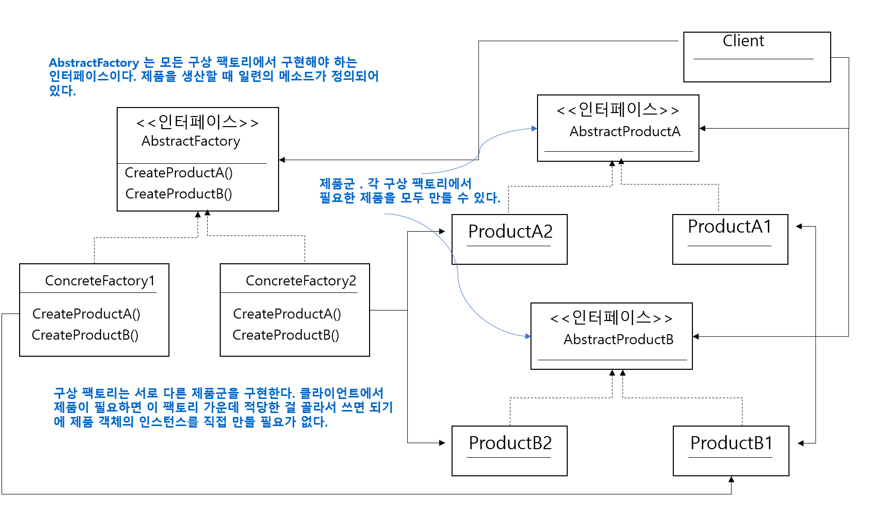
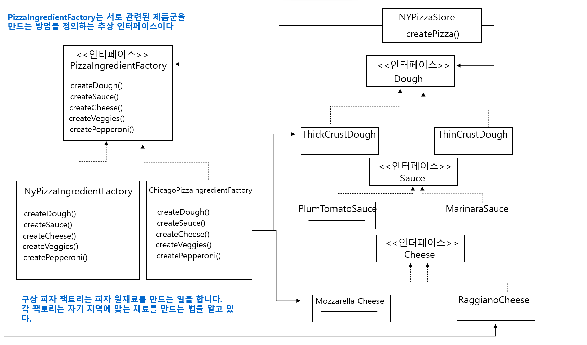
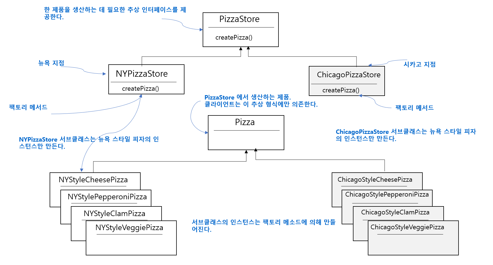
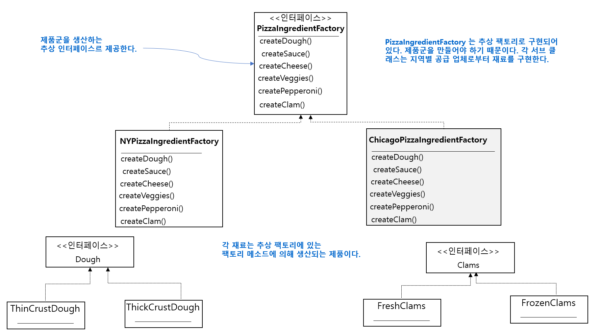

#  14일차 : 2023-08-15 (p.190 ~ 204)

## 요약

**추상 팩토리 패턴의 정의**

<aside>
💡 구상 클래스에 의존하지 않고도 서로 연관되거나 의존적인 객체로 이루어진 제품군을 생산하는 인터페이스를 제공한다. 구상 클래스는 서브클래스에서 만든다.

</aside>

추상 팩토리 패턴을 사용하면 클라이언트에서 추상 인터페이스로 일련의 제품을 공급받을 수 있다.

이때 , 실제로 어떤 제품이 생산되는지는 전혀 알 필요가 없다.

따라서 클라이언트와 팩토리에서 생산되는 제품을 분리 할 수 있다.

클래스 다이어 그램

PizzaStore 시선

**팩토리 메소드 패턴과 추상 팩토리 패턴**

팩토리 메소드 패턴

추상 팩토리 패턴

## 메모

**팩토리 메소드 패턴과 추상 팩토리 패턴**

: 둘 다 객체 생성을 다루는 디자인 패턴이지만 서로 다른 목저과 구조를 가지고 있다.

- 팩토리 메소드 패턴
    - 객체 생성을 처리하는 추상 메소드를 정의하는데 중점을 둔다.
    - 추상 메소드를 서브클래스에서 구현하여 객체 생성 방식을 결정한다.
    - 즉, 클래스의 인스턴스화를 서브클래스로 분리하여 유연서을 제공하는 패턴이다.
    - 예) 게임에서 여러 종류의 캐릭터를 생성 : 각 캐릭터 종류마다 하위 클래스를 생성하ㅗ 해당 클래스에서 필요한 캐릭ㅌ 객체를 생성하는 메소드를 오버라이드
- 추상 팩토리 패턴
    - 관련된 객체 집합을 생성하기 위한 인터페이스를 정의한다.
    - 이 인터페이스를 구현하는 구체적인 팩토리 클래스들을 통해 서로 다른 종류의 객체들을 생성한다.
    - 즉, 관련된 객체들의 패밀리를 생성하는 패턴이다.