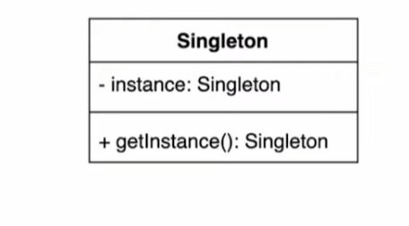

# 16일차 : 2023-08-17 (p.217 ~ 226)

## 요약

**문제를 해결하는 적절한 방법 선택하기**

- getInstance() 메소드를 동기화하는 방법
    - 항상 올바른 결과가 나온다.
    - 초콜릿 보일러의 경우에는 속도 문제가 그리 중요하지 않으므로 이 방법을 써도 괜찮다.
- 인스턴스를 시작하자마자 만드는 방법
    - 어차피 초콜릿 보일러의 인스턴스는 항상 필요하기 때문에 정적으로 초기화하는 것도 괜찮은 방법이다.
    - 표준적인 패턴에 익숙한 개발자들에게는 좀 이상하게 보일 수도 있지만 지금 상황에서는 위에 있는 동기화 방법이나 이 방법이나 그리 크게 차이가 나지 않을 것  같다.
- DCL을 쓰는 방법
    - 속도 문제가 그리 중요하지 않은 상황이기에 굳이 DCL을 쓸 필요까지는 없을 듯 하다.
    - 반드시 자바 5 이상 버전에서만 쓸 수 있다는 점도 고려해야 한다.

## 발췌

> 어떤 클래스에 싱글톤 패턴을 적용하면 그 클래스의 인스턴스가 1개만 있도록 할 수 있다.
>

> 싱글톤 패턴을 사용하면 하나뿐인 인스턴스를 어디서든지 접근할 수 있도록 할 수 있다.
>

> 자바에서 싱글톤 패턴을 구현할 때는 private 생성자와 정적 메소드, 정적 변수를 사용한다.
>

> 멀티 스레드를 사용하는 애플리케이션에서는 속도와 자원 문제를 파악해보고 적절한 구현법을 사용해야 한다.
>

> DCL을 써서 구현하면 자바 5 이전에 나온 버전에서는 스레드 관련 문제가 생길 수 있다.
>

## 메모

- 객체 : 속성 과 기능을 갖춘 것
- 클래스 : 속성과 기능을 정의한 것
- 인스턴스 : 속성과 기능을 가진 것 중 실제 하는

싱글톤 패턴

<aside>
💡 인스턴스를 오직 한 개만 제공하는 클래스

</aside>

- 시스템 런타임 , 환경 세팅에 대한 정보 등 , 인스턴스가 여러개 일 때 문제가 생길 수 있는 경우가 있다. 인스턴스를 오직 한 개만 만들어 제공하는 클래스가 필요하다.


  


멀티 스레드에서 문제 발생

```java
public static Singleton getInstance() {
        if(uniqueInstance == null) {
            uniqueInstance = new Singleton();
        }
        return uniqueInstance;
    }
```

- new Singleton() 이 있는 코드에 여러 스레드가 동시에 접근할 수 있다.

해결 1. synchronized 키워드 사용하기

```java
public static synchronized Singleton getInstance() {
        if(uniqueInstance == null) {
            uniqueInstance = new Singleton();
        }
        return uniqueInstance;
    }
```

- getInstace() 메서드에 synchronized 키워드를 사용하였다.
- getInstance() 메서드가 동시에 한 번에 하나의 스레드만 접근하도록 보장된다.
- 멀티스레딩 환경에서도 안전하게 싱글톤 인스턴스를 생성할 수 있다.
- 스레드간의 경합이 발생할 수 있어서 성능상 이슈가 있을 수 있다.
    - 락이 해제될 때까지 다른 스레드들이 대기해야함
    - 대기상태에 들어가거나 경합 상태가 되면 스레드 스케줄링과 관련된 오버헤드가 발

해결 2. 이른 초기화 (eager initialization )사용하기

```java
public class Singleton {
    // Singleton 클래스의 하나뿐인 인스턴스를 저장하는 정적 변수
    private static final Singleton INSTANCE = new Singleton();

    // 기타 인스턴스 변수

    // 생성자를 private으로 선언했으므로 Singleton 에서만 클래스의 인스턴스를 만들 수 있다.
    private Singleton() {}

    public static synchronized Singleton getInstance() {
        return INSTANCE;
    }
}
```

- 클래스가 로딩될 때 바로 인스턴스를 생성하는 방식
- 클래스 로딩 시점에 인스턴스를 생성하므로, 인스턴스의 초기화가 필요한 상황에서 빠르게 대응할 수 있다.
- 클래스 로딩 시점에 인스턴스를 생성하고 참조할 수 있기 때문에 스레드 안정성에 대한 걱정이 없다.
- 프로그램이 실행 되는 동안 항상 인스턴스가 생성되어 있기 때문에 메모리를 미리 할당하게 되는 단점이 있다.
    - 애플리케이션 시작과 함께 인스턴스가 생성되므로 항상 메모리에 존재하게 된다.
    - 인스턴스가 큰 경우에는 불필요한 메모리 할당이 발생할 수 있다.
    - 프로그램 시작 시점에서 모든 리소스를 할당해야 하는 경우에 유용하다.
    - 자원이 적거나 초기화 시간이 짧은 경우에 적합하다.

해결 3. double checked locking 사용하기

```java
public class Singleton {
    // Singleton 클래스의 하나뿐인 인스턴스를 저장하는 정적 변수
    private static volatile Singleton instance;

    private Singleton() {}

    public static Singleton getInstance() {
        if(instance == null){
            synchronized (Singleton.class) {
                if(instance == null) {
                    instance = new Singleton();
                }
            }
        }
        return instance;
    }
}
```

- 초기에 인스턴스가 생성되지 않았을 때만 락을 사용하여 동기화 하는 방식이다.
- 초기 버전에서는 스레드 안정성 문제가 발생할 수 있어서 안정한 구현이 어려웠다.
- 하지만 java 5 이후의 버전에서는 volatile 키워드와 함께 사용하여 스레드 안전하게 구현하는 것이 가능해졌다.

초기 버전에서 스레드 안정성 문제가 발생하는 이유

- 가시성 문제
    - 스레드는 각자의 캐시나 레지스터에 있는 값들을 사용하려고 할 때가 많다.
    - 인스턴스의 초기화와 관련된 변경 사항이 즉시 모든 스레드에게 보이지 않을 수 있다.
    - 스레드 A가 인스턴스를 생성하고 캐시에 저장한 후, 스레드 B가 같은 인스턴스에 접근하려고 할 때, B는 아직 A가 생성한 값을 볼 수 없을 수 있다.
- 명령어 재 ordering
    - 컴파일러나 하드웨어는 명령어의 실행 순서를 최적화하기 위해 재 ordering을 수행한다.
    - 이로 인해 의도하지 않은 동작이 발생할 수 있다.
    - 예를 들어 객체 생성 시에 다음과 같이 순서가 뒤바뀔 수 있다.
        - 메모리 할당
        - 필드 초기화
        - 인스턴스 변수를 참조하는 레퍼런스 할당