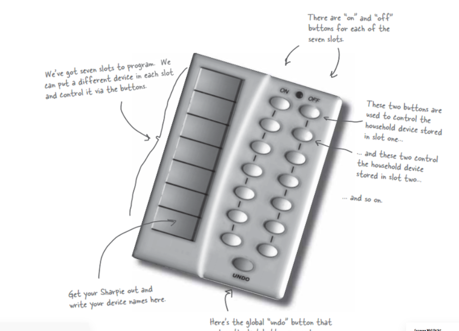
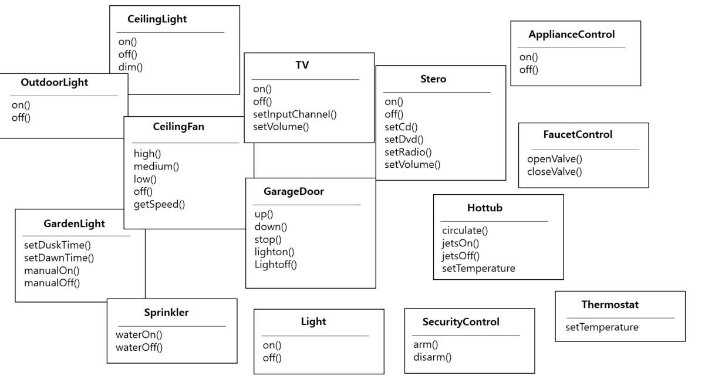
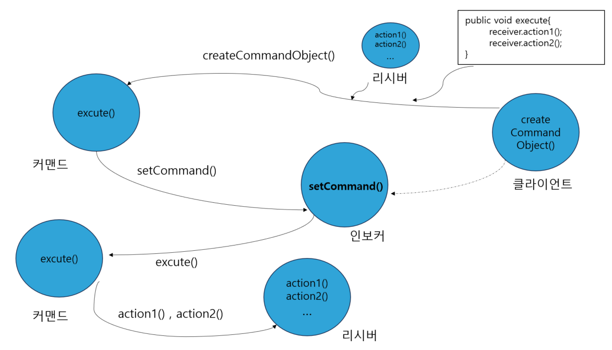

# 17일차 : 2023-08-18 (p.227 ~ 239)

## 요약

**호출 캡슐화하기 - 커맨드 패턴**

**만능 IOT 리모컨**

__

- 프로그래밍이 가능한 7개의 슬롯,  각 슬롯에 원하는 제품을 연결한 다음 옆에 있는 버튼으로 조작할 수 있다.
- 7개의 슬롯마다 각각 ‘ON’ 버튼 과 ‘OFF’ 버튼이 있다.
- 이 두 버튼으로 각 슬롯에 연결 된 가전 제품을 제어할 수 있다.

**협력 업체 클래스 살펴보기**

__

클래스가 많이 복잡하다..

- on() , off() 외에도 많은 메소드가 있다.
- 나중에 또 다른 제품이 추가되면 메소드도 추가될 수 있다.
- 리모컨 버튼을 누르면 자동으로 해야 할 일을 처리할 수 있게 만들어야 한다.
    - 1번 슬롯에 조명이 연결되어 있으면 light.on() 을 호출 하고, 욕조가 연결되어 있으면 hottub.jetsOn() 을 호출하는 방식으로 코드를 작성하면 안된다.
    - ⇒ 새로운 클래스가 추가 될 때마다 리모컨에 있는 코드를 고쳐야 하고, 버그가 생길 가능성이 높아 지기 때문이다.

**커멘트 패턴을 사용하자** !!

: 어떤 작업을 요청하는 쪽과 그 작업을 처리하는 쪽을 분리할 수 있다.

- 디자인에 ‘커맨드 객체’를 추가하자
- 커맨드 객체(command object)는 특정 객체에 관한 특정 작업 요청을 캡슐화 해준다.
- 버튼마다 커맨드 객체를 저장해 두면 사용자가 버튼을 눌렀을 때 커맨드 객체로 작업을 처리할 수 있다.
- 리모컨은 아무것도 몰라도 된다. 어떤 객체에 어떤 일을 시켜야 하는지 잘 알고 있는 커맨드 객체가 있기 때문이다.

**커맨드 패턴 소개**

객체 마을 식당에서 고객, 웨이트리스, 주문, 주방상 사이의 관계를 통해 커맨드 패턴 속 각 객체 사이의 관계를 이해하자

음식 주문 과정

- 고객이 종업원에게 주문을 한다.
- 종업원은 주문을 받아서 카운터에 전달하고 “주문 들어왔어요!” 라고 얘기 한다.
- 주방장이 주문대로 음식을 준비한다.

**객체마을 식당 등장인물의 역할**

- 주문서는 주문 내용을 캡슐화 한다.
    - 주문서는 주문 내용을 요구하는 객체이다.
    - 이 객체의 인터페이스에는 식사 준비에 필요한 행동을 캡슐화한 orderUp() 메소드가 들어 있다.
- 종업원은 주문서를 받고 orderUp() 메소드를 호출한다.
    - 종업원은 주문서에 무슨 내용이 있는지, 누가 식사를 준비하는 지 전혀 걱정 할 필요가 없다. 그냥 orderUp() 메소드를 호출하면 된다.
- 주방장은 식사를 준비하는 데 필요한 정보를 가지고 있다.
    - 종업원이 orderUp() 메소드를 호출하면 주방장이 그 주문을 받아서 음식을 만들 때 필요한 메소드를 전부 처리한다.
    - 주방장과 종업원은 완전히 분리되어 있다.
    - 종업원은 각 주문서에 있는 메소드를 호출하고, 주방장은 주문서로 할 일을 전달 받는다.

**객체마을 식당과 커맨드 패턴**

__

- 클라이언트는 커맨드 객체를 생성해야 한다.  커맨드 객체는 리시버에 전달할 일련의 행동으로 구성된다.
- 커맨드 객체에는 행동과 리시버의 정보가 같이 들어있다.
- 커맨드 객체에서 제공하는 메소드는 execute() 하나뿐이다. 이 메소드는 행동을 캡슐화하며, 리시버에 있는 특정 행동을 처리한다.
- 클라이언트는 인보커 객체의 setCommand() 메소드를 호출하는데, 이때 커맨드 객체를 넘겨준다.

**첫 번째 커맨드 객체 만들기**

커맨드 인터페이스 구현

```java
public interface Command {
    void execute();
}
```

- 커맨드 객체는 모두 같은 인터페이스를 구현해야 한다.

조명을 켤 때 필요한 커맨드 클래스 구현

```java
public class LightOnCommand implements Command{
    
    Light light;

    public LightOnCommand(Light light) {
        this.light = light;
    }

    @Override
    public void execute() {
       light.on(); 
    }
}
```

**커맨드 객체 사용하기**

```java
public class SimpleRemoteControl {
    Command slot;

    public SimpleRemoteControl() {
    }
    
    public void setCommand(Command command) {
        slot = command;
    }
    
    public void buttonWarPressed() {
        slot.execute();
    }
}
```

리모컨을 사용할 때 필요한 간단한 테스트 클래스

```java
public class RemoteControlTest {
    public static void main(String[] args) {
        SimpleRemoteControl remote = new SimpleRemoteControl();
        Light light = new Light();
        LightOnCommand lightOn = new LightOnCommand(light);
        
        remote.setCommand(lightOn);
        remote.buttonWarPressed();
    }
}
```

- remote  변수가 인보커 역할을 한다. 필요한 작업을 요청할 때 사용할 커맨드 객체를 인자로 전달 받는다.
- 요청을 받아서 처리할 리시버인 Light 객체를 생성한다.