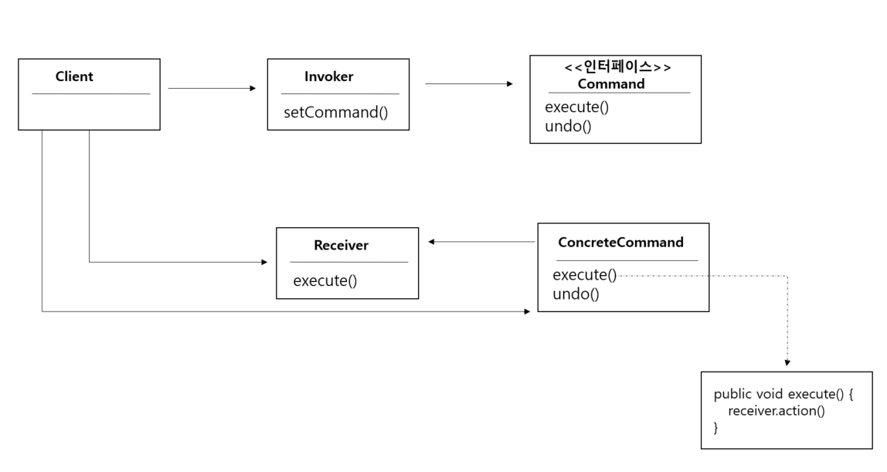

# 18일차 : 2023-08-19 (p.240 ~ 256)

## 요약

**커맨드 패턴의 정의**

<aside>
💡 요청 내용을 객체로 캡슐화해서 객체를 서로 다른 요청 내역에 따라 매개변수화할 수 있다. 이러한 요청을 큐에 저장하거나 로그로 기록하거나 작업 취소 기능을 사용할 수 있다.

</aside>

- 커맨드 객체는 일련의 행동을 특정 리시버와 연결함으로써 요청을 캡슐화한 것이다.
- 행동과 리시버를 한 객체에 넣고, execute()라는 메소드 하나만 외부에 공개하는 방법을 써야 한다.

**커맨드 패턴 클래스 다이어그램 살펴보기**



- execute() 메소드에서는 리시버에 있는 메소드를 호출해서 요청된 작업을 수행한다.
- 리시버는 요구 사항을 수행할 때 어떤 일을 처리해야 하는지 알고 있는 객체이다.
- ConcreteCommand 는 특정 행동과 리시버를 연결해준다. 인보커에서 execute() 호출로 요청하면 ConcreteCommand 객체에서 리시버에 있는 메소드를 호출해서 그 작업을 처리한다.
- Command는 모든 커맨드 객체에서 구현해야 하는 인터페이스이다. 앞에서 배운듯이 모든 내용은 execute() 메소드로 호출로 수행되며, 이 메소드는 리시버에 특정 작업을 처리하라는 지시를 전달한다.
- 인보커에는 명령이 들어있으며, execute() 메소드를 호출함으로써 커맨드 객체에게 특정 작업을 수행해 달라는 요구를 하게 된다.
- 클라이언트는 ConcreteCommand를 생성하고 Receiver를 설정한다.


**리모컨 코드 만들기**

```java
public class RemoteControl {
    Command [] onCommands;
    Command [] offCommands;

    public RemoteControl() {
        onCommands = new Command[7];
        offCommands = new Command[7];
        
        Command noCommand = new NoCommand();
        for(int i=0; i< 7; i++) {
            onCommands[i] = noCommand;
            offCommands[i] = noCommand;
        }
    }
    
   public void setCommand(int slot , Command onCommand, Command offCommand) {
        onCommands[slot] = onCommand;
        offCommands[slot] = offCommand;
   }
   
   public void onButtonWasPushed(int slot) {
        onCommands[slot].execute();
   }
   
   public void offButtonWasPushed(int slot) {
        offCommands[slot].execute();
   }
   
   public String toString(){
       StringBuffer stringBuff = new StringBuffer();
       stringBuff.append("\n-------- 리모컨 -----------\n");
       for (int i=0; i< onCommands.length; i++) {
           stringBuff.append("[slot " + i + "]" + onCommands[i].getClass().getName() + "  " + offCommands[i].getClass().getName()+ "\n");
       }
       
       return stringBuff.toString();
   }
}
```

**커맨드 클래스 만들기**

조명을 끌 때 쓰는 커맨드 클래스

```java
public class LightOffCommand implements Command{
    Light light;

    public LightOffCommand(Light light) {
        this.light = light;
    }

    @Override
    public void execute() {
        light.off();
    }
}
```

오디오를 켜고 끌 때 사용하는 커맨드 클래스

```java
public class StereoOnWithCDCommand implements Command{
    Stereo stereo;

    public StereoOnWithCDCommand(Stereo stereo) {
        this.stereo = stereo;
    }

    @Override
    public void execute() {
        stereo.on();
        stereo.setCD();
        stereo.setVolume(11);
    }
}
```

- on() :  전원을 킨다
- setCD()  : CD를 재생한다.
- setVolume(11) : 볼륨을 11로 맞춘다.

**리모컨 테스트**

```java
public class RemoteLoader {

    public static void main(String[] args) {
        RemoteControl remoteControl = new RemoteControl();

        Light livingRoomLight = new Light("Living Room");
        Light kitchenLight = new Light("Kitchen");
        CeilingFan ceilingFan = new CeilingFan("Living Room");
        GarageDoor garageDoor = new GarageDoor("Garage");
        Stereo stereo = new Stereo("Living Room");

        // 조명용 커맨드 객체
        LightOnCommand livingRoomLightOn = new LightOnCommand(livingRoomLight);
        LightOffCommand livingRoomLightOff = new LightOffCommand(livingRoomLight);
        LightOnCommand kitchenLightOn = new LightOnCommand(kitchenLight);
        LightOffCommand kitchenLightOff = new LightOffCommand(kitchenLight);

        // 선풍키를 켜고 끄는 커맨드 객체
        CeilingFanOnCommand ceilingFanOn = new CeilingFanOnCommand(ceilingFan);
        CeilingFanOffCommand ceilingFanOff = new CeilingFanOffCommand(ceilingFan);

        GarageDoorUpCommand garageDoorUp = new GarageDoorUpCommand(garageDoor);
        GarageDoorDownCommand garageDoorDown = new GarageDoorDownCommand(garageDoor);

        StereoOnWithCDCommand stereoOnWithCD = new StereoOnWithCDCommand(stereo);
        StereoOffCommand stereoOff = new StereoOffCommand(stereo);

        remoteControl.setCommand(0,livingRoomLightOn,livingRoomLightOff);
        remoteControl.setCommand(1,kitchenLightOn,kitchenLightOff);
        remoteControl.setCommand(2,ceilingFanOn,ceilingFanOff);
        remoteControl.setCommand(3,stereoOnWithCD,stereoOff);

        System.out.println(remoteControl);

        remoteControl.onButtonWasPushed(0);
        remoteControl.offButtonWasPushed(0);
        remoteControl.onButtonWasPushed(1);
        remoteControl.offButtonWasPushed(1);
        remoteControl.onButtonWasPushed(2);
        remoteControl.offButtonWasPushed(2);
        remoteControl.onButtonWasPushed(3);
        remoteControl.offButtonWasPushed(3);
    }

} 
```

**작업 취소 기능 추가하기**

커멘드에서 작업 취소 기능을 지원하려면 execute() 메소드와 비슷한 undo() 메소드가 있어야 한다.

```java
public interface Command {
    void execute();
    void undo();
}
```

LigthOnCommand 의 undo() 메소드 추가하기

```java
ublic class LightOnCommand implements Command{

    Light light;

    public LightOnCommand(Light light) {
        this.light = light;
    }

    @Override
    public void execute() {
       light.on();
    }

    @Override
    public void undo() {
        light.off();
    }
}
```

LightOffCommand 의 undo() 추가하기

```java
public class LightOffCommand implements Command{
    Light light;

    public LightOffCommand(Light light) {
        this.light = light;
    }

    @Override
    public void execute() {
        light.off();
    }

    @Override
    public void undo() {
        light.on();
    }
}
```

RemoteControl 클래스에서 사용자가 마지막으로 누른 버튼 기록하고, UNDO  버튼 눌렀을 때 필요한 작업 추가하기

```java
public class RemoteControlWithUndo {
    Command [] onCommands;
    Command [] offCommands;
    Command undoCommand;

    public RemoteControlWithUndo() {
        this.onCommands = new Command[7];
        this.offCommands = new Command[7];
        
        Command noCommand = new NoCommand();
        for (int i=0; i<7; i++) {
            onCommands[i] = noCommand;
            offCommands[i] = noCommand;
        }
        
        this.undoCommand = noCommand;
    }
    
    public void setCommand(int slot , Command onCommand , Command offCommand) {
        onCommands[slot] = onCommand;
        offCommands[slot] = offCommand;
    }

    public void onButtonWasPushed(int slot) {
        
        onCommands[slot].execute();
        undoCommand = onCommands[slot];
    }

    public void offButtonWasPushed(int slot) {
        offCommands[slot].execute();
        undoCommand = offCommands[slot];
    }
    public void undoButtonWasPushed(){
        undoCommand.undo();
    }

    public String toString(){
        StringBuffer stringBuff = new StringBuffer();
        stringBuff.append("\n-------- 리모컨 -----------\n");
        for (int i=0; i< onCommands.length; i++) {
            stringBuff.append("[slot " + i + "]" + onCommands[i].getClass().getName() + "  " + offCommands[i].getClass().getName()+ "\n");
        }

        return stringBuff.toString();
    }
}
```

**작업 취소 기능을 구현할 때 상태를 사용하는 방법**

선풍기 제조 업체에서 제공한 CeilingFan 클래스

```java
public class CeilingFan {
    public static final int HIGH =3;
    public static final int MEDIUM = 2;
    public static final int LOW = 1;
    public static final int OFF = 0;
    String location;
    int speed;
    
    public CeilingFan(String location) {
        this.location = location;
        speed = OFF;
    }
    
    public void high() {
        speed = HIGH;
    }
    
    public void medium() {
        speed = MEDIUM;
    }
    
    public void low() {
        speed = LOW;
    }
    
    public void off() {
        speed = OFF;
    }
    
    public int getSpeed(){
        return speed;
    }
}
```

**선풍기 명령어에 작업 취소 기능 추가하기**

CeilingFan 커맨드 클래스에 작업 취소 기능 추가하기

```java
public class CeilingFanHighCommand implements Command{
    
    CeilingFan ceilingFan;
    int prevSpeed;

    public CeilingFanHighCommand(CeilingFan ceilingFan) {
        this.ceilingFan = ceilingFan;
    }

    @Override
    public void execute() {
        prevSpeed = ceilingFan.getSpeed();
        ceilingFan.high();
        
    }

    @Override
    public void undo() {
        if (prevSpeed == CeilingFan.HIGH){
            ceilingFan.high();
        } else if (prevSpeed == CeilingFan.MEDIUM) {
            ceilingFan.medium();
        } else if (prevSpeed == CeilingFan.LOW) {
            ceilingFan.low();
        } else if (prevSpeed == CeilingFan.OFF) {
            ceilingFan.off();
        }
    }
}
```