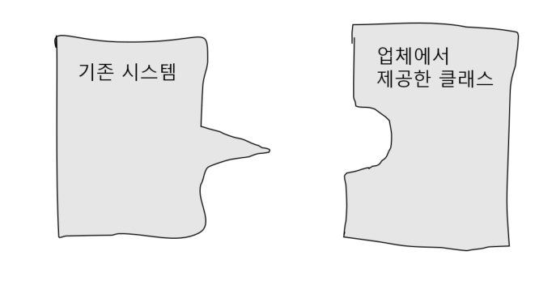
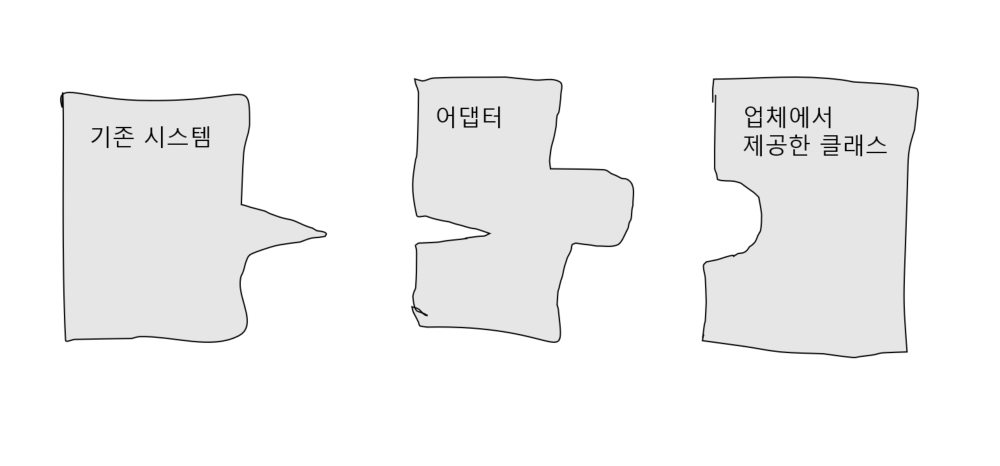
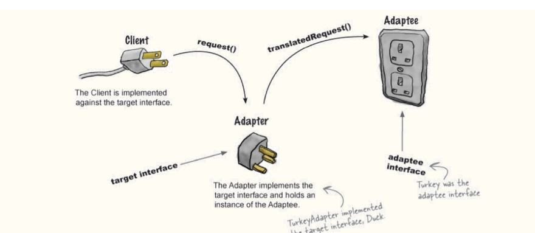
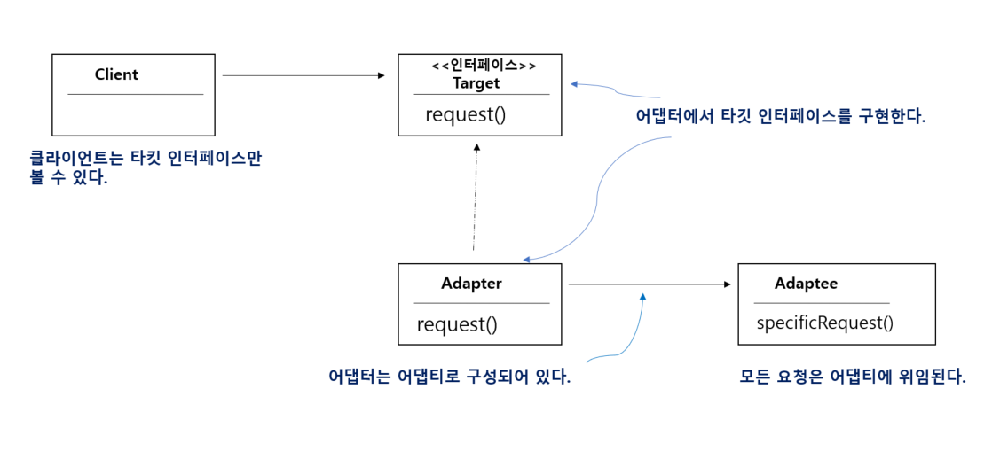
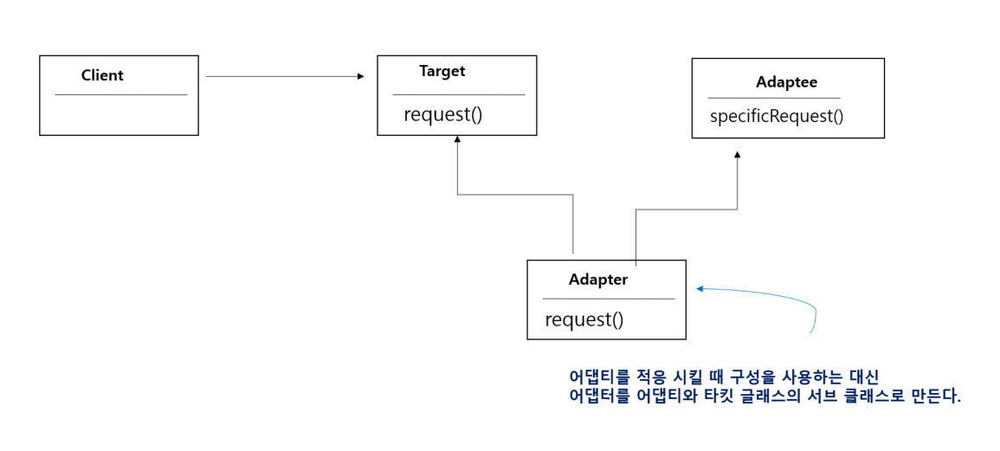

# 20일차 : 2023-08-22 (p. 272 ~ 283)

## 요약

**적응시키기 어댑터 패턴과 퍼사드 패턴**

**어댑터 살펴보기**

한국에서 사용하던 휴대전화 충전기를 영국에서도 사용하려면 플러그 모양을 바꿔주는 어댑터가 필요하다.

**객체지향 어댑터**도 일상 생활에서 쓰이는 어댑터와 똑같은 역할을 한다.

어떤 인터페이스를 클라이언트에서 요구하는 형태로 적응시키는 역할을 한다.

**객체지향 어댑터 알아보기**

어떤 소프트웨어 시스템에 새로운 업체에서 제공한 클래스 라이브러리를 사용해야 하는데 그 업체에서 사용하는 인터페이스가 기존에 사용하던 인터페이스와 다르다고 가정해보



기존 코드를 바꿔서 이 문제를 해결할 수 없는 상황이다.

게다가 업체에서 공급받은 클래스도 변경할 수 없다면 어떻게 해야할까?

새로운 업체에서 사용하는 인터페이스를 기존에 사용하던 인터페이스에 적응시켜 주는 클래스를 만들어야 한다.



어댑터는 클라이언트로부터 요청을 받아서 새로운 업체에서 제공하는 클래스를 클라이언트가 받아들일 수 있는 형태의 요청으로 변환해 주는 중개인 역할을 한다.

**어댑터 사용 방법 알아보기**

```java
public interface Duck {
    void quack();
    void fly();
}
```

오리들이 꽥꽥거리고 날아다닐 수 있게 해 주는 Duck 인터페이스

```java
public class MallardDuck implements Duck {
    @Override
    public void quack() {
        System.out.println("꽥!");
    }

    @Override
    public void fly() {
        System.out.println("날고 있어요");
    }
}
```

Duck을 구현하는 MallardDuck 클래스

그리고

새로 등장한 가금류 칠면조 !!

```java
public interface Turkey {
    void gobble();
    void fly();
}
```

칠면조는 꽥꽥 거리지 않고, 골골거리는 소리를 낸다.

칠면조도 날 수 있긴 하지만, 멀리 날지는 못한다.

```java
public class WildTurkey implements Turkey{
    @Override
    public void gobble() {
        System.out.println("골골");
    }

    @Override
    public void fly() {
        System.out.println("짧은 거리를 날고 있어요!");
    }
}
```

Turkey 를 구현하는 WildTurkey 클래스

Duck 객체가 모자라서 Turkey 객체를 대신 사용해야 하는 상황이라고 가정해 보자.

인터페이스가 달라서 Turkey 객체를 바로 사용할 수 없다.

적응 시킬 형식의 인터페이스를 구현해야 한다.

```java
public class TurkeyAdapter implements Duck{
    Turkey turkey;

    public TurkeyAdapter(Turkey turkey) {
        this.turkey = turkey;
    }

    @Override
    public void quack() {
        turkey.gobble();
    } // 인텊에ㅣ스에 들어 있는 메소드를 모두 구현해야 한다.

    @Override
    public void fly() {
        for (int i=0; i< 5; i++) {
            turkey.fly();
        }
    }
}
```

- 기존 형식 객체의 레퍼런스가 필요하다.
- 생성자에서 레퍼런스를 받아오는 작업을 처리한다.
- fly() : 두 인터페이스에 모두 들어 있지만 칠면조는 오리처럼 멀리 날지 못한다.
- fly() 메소드를 5번 호출 해서 좀 더 멀리 움직이도록 하였다.

**오리 어댑터 테스트**

```java
public class DuckTestDrive {
    public static void main(String[] args) {
        Duck duck = new MallardDuck();

        Turkey turkey = new WildTurkey();

        Duck turkeyAdapter = new TurkeyAdapter(turkey);

        System.out.println("칠면조가 말하길");
        turkey.gobble();
        turkey.fly();

        System.out.println("\n 오리가 말하길");
        testDuck(duck);

        System.out.println("\n 칠면조 어뎁터가 말하길");
        testDuck(turkeyAdapter);
    }

     static void testDuck(Duck duck) {
        duck.quack();
        duck.fly();
    }
}
```

**어댑터 패턴 알아보기**



- Turkey 객체가 어댑티 인터페이스이다.
- 어댑터는 타킷 인터페이스를 구현하며, 여기에는 어댑티 인스턴스가 들어있다.
- TukeyAdapter 에서는 타깃 인터페이스인 Duck을 구현했다.

**클라이언트에서 어댑터를 사용하는 방법**

1. 클라이언트에서 타깃 인터페이스로 메소드를 호출해서 어댑터에 요청을 보낸다.
2. 어댑터는 어댑티 인터페이스로 그 요청을 어댑티에 관한 메소드 호출로 변환한다.
3. 클라이언트는 호출 결과를 받긴 하지만 중간에 어댑터가 있다는 사실을 모른다.

**어댑터 패턴의 정의**

어댑터 패턴 (Adapter Pattern)

<aside>
💡 특정 클래스 인터페이스를 클라이언트에서 요구하는 다른 인터페이스로 변환한다. 인터페이스가 호환되지 않아 같이 쓸 수 없었던 클래스를 사용할 수 있게 도와준다.

</aside>

이 패턴을 사용하면 호환되지 않는 인터페이스를 사용하는 클라이언트를 그대로 활용할 수 있다.



- 어댑터 패턴은 여러 객체지향 원칙을 반영하고 있다.
- 어댑티를 새로 바뀐 인터페이스로 감쌀 때는 객체 구성(composition)을 사용한다.
- 이런 접근법은 어댑티의 모든 서브클래스에 어댑터를 쓸 수 있다는 장점이 있다.

**객체 어댑터와 클래스 어댑터**

어댑터에는 두 종류가 있다.

하나는 **객체 어댑터**, 다른 하나는 **클래스 어댑터**

클래스 어댑터 패턴을 쓰려면 다중 상속이 필요함

※자바에서는 다중 상속이 불가능함




- **클래스 어댑터**는 타깃과 어댑티 모두 서브클래스로 만들어서 사용함
- **객체 어댑터**는 구성으로 어댑티에 요청을 전달한다