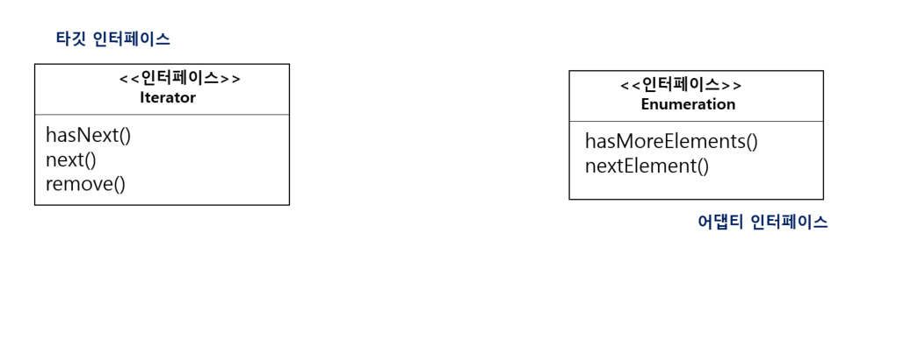
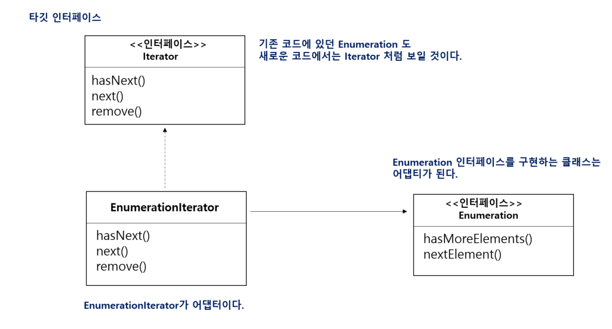
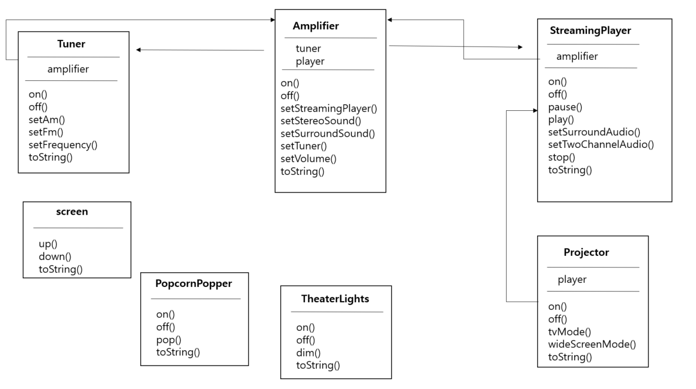

# 21일차 : 2023-08-23 (p. 284 ~ 293)

## 요약

**실전 적용! 어댑터 패턴**

**Enumeration**

- Enumeration 인터페이스를 사용하면 컬렉션의 각 항목이 어떻게 관리되는 지 신경 쓸 필요 없이 컬렉션의 모든 항목에 접근할 수 있다.

**Iterator**

- Enumeration 과 마찬가지로 컬렉션에 있는 일련의 항목에 접근할 수 있다.
- Enumeration 과 달리 요소를 제거할 수 있는 메소드가 있다.

**Enumeration 을 Iteration 에 적응시키기**



어댑터 디자인하기

- 타깃 인터페이스를 구현한다.
- 어댑티 객체로 구성된 어댑터를 구현해야 한다.

hasNext() 와 next() 메소드는 타깃에서 어댑티로 바로 연결된다.

하지만 remove()는 어떻게 처리해야 할까??



**remove() 메소드 처리하기**

Enumeration 은 remove()에 해당하는 기능을 제공하지 않는다.

읽기 전용 인터페이스이다.

어댑터 차원에서 완벽하게 동작하는 remove() 메소드 구현 방법은 없다.

그나마 좋은 방법은 런타임 예외를 던지는 것이다.

메소드가 일대일로 대응되지 않은 상황에서는 어댑터를 완벽하게 적용할 수 없다.

**EnumerationIterator 어댑터 코드 만들기**

```java
public class EnumerationIterator implements Iterator<Object> {
    Enumeration<?> enumeration;

		//적응시켜야 하는 Enumeration 객체. 구성을 활용하고 있기에 인스턴스 변수에 저장한다.
    public EnumerationIterator(Enumeration<?> enumeration) {
        this.enumeration = enumeration;
    }

    @Override
    public boolean hasNext() {
        return enumeration.hasMoreElements();
    }

    @Override
    public Object next() {
        return enumeration.nextElement();
    }
    
    public void remove() {
        throw new UnsupportedOperationException();
    }
}
```

- Enumeration을 Iterator에 적응시키고 있기에 어댑터는 Iterator 인터페이스를 구현해야 한다. 겉에서 봤을 때 Iterator 처럼 생겨야 하기 때문에
- Iterator의 hasNext() 메소드는 Enumeration 의 hasMoreElements() 메소드로 연결된다.
- Iterator의 next() 메소드는 Enumeration 의 nextElement() 메소드로 연결된다.
- Iterator 의 remove 메소드는 지원되지 않으므로 그냥 예외를 던진다.

**퍼사드 패턴 맛보기**

어댑터 패턴은 어떤 클래스의 인터페이스를 클라이언트가 원하는 인터페이스로 변환하는 것이다.

퍼사드 패턴은 인터페이스를 단순하게 바꾸려고 인터페이스를 변경한다.

**홈시어터 만들기**

홈시어터 구축하기

스트리밍 플레이어, 프로젝터 , 자동 스크린 , 서라운드 음향, 팝콘 기계




**복잡한 방법으로 영화 보기**

1. 팝콘 기계를 켠다.
2. 팝콘을 튀기기 시작한다.
3. 조명을 어둡게 조절한다.
4. 스크린을 내린다.
5. 프로젝터를 켠다.
6. 프로젝터 입력을 스트리밍 플레이어로 설정한다.
7. 프로젝터를 와이드 스크린 모드로 전환한다.
8. 앰프를 켠다.
9. 앰프 입력을 스트리핑 플레이어로 설정한다.
10. 앰프를 서라운드 음향 모드로 전환한다.
11. 앰프 볼륨을 중간(5) 으로 설정한다.
12. 스트리밍 플레이어를 켠다.
13. 영화를 재생한다.

```java
popper.on();
popper.pop();

lights.dim(10);

scree.down();

projector.on();
projector.setInput(player);
projector.wideScreenMode();

amp.on();
amp.setDvd(player);
amp.setSurroundSound();
amp.setVolume(5);

player.on();
player.play(movie);
```

홈시어터 사용법이 너무 복잡하다.

퍼사드 패턴으로 간단하게 처리 할 수 있지 않을까??

## 발췌

**UnsupportedOperationException**

> 자바에서 발생하는 예외 중 하나로, 메소드가 호출되었을 때 해당 메소드가 지원되지 않는 경우에 발생한다.
>

주로 추상 클래스나 인터페이스에서 특정 메소드의 구현이 없는 경우나 자식 클래스에서 오버라이딩하지 않은 경우 발생한다.

## 메모

**Enumeration 과 lterator**

:  Java 에서 컬렉션 요소를 반복하는 데 사용되는 인터페이스

**Enumeration**

- JDK 1.0 부터 도입되었고 , 이전 버전의 Java 에서 주로 사용되었다.
- Vector 나 Hashtable 과 같은 구식 컬렉션 클래스에서 사용된다.

```java
public class EnumerationExample {
    public static void main(String[] args) {
        Vector<Integer> numbers  =  new Vector<>();
        numbers.add(1);
        numbers.add(2);
        numbers.add(3);

        Enumeration<Integer> enumeration = numbers.elements();
        while (enumeration.hasMoreElements()) {
            System.out.println(enumeration.nextElement());
        }
    }
}
```

**Iterator**

- JDK 1.2 부터 도입되었고 , 보다 일반적인 컬렉션 클래스에서 사용된다.
- Iterator 는 더 유연하며, 수정 가능한 컬렉션을 반복하면서 요소를 제거할 수 있는 메서드를 제공한다.

```java
public class IteratorExample {
    public static void main(String[] args) {
        List<String> fruits = new ArrayList<>();
        fruits.add("Apple");
        fruits.add("Banana");
        fruits.add("Orange");

        Iterator<String> iterator = fruits.iterator();
        while (iterator.hasNext()) {
            String fruit = iterator.next();
            System.out.println(fruit);
            if (fruit.equals("Banana")) {
                iterator.remove();
            }
        }

        System.out.println(fruits);
    }

}
```

**차이점**

- **기능 및 특징** :  Iterator 는 Enumeration 보다 더 많은 기능을 제공한다.  예를 들어, Iterator 는 요소를 제거할 수 있는 remove() 메서드를 지원한다.  반면에 Enumeration 은 읽기 전용이며, 요소를 제거할 수 있는 메서드가 없다.
- **Fail-Fast** :   Iterator 를 사용하는 컬렉션은 보통 fail-fast 방식을 따른다. 즉, 컬렉션의 내용이 수정되면 예외가 발생하여 다른 스레드에서 컬렉션을 변경하려는 시도를 감지한다. ‘Enumeration’ 은이러한 동시 수정을 감지하지 않는다.
- **데이터 타입** : Enumeration 은 제네릭 타입을 지원하지 않는다.  따라서 요소를 사용하기 위해 형변환을 해야 한다. 반면에 Iterator는 제네릭을 활용하여 타입 안전성을 보장한다.

※Fail-Fast

<aside>
💡 프로그램에서 잠재적인 문제를 빠르게 감지하고 즉시 예외를 발생시켜 프로그램의 안정성을 확보하는 디자인 원칙 또는 패턴

</aside>

- **다중 스레드 환경에서의 안전성** : 컬렉션을 여러 스레드에서 동시에 수정하려고 할 때, “Fail-Fast” 방식은 다른 스레드에서 컬렉션을 수정하는 동작을 감지하고 즉시 ‘ConcurrentModificationException’ 과 같은 예외를 발생 시켜 해당 수정을 막는다.
- **데이터 무결성 확보** : 여러 스레드가 동시에 컬렉션을 수정하거나 요소를 변경하려는 시도를 방지하여 데이터의 무결성을 보호합니다. 이로써 프로그램의 예기치 않은 동작이나 데이터 손상을 방지할 수 있다.
- **문제 조기 발견** :  “Fail-Fast” 방식은 문제가 발생한 지점을 빠르게 감지하고 해당 지점에서 예외를 발생 시킴으로써 문제의 근본 원인을 조기에 발견하여 디버깅을 용이하게 한다.

java의 컬렉션은 modCount 라는 내부의 counter를 운용한다. Collection에 item이 추가되거나

제거될 때마다 이 modCount 라 불리는 카운터가 증가한다.  iterating  중에 next()를 호출 할 때 마다 현 상황의 modCount 값을 초기의 값과 비교한다.  이때 조금이라도 다르다면 즉시 ConcurrentModificationException 을 throw 하고 전체 작업을 중단한다.

ArrayList , HashMap 등과 같은 java.util 패키지의 컬렉션에 대한 기본 iterator 들은 Fail-Fast 방식이다.

예)  요소 제거

```java
public class FailFastTest {
    public static void main(String[] args) {
        List<Integer> numbers = new ArrayList<>();
        numbers.add(1);
        numbers.add(2);
        numbers.add(3);
        for (Integer number : numbers) {
            numbers.remove(0);
        }
        System.out.println(numbers);
    }
}
```

⇒  예외 발생

**Exception in thread "main" java.util.ConcurrentModificationException
at java.base/java.util.ArrayList$Itr.checkForComodification(ArrayList.java:1013)
at java.base/java.util.ArrayList$Itr.next(ArrayList.java:967)**

예) 요소 추가

```java
public class FailFastTest {
    public static void main(String[] args) {
        List<Integer> numbers = new ArrayList<>();
        numbers.add(1);
        numbers.add(2);
        numbers.add(3);
        for (Integer number : numbers) {
            numbers.add(20);
        }
        System.out.println(numbers);
    }
}
```

⇒  예외 발생

**Exception in thread "main" java.util.ConcurrentModificationException
at java.base/java.util.ArrayList$Itr.checkForComodification(ArrayList.java:1013)
at java.base/java.util.ArrayList$Itr.next(ArrayList.java:967)**

예) Iterator 의 remove

```java
public class FailFastTest {
    public static void main(String[] args) {
        List<Integer> numbers = new ArrayList<>();
        numbers.add(1);
        numbers.add(2);
        numbers.add(3);
        Iterator<Integer> iterator = numbers.iterator();
        while (iterator.hasNext()){
            System.out.println(iterator.next());
            iterator.remove();
        }
        System.out.println(numbers);
    }
}
```

예외가 발생하지 않음

예) Iterator  요소 추가

```java
public class FailFastTest {
    public static void main(String[] args) {
        List<Integer> numbers = new ArrayList<>();
        numbers.add(1);
        numbers.add(2);
        numbers.add(3);
        Iterator<Integer> iterator = numbers.iterator();
        while (iterator.hasNext()){
            System.out.println(iterator.next());
            numbers.add(20);
        }
        System.out.println(numbers);
    }
}
```

⇒ 예외 발생

**Exception in thread "main" java.util.ConcurrentModificationException
at java.base/java.util.ArrayList$Itr.checkForComodification(ArrayList.java:1013)
at java.base/java.util.ArrayList$Itr.next(ArrayList.java:967)**

FailSafe Test

```java
public class FailSafeTest {
    public static void main(String[] args) {
        ConcurrentHashMap<String, Integer> map = new ConcurrentHashMap<>();
        map.put("First", 10);
        map.put("Second", 20);
        map.put("Third", 30);
        map.put("Fourth", 40);
        Iterator<String> iterator = map.keySet().iterator();
        while (iterator.hasNext()){
            String key = iterator.next();
            map.put(key,50);
        }
        System.out.println(map);
    }
}
```

출력:

{Second=50, Third=50, First=50, Fourth=50}
