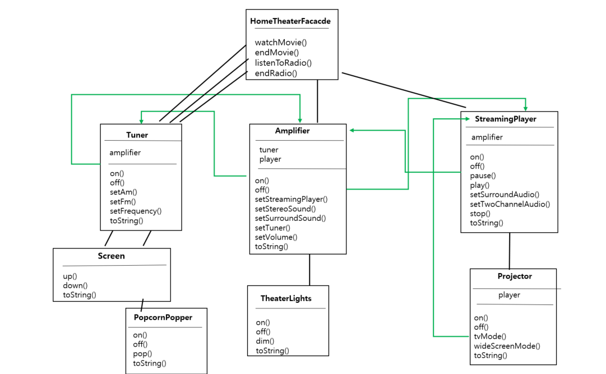
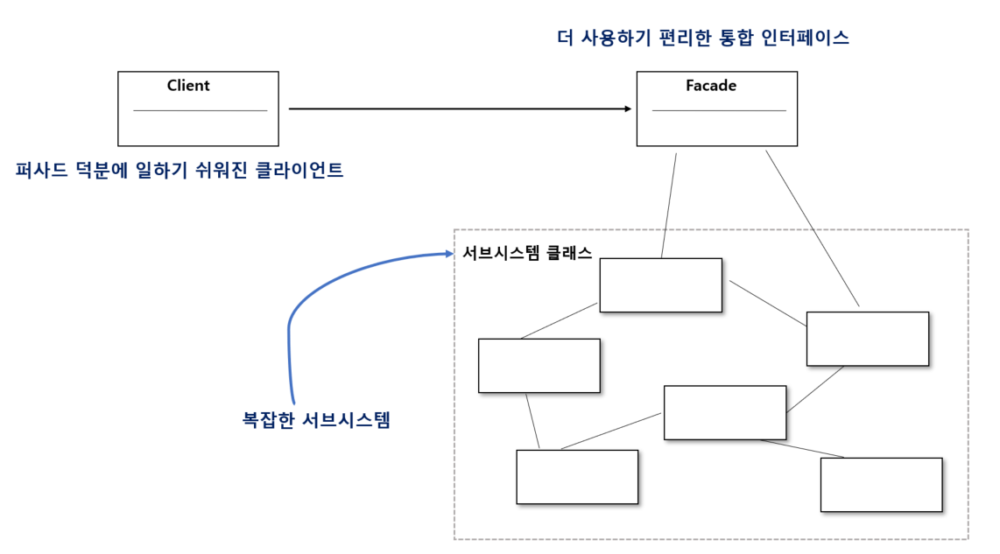

# 22일차 : 2023-08-24 (p. 294 ~ 304)

## 요약

**퍼사드 작동 원리 알아보기**



1. 홈시어터 시스템용 퍼사드는 watchMovie() 와 같이 몇 가지 간단한 메소드가 있는 HomeTheatherFacade 클래스를 만들어야 한다.
2. 퍼사드 클래스는 홈시어터 구성 요소를 하나의 서브시스템으로 간주하고, watchMovie() 메소드는 서브 시스템의 메소드를 호출해서 필요한 작업을 처리한다.
3. 클라이언트 코드는 서브시스템이 아닌 홈시어터 퍼사드에 있는 메소드를 호출한다. watchMovie()메소드만 호출하면 조명 , 스트리밍 플레이어, 프로젝터 ,앰프, 스크린 , 팝콘 기계등이 알아서 준비되므로 영화를 편안하게 즐길 수 있다.
4. 퍼사드를 쓰더라도 서브시스템에 여전히 직접 접근할 수 있다. 서브시스템 클래스의 고급 기능이 필요하다면 언제든지 쓸 수 있다는 뜻이다.

**홈시어터 퍼사드 만들기**

```java
public class HomeTheaterFacade {
    Amplifier amp;
    StreamingPlayer player;
    Projector projector;
    TheaterLights lights;
    Screen screen;
    PopcornPopper popper;

    public HomeTheaterFacade(Amplifier amp
					, StreamingPlayer player
					, Projector projector
					, TheaterLights lights
					, Screen screen
					, PopcornPopper popper) 
		{
        this.amp = amp;
        this.player = player;
        this.projector = projector;
        this.lights = lights;
        this.screen = screen;
        this.popper = popper;
    }
}
```

퍼사드에서 서브시스템에 있는 모든 구성 요소에 접근할 수 있도록 구성해야 한다.

**단순화된 인터페이스 만들기**

```java
public void watchMovie(String movie) {
        System.out.println("영화 볼 준비 중");
        popper.on();
        popper.pop();
        lights.dim(10);
        screen.down();
        projector.on();
        projector.wideScreenMode();
        amp.on();
        amp.setStreamingPlayer(player);
        amp.setSurroundSound();
        amp.setVolume(5);
        player.on();
        player.play(movie);
    }
    
    
    public void endMovie() {
        System.out.println("홈시어터를 끄는 중");
        popper.off();
        lights.on();
        screen.up();
        projector.off();
        amp.off();
        player.stop();
        player.off();
    }
```

**퍼사드 패턴의 정의**

<aside>
💡 서브시스템에 있는 일련의 인터페이스를 통합 인터페이스로 묶어 준다. 또한 고수준 인터페이스도 정의하므로 서브시스템을 더 편리하게 사용할 수 있다.

</aside>

- 퍼사드 패턴을 사용하려면 어떤 서브 시스템에 속한 일련의 복잡한 클래스를 단순하게 바꿔서 통합한 클래스를 만들어야 한다.
- 다른 패턴과 달리 퍼사드 패턴은 상당히 단순한 편이다.
- 퍼사드 패턴을 사용하면 클라이언트와 서브시스템이 서로 긴밀하게 연결되지 않아도 된다.



**최소 지식 원칙**

**최소 지식 원칙(Principle of Least Knowledge)** 에 따르면 객체 사이의 상호작용은 될  수 있으면 아주 가까운 ‘친구’ 사이에서만 허용하는 편이 좋다.

: 시스템을 디자인 할 때 어떤 객체든 그 객체와 상호작용을 하는 클래스의 개수와 상호작용 방식에 주의를 기울여야 한다는 뜻이다.

**친구를 만들지 않고 다른 객체에 영향력 행사하기**

- 객체 자체
- 메소드에 매개변수로 전달된 객체
- 메소드를 생성하거나 인스턴스를 만든 객체
- 객체에 속하는 구성 요소

메소드를 호출한 결과로 리턴받은 객체에 들어있는 메소드를 호출할 때 단점은?

⇒ 다른 객체의 일부분에 요청하게 되고, 직접적으로 알고 지내는 객체의 수가 늘어난다.

최소 지식 원칙을 따르려면 객체가 대신 요청하도록 만들어야 한다.

**원칙을 따르지 않은 경우**

```java
public float getTemp() {
	Thermometer thermometer = station.getThermometer();
	return thermometer.getTemperature();
}
```

: station 으로부터 thermometer 객체를 받은 다음, 그 객체의 getTemperature() 메소드를 직접 호출한다.

**원칙을 따르는 경우**

```java
public float getTemp() {
	return station.getTemperature();
}
```

: 최소 지식 원칙을 적용해서 thermometer 에게 요청을 전달하는 메소드를 station 클래스에 추가했습니다.  이러면 의존해야 하는 클래스의 개수를 줄일 수 있다.

## 발췌

> 퍼사드는 인터페이스를 단순하게 만들고 클라이언트와 구성 요소로 이루어진 서브시스템을 분리하는 역할을 한다.
>

> 퍼사드와 어댑터는 모두 여러 개의 클래스를 감쌀 수 있다. 하지만 퍼사드는 인터페이스를 단순하게 만드는 용도로 쓰이는 반면, 어댑터는 인터페이스를 다른 인터페이스로 변환하는 용도로 쓰인다.
>

> **디자인 원칙** : 진짜 절친에게만 이야기해야 한다.
>

## 메모

**퍼사드 패턴(Facade Pattern)**

<aside>
💡 복잡한 서브시스템을 단순한 인터페이스로 감싸서 클라이언트 코드와 서브 시스템 사이의 상호작용을 간단하게 만드는 것을 목적으로 한다.

</aside>

퍼사드는 건물의 정면을 의미하는 단어로, 여러 개의 복잡한 클래스나 모듈로 이루어진 시스템을 마치 단일한 클래스인 것처럼 사용할 수 있도록 하는 것이 퍼사드 패턴의 아이디어이다.

이렇게 하면 클라이언트는 시스템의 내부 구조에 대한 세부사항을 몰라도 퍼사드 인터페이스를 통해 간단하게 기능을 사용할 수 있다.

**특징**

- **간략화된 인터페이스 제공** : 복잡한 서브시스템을 추상화된 단일 인터페이스로 래핑하여클라이언트가 이해하기 쉽고 사용하기 편하도록 한다.
- **시스템 내부 은닉** : 클라이언트는 퍼사드를 통해 시스템 내부의 복잡한 구조와 동작을알 필요가 없다. 이로써 시스템의 변경이나 업데이트에 덜 민감해진다.
- **코드 재사용 및 유지보수 용이성** : 퍼사드 패턴을 사용하면 클라이언트 코드는 퍼사드에 의존하므로 서브시스템의 변경이 있더라도 퍼사드만 수정하면 된다. 이로써 코드의 재사용과 유지보수성이 향상된다.