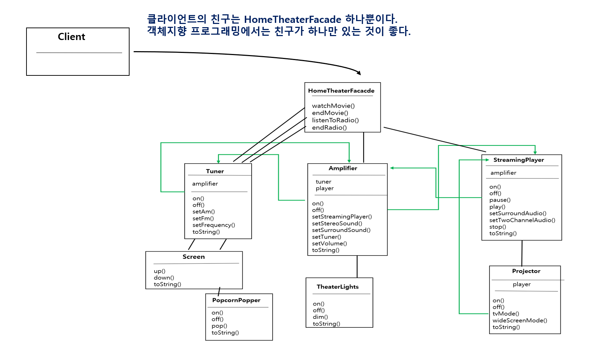
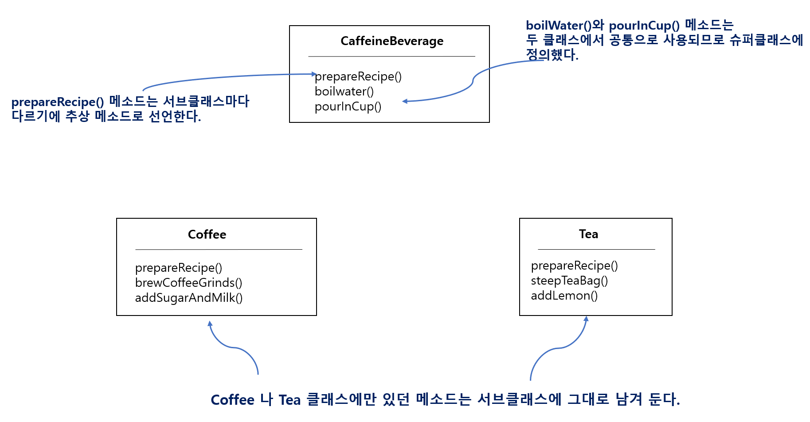

# 23일차 : 2023-08-25 (p. 305 ~ 316)

## 요약

**퍼사드 패턴과 최소 지식 원칙**



- HomeTheaterFacade 는 클라이언트 대신 모든  서브 시스템 구성 요소를 관리 해 준다. 덕분에 클라이언트는 단순하면서도 유연해질 수 있다.
- 홈시어터 구성 요소를 업그레이드해도 클라이언트는 아무 영향을 받지 않는다.
- 서브시스템에서도 최소 지식 원칙을 최대한 지키는 것이 좋다. 서로 얽혀 있는 친구가 너무 많아서 시스템이 너무 복잡하다면 퍼사드를 추가하는 것도 생각해 봅시다.

**알고리즘 캡슐화하기 - 템플릿 메소드 패턴**

: 서브클래스에서 언제든 필요할 때마다 알고리즘을 가져다가 쓸 수 있도록 캡슐화해 보자.

**커피와 홍차 만들기**

커피와 홍차의 공통점은 카페인이 있다는 것이다.

**스타버즈 커피 만드는 법**

1. 물을 끓인다.
2. 끓는 물에 커피를 우려낸다.
3. 커피를 컵에 따른다.
4. 설탕과 우유를 추가한다.

**스타버즈 홍차 만드는 법**

1. 물을 끓인다.
2. 끓는 물에 찻잎을 우려낸다.
3. 홍차를 컵에 따른다.
4. 레몬을 추가한다.

**Coffee 클래스와 Tea 클래스 만들기**

**Coffee 클래스**

```java
public class Coffee {
    
    void prepareRecipe() {
        boilWater();
        brewCoffeeGrinds();
        pourInCup();
        addSugarAndMilk();
    }

    private void boilWater() {
        System.out.println("물 끓이는 중");
    }
    private void brewCoffeeGrinds() {
        System.out.println("필터로 커피를 우려내는 중");
    }

    private void pourInCup() {
        System.out.println("컵에 따르는 중");
    }
    private void addSugarAndMilk() {
        System.out.println("설탕과 우유를 추가하는 중");
    }
    
}
```

메소드 마다 알고리즘의 각 단계를 구현하고 있다.

첫 번째는 물을 끓이는 메소드,

두 번째는 커피를 우려내는 메소드,

세 번째는 커피를 컵에 따르는 메소드,

네 번째는 설탕과 우유를 추가하는 메소드

**Tea 클래스**

```java
public class Tea {
    
    void prepareRecipe(){
        boilWater();
        steepTeaBag();
        pourInCup();
        addLemon();
    }

    private void boilWater() {
        System.out.println("물 끓이는 중");
    }

    private void steepTeaBag() {
        System.out.println("찻잎을 우려내는 중");
    }

    private void addLemon() {
        System.out.println("레몬을 추가하는 중");
    }

    private void pourInCup() {
        System.out.println("컵에 따르는 중");
    }

}
```

Coffee 와  Tea 클래스에 중복된 부분이 상당히 많다.

중복된 부분을 없앨 수 있는 디자인을 고민해 보자

**Coffee 클래스와 Tea 클래스 추상화하기**



- 서브클래스는 음료 제조법을 구현한다.
- 서브클래스는 prepareRecipe() 메소드를 오버라이드해서 음료 제조법을 구현한다.

## 메모

**객체지향 원칙**

- 바뀌는 부분만 캡슐화 한다.
- 상속보다는  구성을 활용한다.
- 구현보다는 인터페이스에 맞춰서 프로그래밍 한다.
- 상호작용하는 객체 사이에서는 가능하면 느슨한 결합을 사용해야 한다.
- 클래스는 확장에는 열려 있어야 하지만 변경에는 닫혀 있어야 한다. (OCP)
- 추상화된 것에 의존하게 만들고 구상 클래스에 의존하지 않게 만든다.
- 진짜 절친에게만 이야기해야 한다.

### **어댑터 패턴 vs 퍼사드 패턴**

**어댑터 패턴**


<aside>
💡 특정 클래스 인터페이스를 클라이언트에서 요구하는 다른 인터페이스로 변환한다.  인터페이스가 호환되지 않아 같이 쓸 수 없었던 클래스를 사용할 수 있게 도와준다.

</aside>

- 기존 클래스를 사용하려고 하는 데 인터페이스가 맞지 않으면 어댑터를 쓰면 된다.
- 어댑터는 인터페이스를 클라이언트에서 원하는 인터페이스로 바꾸는 역할을 한다.
- 어댑터를 구현할 때는 타깃 인터페이스의 크기와 구조에 따라 코딩 해야 할 분량이 결정된다.
- 어댑터 패턴에는 객체 어댑터 패턴과 클래스 어댑터 패턴이 있다. 클래스 어댑터를 쓰려면 다중 상속이 가능해야 한다.

**퍼사드 패턴**

<aside>
💡 서브시스템에 있는 일련의 인터페이스를 통합 인터페이스로 묶어 준다. 또한 고수준 인터페이스도 정의하므로 서브시스템을 더 편리하게 사용할 수 있다.

</aside>

- 큰 인터페이스와 여러 인터페이스를 단순하게 바꾸거나 통합해야 하면 퍼사드를 쓰면 된다.
- 퍼사드는 클라이언트를 복잡한 서브시스템과 분리하는 역할을 한다.
- 퍼사드 패턴에서는 서브 시스템으로 퍼사드를 만들고 진짜 작업은 서브클래스에 맡긴다.
- 한 서브시스템에 퍼사드를 여러 개 만들어도 된다.

어댑터는 객체를 감싸서 인터페이스를 바꾸는 용도로, 데코레이터는 객체를 감싸서 새로운 행동을 추가하는 용도로, 퍼사드는 일련의 객체를 감싸서 단순하게 만다는 용도로 쓰인다.