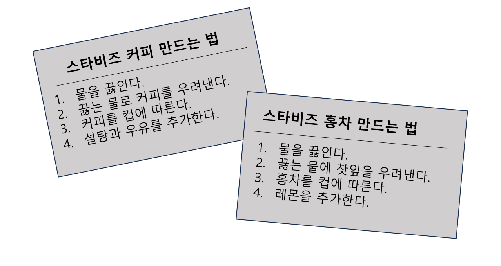
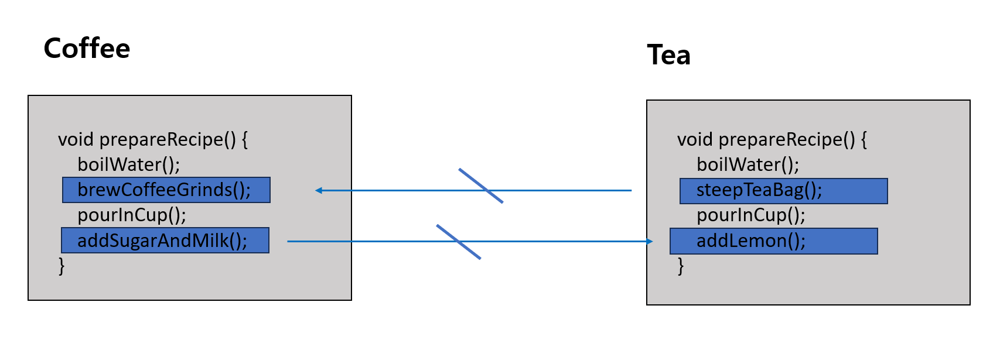
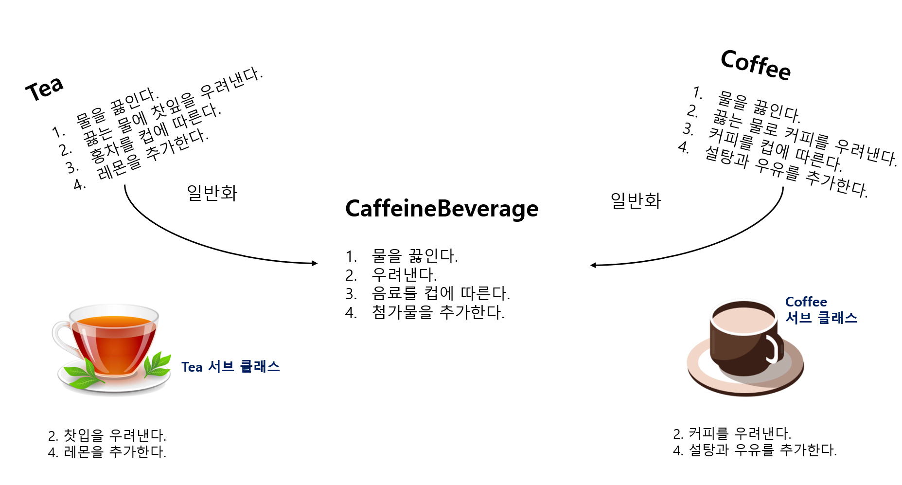
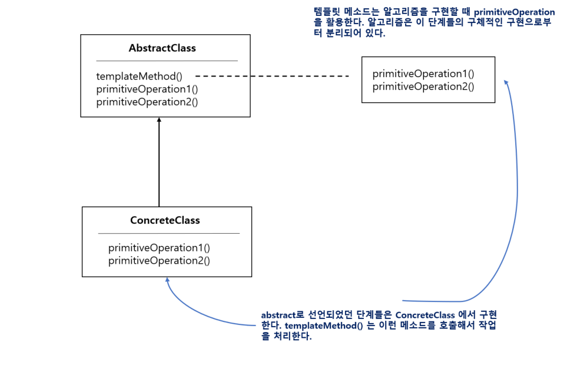

# 24일차 : 2023-08-26 (p.317 ~ 334)

## 요약

Coffee 클래스와 Tea 클래스의 제조법



커피와 홍차 제조법의 알고리즘이 똑같다.

- 물을 끓인다.   ←( 베이스 클래스에 추상화 되어 있다.)
- 뜨거운 물을 사용해서 커피 또는 찻잎을 우려낸다. ←(추상화 되어 있지 않지만 똑같다.)
- 만들어진 음료를 컵에 따른다. ←( 베이스 클래스에 추상화 되어 있다.)
- 각 음료에 맞는 첨가물을 추가한다. ←(추상화 되어 있지 않지만 똑같다.)

**prepareRecipe() 메소드 추상화하기**

첫 번째 문제점

Coffee 클래스는 brewCoffeeGrinds() 와 addSugarAndMilk() 메소드를 사용

Tea 클래스는 steepTeaBag() 와 addLemon() 메소드를 사용



커피를 필터로 우려내는 일과 티백을 물에 넣어서 홍차를 우려내는 일은 별로 다르지 않다.

⇒ brew() 메소드를 만들자

설탕과 우유를 추가하는 일이나 레몬을 추가하는 일도 별반 다르지 않다.

⇒ addCondiments() 메소드를 만들자

```java
void prepareRecipe() {
		boilWater();
    brew();
    pourInCup();
    addCondiments();
}
```

**CaffeineBeverage 슈퍼 클래스**

```java
public abstract class CaffeineBeverage {

    final void prepareRecipe() {
        boilWater();
        brew();
        pourInCup();
        addCondiments();
    }

    abstract void brew();

    abstract void addCondiments();

     void boilWater() {
         System.out.println("물 끓이는 중");
    }

    private void pourInCup() {
        System.out.println("컵에 따르는 중");

    }
}
```

- prepareRecipe() 메소드는 서브클래스가 아무렇게나 오버라이드 하지 못하도록 final로 선언했다.
- brew() , addCondiments()  메소드는 서브클래스에서 서로 다른 방식으로 처리하므로 추상 메소드로 선언해야 한다.

Coffee 와 Tea 클래스 수정하기

**Tea 클래스**

```java
public class Tea extends CaffeineBeverage {

    @Override
    void brew() {
        System.out.println("찻잎을 우려내는 중");
    }

    @Override
    void addCondiments() {
        System.out.println("레몬을 추가하는 중");
    }

}
```

**Coffee 클래스**

```java
public class Coffee extends CaffeineBeverage {

    @Override
    void brew() {
        System.out.println("필터로 커피를 우려내는 중");
    }

    @Override
    void addCondiments() {
        System.out.println("설탕과 우유를 추가하는 중");
    }

}
```

**커피와 홍차를 만드는 과정 다시 살펴보기**



- 조금 다른 방식으로 구현해야 하긴 하지만 , 커피와 홍차를 만드는 방법은 사실상 똑같다.
    - 제조법을 일반화해서 **베이스 클래스(CaffeineBeverage)**에 넣었다.
- CaffeineBeverage 에서 전체 처리 과정을 관리한다.
    - 첫 번째와 세 번째 단계는 직접 처리한다.
    - 두 번째와 네 번째 단계는 Tea와 Coffee 서브 클래스에 의존한다.

**템플릿 메소드 패턴 알아보기**

```java
public abstract class CaffeineBeverage {

    final void prepareRecipe() {
        boilWater();
        brew();
        pourInCup();
        addCondiments();
    }

    abstract void brew();

    abstract void addCondiments();

     void boilWater() {
         System.out.println("물 끓이는 중");
    }

     void pourInCup() {
        System.out.println("컵에 따르는 중");

    }
}
```

prepareRecipe() 는 템플릿 메소드이다.

어떤 알고리즘의 템플릿(틀)역할을 한다.

여기서는 카페인 음료를 만드는 알고리즘의 템플릿이다.

<aside>
💡 템플릿 메소드는 알고리즘의 각 단계를 정의하며, 서브클래스에서 일부 단계를 구현할 수 있도록 유도한다.

</aside>

**홍차가 만들어지기까지**

- 먼저 Tea 객체를 만든다.

```java
Tea myTea = new Tea();
```

- 이제 템플릿 메소드를 호출한다.

```java
myTea.prepareRecipe();
```

그러면 카페인 음료를 만드는 알고리즘이 돌아간다.

```java
final void prepareRecipe() {
        boilWater();
        brew();
        pourInCup();
        addCondiments();
    }
```

- 우선 물을 끓인다.

```java
boilWater();
```

이 단계는 CaffeineBeverage 에서 처리된다.

- 이제 찻잎을 우려낼 차례다. 우려내는 방법은 서브 클래스만이 알고 있다.

```java
brew();
```

- 이제 홍차를 컵에 따른다. 모든 음료에 똑같이 적용되기에 CaffeineBeverage가 맡아서 처리한다.

```java
pourInCup();
```

- 마지막으로 첨가물을 추가한다. 첨가물은 음료마다 다르므로 첨가물 추가느 서브클래스가 처리한다.

```java
addCondiments();
```

**템플릿 메소드 패턴의 정의**

<aside>
💡 알고리즘의 골격을 정의한다. 템플릿 메소드를 사용하면 알고리즘의 일부 단계를 서브클래스에서 구현할 수 있으며, 알고리즘의 구조는 그대로 유지하면서 알고리즘의 특정 단계를 서브클래스에서 재정의할 수도 있다.

</aside>

- 템플릿 메소드 패턴은 알고리즘의 **템플릿(틀)**을 만든다.
- 템플릿이란 메소드이다.
- 일련의 단계로 알고리즘을 정의한 메소드이다.
- 하나 이상의 단계가 추상 메소드로 정의된다.
- 추상 메소드는 서브클래스에서 구현된다.
- 서브클래스가 일부분의 구현을 처리하게 하면서도 알고리즘의 구조는 바꾸지 않아도 된다.



- AbstractClass 에 템플릿 메소드가 들어있다.
- ConcreteClass 는 여러 개가 있을 수 있다. 각 클래스는 템플릿 메소드에서 요구하는 모든 단계를 제공해야 한다.

```java
abstract class AbstractClass {
    
    final void templateMethod(){
        primitiveOperation1();
        primitiveOperation2();
        concreteOperation();
    }
    
    
    abstract void primitiveOperation1();
    
    abstract void primitiveOperation2();
     void concreteOperation() {
    }
}
```

**템플릿 메소드 속 후크  알아보기**

후크(Hook)는 추상 클래스에서 선언되지만 기본적인 내용만 구현되어 있거나 아무 코드도 들어있지 않은 메소드이다.

```java
public abstract class CaffeineBeverageWithHook {

    final void prepareRecipe() {
        boilWater();
        brew();
        pourInCup();
        if(customerWantsCondiments()) {
            addCondiments();
        }
    }
    
    abstract void brew();
    abstract void addCondiments();
    private void boilWater() {
    }

    private void pourInCup() {
        
    }

    boolean customerWantsCondiments() {
        return true;
    }
}
```

- customerWantsCondiments() 는 별 내용이 없는 기본 메소드이다.
- 이 메소드는 서브클래스에서 필요할 때 오버라이드할 수 있는 메소드이므로 후크이다.

**후크 활용하기**

후크를 사용하려면 서브클래스에서 후크를 오버라이드해야 한다.

```java
public class CoffeeWithHook extends CaffeineBeverageWithHook {
    @Override
    void brew() {
        System.out.println("필터로 커피를 우려내는 중");
    }

    @Override
    void addCondiments() {
        System.out.println("우유와 설탕을 추가하는 중");
    }

    @Override
    boolean customerWantsCondiments() {
        String answer = getUserInput();
        if (answer.toLowerCase().startsWith("y")) return true;
        return false;
    }

    private String getUserInput() {
        String answer = null;

        System.out.println("커피에 우유와 설탕을 넣을까요 ? (y/n)");

        BufferedReader in = new BufferedReader(new InputStreamReader(System.in));

        try {
            answer = in.readLine();
        } catch (IOException e) {
            System.out.println("IO 오류");
        }

        if (answer == null) return "no";
        return answer;
    }
}
```

- 후크를 오버라이드해서 원하는 기능을 넣었다.
- 첨가물을 추가할지 말지를 고객에게 물어보고, 고객이 입력한 내용에 따라 true  또는 false 를 리턴한다.

**할리우드 원칙**

> 먼저 연락하지 마세요. 저희가 먼저 연락 드리겠습니다.
>
- 할리우드 원칙을 활용하면 의존성 부패(dependency rot)를 방지할 수 있다.
- 할리우드 원칙을 사용하면, 저수준 구성 요소가 시스템에 접속할 수는 있지만, 언제, 어떻게 그 구성 요소를 사용할지는 고수준 구성 요소가 결정한다.

## 발췌

> 기본적으로 아무것도 하지 않는 구상 메소드를 정의할 수 있다. 이런 메소드를 **후크(hook**)라고부른다.
>

> 후크가 있으면 그 메소드를 오버라이드할 수도 있고 그냥 넘어갈수도 있다.  
오버라이드 하지 않으면 추상 클래스에서 기본으로 제공한 코드가 실행된다.
>