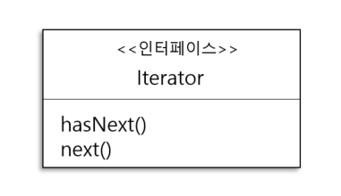
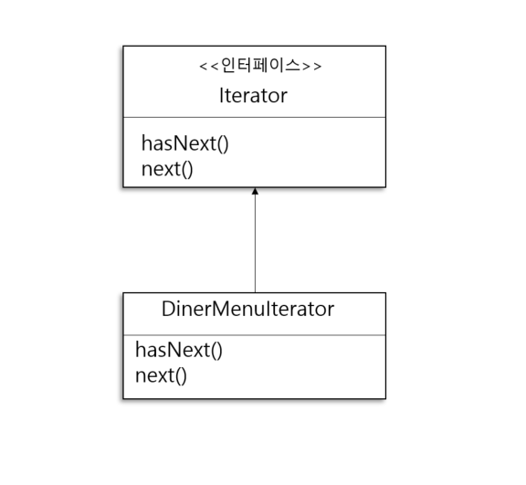
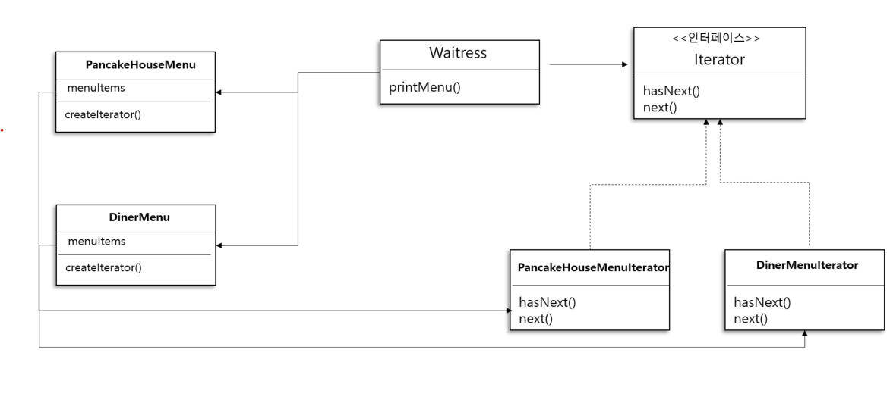
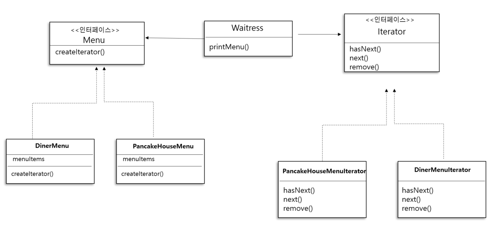
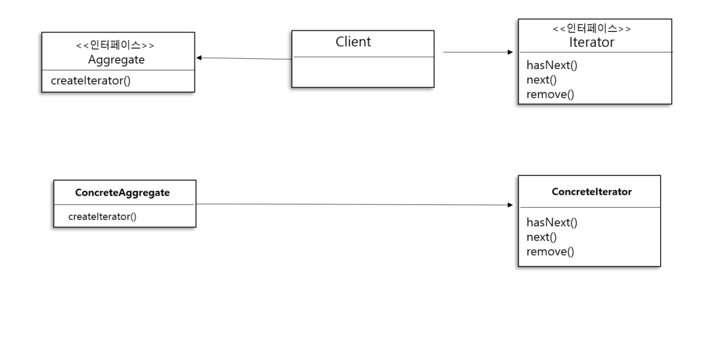

# 27일차 : 2023-09-06 (p.361 ~ 373)

## 요약

반복 작업을 캡슐화 하려는 방법도 일종의 디자인 패턴으로 **반복자(iterator)** 패턴이라고 부른다.

반복자 패턴이 Iterator 인터페이스에 의존한다.



- hasNext() 메소드를 사용하면 반복 작업을 적용할 대상이 더 있는지 확인할 수 있다.
- next() 메소드는 다음 객체를 리턴한다.

이 인터페이스가 있으면 배열, 리스트 ,해시테이블은 물론,  모든 종류의 객체 컬렉션에 반복자를 구현할 수 있다.

DinerMenu 에서 사용하는 배열 Iterator 인터페이스를 다음과 같이 구현할 수 있다.


DinerMenuIterator 는 Iterator 를 구현한 클래스로, MenuItem이 들어있는 배열을 대상으로

반복 작업을 하는 데 필요한 메소드를 제공한다.

**객체마을 식당 메뉴에 반복자 추가하기**

Iterator 인터페이스 정의하기

```java
public interface Iterator {
    boolean hasNext();
    MenuItem next();
}
```

DinerMenu 클래스에 사용할 구상 Iterator 클래스

```java
public class DinerMenuIterator implements Iterator {
    MenuItem[] items;
    int position = 0;

    public DinerMenuIterator(MenuItem[] items) {
        this.items = items;
    }

    @Override
    public boolean hasNext() {
        if (position >= items.length || items[position] == null) return false;
        return true;
    }

    @Override
    public MenuItem next() {
        MenuItem menuItem = items[position];
        position++;
        return menuItem;
    }
}
```

**객체마을 식당 메뉴에서 반복자 사용하기**

```java
public class DinerMenu {
    static final int MAX_ITEMS = 6;
    int numberOfItems = 0;
    MenuItem[] menuItems;

    public DinerMenu() {
        menuItems = new MenuItem[MAX_ITEMS];

        addItem("채식 주의자용 BLT" , "통밀 위에 콩고기 베이컨 , 상추 , 토마토를 얹은 메뉴", true, 2.99);
    }

    private void addItem(String name, String description, boolean vegetarian, double price) {
        MenuItem menuItem = new MenuItem(name,description,vegetarian,price);
        if (numberOfItems >= MAX_ITEMS){
            System.out.println("죄송합니다. 메뉴가 꽉 찼습니다. 더 이상 추가할 수 없습니다.");
        }else {
            menuItems[numberOfItems] = menuItem;
            numberOfItems++;
        }
    }
    // 더 이상 필요 없다. 내부 구조를 다 드러내는 단점이 있어서 없애는게 낫다.
//    public MenuItem[] getMenuItems() {
//        return menuItems;
//    }
    
    public Iterator createIterator(){
        return new DinerMenuIterator(menuItems);
    }
}
```

createIterator() 메소드

- menuItems 배열을 가지고 DinerMenuIterator 를 생성한 다음 클라이언트에게 리턴한다.
- Iteraotor 인터페이스를 리턴한다.

**종업원 코드에 반복자 적용하기**

```java
public class Waitress {
    PancakeHouseMenu pancakeHouseMenu;
    DinerMenu dinerMenu;

    public Waitress(PancakeHouseMenu pancakeHouseMenu, DinerMenu dinerMenu) {
        this.pancakeHouseMenu = pancakeHouseMenu;
        this.dinerMenu = dinerMenu;
    }
    
    public void printMenu(){
        Iterator pancakeIterator = pancakeHouseMenu.createIterator();
        Iterator dinerIterator = dinerMenu.createIterator();

        System.out.println("메뉴 \n ---- \n 아침 메뉴");
        printMenu(pancakeIterator);
        System.out.println("\n 점심 메뉴");
        printMenu(dinerIterator);
    }

    private void printMenu(Iterator iterator) {
        while (iterator.hasNext()) {
            MenuItem menuItem = iterator.next();
            System.out.println(menuItem.getName()+" ,");
            System.out.println(menuItem.getPrice()+" --");
            System.out.println(menuItem.getDescription());
        }
    }
}
```

**종업원 코드 테스트**

```java
public class MenuTestDrive {
    public static void main(String[] args) {
        PancakeHouseMenu pancakeHouseMenu = new PancakeHouseMenu();
        DinerMenu dinerMenu = new DinerMenu();

        Waitress waitress = new Waitress(pancakeHouseMenu, dinerMenu);
        waitress.printMenu();
    }
}
```

**반복자 패턴의 특징 알아보기**

관리하기 힘든 종업원 코드

- 메뉴가 캡슐화되어 있지 않습니다. 객체마을 식당에서는 배열을 쓰고 팬케이크 하우스에서는 ArrayList 를 쓴다는 사실을 누구나 다 알수 있다.
- MenuItems 을 대상으로 반복 작업을 하려면 2개의 순환문이 필요하다.
- 종업원이 구상 클래스(MenuItem[] , ArrayList)에 직접 연결되어 있다.
- 유사한 인터페이스를 가졌음에옫 2개의 서로 다른 구상 메뉴 클래스에 묶여 있다.

Iterator가 장착된 신형 종업원 코드

- 메뉴 구현법이 캡슐화되어 있습니다. 종업원은 메뉴에서 메뉴 항목의 컬렉션을 어떤 식으로 저장하는지 전혀 알 수가 없다.
- 반복자만 구현한다면 다형성을 활용해서 어떤 컬렉션이든 1개의 순환문으로 처리할 수 있다.
- 종업원은 인터페이스만 알면 된다.

**통합 식당 코드 다시 살펴보기**



- 반복자 덕분에 Waitress 클래스가 실제로 구현된 구상 클래스로부터 분리되었다.
    - Menu가 배열로 구현되어있는지, ArrayList 로 구현되었는지 전혀 신경 쓸 필요가 없다.
- 반복자를 사용하면 그 안에 들어있는 모든 항목에 접근할 수 있게 하려고 여러 메소드를 외부에 노출시키지 않으면서도, 컬렉션에 들어있는 모든 객체에 접근할 수 있다.

**java.util.Iterator 적용하기**

PancakeHouseMenuIterator 클래스를 지워버리고 PancakeHouseMenu 코드 맨 위에

java.util.Iterator 를 추가한 다음 1줄의 코드만 고치자

```java
public java.util.Iterator<MenuItem> createIterator(){
        return menuItems.iterator();
    }
```

**변경된 통합 식당 코드 살펴보기**

PancakeHouseMenu 와 DinerMenu 클래스에서 Menu 인터페이스를 구현한다.

Waitress 클래스에서 각 메뉴 객체를 참조할 때는 구상 클래스 대신 인터페이스를 사용하면 된다.




새로 정의한 Menu 인터페이스에는 createIterator() 메소드만 있다.

PancakeHouseMenu 와 DinerMenu 에서 모두 이 메소드를 구현한다.

**반복자 패턴의 정의**

<aside>
💡 **반복자 패턴(Iterator Pattern)** 은 컬렉션의 구현 방법을 노출하지 않으면서 집합체 내의 모든 항목에 접근하는 방법을 제공한다.

</aside>

이 패턴을 사용하면 집합체 내에서 어떤 식으로 일이 처리되는지 전혀 모르는 상태에서 그 안에 들어있는 모든 항목을 대상으로 반복 작업을 수행할 수 있다.

**반복자 패턴의 구조 알아보기**




- Iterator 인터페이스는 모든 반복자가 구현해야 하는 인터페이스를 제공하며, 컬렉션에 들어있는 원소에 돌아가면서 접근할 수 있게 해 주는 메소드를 제공한다.
- ConcreteIterator 는 반복 작업 중에 현재 위치를 관리하는 일을 맡고 있다.
- ConcreteAggregate 에는 객체 컬렉션이 들어있으며, 그 안에 들어있는 컬렉션을 Iterator 로 리턴하는 메소드를 구현한다.

## 발췌

> 컬렉션은 객체를 모아 놓은 것에 불과하다.
리스트, 배열, 해시테이블과 같이 다양한 자료구조에 컬렉션을 보관할 수 있는데 , 어떤 자료구조를 사용하든 결국 컬렉션은 컬렉션이다.
>

> 반복자 패턴을 사용하면 내부 구현 방법을 외부에 노출하지 않으면서 집합체에 있는 모든 항목에 일일이 접근할 수 있다.
>

> 또한 각 항목에 일일이 접근할 수 있게 해 주는 기능을 집합체가 아닌 반복자 객체가 책임진다는 장점도 있다.
>