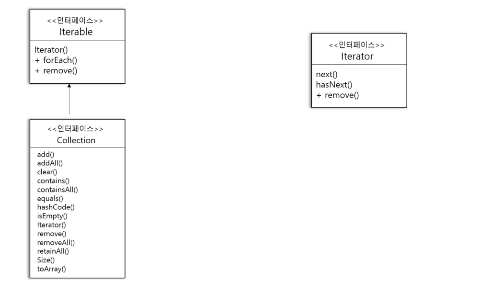

# 28일차 : 2023-09-07 (p.374 ~ 386)

## 요약

**단일 역할 원칙**

집합체에서 내부 컬렉션 관련 기능과 반복자용 메소드 관련 기능을 전부 구현한다면??

집합체에 들어가는 메소드 개수가 늘어난다.

클래스에서 원래 그 클래스의 역할(집합체 관리 ) 외에 다른 역할(반복자 메소드) 을 처리할 때 2가지 이유로 그 클래스가 바뀔 수 있다는 사실을 알아야 한다.

1. 컬렉션이 어떤 이유로 바뀌게 되면 그 클래스도 바뀌어야 한다.
2. 반복자 관련 기능이 바뀌었을 때도 클래스가 바뀌어야 한다.

**디자인 원칙**

<aside>
💡 어떤 클래스가 바뀌는 이유는 하나뿐이어야 한다.

</aside>

클래스를 고치는 일은 최대한 피해야 한다.

코드를 변경하다 보면 온갖 문제가 생길 수 있기 때문이다.

코드를 변경할 만한 이유가 2가지나 되면 그만큼 그 클래스를 나중에 고쳐야 할 가능성이 커지며 디자인에 있어서 2가지 부분에 영향이 미치게 된다.

하나의 역할은 하나의 클래스에서만 맡아야 한다.

**Iterable 인터페이스 알아보기**



어떤 클래스에서 Iterable 을 구현한다면 그 클래스는 iterator() 메소드를 구현한다.

그 메소드는 Iterator 인터페이스를 구현하는 반복자를 리턴한다.

또한 이 인터페이스에는 컬렉션에 있는 항목을 대상으로 반복 작업을 수행하는 방법을 제공하는

forEach() 메소드가 기본으로 포함된다.

**향상된 for  순환문 알아보기**

```java
 				List<MenuItem> menu = new ArrayList<>();

        for (MenuItem menuItem : menu) {
            System.out.print(menuItem.getName()+" , ");
            System.out.print(menuItem.getPrice()+ " -- ");
            System.out.println(menuItem.getDescription());
        }
```

**객체마을 카페 메뉴 살펴보기**

```java
public class CafeMenu {
    Map<String ,MenuItem> menuItems = new HashMap<>();

    public CafeMenu() {
        addItem("베지 버거와 에어 프라이" , "통밀빵 , 상추 , 토마토 , 감자 튀김이 첨가된 베지 버거",true , 3.99);
    }

    private void addItem(String name, String description, boolean vegetarian, double price) {
        MenuItem menuItem = new MenuItem(name,description,vegetarian,price);
        menuItems.put(name,menuItem);
    }

    public Map<String, MenuItem> getMenuItems() {
        return menuItems;
    }
}
```

**객체마을 카페 메뉴 코드 고치기**

```java
public class CafeMenu implements Menu {
    Map<String ,MenuItem> menuItems = new HashMap<>();

    public CafeMenu() {
        addItem("베지 버거와 에어 프라이" , "통밀빵 , 상추 , 토마토 , 감자 튀김이 첨가된 베지 버거",true , 3.99);
    }

    private void addItem(String name, String description, boolean vegetarian, double price) {
        MenuItem menuItem = new MenuItem(name,description,vegetarian,price);
        menuItems.put(name,menuItem);
    }

    @Override
    public Iterator<MenuItem> createIterator() {
        return menuItems.values().iterator();
    }
}
```

## 발췌

> 어떤 클래스에서 맡고 있는 모든 역할은 나중에 코드 변화를 불러올 수 있다.  역할이 2개 이상 있으면 바뀔 수 있는 부분이 2개 이상이 되는 것이다.
>

> 이 원칙에 따라서 하나의 클래스는 하나의 역할만 맡아야 한다.
>

## 메모

**응집도**

<aside>
💡 한 클래스 또는 모듈이 특정 목적이나 역할을 얼마나 일관되게 지원하는지를 나타내는 척도

</aside>

어떤 모듈이나 클래스의 응집도가 높다는 것은 서로 연관된 기능이 묶여있다는 것을,

응집도가 낮다는 것은 서로 상관 없는 기능들이 묶여있다는 것을 뜻한다.