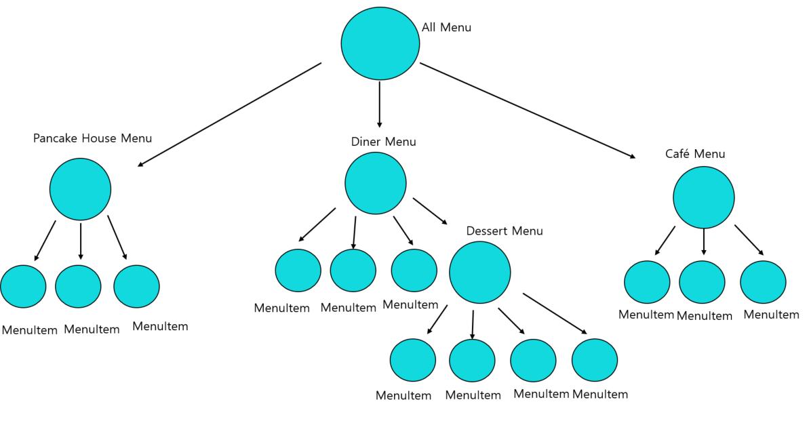
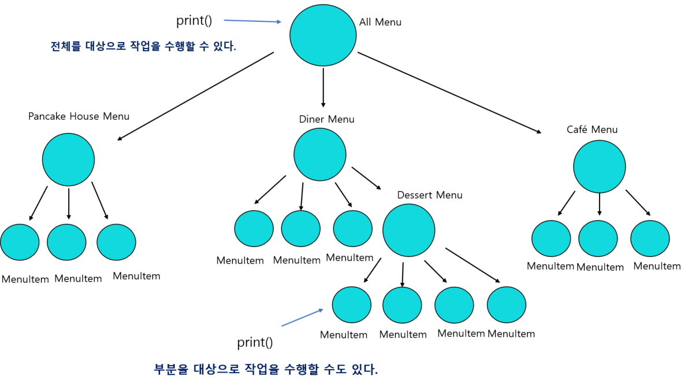
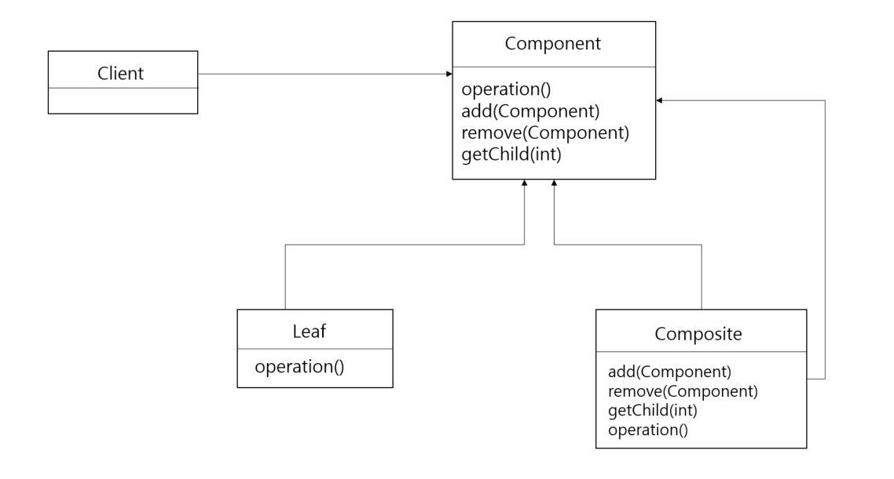
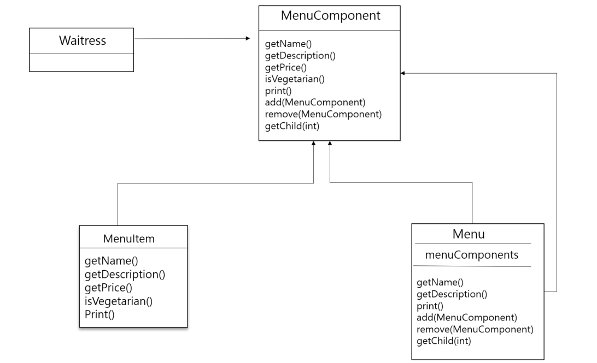

# 29일차 - 2023-09-08 (p.387~398)

## 요약

**반복자와 컬렉션**

자바 컬렉션 프레임워크(Java Collections Framework) 는 클래스와 인터페이스를 모아 놓은 것에 불과하다.

ArrayList 를 비롯하여 Vector , LinkedList , Stack , PrioirtyQueue  등이 모두 이 프레임워크에 속한다.

이 클래스들은 모두 java.util.Collection 인터페이스를 구현하는데, 그 인터페이스에는 객체로 구성된

그룹을 조작하는 여러 유용한 메소드가 포함되어 있다.

**종업원 코드 개선하기**

지금 종업원 코드는 printMenu() 를 3번이나 호출해야 한다는 점과 새로운 메뉴가 추가될 때마다 종업원에 코드를 추가해야 한다는 문제로 남아 있다.

OCP(Open Closed Principle) 에 위배된다.

```java
public void printMenu(){
        java.util.Iterator<MenuItem> pancakeIterator = pancakeHouseMenu.createIterator();
        java.util.Iterator<MenuItem> dinerIterator = dinerMenu.createIterator();
        java.util.Iterator<MenuItem> cafeIterator = cafeMenu.createIterator();
        
        System.out.println("메뉴 \n ---- \n 아침 메뉴");
        printMenu(pancakeIterator);
        
        System.out.println("\n 점심 메뉴");
        printMenu(dinerIterator);

        System.out.println("\n 저녁 메뉴");
        printMenu(cafeIterator);
    }
```

printMenu() 를 메뉴마다 1번씩, 총 3번 호출한다.

메뉴를 전부 합쳐서 메소드를 1번만 호출할 수는 없을까??

메뉴들을 ArrayList로 잘 묶어서 반복자로 각 메뉴를 대상으로 반복 작업을 수행할 수 있다.

```java
public class Waitress {
    List<Menu> menus;

    public Waitress(List<Menu> menus) {
        this.menus = menus;
    }
    
    public void printMenu() {
        Iterator<Menu> menuIterator = menus.iterator();
        while (menuIterator.hasNext()) {
            Menu menu = menuIterator.next();
            printMenu(menu.createIterator());
        }
    }

    private void printMenu(Iterator<MenuItem> iterator) {
        while (iterator.hasNext()) {
            MenuItem menuItem = iterator.next();
            System.out.println(menuItem.getName()+ " , ");
            System.out.println(menuItem.getPrice() + " -- ");
            System.out.println(menuItem.getDescription());
        }
    }
}
```

디저트 서브메뉴 추가하기!

: 여러 개의 메뉴만 지원하는 걸로 끝나는 게 아니라 메뉴 안에 서브메뉴가 들어가 있는 것도 지원해야 한다.

디저트 메뉴를 DinerMenu 컬렉션의 원소로 넣을 수 있으면 좋겠지만,

형식이 다르므로 서브메뉴를 넣을 수 없다.

**리팩터링 준비하기**

시스템이 복잡해져서 지금 당장 디자인을 완전히 뜯어 고치지 않으면 서브메뉴를 기존 메뉴에 추가할 수 없다.

- 메뉴, 서브메뉴, 메뉴 항목 등을 모두 넣을 수 있는 트리 형태의 구조가 필요하다.
- 각 메뉴에 있는 모든 항목을 대상으로 특정 작업을 할 수 있는 방법을 제공해야 하며, 그 방법은 적어도 지금 사용중인 반복자 만큼 편리해야 한다.
- 더 유연한 방법으로 아이템을 대상으로 반복 작업을 수행할 수 있어야 한다.  예를 들어, 객체마을 식당 메뉴에 껴있는 디저트 메뉴를 대상으로만 반복 작업을 할 수 있으면서도 디저트 서브메뉴까지 포함한, 모든 객체마을 식당 메뉴를 대상으로 반복 작업을 할 수 있어야 한다.



**컴포지트 패턴의 정의**

메뉴 관리는 반복자 패턴만으로 처리하기 어려우니 메뉴 관리에 도움이 되는 컴포지트 패턴을 쓰기로 결정

<aside>
💡 **컴포지트 패턴(Composite Pattern)** 으로 객체를 트리구조로 구성해서 부분-전체 계층 구조를 구현한다. 컴포지트 패턴을 사용하면 클라이언트에서 개별 객체와 복합 객체를 똑같은 방법으로 다룰 수 있다.

</aside>

이 패턴을 사용하면 중첩되어 있는 메뉴 그룹과 항목을 똑같은 구조 내에서 처리할 수 있다.

메뉴와 항목을  같은 구조에 넣어서 **부분-전체 계층 구조**를 생성할 수 있다.

여기서 부분-전체 계층 구조란, 부분들이 계층을 이루고 있지만 모든 부분을 묶어서 전체로 다룰 수 있는 구조를 뜻한다.

메뉴 , 서브메뉴, 서브서브메뉴로 구성된 트리구조가 있다고 하면 각각이 모두 복합 객체가 될 수 있다.

컴포지트 패턴을 따르는 디자인을 사용하면 간단한 코드만 가지고도 똑같은 작업을 전체 메뉴 구조를 대상으로 반복해서 적용할 수 있다.






- 클라이언트는 Component 인터페이스를 사용해서 복합 객체내의 객체들을 조작할 수 있다.
- Component 는 복합 객체 내에 들어있는 모든 객체의 인터페이스를 정의한다. 복합 노드와 잎에 관한 메소드까지 정의한다.
- Component 에서  add() , remove() , getChild() 와 몇 가지 작업의 기본 행동을 정의할 수도 있다.

**컴포지트 패턴으로 메뉴 디자인하기**




- MenuComponent 는 MenuItem 과 Menu 모두에 적용되는 인터페이스이다.
- MenuItem 과 Menu 에서 모두 print()를 오버라이드한다.

**메뉴 구성 요소 구현하기**

MenuComponent 추상 클래스

메뉴 구성 요소는 잎과 복합 노드 모두에서 쓰이는 인터페이스 역할을 한다.

```java
public abstract class MenuComponent {

    public void add(MenuComponent menuComponent) {
        throw new UnsupportedOperationException();
    }

    public void remove(MenuComponent menuComponent) {
        throw new UnsupportedOperationException();
    }

    public MenuComponent getChild(int i) {
        throw new UnsupportedOperationException();
    }

    public String getName() {
        throw new UnsupportedOperationException();
    }
    
    public String getDescription() {
        throw new UnsupportedOperationException();
    }
    
    public double getPrice() {
        throw new UnsupportedOperationException();
    }
    
    public boolean isVegetarian() {
        throw new UnsupportedOperationException();
    }
    
    public void print() {
        throw new UnsupportedOperationException();
    }
}
```

## 발췌

> 컬렉션과 반복자를 사용하면 모든 컬렉션 객체에서 자신을 대상으로 하는 반복자를 리턴할 줄 안다는 장점을 활용할 수 있다.
>

> ArrayList 의 iterator() 메소드를 호출하면 그 ArrayList 용 구상 Iterator 클래스가 리턴된다.  그 안에서 사용하는 구상 클래스는 전혀 신경 쓰지 않아도 된다.
>

> 컴포지트 패턴을 사용하면 객체의 구성과 개별 객체를 노드로 가지는 트리 형태의 객체 구조를 만들 수 있다.
>

> 복합 구조(composite structure) 를 사용하면 복합 객체와 개별 객체를 대상으로 똑같은 작업을 적용할 수 있다.  즉, 복합 객체와 개별 객체를 구분할 필요가 거의 없어진다.
>
