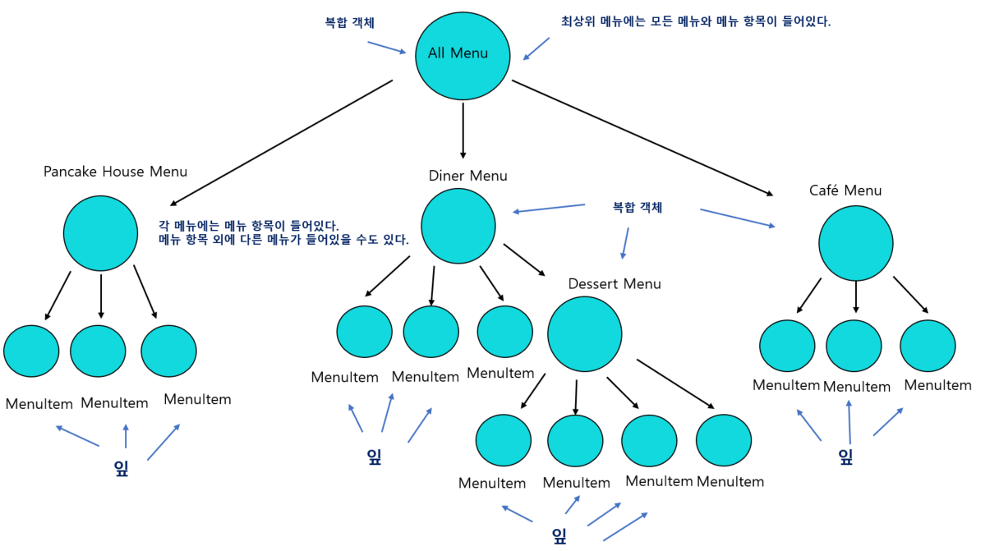

# 30일차 : 2023-09-09 (p.399 ~ 414)

## 요약

**메뉴 항목 구현하기**

```java
public class MenuItem extends MenuComponent {
    String name;
    String description;
    boolean vegetarian;
    double price;

    public MenuItem(String name, String description, boolean vegetarian, double price) {
        this.name = name;
        this.description = description;
        this.vegetarian = vegetarian;
        this.price = price;
    }

    @Override
    public String getName() {
        return name;
    }

    @Override
    public String getDescription() {
        return description;
    }

    @Override
    public boolean isVegetarian() {
        return vegetarian;
    }

    @Override
    public double getPrice() {
        return price;
    }
    
    public void print() {
        System.out.println(" " + getName());
        if (isVegetarian()) {
            System.out.println("(v)");
        }
        System.out.println(", " + getPrice());
        System.out.println("         --    "  + getDescription());
    }
}
```

이 클래스는 컴포지트 패턴 다이어그램에서 잎에 해당하는 클래스이다.

**메뉴 구현하기**

```java
public class Menu extends MenuComponent{
    List<MenuComponent> menuComponents = new ArrayList<>();
    String name;
    String description;

    public Menu(String name, String description) {
        this.name = name;
        this.description = description;
    }

    public void add(MenuComponent menuComponent) {
        menuComponents.add(menuComponent);
    }

    public void remove(MenuComponent menuComponent) {
        menuComponents.remove(menuComponent);
    }

    public MenuComponent getChild(int i) {
        return menuComponents.get(i);
    }
    
    public String getName() {
        return name;
    }
    
    public String getDescription() {
        return description;
    }
    
    public void print() {
        System.out.println("\n" + getName());
        System.out.println(", " + getDescription());
        System.out.println("-----------------------");
    }
}
```

복합 객체 클래스 Menu !!

복합 객체 클래스에는 MenuItem은 물론 다른 Menu도 저장할 수 있다.

그런데, 위의 print() 메소드를 보면 메뉴 이름과 설명만 출력되고

복합 객체에 관한 내용은 출력되지 않는다.

⇒ Menu는 복합 객체라서 그 안에는 MenuItem 과 Menu가 모두 들어있을 수도 있다.

따라서 메뉴의 print() 메소드를 호출하면 그 안에 있는 모든 구성 요소가 출력되어야 한다.

**print() 메소드 고치기**

```java
public void print() {
        System.out.println("\n" + getName());
        System.out.println(", " + getDescription());
        System.out.println("-----------------------");

        for (MenuComponent menuComponent : menuComponents) {
            menuComponent.print();
        }
    }
```

향상된 for 순환문에는 Iterator 가 활용된다.

그 반복자를 사용해서 Menu에 있는 모든 구성 요소를 대상으로 반복 작업을 처리한다.

**종업원 코드에 컴포지트 적용하기**

```java
public class Waitress {
    MenuComponent allMenus;

    public Waitress(MenuComponent allMenus) {
        this.allMenus = allMenus;
    }
    
    public void printMenu() {
        allMenus.print();
    }
}
```



**정리**

**컴포지트 패턴이란?**

: 부분-전체 계층 구조를 가진 객체 컬렉션에서 그 객체들을 모두 똑같은 방식으로 다루고 싶을 때 쓰이는 패턴

**부분-전체 계층 구조가 뜻하는 것은?**

: GUI 를 예로 들어 보자.

GUI에는 프레임에나 패널 같은 최상위 구성 요소가 있고, 그 안에 메뉴나 텍스트틀, 스크롤바, 버튼 같은 구성 요소가 들어있다.

GUI는 여러 부분으로 이루어져 있지만, 화면에 표시할 때는 대개 부분을 나눠서 생각하기보다는

전체를 하나로 묶어서 생각한다.

최상위 구성요소가 화면에 표시되도록 한 다음, 나머지 부분은 그 구성 요소에서 알아서 처리하도록 하는 경우를 흔하게 볼 수 있다.

다른 구성 요소를 포함하고 있는 구성 요소는 복합 객체라고 부르고 , 다른 구성 요소를 포함하지 않는 구성 요소는 잎 객체라고 부른다.

**객체들을 똑같이 다룬다는 말의 뜻은?**

: ****복합 객체와 잎 객체에 똑같은 메소드를 호출하는 것을 뜻한다.

복합 객체에게 화면에 나타나라는 명령을 내리는 것과 똑같은 식으로 잎 객체에게 화면에 나타나라는 명령을 내릴 수 있다. 복합 객체는 화면에 나타나라는 명령을 받았을 때 그 안에 있는 다른 구성 요소에게도 같은 명령을 반복해서 전달한다.

**복합 객체 내에 조금 다른 일을 하는 객체가 들어있다면?**

:  클라이언트에서 봤을 때 투명하게 작동하려면 복합 객체 내에 있는 모든 객체의 인터페이스가 같아야 한다. 그렇지 않으면 클라이언트가 각 객체의 인터페이스에 신경을 써야 해서 처음에 달성하려고 했던 목표에서 벗어난다. ****

**인터페이스를 통일하다 보면 객체에 따라 의미 없는 메소드가 생길 수 도 있다 !!**

: 그러면 우선 그냥 아무 일도 하지 않거나 널 또는 false를 상황에 맞게 리턴하는 방법이 있다.

예외를 던지는 방법을 쓴다면, 클라이언트에서 예외 상황을 적절히 처리할 준비를 하고 있어야 한다.

**클라이언트가 어떤 형식의 객체를 다룰지 미리 알 수 없다면, 어떤 메소드를 호출하면 안 되는지를 어떻게 알 수 있을까?**

: 메소드 구조를 잘 조절해서 기본 구현으로 그럴 듯한 행동을 하게 만들 수 있다.

**복합 객체와 잎 객체가 어떤 식으로 구성되어 있는가?**

: 보통 트리 구조를 이루고 있다. 뿌리는 최상위 복합 객체로 그 자식들은 모두 복합 객체나 잎으로 이루어진다.

**캐시**

: 복합 구조가 너무 복잡하거나, 복합 객체 전체를 도는 데 너무 많은 자원이 필요하다면 복합 노드를 캐싱해 두면 도움이 된다.

예를 들어, 복합 객체에 있는 모든 자식이 어떤 계산을 하고, 그 계산을 반복 작업한다면 계산 결과를 임시로 저장하는 캐시를 만들어서 속도 향상을 시킬 수 있다.

**컴포지트 패턴의 가장 큰 장점은?**

:  클라이언트를 단순화시킬 수 있다는 점이다. 컴포지트 패턴을 사용하는 클라이언트는 복합 객체를 사용하고 있는지, 잎 객체를 사용하고 있는지를 신경 쓰지 않아도 된다.

올바른 객체에 관한 올바른 메소드를 호출하고 있는지 확인하려고 지저분하게 여기 저기 if 문을 쓰지 않아도 된다. 그리고 메소드 하나만 호출하면 전체 구조를 대상으로 반복 작업을 처리할 수도 있다.