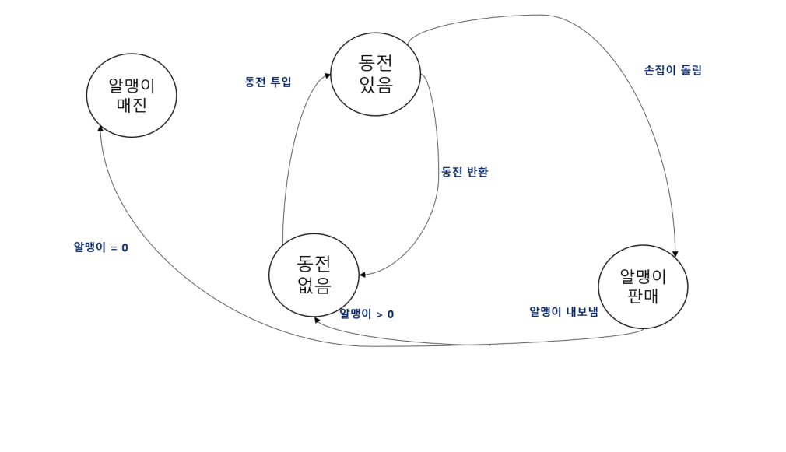
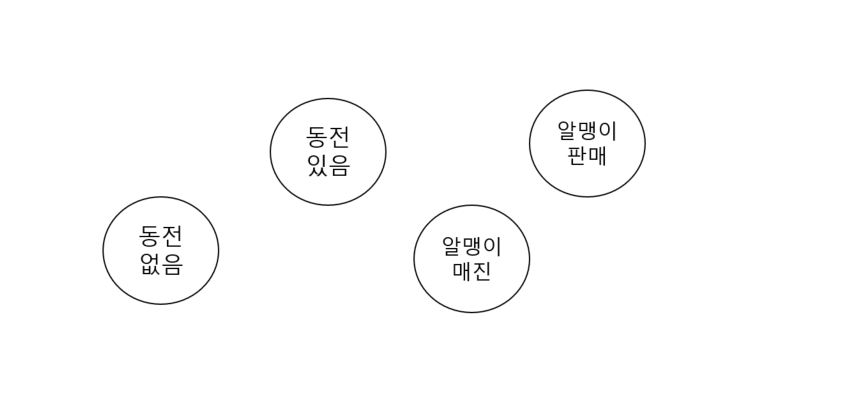

# 31일차 : 2023-09-11 (p.415~427)

## 요약

**객체의 상태 바꾸기 - 상태 패턴**

**최첨단 뽑기 기계**



**상태 기계 기초 지식 알아보기**



총 4개의 상태

현재 상태를 저장하는 인스턴스 변수를 만들고 각 상태의 값을 정의한다.

```java
final static int SOLD_OUT = 0;
final static int NO_QUARTER = 1;
final static int HAS_QUARTER = 2;
final static int SOLD = 3;

int state = SOLD_OUT; // 현재 상태를 저장하는 인스턴스 변수
```

- 알맹이 매진 : SOLD_OUT
- 동전 없음 : NO_QUARTER
- 동전 있음 : HAS_QUARTER
- 알맹이 판매 : SOLD

시스템에서 일어 날 수 있는 모든 행동

- 동전 투입
- 동전 반환
- 손잡이 돌림
- 알맹이 내보냄

상태 별로 작업을 처리하는 메소드

```java
public void insertQuarter() {
	 if(state == HAS_QUARTER) {
			System.out.println("동전은 한 개만 넣어주세요.");
	}else if (state == NO_QUARTER) {
			state = HAS_QUARTER
			System.out.println("동전이 투입 되었습니다.");
	}else if(state == SOLD_OUT) {
			System.out.println("매진되었습니다. 다음 기회에 이용해주세요");
	}else if(state == SOLD) {
			System.out.println("알맹이를 내보내고 있습니.");
	}

}
```

**뽑기 기계 코드 만들기**

```java
public class GumballMachine {
    final static int SOLD_OUT = 0;
    final static int NO_QUARTER = 1;
    final static int HAS_QUARTER = 2;
    final static int SOLD = 3;

    int state = SOLD_OUT;
    int count = 0;

    public GumballMachine(int count) {
        this.count = count;
        if(count > 0){
            state = NO_QUARTER;
        }
    }

    public void insertQuarter() {
        if (state == HAS_QUARTER) {
            System.out.println("동전은 한 개만 넣어 주세요.");
        } else if (state == NO_QUARTER) {
            state = HAS_QUARTER;
            System.out.println("동전을 넣으셨습니다.");
        } else if (state == SOLD_OUT) {
            System.out.println("매진 되었습니다. 다음 기회에 이용해 주세요.");
        } else if (state == SOLD) {
            System.out.println("알맹이를 내보내고 있습니다.");
        }
    }

    public void ejectQuarter() {
        if (state == HAS_QUARTER) {
            System.out.println("동전이 반환됩니다.");
        } else if (state == NO_QUARTER) {
            state = HAS_QUARTER;
            System.out.println("동전을 넣어주세요");
        } else if (state == SOLD_OUT) {
            System.out.println("동전을 넣지 않으셨습니다. 동전이 반환되지 않습니다.");
        } else if (state == SOLD) {
            System.out.println("이미 알맹이를 뽑으셨습니다.");
        }
    }

    public void turnCrank() {
        if (state == HAS_QUARTER) {
            System.out.println("손잡이를 돌리셨습니다.");
            state = SOLD;
            dispense();
        } else if (state == NO_QUARTER) {
            state = HAS_QUARTER;
            System.out.println("동전을 넣어주세요");
        } else if (state == SOLD_OUT) {
            System.out.println("매진되었습니다.");
        } else if (state == SOLD) {
            System.out.println("손잡이는 한 번만 돌려주세요");
        }
    }

    private void dispense() {
        if (state == HAS_QUARTER) {
            System.out.println("알맹이를 내 보낼수 없습니다.");
        } else if (state == NO_QUARTER) {
            System.out.println("동전을 넣어주세요");
        } else if (state == SOLD_OUT) {
            System.out.println("매진입니다.");
        } else if (state == SOLD) {
            System.out.println("알맹이를 내보내고 있습니다.");
            count--;
            if (count ==0) {
                System.out.println("더 이상 알맹이가 없습니다");
                state = SOLD_OUT;
            }
        }
    }
}
```

**뽑기 기계 코드 수정 요청**

10분의 1 확률로 보너스 알맹이를 받을 수 있는 요청 사항 추가

**요청 사항 살펴보기**

```java
final static int SOLD_OUT = 0;
final static int NO_QUARTER = 1;
final static int HAS_QUARTER = 2;
final static int SOLD = 3;
// WINNER 상태 추가하기  (당첨 된 사실)

public void insertQuarter() {
	// 동전이 들어 올 때 해야할 일
}

public void ejectQuarter() {
	// 동전을 반환 할 때 해야 할 일
}

public void turnCrank() {
	// 손잡이가 돌아갔을 때 해야 할 일
}

private void dispense() {
	//  알맹이를 내 보낼 때 해야 할 일
}
```

새로 추가된 WINNER 상태를 확인하는 조건문을

만들었던 모든 메소드에 추가해야 한다.

- 관리와 수정하기 편하게 코드를 리팩토링해야 한다.
- “바뀌는 부분을 캡슐화한다” 원칙을 지켜야 한다.
- 상태와 행동을 별도의 클래스에 넣어 두고 모든 상태에서 각각 자기가 할 일을 구현하도록 하자