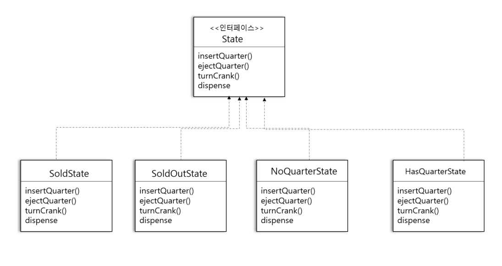

# 32일차 : 2023-09-12 (p.428 ~ 439)

## 요약

**새로운 디자인 구상하기**

기존 코드를 그대로 활용하는 대신 상태 객체들을 별도의 코드에 넣고, 어떤 행동이 일어나면 현재 상태 객체에서 필요한 작업을 처리하게 한다.

- 뽑기 기계와 관련된 모든 행동에 관한 메소드가 들어있는 State 인터페이스를 정의해야 한다.
- 기계의 모든 상태를 대상으로 상태 클래스를 구현해야 한다. 기계가 어떤 상태에 있다면, 그 상태에  해당하는 상태 클래스가 모든 작업을 책임져야 한다.
- 조건문 코드를 전부 없애고 상태 클래스에 모든 작업을 위임한다.

**State 인터페이스 및 클래스 정의하기**



**State 클래스 구현하기**

```java
public class NoQuarterState implements State {
    GumballMachine gumballMachine;
    public NoQuarterState(GumballMachine gumballMachine) {
        this.gumballMachine =gumballMachine;
    }

    @Override
    public void insertQuarter() {
        System.out.println("동전을 넣으셨습니다.");
        gumballMachine.setState(gumballMachine.getHasQuarterState());
    }

    @Override
    public void ejectQuarter() {
        System.out.println("동전을 넣어 주세요");
    }

    @Override
    public void turnCrank() {
        System.out.println("동전을 넣어 주세요");
    }

    @Override
    public void dispense() {
        System.out.println("동전을 넣어 주세요");
    }

    
}
```

**뽑기 기계 코드 수정하기**

정적 정수 변수를 사용하던 기존의 코드를

새로 만든 클래스를 사용하는 방식으로 수정하자.

**뽑기 기계 전체 코드 살펴보기**

```java
public class GumballMachine {
    State soldOutState;
    State noQuarterState;
    State hasQuarterState;
    State soldState;

    State state;
    int count = 0;

    public GumballMachine(int numberGumballs) {
        soldOutState = new SoldOutState(this);
        noQuarterState = new NoQuarterState(this);
        hasQuarterState = new HasQuarterState(this);
        soldState = new SoldState(this);
        this.count = numberGumballs;

        if (numberGumballs > 0) {
            state = noQuarterState;
        }else {
            state = soldOutState;
        }
    }

    public void insertQuarter() {
        state.insertQuarter();
    }

    public void ejectQuarter(){
        state.ejectQuarter();
    }

    public void turnCrank() {
        state.turnCrank();
        state.dispense();
    }

    public void setState(State state) {
        this.state = state;
    }

    void releaseBall() {
        System.out.println("알맹이를 내보내고 있습니다.");
        if (count > 0) {
            count = count - 1;
        }
    }
}
```

**다른 상태 클래스 구현하기**

```java
public class HasQuarterState implements State { 
    GumballMachine gumballMachine;
    public HasQuarterState(GumballMachine gumballMachine) {
        this.gumballMachine =gumballMachine;
    }

    @Override
    public void insertQuarter() {
        System.out.println("동전은 한 개만 넣어주세요");
    }

    @Override
    public void ejectQuarter() {
        System.out.println("동전이 반환됩니다.");
        gumballMachine.setState(gumballMachine.getNoQuarterState());

    }

    @Override
    public void turnCrank() {
        System.out.println("손잡이를 돌리셨습니다.");
        gumballMachine.setState(gumballMachine.getSoldState());
    }

    @Override
    public void dispense() {
        System.out.println("알맹이를 내보낼 수 없습니다.");
    }
    
}
```

**뽑기 기계 구조 다시 살펴보기**

구현을 구조적으로 바꾸었다.

- 각 상태의 행동을 별개의 클래스로 국지화햇다.
- 관리하기 힘든 골칫 덩어리 if 선언문들을 없앴다.
- 각 상태를 변경에는 닫혀 있게 하고, 새로운 상태 클래스를 추가하는 확장에는 열려있도록 고쳤다.