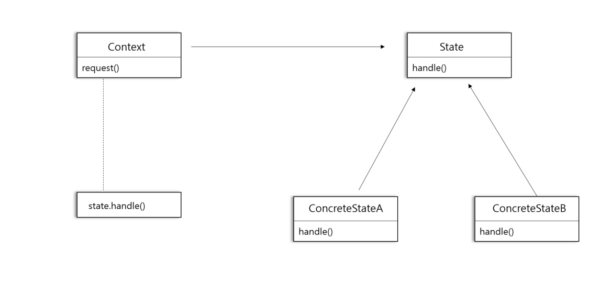
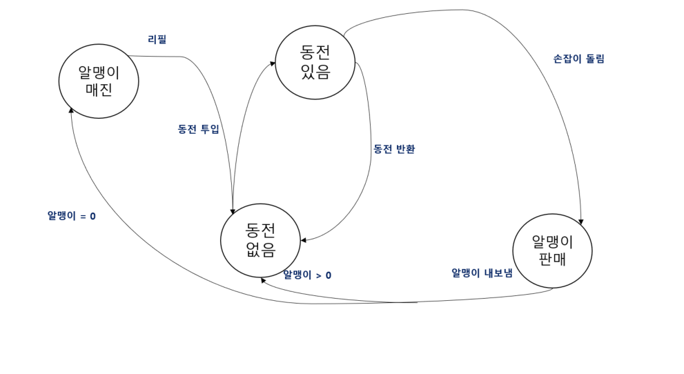

# 33일차 : 2023-09-13 (p.440 ~ 454)

## 요약

**상태 패턴의 정의**

<aside>
💡 **상태 패턴(State Pattern)** 을 사용하면 객체의 내부 상태가 바뀜에 따라서 객체의 행동을 바꿀 수 있습니다. 마치 객체의 클래스가 바뀌는 것과 같은 결과를 얻을 수 있다.

</aside>

이 패턴은 상태를 별도의 클래스로 캡슐화한 다음 현재 상태를 나타내는 객체에게 행동을 위임하므로 내부 상태가 바뀔 때 행동이 달라지게 된다.

‘클래스가 바뀌는 것 같은’ 결과를 얻는다는 게 무엇을 뜻하는 걸까?

클라이언트 관점에서 지금 사용하는 객체의 행동이 완전히 달라진다면 마치 그 객체가

다른 클래스로부터 만들어진 객체처럼 느낀다. 물론 실제로 다른 클래스로 변신하는 게 아니라 구성으로 여러 상태 객체를 바꿔 가면서 사용한다.



- State 인터페이스는 모든 구상 상태 클래스의 공통 인터페이스를 정의한다. 모든 상태 클래스에서 같은 인터페이스를 구현하므로 바꿔 가면서 쓸 수 있다.
- Context 클래스에는 여러 가지 내부 상태가 들어있을 수 있다.
- Context 의 request() 메소드가 호출되면 그 작업은 상태 객체에게 맡겨진다.

**상태 패턴과 전략 패턴**

상태 패턴

- 상태 패턴을 사용할 때는 상태 객체에 일련의 행동이 캡슐화된다.
- 상황에 따라 Context 객체에서 여러 상태 객체 중 한 객체에게 모든 행동을 맡기게 된다.
- 객체의 내부 상태에 따라 현재 상태를 나타내는 객체가 바뀌게 되고, 그 결과로 Context 객체의 행동도 자연스럽게 바뀌게 된다.
- 클라이언트는 상태 객체를 몰라도 된다.

전략 패턴

- 전략 패턴을 사용할 때는 일반적으로 클라이언트가 Context 객체에게 어떤 전략 객체를 사용할 지를 지정 해준다.
- 전략 패턴은 주로 실행 시에 전략 객체를 변경할 수 있는 유연성을 제공하는 용도로 쓰인다.
- 일반적으로 전략 패턴은 서브클래스를 만드는 방법을 대신해서 유연성을 극대화하는 용도로 쓰인다.
- 상속을 사용해서 클래스의 행동을 정의하다 보면 행동을 변경해야 할 때 마음대로 변경하기가 힘들다.
- 전략 패턴을 사용하면 구성으로 행동을 정의하는 객체를 유연하게 바꿀 수 있다.

Context 객체에 수많은 조건문을 넣는 대신에 상태 패턴을 사용한다고 생각하면 된다.

행동을 상태 객체 내에 캡슐화하면 Context 내의 상태 객체를 바꾸는 것만으로도 Context 객체의 행동을 바꿀 수 있다.

**보너스 알맹이 당첨 기능 추가하기**

```java
public class GumballMachine {
    State soldOutState;
    State noQuarterState;
    State hasQuarterState;
    State soldState;
    State winnerState;

		State state;
    int count = 0;
		// 메소드 ....
}
```

WinnerState 클래스

```java

public class WinnerState implements State{
	   // 인스턴스 변수 및 생성자
		//  insertQuarter 오류 메시지
		// ejectQuarter 오류 메시지
		// turnCrank 오류 메시지

    @Override
    public void dispense() {
        gumballMachine.releaseBall();
        if (gumballMachine.getCount() == 0) {
            gumballMachine.setState(gumballMachine.getSoldOutState());
        }else {
            gumballMachine.releaseBall();
            System.out.println("축하합니다! 알맹이를 하나 더 받을 수 있습니다.");
            if (gumballMachine.getCount() > 0) {
                gumballMachine.setState(gumballMachine.getNoQuarterState());
            }else {
                System.out.println("더 이상 알맹이가 없습니다.");
                gumballMachine.setState(gumballMachine.getSoldOutState());
            }
        }

    }
}
```

10% 확률로 당첨 여부를 결정해서 뽑기 기계의 상태를 WinnerState로 전환하는 기능 추가

```java
public class HasQuarterState implements State {
    Random randomWinner =  new Random(System.currentTimeMillis());
    GumballMachine gumballMachine;
    public HasQuarterState(GumballMachine gumballMachine) {
        this.gumballMachine =gumballMachine;
    }

    @Override
    public void insertQuarter() {
        System.out.println("동전은 한 개만 넣어주세요");
    }

    @Override
    public void ejectQuarter() {
        System.out.println("동전이 반환됩니다.");
        int winner = randomWinner.nextInt(10);
        if (winner == 0 && gumballMachine.getCount() > 1) {
            gumballMachine.setState(gumballMachine.getWinnerState());
        }else {
            gumballMachine.setState(gumballMachine.getSoldState());
        }
        gumballMachine.setState(gumballMachine.getNoQuarterState());

    }

    @Override
    public void turnCrank() {
        System.out.println("손잡이를 돌리셨습니다.");
        gumballMachine.setState(gumballMachine.getSoldState());
    }

    @Override
    public void dispense() {
        System.out.println("알맹이를 내보낼 수 없습니다.");
    }

}
```

**리필 기능 추가해보기**



뽑기 기계가 매진 상태에 있을 때 알맹이를 리필하는 방법이 필요하다.

## 발췌

> 상태 패턴을 사용하면 내부 상태를 바탕으로 여러 가지 서로 다른 행동을 사용할 수 있다.
>

> 상태 패턴을 사용하면 프로시저형 상태 기계를 쓸 때와는 달리 각 상태를 클래스로 표현한다.
>

> Context 객체는 현재 상태에게 행동을 위임한다.
>

> 각 상태를 클래스로 캡슐화해서 나중에 변경해야 하는 내용을 국지화할 수 있다.
>

> 상태 패턴과 전략 패턴의 클래스 다이어그램은 똑같지만 그 용도는 다르다.
>

> 전략 패턴에서 Context 클래스를 만들 때  행동과 알고리즘을 설정한다.
>

> 상태 패턴을 사용하면 Context 의 내부 상태가 바뀜에 따라 객체가 알아서 행동을 바꿀 수 있도록 할 수 있다.
>

> 상태 전환은 State 클래스로 제어할 수도 있고, Context 클래스로 제어할 수도 있다.
>

> 상태 패턴을 쓰면 디자인에 필요한 클래스의 개수가 늘어난다.
>

> State 클래스를 여러 Context 객체의 인스턴스에서 공유하도록 디자인할 수도 있다.
>