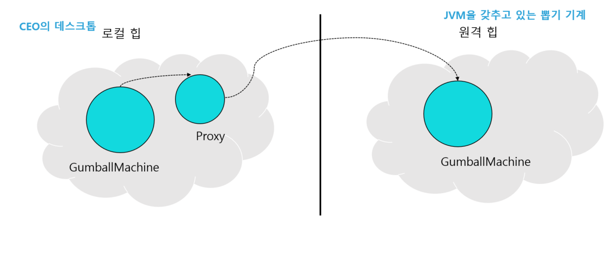
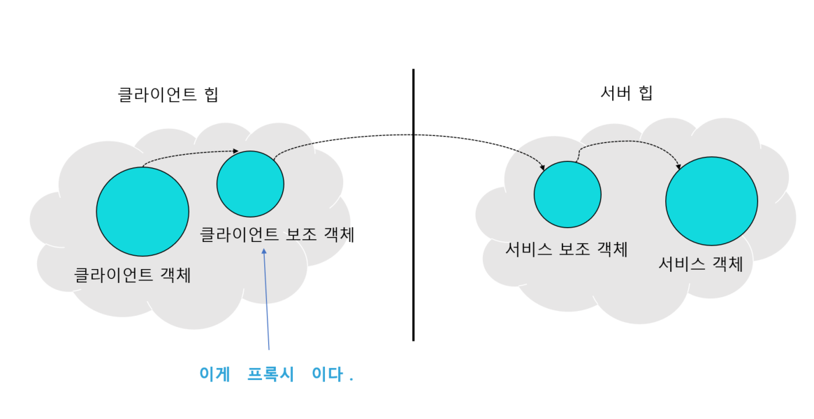
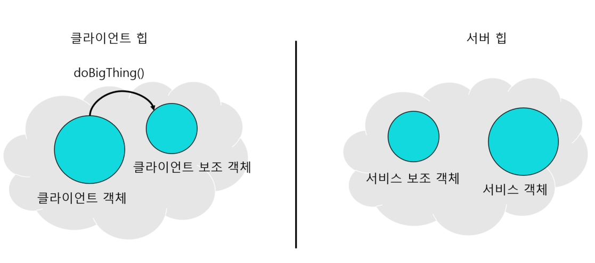
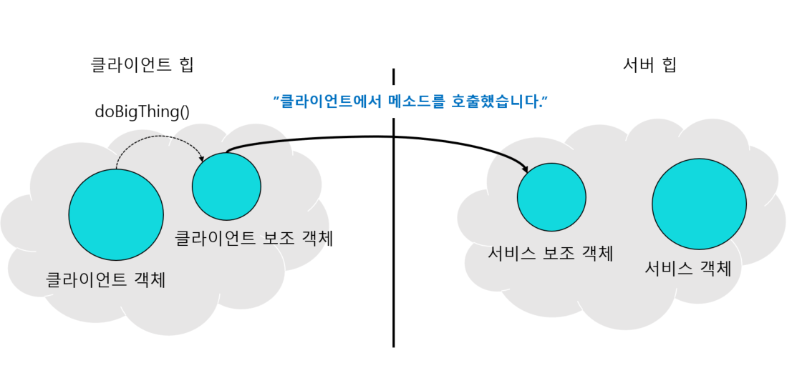
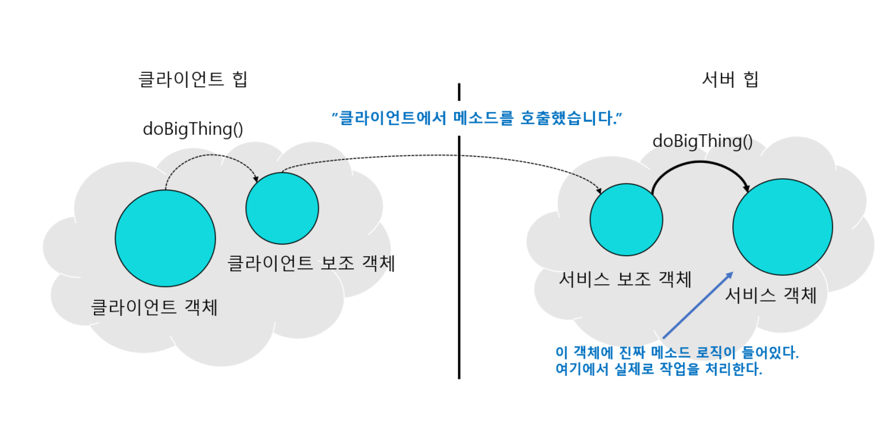
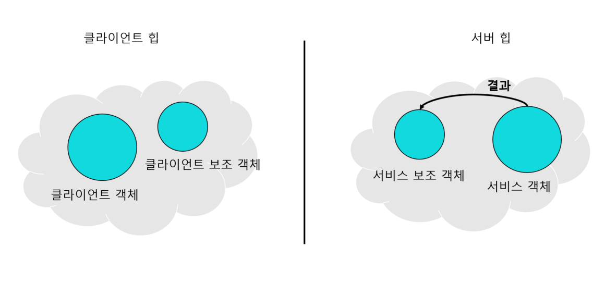
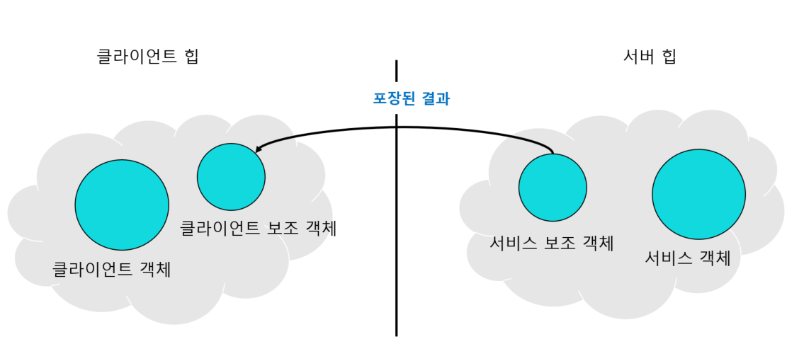
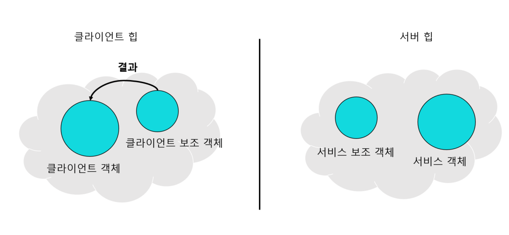
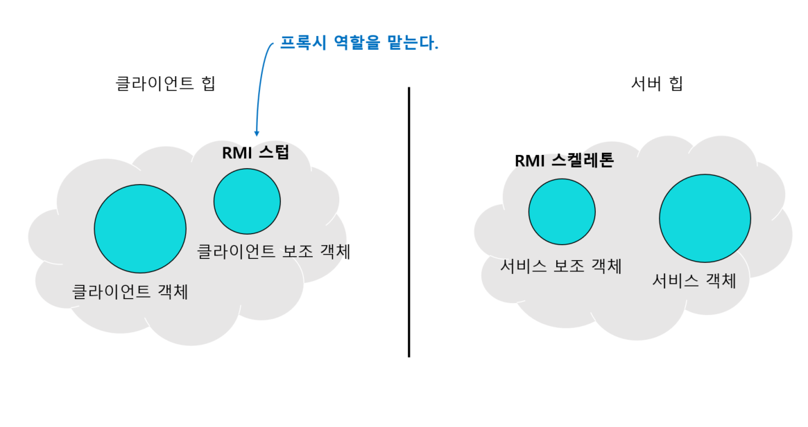

# 35일차 : 2023-09-15 (p.464~474)

## 요약

**원격 프록시의 역할**

원격 프록시는 원격 객체의 **로컬 대변자 역할**을 한다.

원격 객체란, 다른 자바 가상 머신의 힙에서 살고 있는 객체를 뜻한다.

로컬 대변자는 로컬 대변자의 어떤 메소드를 호출하면, 다른 원격 객체에게 그 메소드 호출을 전달해주는 객체를 말한다.



- 프록시는 원격 객체처럼 보이지만, 실은 진짜 객체의 탈을 쓰고 있을 뿐이다.
- GumballMonitor 가 클라이언트 객체에 해당한다. 클라이언트는 진짜 뽑기 기계와 얘기하고 있다고 생각하겠지만 사실 프록시와 얘기하고 있다. 네트워크로 진짜 뽑기 기계와 얘기하는 일은 프록시가 대신해준다.

> 클라이언트 객체는 원격 객체의 메소드 호출을 하는 것처럼 행동한다. 하지만 실제로는 로컬 힙에 들어있는 “프록시” 객체의 메소드를 호출하고 있다. 네트워크 통신과 관련된 저수준 작업은 이 프록시 객체에서 처리해준다.
>

**모니터링 코드에 원격 프록시 추가하기**

다른 JVM에 들어있는 객체의 메소드를 호출하는 프록시를 어떻게 만들어야 할까??

다음과 같은 방법으로 다른 힙에 들어있는 객체 레퍼런스를 가져 올 수는 없다.

```java
Duck d = <다른 힙에 있는 객체>
```

변수 d가 어떤 객체를 참조하든, 그 객체는 선언문이 들어있는 코드와 같은 힙 공간에 있어야만 한다.

어떻게 해야할까?

자바의 **원격 메소드 호출(RMI , Remote Method Invocation)** 을 사용해야 한다.

RMI를 사용하면 원격 JVM에 있는 객체를 찾아서 그 메소드를 호출할 수 있다.

**원격 메소드의 기초**



- 클라이언트 객체는 진짜 서비스의 메소드를 호출한다고 생각한다.  클라이언트 보조 객체에서 자신이 원하는 작업을 처리한다고 생각한다.
- 클라이언트 보조 객체는 진짜 서비스인 척 하고 있지만, 실제로는 진짜 객체의 프록시 일 뿐이다.
- 서비스 보조 객체는 클라이언트 보조 객체로부터 요청을 받는다. 받은 요청을 해석해서 진짜 서비스에 있는 메소드를 호출한다.
- 서비스 객체가 진짜 서비스이다. 실제로 작업을 처리하는 메소드가 들어있다.

**메소드 호출 과정 알아보기**

- 클라이언트 객체에서 클라이언트 보조 객체의 doBigThing() 을 호출한다.




- 클라이언트 보조 객체는 메소드 호출 정보(인자, 메소드 이름 등)를 잘 포장해서 네트워크로 서비스 보조 객체에게 전달한다.


- 서비스 보조 객체는 클라이언트 보조 객체로부터 받은 정보를 해석해서 어떤 객체의 어떤 메소드를 호출할지 알아낸 다음 진짜 서비스 객체의 메소드를 호출한다.




- 서비스 객체의 메소드 실행이 끝나면 서비스 보조 객체에 어떤 결과가 리턴된다.




- 서비스 보조 객체는 호출 결과로 리턴된 정보를 포장해서 네트워크로 클라이언트 보조 객체에게 전달한다.



- 클라이언트 보조 객체는 리턴된 정보를 해석해서 클라이언트 객체에게 리턴한다. 클라이언트 객체는 메소드 호출이 어디로 전달되었는지, 어디에서 리턴되었는지 전혀 알 수 없다.




**자바 RMI 의 개요**

RMI는 우리 대신 클라이언트와 서비스 보조 객체를 만들어준다.

보조 객체에는 원격 서비스와 똑같은 메소드가 들어있다.  RMI를 사용하면 네트워킹 및 입출력 관련 코드를 직접 작성하지 않아도 된다.

클라이언트는 그냥 같은 로컬 JVM에 있는 메소드를 호출하듯이 원격 메소드(진짜 서비스 객체에 있는 메소드)를 호출할 수 있다.

또한 클라이언트가 원격 객체를 찾아서 접근할 때 쓸 수 있는 룩업 서비스도 RMI에서 제공한다.

RMI와 로컬 메소드 호출의 차이점도 있다.

클라이언트는 로컬 메소드 호출과 똑같은 식으로 메소드를 호출하지만,

실제로는 클라이언트 보조 객체가 네트워크로  호출을 전송해야 하므로 네트워킹 및 입출력 기능이 반드시 필요하다는 것이 차이점이다.

네트워킹이나 입출력 기능을 쓸 때는 문제가 발생할 위험이 따르므로 클라이언트에서 항상 예상치 못한 상황을 대비하고 있어야 한다.

※ **RMI 용어** : RMI 에서 클라이언트 보조 객체는 **스텁(stub)** , 서비스 보조 객체는 **스켈레톤(skeleton)**이라고 부른다.



**원격 서비스 만들기**

1단계 :**원격 인터페이스 만들기**

: 원격 인터페이스는 클라이언트가 원격으로 호출 할 메소드를 정의한다. 클라이언트에서 이 인터페이스를 서비스의 클래스 형식으로 사용한다. 스텁과 실제 서비스에 이 인터페이스를 구현해야 한다.

2단계 : **서비스 구현 클래스 만들기**

: 실제 작업을 처리하는 클래스이다. 원격 메소드를 실제로 구현한 코드가 들어있는 부분이다.

나중에 클라이언트에서 이 객체에 있는 메소드를 호출한다.

3단계 : **RMI 레지스트리(rmiregistry) 실행하기**

: rmiregistry는 전화번호부와 비슷하다고 보면 된다. 클라이언트는 이 레지스트리로부터 프록시를 받아 간다.

4단계 : **원격 서비스 실행하기**

: 서비스 객체를 실행해야 한다. 서비스를 구현한 클래스에서 서비스의 인스턴스를 만들고 그 인스턴스를 RMI 레지스트리에 등록한다.

**1단계 : 원격 인터페이스 만들기**

- **java.rmi.Remote를 확장한다.**

    ```java
    public interface MyRemote extends Remote {
    ```

- **모든 메소드를 RemoteException을 던지도록 선언한다.**

  : 클라이언트는 서비스 원격 인터페이스 형식으로 선언해서 사용한다.  즉, 클라이언트는 원격 인터페이스르 구현하는 스텁의 메소드를 호출한다.

  그런데 스텁이 각종 입출력 작업을 처리할 때 네트워크 등에 안 좋은 일이 일어 날 수 있다. 따라서 클라이언트는 원격 예외를 처리하거나 선언해서 안 좋은 일에 대비해야 한다.

  인터페이스를 정의할 때 모든 메소드에서 예외를 선언했다면, 인터페이스 형식의 레퍼런스에 관한 메소드를 호출하는 코드에서 반드시 그 예외를 처리하거나 선언해야 한다.

    ```java
    import java.rmi.*;
    
    public interface MyRemote extends Remote {
    	public String sayHello() throws RemoteException;
    }
    ```

- **원격 메소드의 인자와 리턴값은 반드시 원시 형식(primitive) 또는 Serializable 형식으로 선언한다.**

  :  원격 메소드의 인자는 모두 네트워크로 전달되어야 하며, 직렬화로 포장된다. 리턴값도 마찬가지다. 원시 형식이나 String 또는 API에서 많이 쓰이는 일반적인  형식을 사용하면 걱정하지 않아도 된다. 혹시 직접 만든 형식을 전달한다면, 클래스를 만들 때 Serializable 인터페이스도 구현해야 한다.

```java
public String sayHello() throws RemoteException;
```

**2단계 : 서비스 구현 클래스 만들기**

- 서비스 클래스에 원격 인터페이스를 구현한다.

```java
public class MyRemoteImpl extends UnicastRemoteObjcet implements MyRemote {
	public String sayHello() {
			return "Server says, 'Hey'";
	}
}
```

- UnicateRemoteObject를 확장한다.

  : 원격 서비스 객체 역할을 하려면 객체에 ‘원격 객체’ 기능을 추가해야 한다. 가장 간단한 방법은 UnicastRemoteObject 를 확장해서, 슈퍼클래스에서 제공하는 기능으로 처리하기이다.


```java
public class MyRemoteImple extends UnicastRemoteObjcet implements MyRemote {
	private static final long serialVersionUID = 1L;
```

- RemoteException을 선언하는 생성자를 구현한다.

  : 슈퍼 클래스 UnicastRemoteObject에는 생성자가 RemoteException을 던진다는 문제가 있다. 이 문제를 해결하려면 서비스를 구현하는 클래스에 RemoteException을 선언하는 생성자를 만들어야  한다.  어떤 클래스가 생성될 때  그 슈퍼클래스의 생성자도 반드시 호출되므로 슈퍼클래스 생성자가 어떤 예외를 던진다면 서브클래스의 생성자도 그 예외를 선언해야 한다는 사실을 기억하자

    ```java
    public MyRemoteImpl() throws RemoteException { }
    ```

- 서비스를 RMI 레지스트리에 등록한다.

  : 원격 서비스를 원격 클라이언트에서 쓸 수 있게 만들어야 한다. 인스턴스를 만든 다음 RMI 레지스트리에 등록하면 된다. 서비스를 구현한 객체를 등록하면 RMI 시스템은 레지스트리에 스텁만 등록한다. 클라이언트는 스텁만 필요하다. 서비스를 등록할 때는 java.rmi.Naming 클래스에 있는 rebind() 정적 메소드를 사용한다.

    ```java
    try {
    	MyRemote service = new MyRemoteImpl();
    }catch(Exception ex) {...}
    ```


**3단계 : rmiregistry 실행하기**

터미널을 새로 띄어서 rmiregistry를 실행한다. 클래스에 접근할 수 있는 디렉토리에서 실행해야 한다.

**4단계: 원격 서비스 실행하기**

다른 터미널을 열고 서비스를 실행한다.