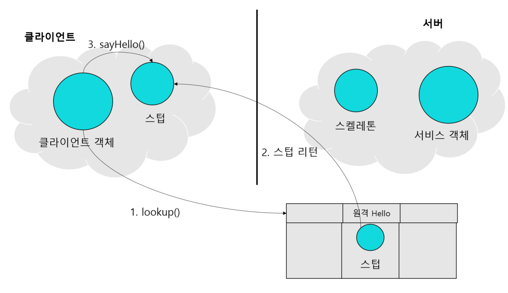
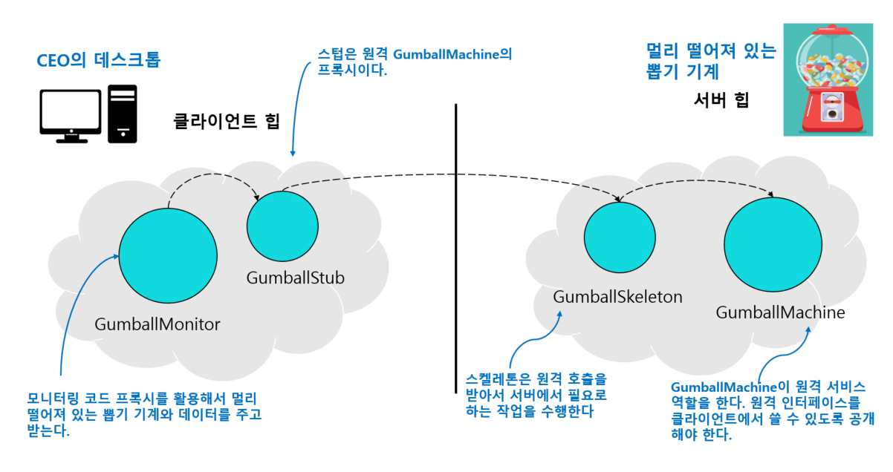
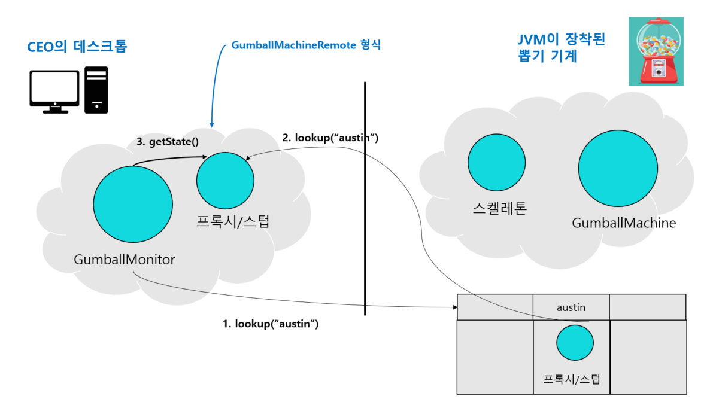
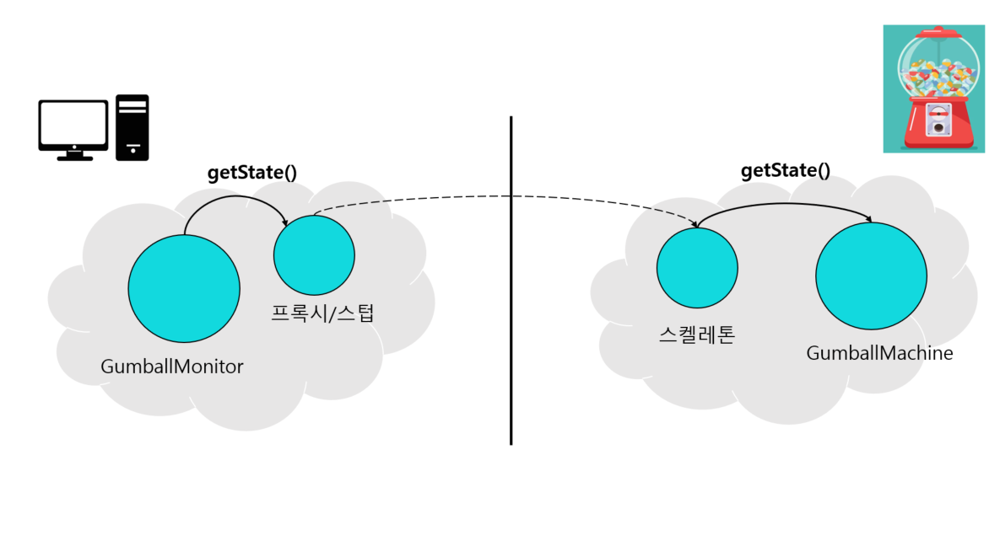
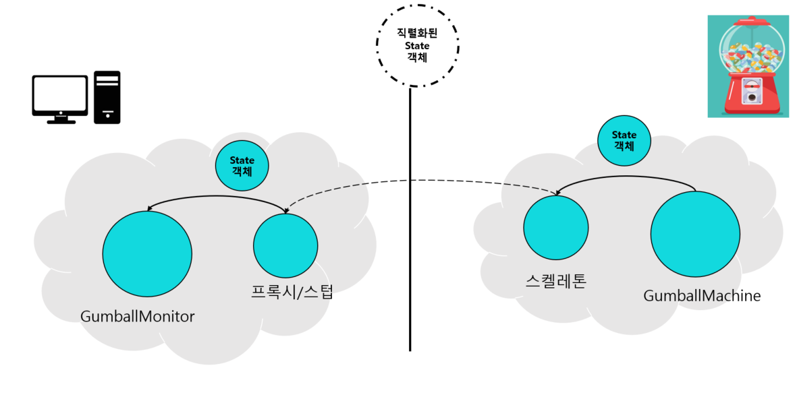

# 36일차 : 2023-09-16 (p.475 ~ 488)

## 요약

**서버에 필요한 코드 살펴보기**

원격 인터페이스

```java
public interface MyRemote extends Remote {
    
    public String sayHello() throws RemoteException;
}
```

원격 서비스를 구현한 클래스

```java
public class MyRemoteImpl extends UnicastRemoteObject implements MyRemote {
    private static final long serialVersionUID = 1L;

    @Override
    public String sayHello() throws RemoteException {
        return "Server says , 'Hey' ";
    }

    public MyRemoteImpl() throws RemoteException {
    }

    public static void main(String[] args) {
        try {
            MyRemote service = new MyRemoteImpl();
            Naming.rebind("RemoteHello",service);
        }catch (Exception ex) {
            ex.printStackTrace();
        }
    }
}
```

- 슈퍼클래스 생성자 (UnicastRemoteObject)  에서 예외를 선언하므로 반드시 생성자 코드를 작성해야 한다. 생성자에서 위험 요소가 있는 코드를 호출해야 하니깐
- 원격 객체의 인스턴스를 만들고 Naming.rebind() 정적 메소드를 써서 rmiregistry에 결합한다. 클라이언트에서 RMI 레지스트리로 서비스를 검색할 때는 여기에서 지정한 이름을 사용한다.



**작동 방식**

- 클라이언트에서 RMI 레지스트리를 룩업한다.

    ```java
    Naming.lookup("rmi://127.0.0.1/RemoteHello");
    ```

- RMI 레지스트리에서 스텁 객체를 리턴한다. 스텁 객체는 lookup() 메소드의 리턴 값으로 전달되며, RMI에서는 그 스텁을 자동으로 역직렬화한다. 이때 스텁 클래스는 반드시 클라이언트에만 있어야 한다. 그 클래스가 없으면 역직렬화를 할 수 없다.
- 클라이언트는 스텁의 메소드를 호출한다. 스텁이 진짜 서비스 객체라고 생각한다.

**클라이언트 코드 살펴보기**

```java
public class MyRemoteClient {
    public static void main(String[] args) {
        new MyRemoteClient().go();
    }

    private void go() {
        try {
            MyRemote service = (MyRemote) Naming.lookup("rmi://127.0.0.1/RemoteHello");
            String s = service.sayHello();

            System.out.println(s);
        }catch (Exception ex){
            ex.printStackTrace();
        }
    }
}
```

**뽑기 기계용 원격 프록시 고민하기**




**GumballMachine 클래스를 원격 서비스로 바꾸기**

원격 프록시를 쓸 수 있도록 코드를 바꿀 때 가장 먼저 할 일은 GumballMachine 클래스를

클라이언트로부터 전달된 원격 요청을 처리하도록 바꾸기이다.

즉, 서비스를 구현한 클래스로 만들어야 한다.

- GumballMachine 의 원격 인터페이스를 만든다. 이 인터페이스는 원격 클라이언트에서 호출할 수 있는 메소드를 정의한다.
- 인터페이스의 모든 리턴 형식을 직렬화할 수 있는지 확인한다.
- 구상 클래스에서 인터페이스를 구현한다.

```java
public interface GumballMachineRemote extends Remote {
    public int getCount() throws RemoteException;
    public String getLocation() throws  RemoteException;
    public State getState() throws RemoteException;
}
```

State  클래스는 직렬화할 수 없는 리턴 형식으로 되어있다.

```java
public interface State extends Serializable {
    public void insertQuarter();
    public void ejectQuarter();
    public void turnCrank();
    public void dispense();
}     
```

모든 state 객체에는 뽑기 기계의 메소드를 호출하거나 상태를 변경할 때 사용하는 뽑기 기계의 레퍼런스가 들어있다. 하지만 State 객체가 전송될 때 GumballMachine 클래스도 전부 직렬화해서 같이 보내는 일은 별로 바람직하지 않다.

```java
public class NoQuarterState implements State{
    private static final long serialVersionUID = 2L;
    transient GumballMachine gumballMachine;

		// 기타 메소드
}
```

**RMI 레지스트리 등록하기**

```java
public class GumballMachineTestDrive {

    public static void main(String[] args) {
        GumballMachineRemote gumballMachine = null;
        int count;
        
        if (args.length <2){
            System.out.println("GumballMachine <name> <inventory>");
            System.exit(1);
        }
        
        try {
            count = Integer.parseInt(args[1]);
            
            gumballMachine =  new GumballMachine(args[0],count);
            Naming.rebind("//" + args[0] +"/gumballmachine" , gumballMachine);
        }catch (Exception e) {
            e.printStackTrace();
        }
    }
}
```

클라이언트가 찾을 수 있게 뽑기 기계를 RMI 레지스트리에 등록해야 한다.

**GumballMonitor 클라이언트 코드 고치기**

```java
public class GumballMonitor {
    GumballMachineRemote machine;

    public GumballMonitor(GumballMachineRemote machine) {
        this.machine = machine;
    }

    public void report() {
        try {
            System.out.println("뽑기 기계 위치 : " + machine.getLocation());
            System.out.println("현재 재고 :  " + machine.getCount() + "개");
            System.out.println("현재 상태 : " + machine.getState());
        } catch (RemoteException e) {
            throw new RuntimeException(e);
        }
    }
}
```

**프록시가 원격으로 일을 처리할 때까지**

모니터링을 시작하면 , GumballMonitor는 우선 뽑기 기계 원격 객체의 프록시를 가져온 다음

getState () 와 getCount(), getLocation()을 호출한다.




프록시의 getState()가 호출되면 프록시는 그 호출을 원격 서비스로 전달한다.  스켈레톤은 그 요청을 받아서 뽑기 기계에게 전달한다.




GumballMachine은 스켈레톤에게 상태를 리턴한다. 그러면 스켈레톤은 리턴값을 직렬화한 다음 네트워크로 프록시에게 전달한다. 프록시는 리턴값을 역직렬화해서 GumballMonitor에게 리턴한다.


