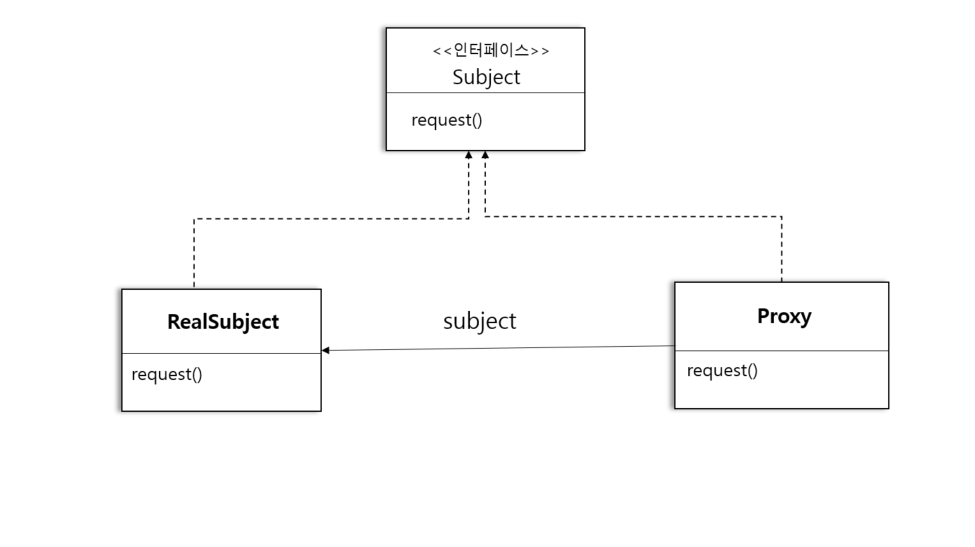
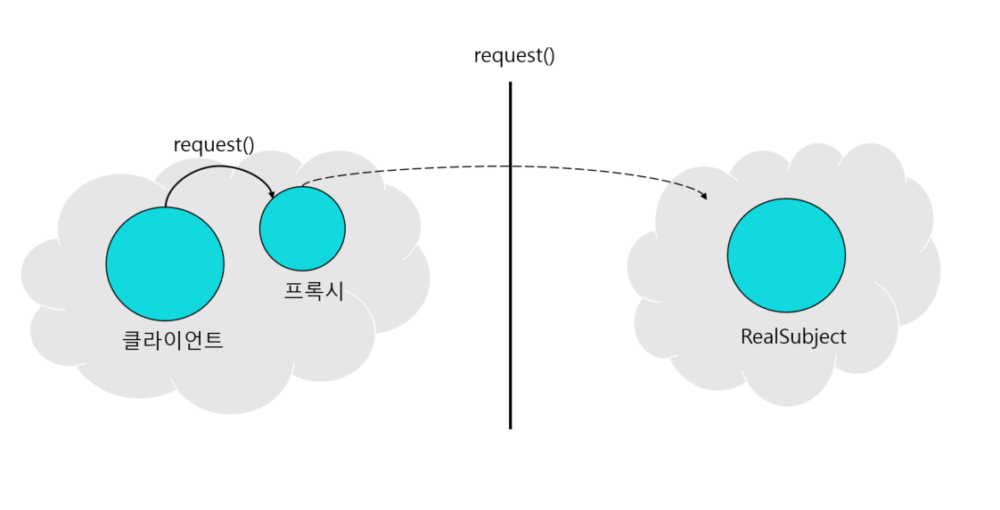
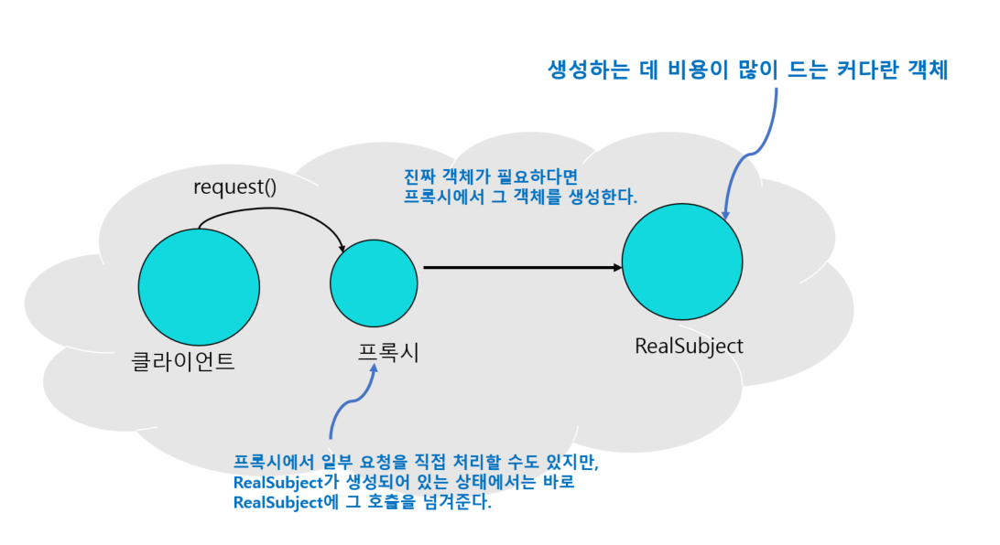
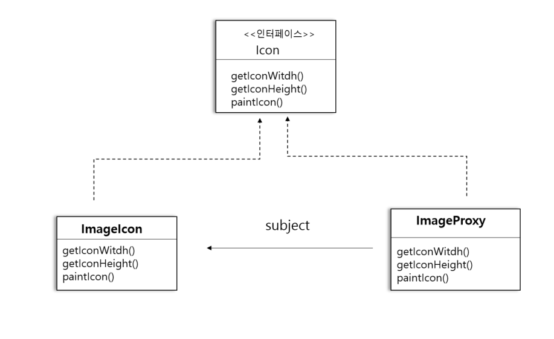

# 37일차 : 2023-09-18 (p.489 ~ 502)

## 요약

**프록시 패턴의 정의**

<aside>
💡 프록시 패턴(Proxy Pattern)은 특정 객체로의 접근을 제어하는 대리인을 제공한다.

</aside>

프록시는 다른 객체의 **대리인** 이라고 봐도 무방하다.

프록시에서 접근을 제어하는 몇 가지 방법

- 원격 프록시를 써서 원격 객체로의 접근을 제어할 수 있다.
- 가상 프록시(virtual proxy)를 써서 생성하기 힘든 자원으로의 접근을 제어할 수 있다.
- 보호 프록시(protection proxy)를 써서 접근 권한이 필요한 자원으로의 접근을 제어할 수 있다.



- Proxy 와 RealSubject 모두 Subject 인터페이스를 구현한다.
- RealSubject 는 진짜 작업을 대부분 처리하는 객체이다. Proxy는 그 객체로의 접근을 제어하는 객체이다.
- Proxy에는 진짜 작업을 처리하는 객체의 레퍼런스가 들어있다.  진짜 객체가 필요하면 그 레퍼런스를 사용해서 요청을 전달한다.

**원격 프록시와 가상 프록시 비교하기**

**원격 프록시**



다른 JVM에 들어있는 객체의 대리인에 해당하는 로컬 객체이다.

프록시의 메소드를 호출하면 그 호출이 네트워크로 전달되어 결국 원격 객체의 메소드가 호출된다.

그리고 그 결과는 다시 프록시를 거쳐서 클라이언트에게 전달된다.

**가상 프록시**




가상 프록시는 생성하는 데 많은 비용이 드는 객체를 대신한다.

진짜 객체가 필요한 상황이 오기 전까지 객체의 생성을 미루는 기능도 제공한다.

객체 생성 전이나 객체 생성 도중에 객체를 대신하기도 한다.

객체 생성이 끝나면 그냥 RealSubject에 직접 요청을 전달한다.

**앨범 커버 뷰어 만들기**

앨범 타이틀 메뉴를 만든 다음 이미지를 아마존 같은 온라인 서비스로부터 가져오면 꽤 편리할 것이다. 스윙을 사용한다면 아이콘을 만든 다음, 그 아이콘 객체로 하여금 네트워크로 이미지를 불러오도록 할 수 있다.

이 방법을 사용하면 네트워크의 상태와 인터넷 연결 속도에 따라 앨범 커버 이미지를 가져오는 데 시간이 걸릴 수 있으므로, 이미지를 불러오는 동안 화면에 뭔가 다른 걸 보여주면 좋다.

그리고 이미지를 기다리는 동안 애플리케이션 전체가 작동을 멈춰서도 안된다.

가상 프록시를 사용하면 이 2가지 조건을 간단하게 만족할 수 있다.

가상 프록시가 아이콘 대신 백그라운드에서 이미지를 불러오는 작업을 처리하고,

이미지를 완전히 가져오기 전까지는 “앨범 커버를 불러오는 중입니다. 잠시만 기다려 주세요. “ 와

같은 메시지를 보여 주면 되기 때문이다. 이미지 로딩이 끝나면 프록시는 아이콘 객체에게 모든 작업을 넘기면 된다.

**앨범 커버 가상 프록시 설계하기**



- 사용자 인터페이스에 이미지를 표시해 주는 Icon 인터페이스
- 이미지를 화면에 표시해 주는 ImageIcon 클래스
- 처음에는 화면에 간단한 메시지를 표시해 주다가, 이미지 로딩이 끝나면 디스플레이 작업을 ImageIcon 에 위임하는 프록시

**ImageProxy 작동 방법**

- ImageProxy는 ImageIcon을 생성하고 네트워크 URL로부터 이미지를 불러온다.
- 이미지를 가져오는 동안 “앨범 커버를 불러오는 중입니다. 잠시만 기다려 주세요.” 라는 메시지를 화면에 표시한다.
- 이미지 로딩이 끝나면 paintIcon() , getWidth() , getHeight() 를 비롯한 모든 메소드 호출을 이미지 아이콘 객체에게 넘긴다.
- 새로운 이미지 요청이 들어오면 프록시를 새로 만들고 위의 과정을 처음부터 다시 반복한다.

**ImageProxy 코드 만들기**

```java
public class ImageProxy implements Icon {
    volatile ImageIcon imageIcon;
    final URL imageURL;
    Thread retreivalThread;
    boolean retrieving =false;

    public ImageProxy(URL imageURL) {
        this.imageURL = imageURL;
    }

    @Override
    public void paintIcon(final Component c, Graphics g, int x, int y) {
        if (imageIcon !=null) {
            imageIcon.paintIcon(c,g,x,y);
        }else {
            g.drawString("앨범 커버를 불러오는 중입니다. 잠시만 기다려 주세요 " , x+300,y+190);
            if(!retrieving){
                retrieving = true;
                
                retreivalThread = new Thread(new Runnable() {
                    @Override
                    public void run() {
                        try {
                            setImageIcon(new ImageIcon(imageURL , "Album Cover"));
                        }catch (Exception e) {
                            e.printStackTrace();
                        }
                    }
                });
                retreivalThread.start();
            }
        }
    }

    @Override
    public int getIconWidth() {
        if (imageIcon != null) {
            return imageIcon.getIconWidth();
        }
        return 800;
    }

    @Override
    public int getIconHeight() {
        if (imageIcon != null) {
            return imageIcon.getIconHeight();
        }
        return 600;
    }
    
    synchronized void setImageIcon(ImageIcon imageIcon) {
        this.imageIcon = imageIcon;
    }
}
```

## 발췌

> 프록시 패턴을 사용하면 원격 객체라든가 생성하기 힘든 객체,  보안이 중요한 객체와 같은 다른 객체로의 접근을 제어하는 대리인 객체를 만들 수 있다.
>

