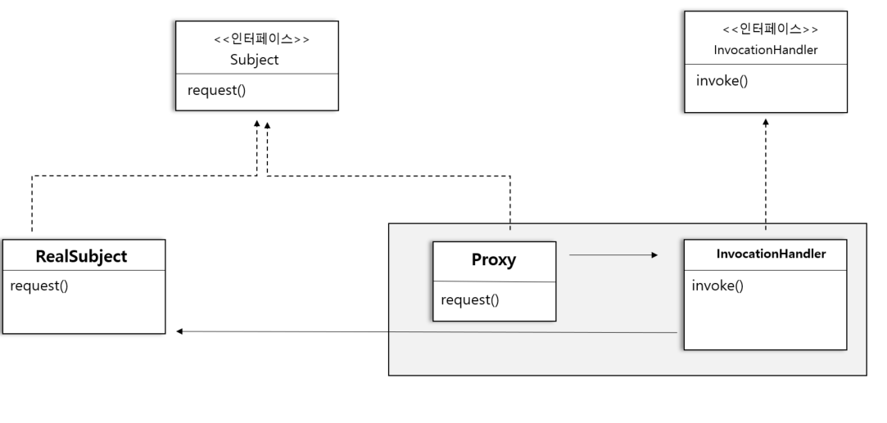

# 38일차 : 2023-09-19 (p.503 ~ 513)

## 요약

**보호 프록시 만들기**

자바의 java.lang.reflect 패키지 안에 프록시 기능이 내장되어 있다.

이 패키지를 사용하면 즉석에서 하나 이상의 인터페이스를 구현하고, 지정한 클래스에 메소드 호출을 전달하는 프록시 클래스를 만들 수 있다.

진짜 프록시 클래스는 실행 중에 생성되므로 이러한 자바 기술을 **동적 프록시(dynamic proxy)** 라고 부른다.

자바의 동적 프록시를 활용해서 보호 프록시를 만들어 보자



- 자바에서 Proxy 클래스가 Subject 인터페이스 전체를 구현한다.
- Proxy 객체의 모든 메소드 호출을 전달받는 InvocationHandler 를 제공해야 한다. InvocationHandler에서 RealSubject 객체에 있는 메소드로의 접근을 제어한다.

자바에서 Proxy 클래스를 생성해 주므로 Proxy 클래스에게 무슨 일을 해야 하는지 알려 줄 방법이 필요하다.

필요한 코드를 직접 구현하는 건 아니기 때문에 이전 처럼 코드를 프록시 클래스에 넣을 수는 없곺

InvocationHandler에 넣어야 한다.

**객체마을 데이팅 서비스**

객체마을 사람들의 제 짝을 찾아주는 데이팅 서비스를 만들어보자.

이 서비스는 어떤  사람의 정보를 설정하거나 가져올 수 있는 Person 인터페이스를 중심으로 돌아간다.

```java
public interface Person {
    String getName();
    String getGender();
    String getInterests();
    int getGeekRating();
    
    void setName(String name);
    void setGender(String gender);
    void setInterests(String interests);
    void setGeekRating(int rating);
}
```

**Person 인터페이스 코드 만들기**

```java
public class PersonImpl implements Person {
    String name;
    String gender;
    String interests;
    int rating;
    int ratingCount = 0;

    @Override
    public String getName() {
        return name;
    }

    @Override
    public String getGender() {
        return gender;
    }

    @Override
    public String getInterests() {
        return interests;
    }

    @Override
    public int getGeekRating() {
        if (ratingCount == 0 ) return 0;
        return (rating / ratingCount);
    }

    @Override
    public void setName(String name) {
        this.name =name;

    }

    @Override
    public void setGender(String gender) {
        this.gender = gender;

    }

    @Override
    public void setInterests(String interests) {
        this.interests = interests;
    }

    @Override
    public void setGeekRating(int rating) {
        this.rating += rating;
        ratingCount++;
    }
}
```

여기서

자기가 직접 자기 점수를 매긴다거나, 다른 고객의 정보를 마음대로 바꾸는 건 막아야 한다.

Person 인터페이스를 지금처럼 두면 클라이언트에서 아무 메소드나 마음대로 호출할 수 있을 것이다.

바로 이때, **보호 프록시(Protection Proxy)**를 사용해야 한다.

보호 프록시는 접근 권한을 바탕으로 객체로의 접근을 제어하는 프록시이다.

예를 들어, 회사 직원을 나타내는 객체가 있다면 일반 직원 객체에서 호출할 수 있는 메소드가 정해져 있고, 관리자 객체는 더 많은 메소드를 호출할 수 있고, 인사과 직원 객체는 모든 메소드를 호출할 수 있도록 만들어야 한다.

지금 만들고 있는 데이팅 서비스에는 고객이 자기 정보를 직접 수정할 수 있게 하면서도 다른 사람은 그 정보를 수정할 수 없게 해야한다.

그리고 반대로 선호도는 다른 고객만 점수를 매길 수 있고 자신은 점수를 매길 수 없게 해야 한다.

Person 에 있는 게터 메소드에는 남들이 보면 안 되는 정보를 제공하는 메소드는 따로 없으므로 그 게터 메소드는 누구든지 호출할 수 있도록 해도 된다.

**Person 인터페이스용 동적 프록시 만들기**

데이팅 서비스의 몇 가지 문제점을 해결해야 한다.

자기 괴짜 지수를 직접 조작할 수 없어야 하고, 다른 사람들의 개인 정보도 수정할 수 없도록 해야 한다.

이 문제를 해결하려면 2개의 프록시를 만들어야 한다.

하나는 본인의 Person 객체에 접근하는 프록시이고, 다른 하나는 다른 사람들의 Person 객체에 접근하는 프록시이다.

**1단계 : InvocationHandler 만들기**

2개의 호출 핸들러를 만들어야 한다.

하나는 본인용 핸들러, 다른 하나는 타인용 핸들러이다.

```java
public class OwnerInvocationHandler implements InvocationHandler {
    Person person;

    public OwnerInvocationHandler(Person person) {
        this.person = person;
    }

    @Override
    public Object invoke(Object proxy, Method method, Object[] args) throws IllegalAccessException {
        try {
            if (method.getName().startsWith("get")) {
                return method.invoke(person,args);
            } else if (method.getName().equals("setGeekRating")) {
                throw new IllegalAccessException();
            } else if (method.getName().startsWith("set")) {
                return method.invoke(person,args);
                
            }
        }catch (InvocationTargetException e) {
            e.printStackTrace();
        }
        return null;
    }
}
```

**2단계 : 동적 프록시 생성 코드 만들기**

동적으로 프록시 클래스를 생성하는 프록시 객체 인스턴스를 만들어야 한다.

우선 Person 객체를 인자로 받고 본인용 프록시를 만드는 메소드를 만들어 보자

다시 말해, 메소드 호출을 OwnerInvocationHandler에게 넘겨주는 프록시를 만드는 것이다.

```java
Person getOwnerProxy(Person person) {
	return (Person) Proxy.newProxyInstance(
            person.getClass().getClassLoader(),
            person.getClass().getInterfaces(),
            new OwnerInvocationHandler(person));
    )
}
```

- 이 메소드는 Person 객체를 인자로 받아오고 프록시를 리턴한다. 프록시의 인터페이스는 주제의 인터페이스와 똑같으므로 리턴 형식은 Person이 된다.
- Proxy 클래스에 있는 newProxyInstance 정적 메소드를 써서 프록시를 생성한다.
- person 의 클래스로더를 인자로 전달한다.
- 프록시에서 구현해야 하는 인터페이스도 인자로 전달해야 한다.
- 호출 핸들러인 OwnerInvocationHandler도 인자로 전달해야 한다.