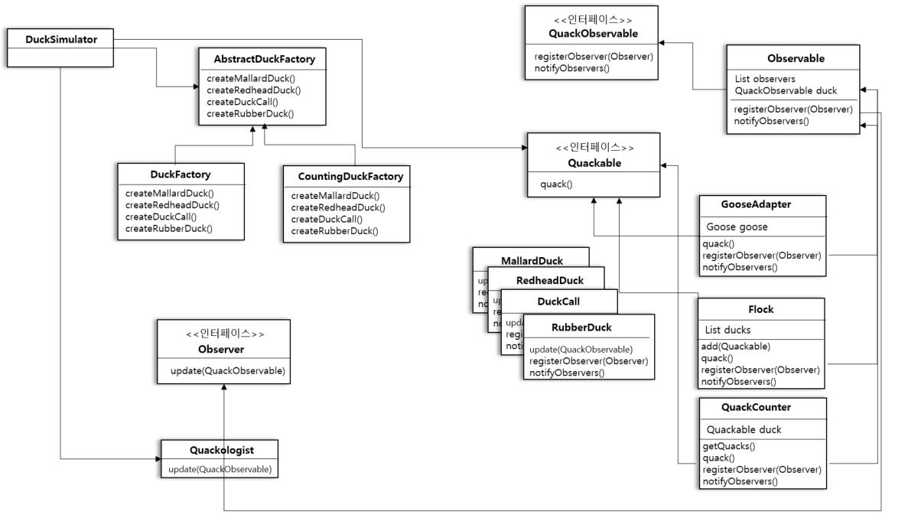

# 41일차 : 2023-09-22 (P.540 ~ 553)

## 요약

오리를 따로따로 관리하기가 힘들다.

일괄적으로 관리할 수 있는 방법이 없을까?

아래 코드는 관리하기 좋은 방법이 아니다.

```java
Quackable mallardDuck = duckFactory.createMallardDuck();
Quackable redheadDuck =duckFactory.createRedheadDuck();
Quackable duckCall = duckFactory.createDuckCall();
Quackable rubberDuck = duckFactory.createRubberDuck();
Quackable gooseDuck = new GooseAdapter(new Goose());

simulate(mallardDuck);
simulate(redheadDuck);
simulate(duckCall);
simulate(rubberDuck);
simulate(gooseDuck);
```

오리 무리를 만들어 보자

객체들로 구성된 컬렉션을 개별 객체와 같은 방식으로 다룰 수 있게 해 주는 컴포지트 패턴!

Quackable 무리를 다룰 때도 이 패턴을 활용하자

```java
public class Flock implements Quackable {
    List<Quackable> quackers = new ArrayList<>();
    
    public void add(Quackable quacker) {
        quackers.add(quacker);
    }
    
    @Override
    public void quack() {
        Iterator<Quackable> iterator = quackers.iterator();
        while (iterator.hasNext()){
            Quackable quacker = iterator.next();
            quacker.quack();
        }
    }
}
```

시뮬레이터 고치기

```java
public class DuckSimulator {
    public static void main(String[] args) {
        DuckSimulator simulator = new DuckSimulator();
        AbstractDuckFactory duckFactory =new CountingDuckFactory();
        simulator.simulate(duckFactory);
    }

    void simulate(AbstractDuckFactory duckFactory) {
        Quackable mallardDuck = duckFactory.createMallardDuck();
        Quackable redheadDuck =duckFactory.createRedheadDuck();
        Quackable duckCall = duckFactory.createDuckCall();
        Quackable rubberDuck = duckFactory.createRubberDuck();
        Quackable gooseDuck = new GooseAdapter(new Goose());

        System.out.println("\n 오리 시뮬레이션 게임 : 무리 ( + 컴포지트)");

        Flock flockOfDucks = new Flock();
        flockOfDucks.add(redheadDuck);
        flockOfDucks.add(duckCall);
        flockOfDucks.add(rubberDuck);
        flockOfDucks.add(gooseDuck);

        Flock flockOfMallards = new Flock();

        Quackable mallardOne = duckFactory.createMallardDuck();
        Quackable mallardTwo = duckFactory.createMallardDuck();
        Quackable mallardThree = duckFactory.createMallardDuck();
        Quackable mallardFour = duckFactory.createMallardDuck();

        flockOfMallards.add(mallardOne);
        flockOfMallards.add(mallardTwo);
        flockOfMallards.add(mallardThree);
        flockOfMallards.add(mallardFour);

        flockOfDucks.add(flockOfMallards);

        System.out.println("\n 오리 시뮬레이션 게임 : 전체 무리");
        simulate(flockOfDucks);

        System.out.println("\n오리 시뮬레이션 게임 : 물오리 무리");
        simulate(flockOfMallards);

        System.out.println("오리가 소리 낸 횟수 :" + QuackCounter.getQuacks()+" 번 ");
    }

    void simulate(Quackable duck){
        duck.quack();
    }
}
```

이번에는 꽥꽥 소리 내는 오리들을 1마리씩 실시간으로 추적할 수 있는 기능을 만들어보자

객체의 행동을 관측하려고 만들어진 패턴인 옵저버 패턴을 사용하자

Observable 인터페이스를 만들자

```java
public interface QuackObservable {
    void registerObserver(Observer observer);
    void notifyObservers();
}
```

- 옵저버를 등록하는 메소드와 옵저버에게 연락을 돌리는 메소드

모든 Quackable 에서 인터페이스를 구현하자

```java
public interface Quackable extends QuackObservable {
    void quack();
}
```

Observable 보조 클래스

```java
public class Observable implements QuackObservable{
    List<Observer> observers = new ArrayList<>();
    QuackObservable duck;

    public Observable(QuackObservable duck) {
        this.duck = duck;
    }

    @Override
    public void registerObserver(Observer observer) {
        observers.add(observer);
    }

    @Override
    public void notifyObservers() {
        Iterator<Observer> iterator = observers.iterator();
        while (iterator.hasNext()){
            Observer observer = iterator.next();
            observer.update(duck);
        }
    }
}
```

Observer 보조 객체와 Quackable 클래스를 결합하자

```java
public class MallardDuck implements Quackable {
    Observable observable;

    public MallardDuck() {
        this.observable = new Observable(this);
    }

    @Override
    public void quack() {
        System.out.println("꽥꽥");
        notifyObservers();
    }

    @Override
    public void registerObserver(Observer observer) {
        observable.registerObserver(observer);
    }

    @Override
    public void notifyObservers() {
        observable.notifyObservers();
    }
}
```

**오리 시뮬레이션 게임 클래스 다이어그램**

