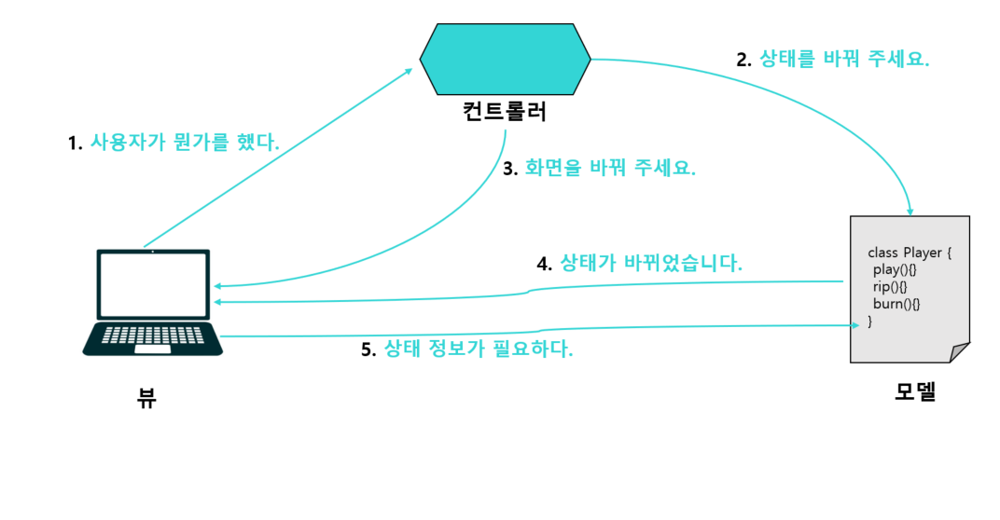
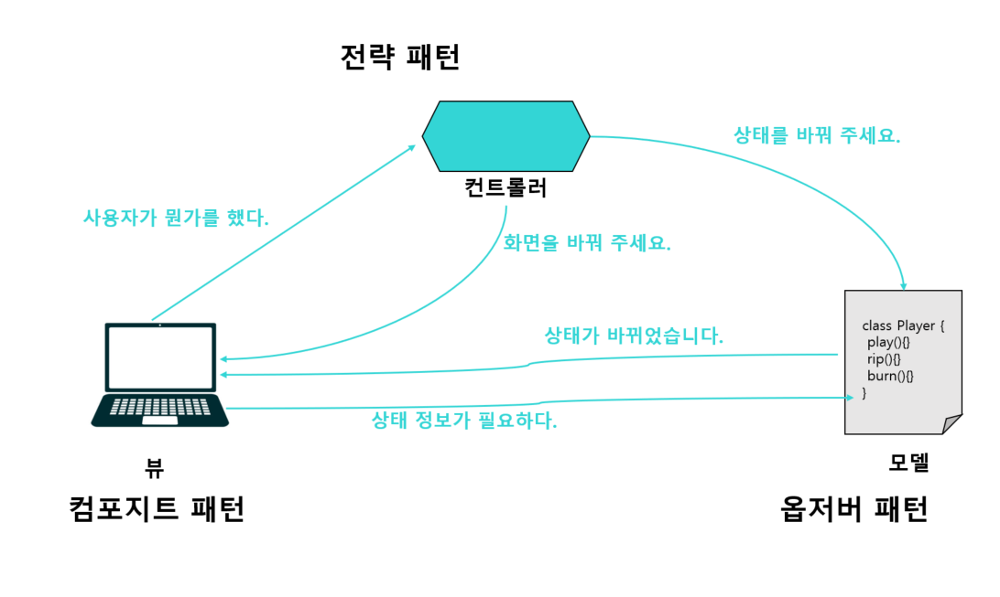
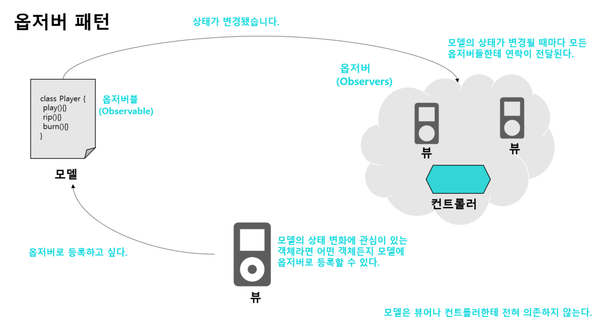
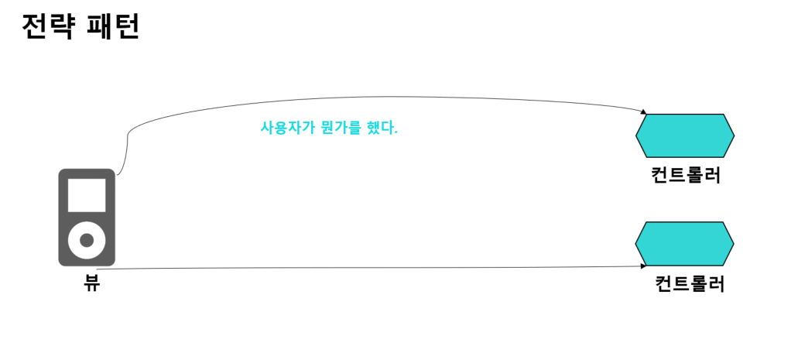
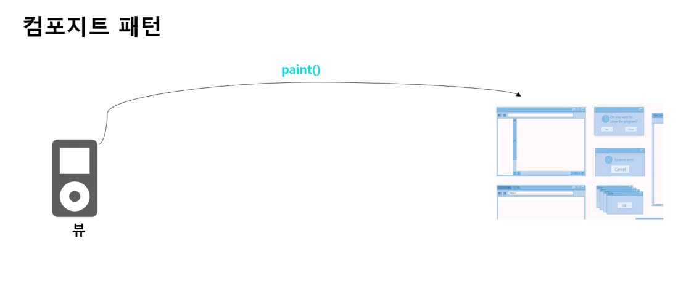
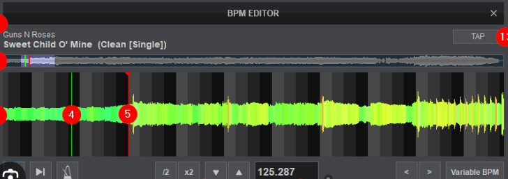
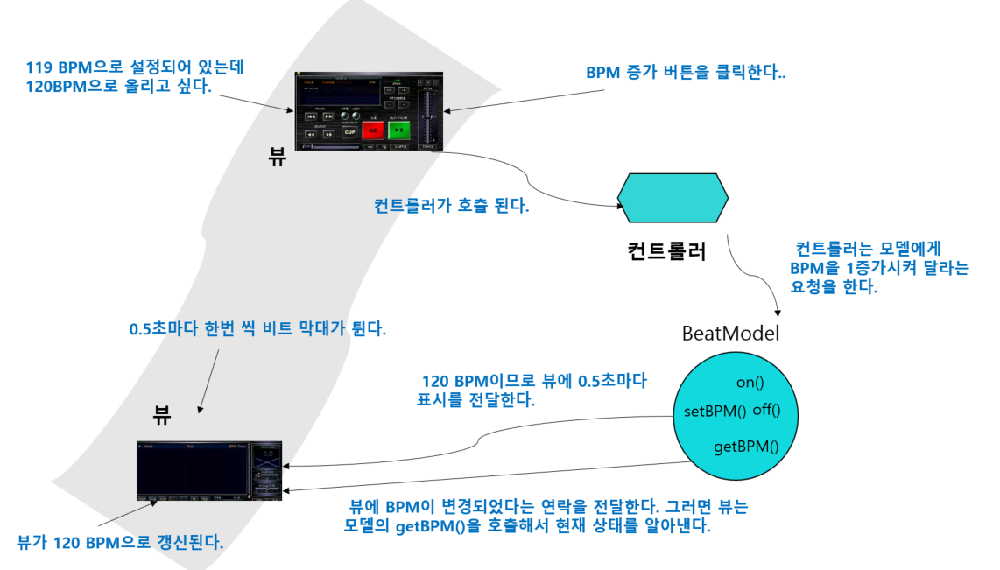

# 42일차 : 2023-09-23 (p.554 ~ 564)

## 요약

**모델 - 뷰 - 컨트롤러**

**뷰**

<aside>
💡 모델을 표현하는 방법을 제공한다. 일반적으로 화면에 표시할 때 필요한 상태와 데이터는 모델에서 직접 가져온다.

</aside>

**컨트롤러**

<aside>
💡 사용자로부터 입력을 받으며 입력받은 내용이 모델에게 어떤 의미가 있는지 파악한다.

</aside>

**모델**

<aside>
💡 모든 데이터, 상태와 애플리케이션 로직이 들어있다. 뷰와 컨트롤러에서 모델의 상태를 조작하거나 가져올 때 필요한 인터페이스를 제공하고, 모델이 자신의 상태 변화를 옵저버들에게 연락해 주긴 하지만, 기본적으로 모델은 뷰와 컨트롤러에 별 관심이 없

</aside>

1. **사용자는 뷰에만 접촉할 수 있다.**  : 뷰는 모델을 보여 주는 창이라고 할 수 있다. 사용자가 뷰에서(재생 버튼을 누른다든가 하는 식으로) 뭔가를 하면 뷰는 무슨 일이 일어났는지 컨트롤러에게 알려 준다. 그러면 컨트롤러가 상황에 맞게 작업을 처리한다.
2. **컨트롤러가 모델에게 상태를 변경하라고 요청한다.**  : 컨트롤러는 사용자의 행동을 받아서 해석한다. 사용자가 버튼을 클릭하면 컨트롤러는 그것이 무엇을 의미하는지 해석하고, 모델을 어떤 식으로 조작해야 하는 지 결정한다.
3. **컨트롤러가 뷰를 변경해 달라고 요청할 수도 있다.**  : 컨트롤러는 뷰로부터 어떤 행동을 받았을 때, 그 행동의 결과로 뷰에게 뭔가를 바꿔 달라고 할 수도 있다. 예를 들어, 컨트롤러는 인터페이스에 있는 어떤 버튼이나 메뉴를 활성화하거나 비활성화할 수 있다.
4. **상태가 변경되면 모델이 뷰에게 그 사실을 알린다.**  : 사용자가 한 행동(버튼 클릭 등)이나 다른 내부적인 변화(재생목록에서 다음 곡이 재생되는 것 등) 등으로 모델에서 뭔가가 바뀌면 모델은 뷰에게 상태가 변경되었다고 알린다.
5. **뷰가 모델에게 상태를 요청한다.** : 뷰는 화면에 표시할 상태를 모델로부터 직접 가져온다. 예를 들어, 모델이 뷰에게 새로운 곡이 재생되었다고 알려 주면 뷰는 모델에게 곡 제목을 요청하고, 그것을 받아서 화면에 표시한다. 컨트롤러가 뷰에게 뭔가를 바꾸라고 요청을 했을 때도 뷰는 모델에게 상태를 알려 달라고 요청할 수도 있다.

※ 컨트롤러는 뷰로부터 사용자 입력을 받아 오고 모델에게 보내는 일만 하는 건가??

그러면 굳이 컨트롤러를 쓰는 이유가 있을 까?? 뷰에 그 코드를 넣어도 될 것 같은데?

컨트롤러가 하는 일은 모델에 있는 메소드를 호출하는 것 뿐이지 않은가???

: 컨트롤러가 그냥 ‘모델한테 전달하는’ 일만 하는 것은 아니다.

컨트롤러는 사용자가 입력한 내용을 해석해서, 모델을 조작하는 임무를 맡고 있다.

응 ?? 뷰에 그런 기능을 넣으면 되지 않을까???

뷰에 그런 기능을 넣어도 되지만,  **뷰 코드가 복잡해진다는 문제가 있다.**

사용자 인터페이스도 관리해야 하고 모델을 제어하는 로직도 처리해야 한다.

또 다른 이유로 **뷰를 모델에 너무 밀접하게 연관시켜야 한다는** 문제가 있다.

이러면 뷰를 다른 모델과 연결해서 재사용하기가 아주 힘들어진다.

컨트롤러는 **제어 로직을 뷰로부터 분리해서 뷰와 모델의 결합을 끊어 주는 역할**을 한다.

뷰와 컨트롤러를 느슨하게 결합하면 더 유연하고 확장하기 좋은 디자인을 만들 수 있다.

**모델-뷰-컨트롤러에 사용되는 패턴 알아보기**

MCV를 이해하는 가장 좋은 방법은 MVC를 여러 개의 패턴이 함께 적용되어서 완성된 하나의 디자인으로 생각하기이다.

모델은 **옵저버 패턴**을 써서 상태가 바뀔 때마다 뷰와 컨트롤러에게 연락한다.

뷰와 컨트롤러는 **전략 패턴**을 사용한다.

컨트롤러는 뷰의 행동에 해당하며, 다른 행동이 필요하면 그냥 다른 컨트롤러로 바뀌면 된다.

그리고 뷰 안에는 내부적으로 **컴포지트 패턴**을 써서 윈도우, 버튼 같은 다양한 구성 요소를 관리한다.

**전략 패턴**

: 뷰와 컨트롤러는 고전적인 전략 패턴으로 구현되어 있다. 뷰 객체를 여러 전략을 써서 설정할 수 있다. 컨트롤러가 전략을 제공한다. 뷰는 애플리케이션의 겉모습에만 신경을 쓰고, 인터페이스의 행동을 결정하는 일은 모두 컨트롤러에게 맡긴다.

전략 패턴을 사용하면 뷰를 모델로부터 분리하는 데에도 도움이 된다. 사용자가 요청한 내역을 처리하려고 모델과 얘기하는 일을 컨트롤러가 맡고 있다. 뷰는 그 방법을 전혀 알지 못한다.

**컴포지트 패턴**

: 디스플레이는 여러 단계로 겹쳐 있는 윈도우, 패널, 텍스트 레이블 등으로 구성된다.

각 디스플레이 항목은 복합 객체(윈도우) 나 잎(버튼)이 될 수 있다. 컨트롤러가 뷰에게 화면을 갱신해 달라고 요청하면 최상위 뷰 구성 요소에게만 화면을 갱신하라고 얘기하면 된다.

나머지는 컴포지트 패턴이 알아서 처리해준다.

**옵저버 패턴**

: 모델은 옵저버 패턴을 써서 상태가 변경되었을 때 그 모델과 연관된 객체들에게 연락한다.

옵저버 패턴을 사용하면 모델을 뷰와 컨트롤러로부터 완전히 독립시킬 수 있다.

한 모델에서 서로 다른 뷰를 사용할 수도 있고, 심지어 여러 개의 뷰를 동시에 사용하는 것도 가능하다.

---

- 뷰는 사용자의 행동을 처리하는 작업을 컨트롤러에게 맡긴다.
- 뷰는 화면 표시만 잘 챙김녀 된다. 사용자 입력에 따라 모델에게 요청하는 일은 컨트롤러가 처리한다.
- 컨트롤러는 뷰의 전략 객체에 해당한다. 사용자의 행동에 따라 어떤 행동을 취해야 하는지 알고 있다.
- 컨트롤러를 바꾸면 뷰의 행동도 바꿀 수 있다.

---

- 뷰는  GUI 구성 요소(레이블, 버튼, 텍스트 항목 등)로 이루어진 복합 객체이다.  최상위 구성 요소에는 다른 구성 요소들이 들어 있고, 그 안에는 각각 다른 구성 요소가 들어갈 수 있다.

**모델-뷰-컨트롤러로 BPM 제어 도구 만들기**

DJ에게 가장 중요한 건 비트이다.

BPM을 제어하는 도구를 만들자.

**자바 DJ 뷰**

뷰는 드럼 비트를 만들고 BPM을 조정하는 용도로 쓰인다.

**모델과 뷰 사이의 컨트롤러**

컨트롤러는 뷰와 모델 사이에 있다.

사용자가 DJ Control 메뉴에서 ‘Start’를 선택하면 그 입력을 모델이 해야 하는 적절한 행동으로 바꾸는 작업을 처리한다.

**그 뒤에 떡하니 버티고 있는 모델**

모델을 직접 볼 수 없겠지만, 적어도 들을 수는 있다.

모델은 멀찌감치 뒤에 숨어서 비트를 조절하고 스피커로 소리를 내보내는 작업을 처리한다.

**모델, 뷰 , 컨트롤러 합쳐서 보기**

