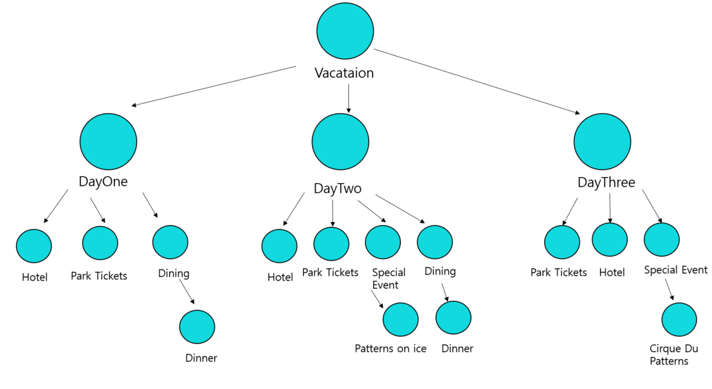

# 47일차 : 2023-09-30 (p. 622 ~ 635)

## 요약

**실전! 패턴 동물원 탐방하기**

- **건축 패턴(Architectural Pattern)** : 생동감 있는 건물, 마을, 도시를 만드는 용도로 쓰인다. 패턴이라는 여기서부터 시작되었다.
- **애플리케이션 패턴(Application Pattern)** : 시스템 수준의 아키텍처를 만드는 패턴이다. 다양한 다단계 아키텍처가 여기에 속한다**.**
- **특정 영역용 패턴(Domain-Specific Pattern)** : 컨커런트 시스템이라든가 실시간 시스템과 같은 특정 영역에 국한된 문제를 해결하는 패턴이다.
- **비즈니스 프로세스 패턴(Business Process Pattern)**  : 비즈니스, 고객, 데이터 사이의 상호작용을 기술하는 패턴으로, 효과적인 의사소통과 의사결정 방법을 정할 때 적용할 수 있다.
- **조직 패턴 (Organizational Pattern )** :  조직의 구조와 운영을 기술하는 패턴이다. 주로 소프트웨어 제작/지원 조직에 초점이 맞춰졌다.
- **사용자 인터페이스 디자인 패턴(User Interface Design Pattern)**  : 사용자들이 직접 다루게 되는 소프트웨어 프로그램을 디자인하는 패턴이다.

**사악한 안티 패턴 섬멸하기**

**안티 패턴(Anti-Pattern)**  : 어떤 문제의 나쁜 해결책에 이르는 길을 알려준다.

일상적인 문제의 자주 반복되는 나쁜 해결책을 문서로 만들면 다른 개발자들이 똑같은 실수를 하지 않도록 방지할 수 있ㄷ.

안티 패턴의 요소

: **안티 패턴은 어떤 이유로 나쁜 해결책에 유혹되는 지를 알려 준다.**

안티 패턴의 가장 큰 역할은 나쁜 해결책이 어떤 식으로 사람들을 꼬시는지 설명함으로써 나쁜 패턴을 쓰지 않도록 경고하기에 있다.

**안티 패턴은 장기적인 관점에서 그 해결책이 나쁜 이유를 알려 준다.**

어떤 해결책이 왜 안티 패턴인지 이해하려면 어떤 부정적인 효과가 나타날지를 알아야 한다.

안티 패턴은 그 해결책을 사용했을 때 어떤 문제가 생길 것인지를 기술한다.

**안티 패턴은 좋은 해결책을 만들 때 적용할 수 있는 다른 패턴을 제안 해준다.**

> 안티 패턴은 좋은 해결책처럼 보이지만 적용하고 나서야 상당히 좋지 않은 해결책이었다는 사실이 밝혀진다.
>

> 안티 패턴을 문서로 정리해 두면 다른 사람들이 나쁜 해결책을 구현하기 전에 그 문제점을 미리 파악하는 데 도움을 줄 수 있다.
>

**다양한 패턴 빠르게 알아보기 - 기타 패턴**

**브리지 패턴**

만능 리모컨

**브리지 패턴 사용하기**

브리지 패턴을 사용하면 추상화된 부분과 구현 부분을 서로 다른 클래스 계층 구조로 분리해서 그 둘을 모두 변경할 수 있다.

**브리지 패턴의 장점**

- 구현과 인터페이스를 완전히 결합하지 않았기에 구현과 추상화 부분을 분리할 수 있다.
- 추상화된 부분과 실제 구현 부분을 독립적으로 확장할 수 있다.
- 추상화 부분을 구현한 구상 클래스를 바뀌어도 클라이언트에는 영향을 끼치지 않는다.

**브리지 패턴의 활용법과 단점**

- 여러 플랫폼에서 사용해야 하는 그래픽스와 윈도우 처리 시스템에서 유용하게 쓰인다.
- 인터페이스와 실제 구현할 부분을 서로 다른 방식을 변경해야 할 때 유용하게 쓰인다.
- 디자인이 복잡해지다는 단점이 있다.

**빌더 패턴**

휴가 계획 프로그램 : 호텔 , 입장권, 레스토랑 ,특별 이벤트 등을 마음대로 선택해서 예약 할 수 있다.

**빌더 패턴 사용하기**

**빌더 패턴의 장점**

- 복합 객체 생성 과정을 캡슐화한다.
- 여러 단계와 다양한 절차를 거쳐 객체를 만들수 있다.
- 제품의 내부 구조를 클라이언트로부터 보호할 수 있다.
- 클라이언트는 추상 인터페이스만 볼 수  있기에 제품을 구현한 코드를 쉽게 바꿀 수 있다.

**빌더 패턴의 활용법과 단점**

- 복합 객체 구조를 구축하는 용도로 많이 쓰인다.
- 팩토리를 사용할 때 보다 객체를 만들 때 클라이언트에 관해 더 많이 알아야 한다.

## 메모

**브리지 패턴**

<aside>
💡 객체의 추상화와 구현을 분리하여 두 개의 독립적인 클래스 계층을 만드는 구조적 패턴 중 하나이다.

</aside>

이 패턴은 다음과 같은 상황에서 사용된다.

- 추상화와 구현을 독립적으로 확장하고자 할 때
- 추상화와 구현을 런타임에 동적으로 연결하고 변경하고자 할 때
- 복잡한 클래스 계층 구조를 간결하게 유지하고자 할

**빌더 패턴**

<aside>
💡 객체 생성 과정을 추상화하고 복잡한 객체를 생성하기 위한 디자인 패턴

</aside>