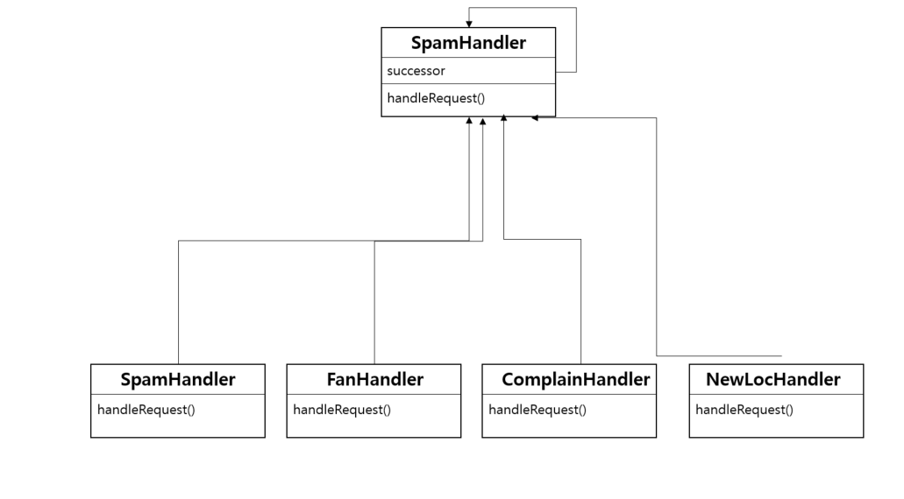
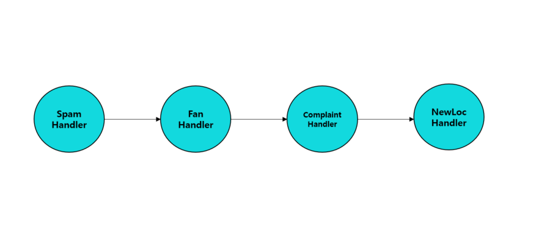
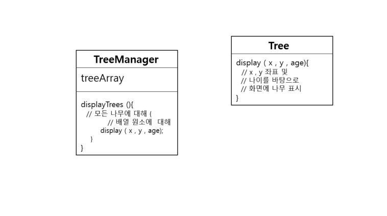
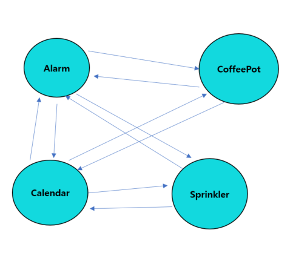
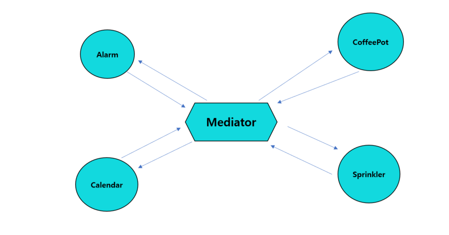
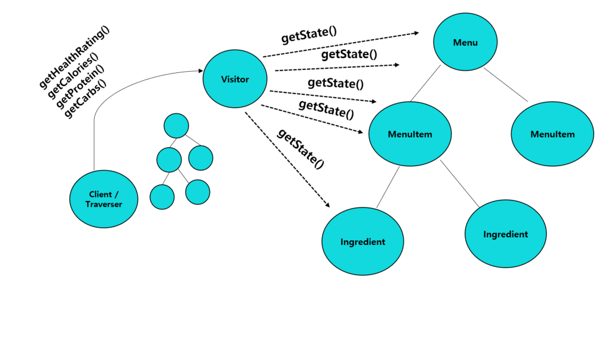

# 48일차 : 2023-09-30 (p.636 ~ 649)

## 요약

**책임 연쇄 패턴**

1개의 요청을 2개 이상의 객체에서 처리해야 한다면 책임 연쇄(Chain of Responsibility) 패턴을 사용하면 된다.

**시나리오**

자바가 탑재된 뽑기 기계 출시 이후로, 주식회사 왕뽑기에는 감당하기 힘들 정도로 많은 이메일이 왔다.

기능에 만족한 고객으로부터 오는 팬 메일, 아이들이 뽑기에 중독됐다면서 기계를 다른 데로 옮겨 달라고 항의하는 부모님들의 메일, 뽑기 기계를 새로 설치해 달라는 메일, 그리고 스팸 메일

**해야 할일 :  검출기로 메일을 분류해야 한다.**

주식회사 왕뽑기에서 스팸 메일 , 팬 메일 , 항의 메일, 신규 설치 요청 메일을 감지해주는 인공지능 검출기를 만들었다.

**책임 연쇄 패턴 사용하기**

책임 연쇄 패턴에서는 주어진 요청을 검토하는 객체 사슬을 생성한다.

그 사슬에 속해 있는 각 객체는 자기가 받는 요청을 검사해서 직접 처리하거나 사슬에 들어있는 다른 객체에게 넘긴다.

이메일이 수신되면 첫 번째 핸들러인 SpamHandler 에게 전달된다.

SpamHandler가 처리할 수 없으면 FanHandler 로 넘긴다.

이처럼 사슬을 따라 요청이 전달되면서 적절한 핸들러가 메일을 분류한다.

**책임 연쇄 패턴의 장점**

- 요청을 보낸 쪽과 받는 쪽을 분리할 수 있다.
- 객체는 사슬의 구조를 몰라도 되고 그 사슬에 들어있는 다른 객체의 직접적인 레퍼런스를 가질 필요도 없으므로 객체를 단순하게 만들 수 있다.
- 사슬에 들어가는 객체를 바꾸거나 순서를 바꿈으로써 역할을 동적으로 추가하거나 제거할 수 있다.

**책임 연쇄 패턴의 활용법과 단점**

- 윈도우 시스템에서 마우스 클릭과 키보드 이벤트를 처리할 때 흔히 쓰인다.
- 요청이 반드시 수행된다는 보장이 없다는 단점이 있다. 사슬 끝까지 갔는 데도 처리되지 않을 수 있다.
- 실행 시에 과정을 살펴보거나 디버깅하기가 힘들다는 단점이 있다.

**플라이웨이트 패턴**

어떤 클래스의 인스턴스 하나로 여러 개의 ‘가상 인스턴스’를 제공하고 싶다면 플라이웨이트(Flyweight) 패턴을 사용하면 된다.

**시나리오**

조경 설계 애플리케이션에서 나무를 객체 형태로 추가해야 한다.

나무는 X,Y 좌표를 가지고 있고 , 나무의 나이에 따라 적당한 크기로 화면에 표현하면 된다.

**해야 할 일 :**

**실행 중에 느려지지 않게 만들어야 한다**.

**플라이웨이트 패턴 사용하기**

Tree 객체를 수 천 개 만드는 대신 시스템을 조금 고쳐서 Tree 의 인스턴스는 하나만 만들고 모든 나무의 상태를 클라이언트 객체가 관리하도록 하자

- 상태가 저장되어 있지 않은 Tree 객체 인스턴스
- TreeManager : 모든 가상 Tree 객체가 2차원 배열에 저장된다.

**플라이웨이트 패턴의 장점**

- 실행 시에 객체 인스턴스의 개수를 줄여서 메모리를 절약할 수 있다.
- 여러 ‘가상’ 객체의 상태를 한곳에 모아 둘 수 있다.

**플라이웨이트 패턴 사용법과 단점**

- 어떤 클래스의 인스턴스가 아주 많이 필요하지만 모두 똑같은 방식으로 제어해야 할 때 유용하게 쓰인다.
- 일단 이 패턴을 써서 구현해 놓으면 특정 인스턴스만 다른 인스턴스와 다르게 행동하게 할 수 없다는 단점이 있다.

**인터프리터 패턴**

어떤 언어의 인터프리터를 만들 때는 인터프리터 패턴을 사용하면 된다.

**인터프리터 패턴 사용하기**

인터프리터 패턴은 문법과 구문을 번역하는 인터프리터 클래스를 기반으로 간단한 언어를 정의한다.

언어에 속하는 규칙을 나타내는 클래스를 사용해서 언어를 표현한다.

**인터프리터 패턴의 장점**

- 문법을 클래스로 표현해서 쉽게 언어로 구현할 수 있다.
- 문법이 클래스로 표현되므로 언어를 쉽게 변경하거나 확장할 수 있다.
- 클래스 구조에 메소드만 추가하면 프로그램을 해석하는 기본 기능 외에 예쁘게 출력하는 기능이나 더 나은 프로그램 확인 기능 같은 새로운 기능을 추가할 수 있다.

**인터프리터 패턴의 활용법과 단점**

- 간단한 언어를 구현할 때 인터프리터 패턴이 유용하게 쓰인다.
- 효율보다는 단순하고 간단하게 문법을 만드는 것이 더 중요한 경우에 유용하다.
- 스크립트 언어와 프로그래밍 언어에서 모두 쓸 수 있다.
- 문법 규칙의 개수가 많아지면 아주 복잡해진다는 단점이 있다.

**중재자 패턴**

서로 관련된 객체 사이의 복잡한 통신과 제어를 한곳으로 집중하고 싶다면 중재자(Mediator) 패턴을 쓰면 된다.

**해야 할일 : 객체가 할 일을 정리해야 한다.**

어떤 객체에 어떤 규칙을 넣어야 할지를 결정하기가 점점 어려워 지고 있다.

그리고 여러 객체를 서로 연관시키는 과정도 점점 복잡해지고 있다.

**중재자 사용하기**

시스템에 중재자 패턴을 적용하면 가전제품 객체들을 훨씬 단순화할 수 있다.

- 상태가 바뀔 때마다 중재자에게 알려준다.
- 중재자에게 보낸 요청에 응답한다.

중재자에는 모든 시스템을 제어하는 로직이 들어있다.

기존 가전제품에 새로운 규칙을 추가하거나 새로운 가전제품을 자동화 시스템에 추가하더라도

그냥 중재자만 고치면 된다.

**중재자 패턴의 장점**

- 시스템과 객체를 분리함으로써 재사용성을 획기적으로 향상시킬 수 있다.
- 제어 로직을 한 군데 모아놨으므로 관리하기가 수월하다.
- 시스템에 들어있는 객체 사이에서 오가는 메시지를 확 줄이고 단순화할 수 있다.

**중재자 패턴의 활용법과 단점**

- 서로 연관된 GUI 구성 요소를 관리하는 용도로 많이 쓰인다.
- 디자인을 잘 하지 못하면 중재자 객체가 너무 복잡해질 수 있다는 단점이 있다.

**메멘토 패턴**

객체를 이전의 상태로 복구해야 한다면 메멘토 패턴을 쓰면 된다.

**메멘토 패턴 사용하기**

메멘토 패턴에는 2가지 목적이 있다.

- 시스템에서 핵심적인 기능을 담당하는 객체의 상태 저장
- 핵심적인 객체의 캡슐화 유지

**메멘토 패턴의 장점**

- 저장된 상태를 핵심 객체와는 다른 별도의 객체에 보관할 수 있어 안전하다.
- 핵심 객체의 데이터를 계속해서 캡슐화된 상태로 유지할 수 있다.
- 복구 기능을 구현하기가 쉽다.

**메멘토 패턴의 활용법과 단점**

- 메멘토 객체를 써서 상태를 저장한다.
- 자바 시스템에서는 시스템의 상태를 저장할 때 직렬화를 사용하는 것이 좋다.
- 상태를 저장하고 복구하는 데 시간이 오래 걸릴 수 있다는 단점이 있다.

**프로토타입 패턴**

어떤 클래스의 인스턴스를 만들 때 자원과 시간이 많이 들거나 복잡하다면 프로토타입 패턴을 쓰면 된다.

**프로토타입 패턴 사용하기**

: 프로토타입 패턴을 사용하면 기존 인스턴스를 복사하기만 해도 새로운 인스턴스를 만들 수 있다.

( 자바에서는 clone() 메소드를 사용하거나 역직렬화를 하면 된다. )

이 패턴의 가장 두드러진 특징은 클라이언트 코드에서 어떤 클래스의 인스턴스를 만드는지 전혀 모르는 상태에서도 새로운 인스턴스를 만들 수 있다는 점이다.

**프로토타입 패턴의 장점**

- 클라이언트는 새로운 인스턴스를 만드는 과정을 몰라도 된다.
- 클라이언트는 구체적인 형식을 몰라도 객체를 생성할 수 있다.
- 상황에 따라서 객체를 새로 생성하는 것보다 객체를 복사하는 것이 더 효율적일 수 있다.

**프로토타입 패턴의 활용법과 단점**

- 시스템에서 복잡한 클래스 계층구조에 파묻혀 있는 다양한 형식의 객체 인스턴스를 새로 만들어야 할 때 유용하게 써먹을 수 있다.
- 때때로 객체의 복사본을 만드는 일이 매우 복잡할 수도 있다는 단점이 있다.

**비지터 패턴**

다양한 객체에 새로운 기능을 추가해야 하는데 캡슐화가 별로 중요하지 않다면 비지터 패턴을 쓰면 된다.

비지터 객체는 트래버서(Traverser ) 객체와 함께 돌아간다. 트래버서는 컴포지트 패턴을 쓸 때, 복합 객체 내에 속해 있는 모든 객체에 접근하는 일을 도와주는 역할을 한다.

비지터 객체의 복합 객체 내의 모든 객체를 대상으로 원하는 작업을 처리하게 해준다.

각각의 상태를 모두 가져오면 클라이언트는 비지터에게 각 상태에 맞는 다양한 작업을 처리하도록 요구할 수 있다. 새로운 기능이 필요하게 되더라도 비지터만 고치면 되니깐 편리하다.

- 클라이언트는 비지터에게 복합 객체 구조 정보를 요구한다.  새로운 메서드를 추가하고 싶을 때는 복합 객체는 건드리지 않고 비지터만 고치면 된다.
- 비지터는 모든 클래스의 getState() 메소드를 호출할 수 있어야 한다.
- 여기 있는 복합 클래스에는 getState() 메소드만 있으면 된다. 대신 자기 자신의 상태를 외부에 노출해야 한다.
- 트래버서는 비지터가 복합 객체 구조를 돌아다니는 데 도움을 준다.

**비지터 패턴의 장점**

- 구조를 변경하지 않으면서도 복합 객체 구조에 새로운 기능을 추가할 수 있다.
- 비교적 손쉽게 새로운 기능을 추가할 수 있다.
- 비지터가 수행하는 기능과 관련된 코드를 한 곳에 모아 둘 수 있다.

**비지터 패턴의 단점**

- 비지터를 사용하면 복합 클래스의 캡슐화가 깨진다.
- 컬렉션 내의 모든 항목에 접근하는 트래버서가 있으므로 복합 구조를 변경하기가 더 어려워진다.