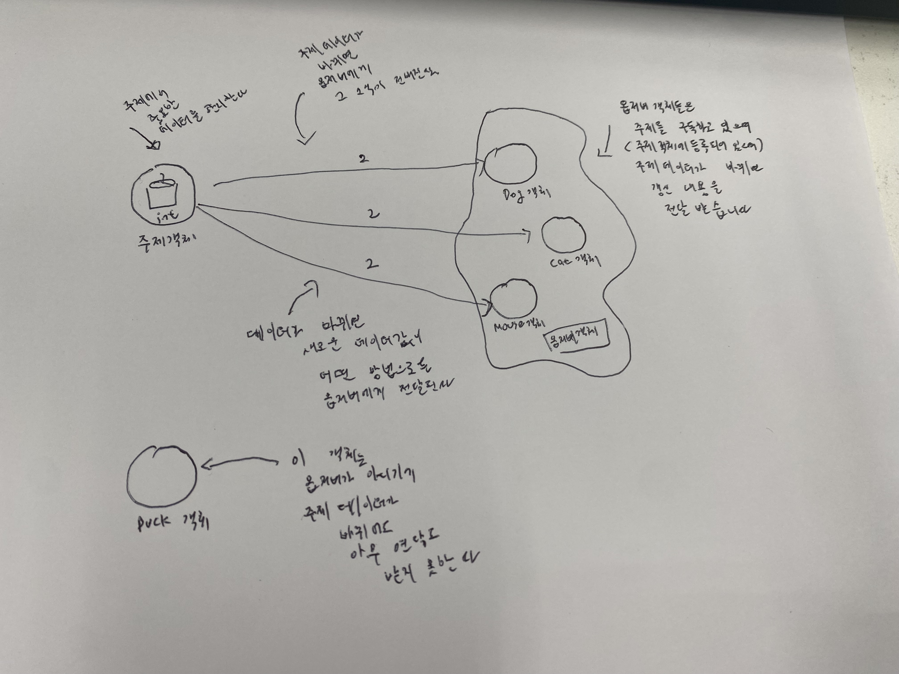
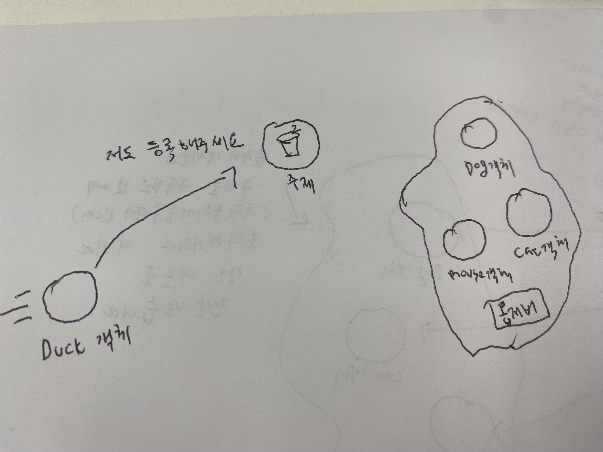
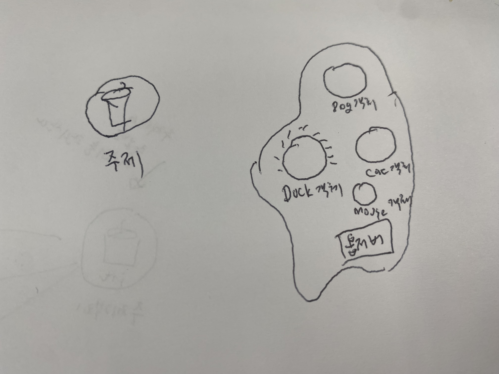
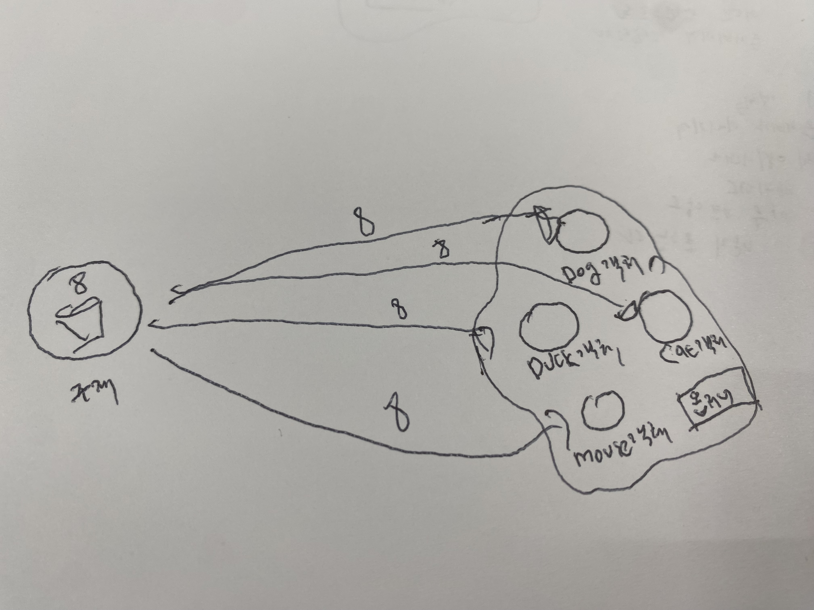
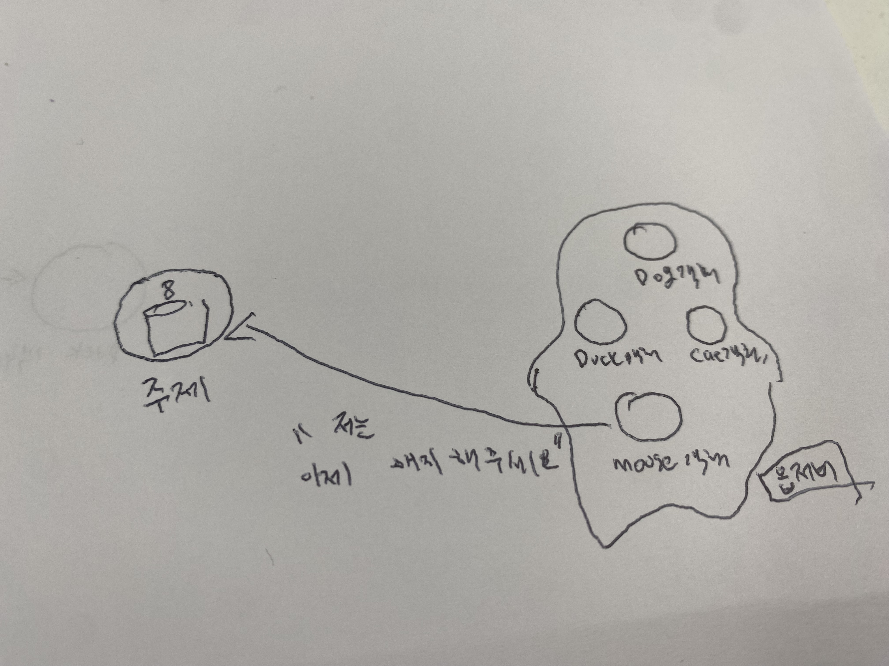
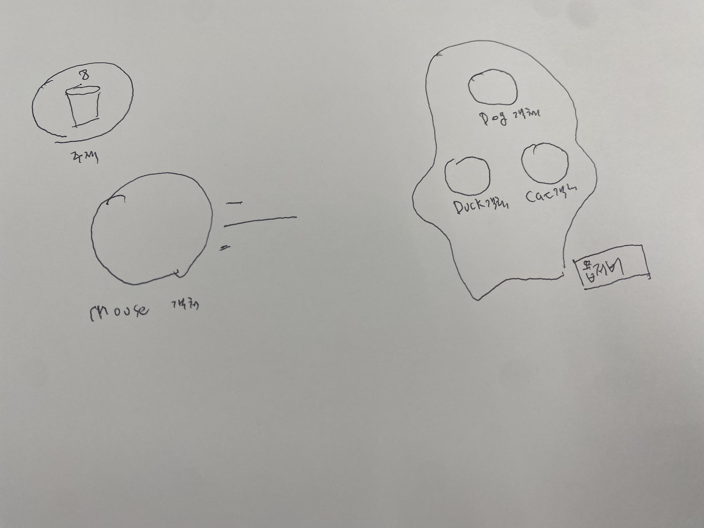
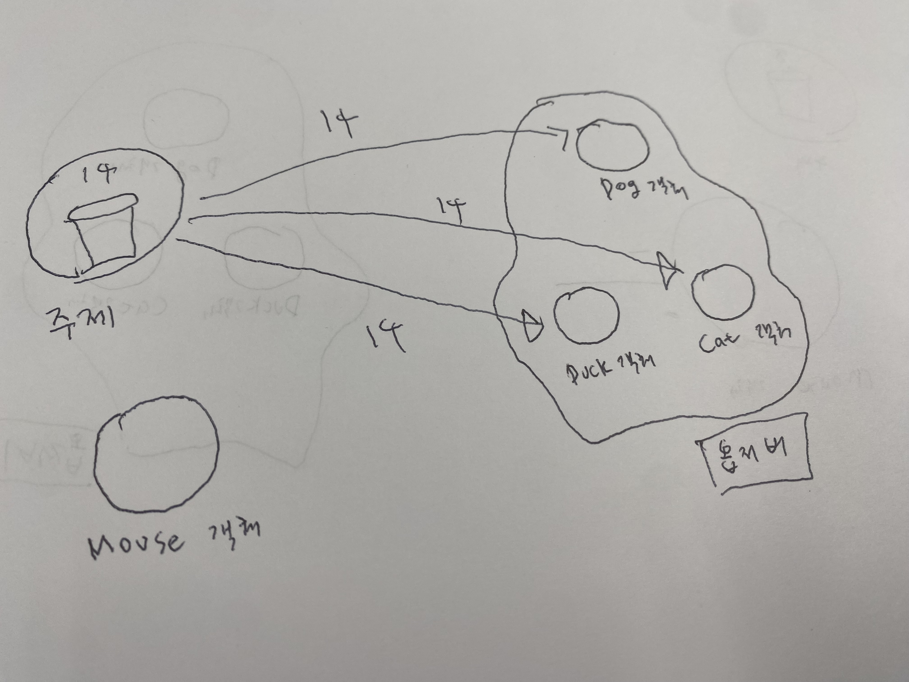

# 5일차 : 2023-08-04 (p.70 ~ 86)


## 요약

**객체들에게 연락 돌리기 - 옵저버 패턴**

**기상 모니터링 애플리케이션 알아보기**

Weather-O-Rama 에서 제공한 부분과 우리가 만들거나 확장해야 하는 부분 전부 파악해야 한다.

- 기상 스테이션 (실제 기상 정보를 수집하는 물리 장비)
- WeatherData 객체 (기상 스테이션으로부터 오는 정보를 추적하는 객체)
- 사용자에게 현재 기상 조건을 보여주는 디스플레이 장비

**WeatherData** 객체로 현재 조건, 기상 통계 , 기상 예보 3가지 항목을 디스플레이 장비에서 갱신해가면서 보여주는 애플리케이션을 만들어야 한다.

**WeatherData 클래스 살펴보기**

```java
클래스 WeatherData

메소드
getTemperature()
getHumidity()
getPressure()

measurementsChanged()
```

가장 최근에 측정된 온도, 습도, 기압 값을 리턴하는 메소드

getTemperature()  ,getHumidity() ,getPressure()

WeatherData 에서 갱신된 값을 가져올 때 마다 measurementsChanged() 메소드가 호출 된다.

**구현 목표**

디스플레이를 구현하고 새로운 값이 들어 올 때  (measurementsChanged() 메소드 가 호출 될 때)

WeatherData 에서 디스플레이를 업데이트 해야 한다.

미래를 생각해야 한다.

“소프트웨어에 개발에서 바뀌지 않는 단 하나 !! 바로 **변화”**

- 다른 개발자가 새로운 디스플레이를 만들고 싶을 수도 있다.
- 사용자가 마음대로 디스플레이 요소를 더하거나 뺄 수 있다.
- 3가지 디스플레이가 아닌 새로운 디스플레이가 계속 추가 될 수 있다.

**기상 스테이션용 코드 추가하기**

```java
public class WeatherData {

		// 인스턴스 변수 선언    

    public void measurementsChanged() {
        float temp = getTemperature();
        float humidity = getHumidity();
        float pressure = getPressure();

				// 각 디스플레이 갱신
				currentConditionDisplay.update(temp, humidity, pressure)
				statisticsDisplay.update(temp , humidity , pressure)
				forecastDisplay.upadte(temp , humidity , pressure)

    }

}
```

위의 코드를 보고 분석해보자

새로운 디스플레이가 생길 때마다 코드를 추가 해야 할 것 같다.

추후에 사용하지 않는 디스플레이는 지워줘야 할 것 같다.

요구 사항이 새로 들어 올 때마다 코드를 계속 수정해야 하는 것은 명백하다.

디스플레이를 갱신하는 코드를 캡슐화 시켜야 할 것 같다.

**원칙으로 추가 코드 살펴보기**

책에서는 어떻게 설명 할까? 위에서 내가 생각 한 것이 맞을 까?

살펴 보자

```java
public class WeatherData {

		// 인스턴스 변수 선언    
    public void measurementsChanged() {
        float temp = getTemperature();
        float humidity = getHumidity();
        float pressure = getPressure();

				// 각 디스플레이 갱신
				currentConditionDisplay.update(temp, humidity, pressure)
				statisticsDisplay.update(temp , humidity , pressure)
				forecastDisplay.upadte(temp , humidity , pressure)

    }

}
```

- 구체적인 구현에 맞춰서 코딩했으므로 프로그램을 고치지 않고는 다른 디스플레이 항목을 추가하거나 제거할 수 없다.
- 디스플레이 항목과 데이터를 주고받을 때 공통적인 인터페이스를 사용하고 있는 것 같다. 모두 온도, 습도, 기압 값을 받아 들이는 update 메소드를 가지고 있기 때문에 !!
- 바뀔 수 있는 부분이기 때문에 캡슐화 해야 한다.

**옵저버 패턴 이해하기**

신문사 + 구독자 = 옵저버 패턴

: 신문사를 **주제(subject)** , 구독자를 **옵저버(observer)**라고 부른다.




**옵저버 패턴의 작동 원리**

- Duck 객체가 등장해서는 주제한테 자기도 옵저버가 되고 싶다고 이야기 한다.
    - Duck은 정말로 옵저버가 되고 싶었다. 주제에서 상태가 바뀔 때마다 보내 주는 int 값에 관심이 많기 때문에..



- Duck 객체도 이제 정식 옵저버가 되었다.
    - Duck은 신이 났다. 구독자 목록에 이름을 올리고 다음에 전달될 int 값을 애타게 기다리고 있다.
     


- 주제 값이 바뀌었다.
    - 이제 Duck을 비롯한 모든 옵저버가 주제 값이 바뀌었다는 연락을 받았다.



- Mouse 객체가 옵저버 목록에서 탈퇴하고 싶다는 요청을 한다.
    - Mouse 객체는 한참 전부터 int 값을 받아왔으나 옵저버를 그만두기로 하고는 해지 요청을 한다.




- 이제 Mouse 가 빠졌다.
    - 주제가 요청을 받아들여 Mouse 객체를 옵저버 집합에서 제거한다.




- 주제에 새로운 int 값이 들어왔다.
    - 모든 옵저버가 값이 바뀌었다는 연락을 받았다. Mouse는 이제 연락을 받지 못하기에 새로운 int 값이 무엇인지 알 수 없다. 새로운 int 값을 알고 싶다면 다시 옵저버 등록 요청을 하면 된다.




## 발췌

## 메모

옵저버 패턴

<aside>
💡 소프트웨어 디자인 패턴 중 하나로, 객체 간의 의존성을 최소화하고, 한 객체의 상태 변화를 관찰하는 다른 객체들에게 알려주는 패턴이다. 이는 주로 이벤트 처리, 데이터 변화 등에서 활용 된다.

</aside>