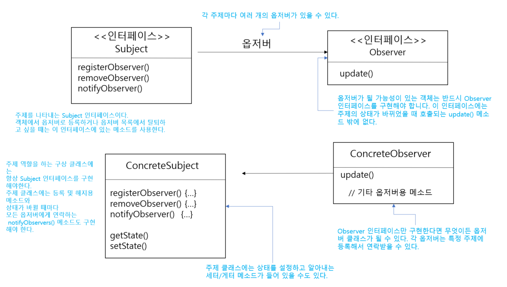

# 6일차 : 2023-08-05 (p.87 ~ 101)


## 요약

**옵저버 패턴의 정의**

<aside>
💡 한 객체의 상태가 바뀌면 그 객체에 의존하는 다른 객체에게 연락이 가고 자동으로 내용이 갱신 되는 방식으로 일대다 의존성을 정의한다.

</aside>

옵저버 패턴은 여러 가지 방법으로 구현할 수 있지만, 보통은 주제 인터페이스와 옵저버 인터페이스가 들어 있는 클래스 디자인으로 구현한다.

**옵저버 패턴의 구조**



**느슨한 결합의 위력**

- **느슨한 결합**은 객체들이 상호 작용할 수는 있지만, 서로를 잘 모르는 관계를 의미한다.
- 느슨한 결합을 활용하면 유연성이 아주 좋아진다.
- 옵저버 패턴은 느슨한 결합을 보여주는 훌륭한 예이다.

**주제는 옵저버가 특정 인터페이스를 구현한다는 사실만 안다.**

⇒ 옵저버의 구상 클래스가 무엇인지, 옵저버가 무엇을 하는지는 알 필요도 없다.

**옵저버는 언제든지 새로 추가할 수 있다.**

⇒ 주제는 Observer 인터페이스를 구현하는 객체의 목록에만 의존하므로 언제든지 새로운 옵저버를 추가할 수 있다. 사실 실행 중에 하나의 옵저버를 다른 옵저버로 바꿔도 주제는 계속해서 다른 옵저버에 데이터를 보낼 수 있다. 마찬가지로 아무 때나 옵저버를 제거해도 된다.

**새로운 형식의 옵저버를 추가할 때도 주제를 변경할 필요가 전혀 없다.**

⇒ 옵저버가 되어야 하는 새로운 구상 클래스가 생겼다고 가정해 본다. 이때도 새로운 클래스 형식을 받아들일 수 있도록 주제를 바꿔야 할 필요는 없다. 새로운 클래스에서 Oberver 인터페이스를 구현하고 옵저버로 등록하기만 하면 된다. 주제는 신경 쓸 필요가 없다. Observer 인터페이스만 구현한다면 어떤 객체에도 연락할 수 있다.

**주제와 옵저버는 서로 독립적으로 재사용할 수 있다.**

⇒ 주제나 옵저버를 다른 용도로 활용할 일이 있다고 해도 손쉽게 재사용할 수 있다.

그 둘이 서로 단단하게 결합되어 있지 않기 때문이다.

**주제나 옵저버가 달라져도 서로에게 영향을 미치지는 않는다.**

⇒ 서로 느슨하게 결합되어 있으므로 주제나 옵저버 인터페이스를 구현한다는 조건만 만족한다면 어떻게 고쳐도 문제가 생기지 않다.

**디자인 원칙**

<aside>
💡 상호작용하는 객체 사이에는 가능하면 느슨한 결합을 사용해야 한다.

</aside>

**기상 스테이션 구현하기**

```jsx
public interface Subject {
    void registerObserver(Observer o);
    void removeObserver(Observer o);
    void notifyObservers();
}

public interface Observer {
    void update(float temp, float humidity , float pressure);
}

public interface DisplayElement {
    void display();
}

```

**Subject 인터페이스 구현하기**

```jsx
public class WeatherData implements Subject {

    private List<Observer> observers;
    private float temperature;
    private float humidity;
    private float pressure;

    public WeatherData() {
        this.observers = new ArrayList<Observer>();
    }

    @Override
    public void registerObserver(Observer o) {
        observers.add(o);
    }

    @Override
    public void removeObserver(Observer o) {
        observers.remove(o);
    }

    @Override
    public void notifyObservers() {
        for (Observer observer : observers) {
            observer.update(temperature,humidity,pressure);
        }
    }

    public void measurementsChanged() {
        notifyObservers();
    }
    
    public void setMeasurements(float temperature, float humidity , float pressure) {
        this.temperature = temperature;
        this.humidity = humidity;
        this.pressure = pressure;
        measurementsChanged();
    }
}
```


## 발췌

> “우리 소프트웨어에서도 객체가 서로 서도 덜 단단하게 결합되어 있다면 객체들이 부서질 확률이 낮아지지 않을까요?”
>

> 다른 객체를 잘 모르면 변화에 더 잘 대응할 수 있는 디자인을 만들 수 있어요 덜 단단하게 짠 바구니처럼 더 유연한 디자인을 만들 수 있는 것이지요
>

> “느슨하게 결합하는 디자인을 사용하면 변경 사항이 생겨도 무난히 처리할 수 있는 유연한 객체지향 시스템을 구축할 수 있다. 객체 사이의 상호 의존성을 최소화 할 수 있기 때문이다. “
>

## 메모