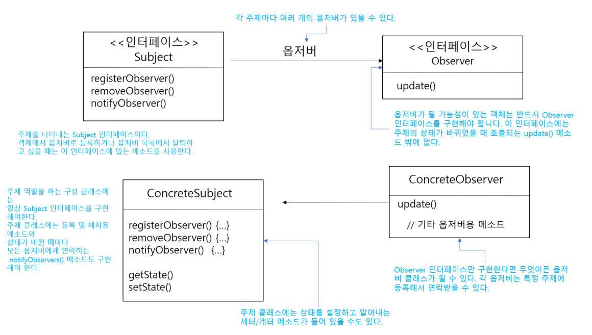

# 6일차 : 2023-08-05 (p.87 ~ 101)


## 요약

**옵저버 패턴의 정의**

<aside>
💡 한 객체의 상태가 바뀌면 그 객체에 의존하는 다른 객체에게 연락이 가고 자동으로 내용이 갱신 되는 방식으로 일대다 의존성을 정의한다.

</aside>

옵저버 패턴은 여러 가지 방법으로 구현할 수 있지만, 보통은 주제 인터페이스와 옵저버 인터페이스가 들어 있는 클래스 디자인으로 구현한다.

**옵저버 패턴의 구조**



**느슨한 결합의 위력**

- **느슨한 결합**은 객체들이 상호 작용할 수는 있지만, 서로를 잘 모르는 관계를 의미한다.
- 느슨한 결합을 활용하면 유연성이 아주 좋아진다.
- 옵저버 패턴은 느슨한 결합을 보여주는 훌륭한 예이다.

**주제는 옵저버가 특정 인터페이스를 구현한다는 사실만 안다.**

⇒ 옵저버의 구상 클래스가 무엇인지, 옵저버가 무엇을 하는지는 알 필요도 없다.

**옵저버는 언제든지 새로 추가할 수 있다.**

⇒ 주제는 Observer 인터페이스를 구현하는 객체의 목록에만 의존하므로 언제든지 새로운 옵저버를 추가할 수 있다. 사실 실행 중에 하나의 옵저버를 다른 옵저버로 바꿔도 주제는 계속해서 다른 옵저버에 데이터를 보낼 수 있다. 마찬가지로 아무 때나 옵저버를 제거해도 된다.

**새로운 형식의 옵저버를 추가할 때도 주제를 변경할 필요가 전혀 없다.**

⇒ 옵저버가 되어야 하는 새로운 구상 클래스가 생겼다고 가정해 본다. 이때도 새로운 클래스 형식을 받아들일 수 있도록 주제를 바꿔야 할 필요는 없다. 새로운 클래스에서 Oberver 인터페이스를 구현하고 옵저버로 등록하기만 하면 된다. 주제는 신경 쓸 필요가 없다. Observer 인터페이스만 구현한다면 어떤 객체에도 연락할 수 있다.

**주제와 옵저버는 서로 독립적으로 재사용할 수 있다.**

⇒ 주제나 옵저버를 다른 용도로 활용할 일이 있다고 해도 손쉽게 재사용할 수 있다.

그 둘이 서로 단단하게 결합되어 있지 않기 때문이다.

**주제나 옵저버가 달라져도 서로에게 영향을 미치지는 않는다.**

⇒ 서로 느슨하게 결합되어 있으므로 주제나 옵저버 인터페이스를 구현한다는 조건만 만족한다면 어떻게 고쳐도 문제가 생기지 않다.

**디자인 원칙**

<aside>
💡 상호작용하는 객체 사이에는 가능하면 느슨한 결합을 사용해야 한다.

</aside>

**기상 스테이션 구현하기**

```java
public interface Subject {
    void registerObserver(Observer o);
    void removeObserver(Observer o);
    void notifyObservers();
}

public interface Observer {
    void update(float temp, float humidity , float pressure);
}

public interface DisplayElement {
    void display();
}

```

**Subject 인터페이스 구현하기**

```java
public class WeatherData implements Subject {

    private List<Observer> observers;
    private float temperature;
    private float humidity;
    private float pressure;

    public WeatherData() {
        this.observers = new ArrayList<Observer>();
    }

    @Override
    public void registerObserver(Observer o) {
        observers.add(o);
    }

    @Override
    public void removeObserver(Observer o) {
        observers.remove(o);
    }

    @Override
    public void notifyObservers() {
        for (Observer observer : observers) {
            observer.update(temperature,humidity,pressure);
        }
    }

    public void measurementsChanged() {
        notifyObservers();
    }
    
    public void setMeasurements(float temperature, float humidity , float pressure) {
        this.temperature = temperature;
        this.humidity = humidity;
        this.pressure = pressure;
        measurementsChanged();
    }
}
```

**디스플레이 요소 구현하기**

기상 조건 , 기상 통계 , 기상 예보를 표시하는 3가지 디스플레이 중 기상 조건을 표시하는 디스플레이

```java
public class CurrentConditionDisplay implements Observer, DisplayElement {

    private float temperature;
    private float humidity;
    private WeatherData weatherData;

    public CurrentConditionDisplay(WeatherData weatherData) {
        this.weatherData = weatherData;
        weatherData.registerObserver(this);
    }

    @Override
    public void display() {
        System.out.println("현재 상태 : 온도 " + temperature + "F, 습도 +" + humidity + "%");
    }

    @Override
    public void update(float temp, float humidity, float pressure) {
        this.temperature = temp;
        this.humidity = humidity;
        display();
    }
}
```

**라이브러리 속 옵저버 패턴 알아보기**

- JDK에 있는 자바빈 과 스윙 라이브러리에서 옵저버 패턴을 쓰고 있다.
- 자바 외에 자바스크립트의 이벤트, 코코아와 스위프트의 키-값 옵저빙 프로토콜에서도 옵저버 패턴이 쓰인다.

**스윙 라이브러리**

- 스윙 툴킷의 기본 구성 요소 중 하나로 JButton 클래스가 있다.
- JButton 의 슈퍼클래스인 AbstractButton 에는 리스너를 추가하고 제거하는 메소드가 있다. 이런 메소드들은 스윙 구성 요소에서 일어나는 다양한 유형의 이벤트를 감시하는 옵저버를 추가하거나 제거하는 역할을 한다.
    - 옵저버 == 스윙 라이브러리에서의 리스너


## 발췌

> “우리 소프트웨어에서도 객체가 서로 서도 덜 단단하게 결합되어 있다면 객체들이 부서질 확률이 낮아지지 않을까요?”
>

> 다른 객체를 잘 모르면 변화에 더 잘 대응할 수 있는 디자인을 만들 수 있어요 덜 단단하게 짠 바구니처럼 더 유연한 디자인을 만들 수 있는 것이지요
>

> “느슨하게 결합하는 디자인을 사용하면 변경 사항이 생겨도 무난히 처리할 수 있는 유연한 객체지향 시스템을 구축할 수 있다. 객체 사이의 상호 의존성을 최소화 할 수 있기 때문이다. “
>

## 메모


옵저버 패턴에 대해서 너무 생소하고,  책에 있는 예제를 보아도 잘 이해가 되지 않았다.

실제로 이 디자인 패턴을 많이 사용할까 의문이 들어서 실제 사례를 찾아 보았다.

- GUI 이벤트 처리 : 그래픽 사용자 인터페이스에서 버튼, 체크박스 등의 이벤트를 처리할 때 옵저버 패턴을 활용하여 이벤트에 대한  처리를 구현한다.
- 데이터베이스 업데이트 : 데이터베이스의 변경 사항을 감지하여 해당 변경 사항을 구독한 다른 객체들에게 알림을 보내 데이터의 동기화를 유지하는 데 사용된다.
- 이벤트 리스너 : 이벤트 기반 시스템에서 이벤트 리스너와 이벤트 발생자 사이에 옵저버 패턴을 적용하여 이벤트를 처리한다.
- MVC 패턴 :  모델-뷰-컨트롤러 아키텍처에서 모델과 뷰 간의 상호작용을 옵저버 패턴으로 구현하여 모델의 상태 변화에 따라 뷰를 업데이트한다.