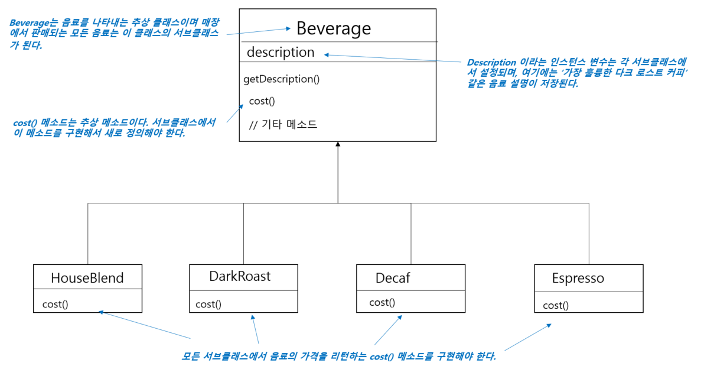
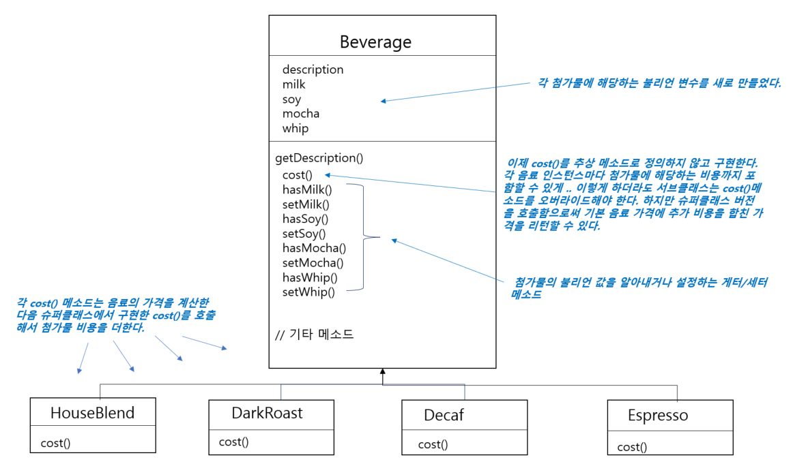
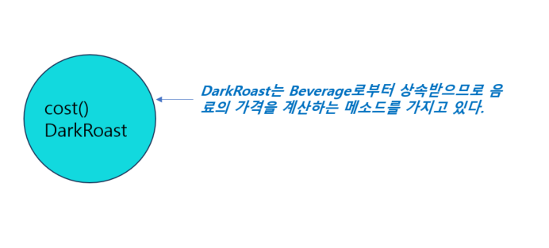
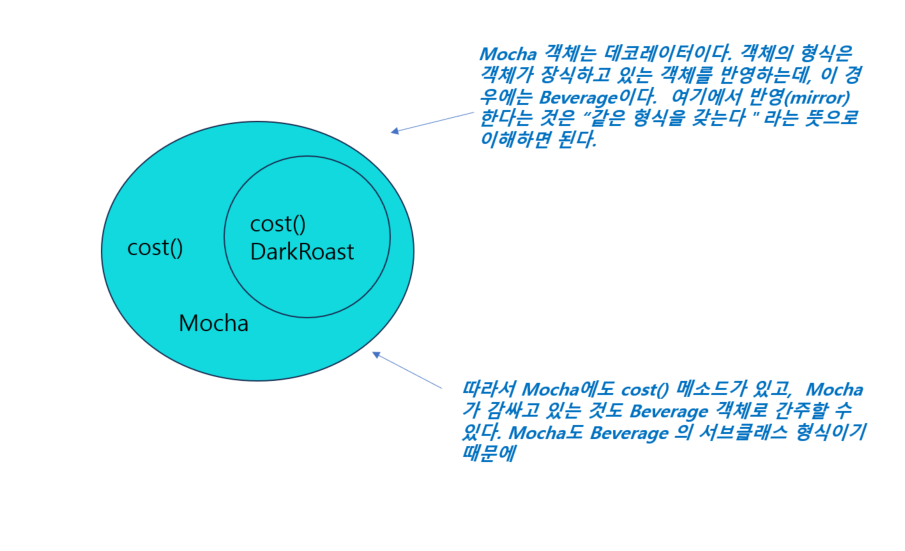
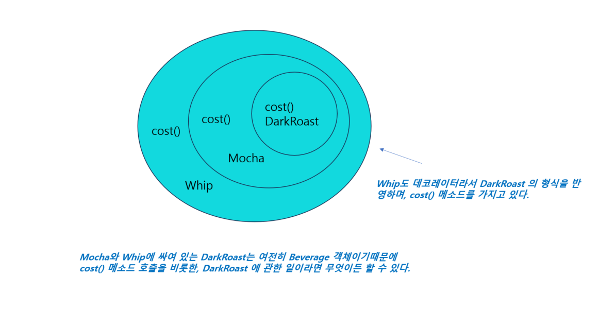
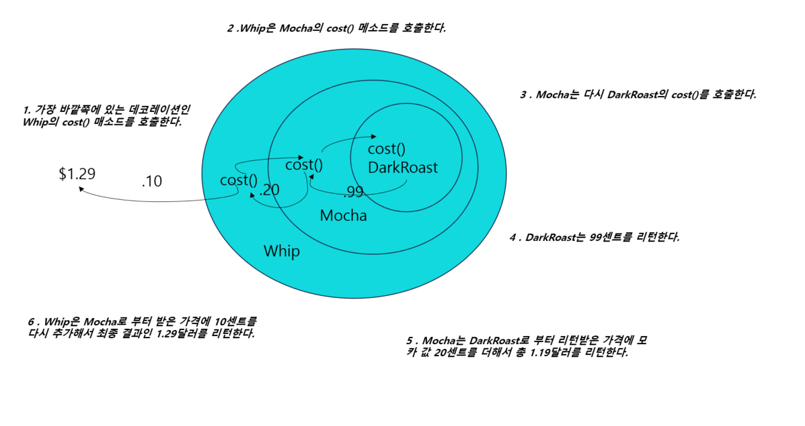
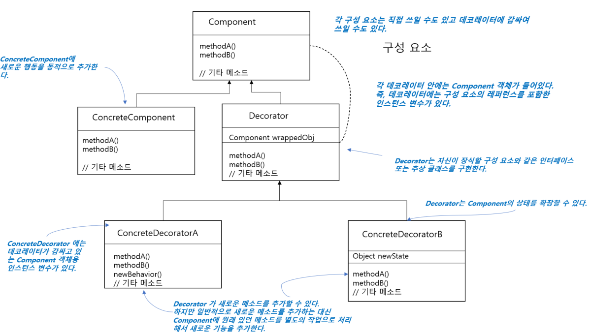

# 8일차 : 2023-08-08 (p.114 ~ 125)

## 요약

### 객체 꾸미기 - 데코레이터 패턴

“상속 맨, 디자인에 눈을 뜨다”

데코레이터 패턴을 배우면 기존 클래스 코드를 바꾸지 않고도 객체에 새로운 임무를 추가할 수 있다.

**초대형 커피 전문점, 스타버즈**

주문 시스템 클래스

고객은 커피를 주문할 때 우유나 두유, 모카를 추가하고 그 위에 휘핑크림을 얹기도 한다.

⇒ HouseBlendWithSteamedMilkandMocha, DarkRoastWithSteamedMilandMocha 등 등…..

클래스가 기하급수적으로 늘어날수 있다…

클래스가 많이 필요할까???

Beverage 클래스에 우유, 두유, 모카, 휘핑 크림 첨가 여부를 보여주는 인스턴스 변수를 추가해보자

클래스가 5개로 줄어들었지만 이 설계에 문제점이 무엇일까?? 생각해보자

- 첨가물 가격이 변한다면?? 기존 코드를 수정해야 하지 않을까?
- 첨가물의 종류가 많아지면 새로운 메소드를 추가해야하고, 슈퍼 클래스 cost() 도 수정해야한다.
- 새로운 음료가 출시 된다면??  그 중에서 특정 첨가물이 들어가면 안되는 음료가 존재한다면??

⇒ 요구사항에 따라서 기존 코드가 변경 될 확률이 매우 높아 보인다.

**OCP 살펴보기**

디자인 원칙 :  클래스는 확장에는 열려 있어야 하지만 변경에는 닫혀 있어야 한다.

우리의 목표는 기존 코드를 건드리지 않고 확장으로 새로운 행동을 추가하는 것이다.

이 목표를 달성하면 ? ⇒ 새로운 기능을 추가할 때 급변하는 주변 환경에 잘 적응하는 유연하고 튼튼한 디자인을 만들 수 있다.

**데코레이터 패턴 살펴보기**

상속을 써서 음료 가격과 첨가물(샷, 시럽 ,우유 , 휘핑크림 등) 가격을 합해서 총 가격을 산출하는 방법은 그리 좋은 방법이 아니다.

클래스가 어마어마하게 많아지거나 일부 서브클래스에는 적합하지 않는 기능을 추가해야 하는 문제가 있기 때문이다.

다른 방법을 생각해보자

⇒ 특정 음료에서 시작해서 첨가물로 그 음료를 **장식(decorate)**하는 방법은?

어떤 고객이 모카와 휘핑크림을 추가한 다크 로스트 커피를 주문한다고 가정 해보자

- DarkRoast 객체를 가져온다.
- Mocha 객체로 장식한다.
- Whip 객체로 장식한다.
- cost () 메소드를 호출한다. 이때 첨가물의 가격을 계산하는 일은 해당 객체에게 위임한다.

**주문 시스템에 데코레이터 패턴 적용하기**

- DarkRoast 객체에서 시작한다.

- 고객이 모카를 주문했으니깐 Mocha 객체를 만들고 그 객체로 DarkRoast 를 감싼다.

- 고객이 휘핑크림도 추가했으니깐 Whip 데코레이터를 만들어 Mocha를 감싼다.

- 이제 가격을 계산 해보자 ! 가격을 구할 때는 가장 바깥쪽에 있는 데코레이터인 Whip()의 cost()를 호출한다. 그러면 Whip은 그 객체가 장식하고 있는 객체에게 가격 계산을 위임한다. 가격이 구해지고 나면, 계산된 가격에 휘핑크림의 가격을 더한 다음 그 결과값을 리턴한다.

- 데코레이터의 슈퍼클래스는 자신이 장식하고 있는 객체의 슈퍼클래스와 같다.
- 한 객체를 여러 개의 데코레이터로 감쌀 수 있다.
- 데코레이터는 자신이 감싸고 있는 객체와 같은 슈퍼클래스를 가지고 있기에 원래 객체가 들어갈 자리에 데코레이터 객체를 넣어도 상관없다.
- 데코레이터는 자신이 장식하고 있는 객체에게 어떤 행동을 위임하는 일 말고도 추가 작업을 수행 할 수 있다.
- 객체는 언제든지 감쌀 수 있기 때문에 실행 중에 필요한 데코레이터를 마음대로 적용할 수 있다.

**데코레이터 패턴의 정의**

<aside>
💡 **데코레이터 패턴(Decorator Pattern)**으로 객체에 추가 요소를 동적으로 더 할 수 있다.
데코레이터를 사용하면 서브클래스를 만들 때 보다 훨씬 유연하게 기능을 확장할 수 있다.

</aside>

## 발췌

> 서브클래스를 만드는 방식으로 행동을 상속 받으면 그 행동은 컴파일할 때 완전히 결정된다. 게다가 모든 서브클래스에서 똑같은 행동을 상속 받아야 한다.  하지만 구성(Composition)으로 객체의 행동을 확장하면 실행 중에 동적으로 행동을 설정할 수 있다.
>

> 코드에서 확장해야 할 부분을 선택할 때는 세심한 주의를 기울여야 한다. 무조건 OCP를 적용한다면 괜히 쓸데없는 일을 하며 시간을 낭비할 수 있으며, 필요 이상으로 복잡하고 이해하기 힘든 코드를 만들게 되는 부작용이 발생할 수 있다.
>

## 메모

OCP : 개방 - 폐쇄 원칙 (Open / Closed pinciple) 에 대해서 정리해보자

<aside>
💡 소프트웨어 구성요소 (컴포넌트, 클래스, 모듈 , 함수) 는 확장에는 열려있고, 변경에는 닫혀 있어야 한다는 원칙

</aside>

- 소프트웨어 요소는 확장에는 열려 있으나 변경에는 닫혀 있어야 한다.
    - 개방에는 Open, 변경에는 Close
    - 변경될 것과 변하지 않을 것을 엄격히 구분한다.
    - 이 두 모듈이 만나는 지점에 인터페이스를 정의한다.
- 요구 사항의 변경이나 추가사항이 발생하더라도 기존 구성요소는 수정이 일어나지 말아야 하며, 기존 구성요소를 쉽게 확장해서 재사용할 수 있어야 한다는 뜻이다.
    - 기능을 변경하거나 확장할 수 있으면서 그 기능을 사용하는 코드는 수정하지 않는다.
- 확장하려면 코드를 변경해야 하는데??
    - 확장되는 부분을 추상화해서 표현하자
    - 다형성을 활용하자
- 인터페이스를 구현한 새로운 클래스를 하나 만들어서 새로운 기능을 구현
    - 새로운 클래스를 만드는 것은 기존 코드를 변경하는 것이 아니다.
    - 구현에 의존하기 보단 정의한 인터페이스에 의존하도록 하자

**개방 폐쇄 원칙은 유연함에 대한 것**

: 개방 폐쇄 원칙은 변경의 유연함과 관련된 원칙이다. 만약 기존 기능을 확장하기 위해 기존 코드를 수정해주어야 한다면, 새로운 기능을 추가하는 것이 점점 힘들어진다.

즉, 확장에는 닫히고 변경에는 열리는 반대 상황이 발생하는 것이다.

개방 폐쇄 원칙은 변화가 예상 되는 것을 추상화해서 변경의 유연함을 얻도록 해준다.

이 말은 변화되는 부분을 추상화하지 못하면 개방 폐쇄 원칙을 지킬 수 없게 되어 시간이 흐를 수록 , 기능 변경이나 확장을 어렵게 만드는 것을 뜻한다. 따라서 코드에 대한 변화 요구가 발생하면 변화와 관련된 구현을 추상화해서 개방 폐쇄 원칙에 맞게 수정할 수 있는지 확인하는 습관을 갖도록 하자