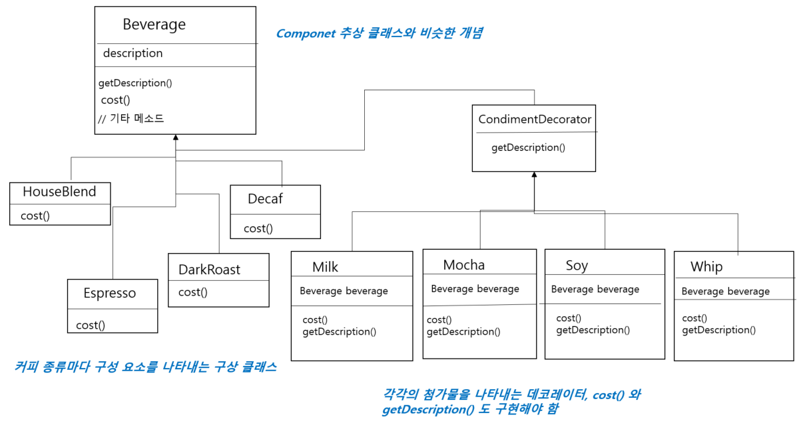
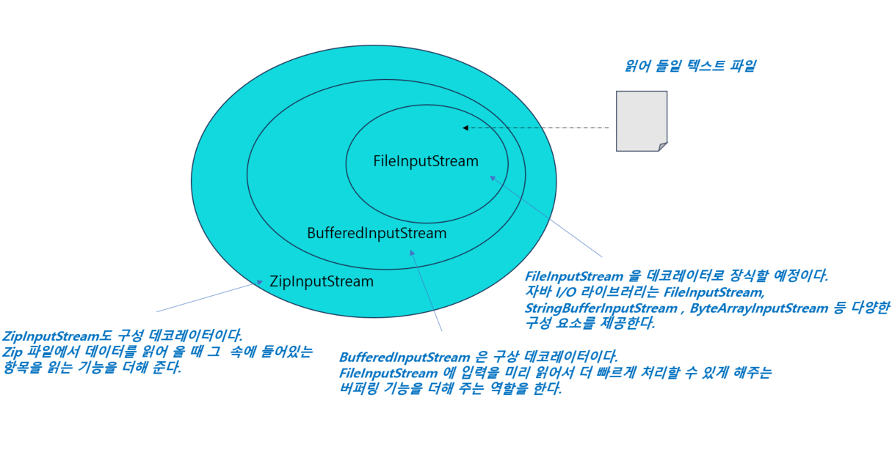
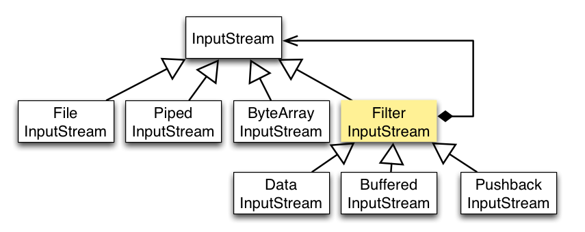

# 9일차 : 2023-08-08 (p.126 ~ 139)


## 요약

**Beverage 클래스 장식하기**



- CondimentDecorator 가 Beverage 클래스를 확장하고 있다.
- 데코레이터 형식이 데코레이터로 감싸는 객체의 형식과 같다
- 데코레이터 패턴에서는 상속을 사용해서 형식을 맞춘다.

어떤 구성 요소를 가지고 데코레이터를 만들 때 새로운 행동을 추가한다.

⇒ 슈퍼클래스로부터 행동을 상속받아서 얻는 것이 아니라 객체를 구성해서 얻는다.

Beverage 서브클래스를 만든 이유는 행동을 상속받으려고 만든 것이 아니라 형식을 맞추기 위함이다.  행동은 기본 구성 요소와는 다른 데코레이터 등을 인스턴스 변수에 저장하는 식으로 연결할 수 있다.

**데코레이터 방식의 좋은 점은??**

:  객체 구성(인스턴스 변수로 다른 객체를 저장하는 방식)을 이용하고 있기 때문에 음료에 첨가물을 다양하게 추가해도 유연성을 잃지 않을 수 있다.

**상속과의 차이점은?**

: 상속만 사용했으면 행동이 컴파일 시에 정적으로 결정되어서 슈퍼클래스에서 받은 것과 코드로 오버라이드한 것만 사용할 수 있다. 하지만 구성을 활용하면 실행 중에 데코레이터를 마음대로 조합해서 사용할 수 있다는 장점이 있다.

⇒ 데코레이터를 언제든지 구현해서 새로운 행동을 추가할 수 있다. 상속에만 의존했으면 새로운 행동을 추가할 때마다 기존 코드를 바꿔야 한다.

**커피 주문 시스템 코드 만들기**

Beverage 클래스

```java
public abstract class Beverage {
    String description = "제목 없음";

		// getDescription 은 구현되어 있지만 cost() 서브 클래스에서 구현해야 한다.
    public String getDescription() { 
        return description;
    }
    
    public abstract double cost();
}
```

- Beverage 는 추상 클래스이며, getDescription()과 cost() 라는 2개의 메소드를 가진다.

첨가물(condiment)을 나타내는 추상 클래스  ← 데코레이터 클래스

```java
public abstract class CondimentDecorator extends Beverage {
    // 각 데코레이터가 감쌀 음료를 나타내는 Beverage 객체를 여기에서 지정한다.
		// 음룔르 지정할 때는 데코레이터에서 어떤 음료든 감쌀 수 있도록
		// Beverage 슈퍼클래스 유형을 사용한다. 
    Beverage beverage;

		// 모든 첨가물 데코레이터에 getDescription() 메소드를 새로 구현하도록 만들자
    // 추상 메소드로 선언
    public abstract String getDescription();
}
```

- Beverage 객체가 들어갈 자리에 들어 갈 수 있어야 하므로 Beverage 클래스를 확장한다.

**음료 코드 구현하기**

```java
public class Espresso extends Beverage{

    public Espresso() {
        description = "에스프레소";
    }

    @Override
    public double cost() {
        return 1.99;
		// 에스프레소 가격을 계산한다. 
		// 이 클래스는 첨가물 가격을 걱정할 필요가 없다.
		// 그냥 에스프레소 가격을 리턴하면 된다.
    }
}
```

- Beverage 클래스를 확장한다.
- 클래스 생성자 부분에서 description 변수값을 설정한다.
    - description 인스턴스 변수는 Beverage 로부터 상속받은 것이다.

```java
public class HouseBlend extends Beverage{
    public HouseBlend() {
        description = "하우스 블렌드 커피";
    }

    @Override
    public double cost() {
        return .89;
    }
}
```

**첨가물 코드 구현하기**

```java
public class Mocha extends CondimentDecorator {

    public Mocha(Beverage beverage) {
        this.beverage = beverage;
    }

    @Override
    public double cost() {
        return beverage.cost() + .20;
    }

    @Override
    public String getDescription() {
        return beverage.getDescription() + ", 모카";
    }
}
```

- Mocha는 데코레이터라서 CondimentDecorator 를 확장한다.
- CondimentDecorator 에서 Beverage 를 확장한다.

**커피 주문 시스템 코드 테스트**

```java
public class StarbuzzCoffee {

    public static void main(String[] args) {
        Beverage beverage = new Espresso();
        System.out.println(beverage.getDescription() + " $ " + beverage.cost());

        Beverage beverage1 = new DarkRoast();
        beverage1 = new Mocha(beverage1);
        beverage1 = new Mocha(beverage1);
        beverage1 = new Whip(beverage1);
        System.out.println(beverage1.getDescription() + " $ " + beverage1.cost());

        Beverage beverage2 = new HouseBlend();
        beverage2 = new Soy(beverage2);
        beverage2 = new Mocha(beverage2);
        beverage2 = new Whip(beverage2);

        System.out.println(beverage2.getDescription() + " $" + beverage2.cost());

    }
}
```

출력

-에스프레소 $ 1.99
-다크 로스트, 모카, 모카, 휘핑크림 $ 1.49
-하우스 블렌드 커피 , 두유, 모카, 휘핑크림 $1.34

**데코레이터가 적용된 예 : 자바I/O**




**java.io 클래스와 데코레이터 패턴**

- BufferedInputStream 과 ZipInputStream 은 둘 다 FilterInputStream 을 확장한 클래스이다.
- FilterInputStream 은 InputStream을 확장한 클래스이다.
- InputStream 은 추상 데코레이터 클래스 역할을 한다.




## 발췌

> 디자인의 유연성 면에서 보면 상속으로 확장하는 일은 별로 좋은 선택이 아니다.
>

> 기존 코드 수정 없이 행동을 확장해야 하는 상황도 있다.
>

> 구성과 위임으로 실행 중에 새로운 행동을 추가할 수 있다.
>

> 상속 대신 데코레이터 패턴으로 행동을 확장할 수 있다.
>

> 데코레이터 패턴은 구상 구성 요소를 감싸 주는 데코레이터를 사용한다.
>

> 데코레이터 클래스의 형식은 그 클래스가 감싸는 클래스 형식을 반영한다.
>

> 데코레이터 패턴을 사용하면 자잘한 객체가 매우 많이 추가될 수 있고, 데코레이터를 너무 많이 사용하면 코드가 필요 이상으로 복잡해진다.
>

## 메모

```java
public abstract class Beverage {
    String description = "제목 없음";
    public String getDescription() {
        return description;
    }
    public abstract double cost();
}
```

슈퍼 클래스 Beverage 의 cost 메소드는 추상 메소드이다.

Beverage 을 상속 받는 서브클래스는 cost () 를 반드시 오버라이딩 해야 한다.

```java
public abstract class CondimentDecorator extends Beverage {
    Beverage beverage;
    public abstract String getDescription();
}
```

서브클래스에서 추상클래스를 상속받고 cost() 메소드를 오버라이딩 하지 않아도 에러가 발생하지 않았다.

그 이유는

⇒ 서브 클래스가 일반 클래스인 경우에는 추상 메소드를 반드시 오버라이딩 해야하지만, 서브 클래스가 추상 클래스인 경우에는 추상 메서드를 오버라이딩 하지 않아도 되기 때문이다.

상속을 사용할 때 주의해야 할 점

- 긴밀한 결합 : 상속을 사용하면 부모 클래스와 자식 클래스 간에 긴밀한 관계가 형성된다.
    - 자식 클래스가 부모 클래스의 내부 구현에 의존하게 되는데, 이로 인해 부모 클래스의 변경이 자식 클래스에 영향을 미칠 수 있다.
- 새로운 기능을 추가하려면 기존 클래스의 하위 클래스를 만들어야 할 수 있다. 이는 클래스의 구조를 변경하거나 확장하기 어렵게 만들 수 있다.

구성(Composition) 의 장점

- 낮은 결합도 : 구성을 사용하면 객체 간의 관계가 더 느슨해진다.
    - 한 객체가 다른 객체의 내부 구현에 의존하지 않기 때문에 변경이 다른 객체에 영향을 덜 주게 된다.
- 유연한 디자인 : 구성을 사용하면 객체를 조합해서 필요한 기능을 구현할 수 있다.
    - 필요한 경우 객체를 추가하거나 교체하여 유연하게 디자인할 수 있다.
- 인터페이스를 통한 확장 :  구성을 사용하면 인터페이스를 통해 다양한 객체를 조합할 수 있으며, 객체 간의 상호작용을 더욱 추상화 할 수 있다.
- 런타임에 변경 가능 : 객체를 구성하는 방식을 변경하더라도 코드 변경이 필요하지 않을 수 있다.