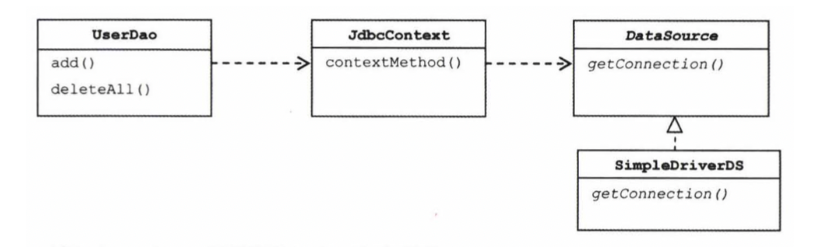
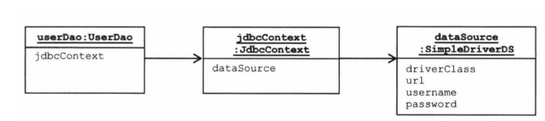

# 2024-07-31 10일차 p.224 ~ 240

## 3.3 JDBC 전략 패턴의 최적화

### 3.3.1 전략 클래스의 추가 정보

이제 add() 메소드에도 적용해보자.

`리스트 3-13 add() 메소드의 PreparedStatement 생성 로직을 분리한 클래스`

등록할 사용자 정보는 클라이언트에 해당하는 add() 메서드가 갖고 있다.
따라서 클라이언트가 AddStatement 의 전략을 수행하려면 부가정보인 user 를 제공해줘야 한다.
클라이언트로부터 User 타입 오브젝트를 받을 수 있도록 리스트 3-14 와 같이 AddStatement 의 생성자를
통해 제공받게 만들자.

`리스트 3-14 User 정보를 생성자로부터 제공받도록 만든 AddStatement`

```java
public class AddStatement implements StatementStrategy {
    
    User user;

    public AddStatement(User user) {
        this.user = user;
    }

    @Override
    public PreparedStatement makePreparedStatement(Connection c) throws SQLException {
        PreparedStatement ps = c.prepareStatement("insert into user(id, name , password) values (?,?,?)");
        
        ps.setString(1,user.getId());
        ps.setString(2,user.getName());
        ps.setString(3,user.getPassword());
        return ps;
    }
}

```

다음은 클라이언트인 UserDao 의 add() 메소드를 리스트 3-15와 같이 User 정보를 생성자를 통해
전달해주도록 수정한다.

`리스트 3-15  user 정보를 AddStatement에 전달해주는 add() 메소드`

```java
 public void add(User user) throws SQLException {
        StatementStrategy st = new AddStatement(user);
        jdbcContextWithStatementStrategy(st);
    } 
```

### 3.3.2 전략과 클라이언트의 동거

먼저 DAO 메소드마다 새로운 StatementStrategy 구현 클래스를 만들어야 한다는 점이다.
이렇게 되면 기존 UserDao 때보다 클래스 파일의 개수가 많이 늘어난다.
이래서는 런타임 시에 다이내믹하게 DI 해준다는 점을 제외하면 로직마다 상속을 사용하는 템플릿 메소드 패턴을 적용했을 때보다 그다지 나을게 없다.

또 다른 불만은 DAO 메소드에서 StatementStrategy 에 전달할 User 와 같은 부가적인 정보가 있는 경우, 이를 위해 오브젝트를 전닯받는 생성자와 이를 저장해둘
인스턴스 변수를 번거롭게 만들어야 한다는 점이다.


### 로컬 클래스

클래스 파일이 많아지는 문제는 간단한 해결 방법이 있다.
StatementStrategy 전략 클래스를 매번 독립된 파일로 만들지 말고 UserDao 클래스 안에 내부 클래스로 정의해버리는 것이다.


`리스트 3-16 add() 메소드 내의 로컬 클래스로 이전한 AddStatement`

```java
	public void add(User user) throws SQLException {
		  class AddStatement implements StatementStrategy {
		    User user;
		    
		    public AddStatement(User user) {
		      this.user = user;
		    }

        @Override
        public PreparedStatement makePreparedStatement(Connection c) throws SQLException {
          PreparedStatement ps = c.prepareStatement("insert into users(id, name , password ) values (?,?,?)");
          
          ps.setString(1, user.getId());
          ps.setString(2, user.getName());
          ps.setString(3, user.getPassword());
          return ps;
        }
		  }

    StatementStrategy st = new AddStatement(user);
    jdbcContextWithStatementStrategy(st);


}
```


> **중첩 클래스의 종류**
> <br/>
> 다른 클래스 내부에 정의되는 클래스는 중첩 클래스(nested class) 라고 한다.
> 중첩 클래스는 독립적으로 오브젝트로 만들어질 수 있는 스태틱 클래스와 자신이 정의된 클래스의 오브젝트 안에서만 만들어질 수 있는 내부 클래스로 구분된다.
> <br/>
> 내부 클래스는 다시 범위에 따라 세 가지로 구분된다. 멤버 필드처럼 오브젝트 레벨에 정의되는 멤버 내부 클래스와 메소드 레벨에 정의되는 로컬 클래스 ,
> 그리고 이름을 갖지 않는 익명 내부 클래스다. 익명 내부 클래스의 범위는 선언된 위치에 따라서 다르다.


AddStatement 클래스를 로컬 클래스로서 add() 메소드 안에 집어넣은 것이다.
이런식으로 클래스를 정의하는 방식이 생소할지 모르겠지만 자바 언어에서 허용하는 클래스 선언 방법의 하나다.
마치 로컬 변수를 선언하듯이 선언하면 된다.

로컬 클래스에는 또 한 가지 장점이 있다. 바로 로컬 클래스는 클래스가 내부 클래스이기 때문에
자신이 선언된 곳의 정보에 접근할 수 있다는 점이다.

내부 메소드는 자신이 정의된 메소드의 로컬 변수에 직접 접근할 수 있기 때문입니다.

`리스트 3-17 add() 메소드의 로컬 변수를 직접 사용하도록 수정한 AddStatement`

```java
 public void add(final User user) throws SQLException {
        class AddStatement implements  StatementStrategy {

            @Override
            public PreparedStatement makePreparedStatement(Connection c) throws SQLException {
                PreparedStatement ps = c.prepareStatement("insert into user(id, name , password) values (?,?,?)");

                ps.setString(1,user.getId());
                ps.setString(2,user.getName());
                ps.setString(3,user.getPassword());
                return ps;
            }
        }
        StatementStrategy st = new AddStatement();
        jdbcContextWithStatementStrategy(st);
      
    }
```

로컬 클래스로 만들어두니 장점이 많다. AddStatement 는 복잡한 클래스가 아니므로 메소드 안에서
정의해도 그다지 복잡해 보이지 않는다. 
메소드마다 추가해야 했던 클래스 파일을 하나 줄일 수 있다는 것도 장점이고, 내부 클래스의 특징을 이용해 로컬 변수를 바로 가져다 사용할 수 있다는 것도 큰 장점이다.


### 익명 내부 클래스

한 가지 더 욕심을 내보자. AddStatement 클래스는 add() 메소드에서만 사용할 용도로 만들어졌다. 그렇다면 
좀 더 간결하게 클래스 이름도 제거할 수 있다. 
자바에는 이름조차 필요 없는 익명 내부 클래스가 있지 않은가
AddStatement 를 익명 내부 클래스로 만들어보자 . 익명 내부 클래스는 선언과 동시에
오브젝트를 생성한다. 이름이 없기 때문에 클래스 자신의 타입을 가질 수 없고, 구현한 인터페이스
타입의 변수에만 저장할 수 있다.

> **익명 내부 클래스**
> <br/>
> 익명 내부 클래스는 이름을 갖지 않는 클래스다.

`리스트 3-18 AddStatement 를 익명 내부 클래스로 전환`

```java
	public void add(final User user) throws SQLException {
		jdbcContextWithStatementStrategy(
				new StatementStrategy() {			
					public PreparedStatement makePreparedStatement(Connection c)
					throws SQLException {
						PreparedStatement ps = 
							c.prepareStatement("insert into users(id, name, password) values(?,?,?)");
						ps.setString(1, user.getId());
						ps.setString(2, user.getName());
						ps.setString(3, user.getPassword());
						
						return ps;
					}
				}
		);
	}

```


## 3.4 컨텍스트와 DI

### 3.4.1 JdbcContext 의 분리

전략 패턴의 구조로 보자면 UserDao 의 메소드가 클라이언트이고, 익명 내부 클래스로 만들어지는 것이
개별적인 전략이고, jdbcContextWithStatementStrategy() 메소드는 컨텍스트다.

컨텍스트 매서드는 UserDao 내의 PreparedStatement 를 실행하는 기능을 가진 메소드에서 공유할 수 있다.
그런데 JDBC 의 일반적인 작업 흐름을 담고 있는
jdbcContextWithStatementStrategy() 는 다른 DAO 에서도 사용 가능하다.
그러니 jdbcContextWithStatementStrategy() 를 UserDao 클래스 밖으로 독립시켜서 모든 DAO가
사용할 수 있게 해보자.

#### 클래스 분리

분리해서 만들 클래스의 이름은 JdbcContext 라고 하자. 
JdbcContext 에 UserDao 에 있던 컨텍스트 메소드를 workWithStatementStrategy() 라는 이름으로 옮겨 놓는다.

`리스트 3-21 JDBC 작업 흐름을 분리해서 만든 JdbcContext 클래스`

```java
public class JdbcContext {
    DataSource dataSource;

    public void setDataSource(DataSource dataSource) {
        this.dataSource = dataSource;
    }

    public void workWithStatementStrategy(StatementStrategy stmt) throws SQLException {
        Connection c = null;
        PreparedStatement ps = null;

        try {
            c = dataSource.getConnection();

            ps = stmt.makePreparedStatement(c);

            ps.executeUpdate();
        } catch (SQLException e) {
            throw e;
        } finally {
            if (ps != null) { try { ps.close(); } catch (SQLException e) {} }
            if (c != null) { try {c.close(); } catch (SQLException e) {} }
        }
    }
}
```
다음은 리스트 3-22 처럼 UserDao 가 분리된 JdbcContext 를 DI 받아서 사용할 수 있게 만든다.


`리스트 3-22 JdbcContext 를 DI 를 받아서 사용하도록 만든 UserDao`

```java
public class UserDao {
    private JdbcContext jdbcContext;

    public void setJdbcContext(JdbcContext jdbcContext) {
        this.jdbcContext = jdbcContext;
    }
    
    public void add(final User user) throws SQLException {
        this.jdbcContext.workWithStatementStrategy(new StatementStrategy() {
            @Override
            public PreparedStatement makePreparedStatement(Connection c) throws SQLException {
                PreparedStatement ps = c.prepareStatement("insert into user(id, name , password) values (?,?,?)");

                ps.setString(1,user.getId());
                ps.setString(2,user.getName());
                ps.setString(3,user.getPassword());
                return ps;
            }
        });
    }
    
    public void deleteAll() throws SQLException {
        this.jdbcContext.workWithStatementStrategy(new StatementStrategy() {
            @Override
            public PreparedStatement makePreparedStatement(Connection c) throws SQLException {
                ...
            }
        });
    }
}

```

#### 빈 의존관계 변경

UserDao 는 이제 JdbcContext 에 의존하고 있다. 그런데 JdbcContext 는 인터페이스인
DataSource 와 달리 구체 클래스다. 스프링의 DI는 기본적으로 인터페이스를 사이에
두고 의존 클래스를 바꿔서 사용하도록 하는 게 목적이다.
하지만 이 경우 JdbcContext 는 그 자체로 독립적인 JDBC 컨텍스트를 제공해주는
서비스 오브젝트로서 의미가 있을 뿐이고 구현 방법이 바뀔 가능성은 없다. 

따라서 인터페이스를 구현하도록 만들지 않았고, UserDao 와 JdbcContext 는
인터페이스를 사이에 두지 않고 DI를 적용하는 특별한 구조가 된다. 


`그림 3-4 JdbcContext 를 적용한 UserDao 의 의존관계`



스프링의 빈 설정은 클래스 레벨이 아니라 런타임 시에 만들어지는 오브젝트 레벨의 의존관계에 따라 정의된다.
빈으로 정의되는 오브젝트 사이의 관계를 그러보면 그림 3-5 와 같다.
기존에는 userDao 빈이 dataSource 빈을 직접 의존했지만 이제는 jdbcContext 빈이 그 사이에 끼게된다.

`그림 3-5 JdbcContext 가 적용된 빈 오브젝트 관계`




`리스트 3-23 JdbcContext 빈을 추가하도록 수정한 설정 파일`


### 3.4.2 JdbcContext 의 특별한 DI

JdbcContext 를 분리하면서 사용했던 DI 방법에 대해 좀 더 생각해보자.
UserDao 와 JdbcContext 사이에는 인터페이스를 사용하지 않고 DI를 적용했다.
지금까지 적용했던 DI 에서는 클래스 레벨에서 구체적인 의존관계가 만들어지지 않도록 인터페이스를 사용했다.
인터페이스를 적용했기 때문에 코드에서 직접 클래스를 사용하지 않아도 됐고, 그 덕분에 설정을 변경하는 것만으로도 얼마든지 다양한 의존 오브젝트를 변경해서 사용할 수 있게 됐다.

그런데 UserDao 는 인터페이스를 거치지 않고 코드에서 바로 JdbcContext 클래스를 사용하고 있다. 
UserDao 와 JdbcContext 는 클래스 레벨에서 의존관계가 결정된다. 
비록 런타임 시에 DI 방식으로 외부에서 오브젝트를 주입해주는 방식을 사용하긴 했지만,
의존 오브젝트의 구현 클래스를 변경할 수는 없다.

### 스프링 빈으로 DI

이렇게 인터페이스를 사용하지 않고 DI를 적용하는 것은 문제가 있지 않을까?
스프링 DI 의 기본 의도에 맞게 JdbcContext 의 메소드를 인터페이스로 뽑아내어 정의해두고,
이를 UserDao 에서 사용하게 해야 하지 않을까?

의존관계 주입이라는 개념을 충실히 따르자면, 인터페이스를 사이에 둬서 클래스 레벨에서는 의존관계가 고정되지 않게 하고,
런타임 시에 의존할 오브젝트와의 관계를 말해서 온전한 DI라고 볼 수는 없다.
그러나 스프링의 DI는 넓게 보자면 객체의 생성과 관계설정에 대한 제어권한을 오브젝트에서 제거하고 외부로
위임했다는 IoC 라는 개념을 포괄한다. 그런 의미에서 JdbcContext 를 스프링을 이용해 UserDao 객체에서
사용하게 주입했다는 건 DI의 기본을 따르고 있다고 볼 수 있다.


인터페이스를 사용해서 클래스를 자유롭게 변경할 수 있게 하지는 않았지만,
JdbcContext 를 UserDao 와 DI 구조로 만들어야 할 이유를 생각해보자.

첫째는 JdbcContext 가 스프링 컨테이너의 싱글톤 레지스트리에서 관리되는 싱글톤 빈이 되기 때문이다.
JdbcContext 는 그 자체로 변경되는 상태 정보를 갖고 있지 않다. 
내부에서 사용할 dataSource 라는 인스턴스 변수는 있지만, dataSource 는 읽기전용이 되므로 JdbcContext 가 싱글톤이 되는 데 아무런 문제가 없다.

둘째는 JdbcContext 가 DI를 통해 다른 빈에 의존하고 있기 때문이다.
이 두 번째 이유가 중요하다. JdbcContext 는 dataSource 프로퍼티를 통해 DataSource 오브젝트를 주입받도록 되어 있다.
DI를 위해서는 주입되는 오브젝트와 주입받는 오브젝트 양쪽 모두 스프링 빈으로 등록돼야 한다.
스프링이 생성하고 관리하는 IoC 대상이어야 DI에 참여할 수 있기 때문이다.
따라서 JdbcContext 는 다른 빈을 DI 받기 위해서라도 스프링 빈으로 등록돼야 한다.

실제로 스프링에는 드물지만 이렇게 인터페이스를 사용하지 않는 클래스를 직접 의존하는 DI가 등장하는 경우도 있다.
여기서 중요한 것은 인터페이스의 사용 여부다. 왜 인터페이스를 사용하지 않았을까?
인터페이스가 없다는 건 UserDao 와 JdbcContext 가 매우 긴밀한 관계를 가지고 강하게 결합되어 있다는 의미다.

UserDao 는 항상 JdbcContext 클래스와 함께 사용돼야 한다.
비록 클래스는 구분되어 있지만 이 둘은 강한 응집도를 갖고 있다.

UserDao 가 JDBC 방식 대신 JPA 나 하이버네이트 같은 ORM 을 사용해야 한다면 JdbcContext 도 통째로 
바뀌어야 한다.

단, 이런 클래스를 바로 사용하는 코드 구성을 DI에 적용하는 것은 가장 마지막 단계에서 고려해볼 
사항임을 잊지 말 그저 인터페이스를 만들기가 귀찮으니까 그냥 클래스를 사용하자는 건 잘못된 생각이다.


### 코드를 이용하는 수동 DI

이 방법을 쓰려면 JdbcContext 를 스프링의 빈으로 등록해서 사용했던 첫 번째 이유인
싱글톤으로 만들려는 것은 포기해야 한다. 물론 스프링의 도움을 받아서
싱글톤으로 만드는 걸 포기했다고 해서 DAO 메소드가 호출될 때마다 JdbcContext 오브젝트를
새로 만드는 무식한 방법을 사용해야 한다는 뜻은 아니다.

조금만 타협을 해서 DAO 마다 하나의 JdbcContext 오브젝트를 갖고 있게 하는 것이다.
DAO 메소드에서 매번 만들어 사용한다면, 수만, 수백만의 JdbcContext 오브젝트가 만들어지겠지만, 
DAO 마다 하나씩 만 만든다면 기껏해야 DAO 개수만큼

JdbcContext 를 스프링 빈으로 등록하지 않았으므로 다른 누군가가 JdbcContext 의 생성과 초기화를 책임져야 한다.
JdbcContext 의 제어권은 UserDao가 갖는 것이 적당하다.
자신이 사용할 오브젝트를 직접 만들고 초기화하는 전통적인 방법을 사용하는 것이다.
어차피 JdbcContext 클래스의 정체도 알고 있으니 문제 될 것은 없다.

남은 문제는 JdbcContext 를 스프링 빈으로 등록해서 사용했던 두 번째 이유다.
JdbcContext 는 다른 빈을 인터페이스를 통해 간접적으로 의존하고 있다.
다른 빈을 의존하고 있다면, 의존 오브젝트를 DI를 통해 제공받기 위해서라도 
자신도 빈을 등록돼야 한다고 했다. 
그렇다면 UserDao 에서 JdbcContext 를 직접 생성해서 사용하는 경우에는 어떻게 해야 할까?

여전히 JdbcContext 는 DataSource 타입 빈을 다이내믹하게 주입 받아서 사용해야 한다.
그렇지 않으면 DataSource 구현 클래스를 자유롭게 바꿔가면서 적용할 수 없다.
하지만 JdbcContext 는 자신은 스프링의 빈이 아니니 DI 컨테이너를 통해 DI 받을 수는 없다.

이런 경우에 사용할 수 있는 방법이 한 가지 있다.
그것은 JdbcContext 에 대한 제어권을 갖고 생성과 관리를 담당하는 UserDao 에게 DI까지 맡기는 것이다.
오브젝트를 생성하고 그 의존 오브젝트를 수정자 메소드로 주입해주는 것이 바로 DI의 동작원리가 아닌가?
그렇다면 UserDao 가 임시로 DI 컨테이너처럼 동작하게 만들면 된다.

JdbcContext 에 주입해줄 의존 오브젝트인 DataSource 는 UserDao 가 대신 DI 받도록 하면 된다.
UserDao 는 직접 DataSource 빈을 필요로 하지 않지만 JdbcContext 에 대한 DI 작업에 사용할 용도로 제공받는 것이다.


`그림 3-6 코드를 통한 JdbcContext DI 구조`

스프링의 설정 파일에 userDao 와 dataSource 두 개만 빈으로 정의한다.

`리스트 3-24 jdbcContext 빈을 제거한 설정파일`

```xml
<?xml version="1.0" encoding="UTF-8"?>
<beans xmlns="http://www.springframework.org/schema/beans"
	xmlns:xsi="http://www.w3.org/2001/XMLSchema-instance"
	xsi:schemaLocation="http://www.springframework.org/schema/beans 
						http://www.springframework.org/schema/beans/spring-beans-3.0.xsd">
	<bean id="dataSource" class="org.springframework.jdbc.datasource.SimpleDriverDataSource">
		<property name="driverClass" value="com.mysql.jdbc.Driver" />
		<property name="url" value="jdbc:mysql://localhost/springbook?characterEncoding=UTF-8" />
		<property name="username" value="spring" />
		<property name="password" value="book" />
	</bean>
	
	<bean id="userDao" class="springbook.user.dao.UserDao">
		<property name="dataSource" ref="dataSource" />
	</bean> 
</beans>

```

설정파일만 보자면 UserDao 가 직접 DataSource 를 의존하고 있는 것 같지만, 내부적으로는 JdbcContext 를 통해 간접적으로 
DataSource 를 사용하고 있을 뿐이다.

`리스트 3-25 JdbcContext 생성과 DI 작업을 수행하는 setDataSource() 메소드`

```java
public class UserDao {
    private DataSource dataSource;

    public void setDataSource(DataSource dataSource) {
        this.jdbcContext = new JdbcContext();
        this.jdbcContext.setDataSource(dataSource);

        this.dataSource = dataSource;
    }
}
```

UserDao 의 메소드에서는 JdbcContext 가 외부에서 빈으로 만들어져 주입된 것인지, 내부에서 직접 만들고 초기화한 것인지 구분할 필요도 없고 구분할 수도 없다.

이 방법의 장점은 굳이 인터페이스를 두지 않아도 될 만큼 긴밀한 관계를 갖는 DAO 클래스와
JdbcContext 를 어색하게 따로 빈으로 분리하지 않고 내부에서 직접 만들어 사용하면서도
다른 오브젝트에 대한 DI를 적용할 수 있다는 점이다.
이렇게 한 오브젝트의 수정자 메소드에서 다른 오브젝트를 초기화하고 코드를 이용해 DI 하는 것은 스프링에서도
종종 사용되는 기법이다.

지금까지 JdbcContext 와 같이 인터페이스를 사용하지 않고 DAO 와 밀접한 관계를 갖는 클래스를 DI에 적용하는 방법 두 가지를 알아봤다.
두 가지 방법 모두 장단점이 있다. 인터페이스를 사용하지 않는 클래스와의 의존관계이지만 스프링의 DI를 이용하기 위해
빈으로 등록해서 사용하는 방법은 오브젝트 사이의 실제 의존관계가 설정파일에 명확하게 드러난다는 장점이 있다.