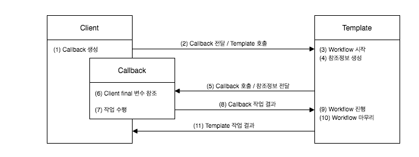

#  p.240 ~ 258

## 3.5 템플릿과 콜백

전략 패턴의 기본 구조에 익명 내부 클래스를 활용한 방식이다.
이런 방식을 스프링에서는 템플릿/콜백 패턴이라고 부른다.

전략 패턴의 컨텍스트를 템플릿이라 부르고,
익명 내부 클래스로 만들어지는 오브젝트를 콜백이라고 부른다.

> **템플릿**
> <br/>
> 템플릿은 어떤 목적을 위해 미리 만들어둔 모양이 있는 틀을 가리킨다.
> 학생들이 도형을 그릴 때 사용하는 도형자 또는 모양자가 바로 템플릿이다.
> 프로그래밍에서는 고정된 틀 안에 바꿀 수 있는 부분을 넣어서 사용하는 경우에 템플릿이라고 부른다.
> JSP 는 HTML 이라는 고정된 부분에 EL 과 스크립릿이라는 변하는 부부을 넣은 일종의 템플릿 파일이다.


>**콜백**
> <br/>
> 콜백(callback) 은 실행되는 것을 목적으로 다른 오브젝트의 메소드에 전달되는 오브젝트를 말한다.
> 파라미터로 전달되지만 값을 참조하기 위한 것이 아니라 특정 로직을 담은 메소드를 실행시키기 위해 사용된다.
> 자바에선 메소드 자체를 파라미터로 전달할 방법은 없기 때문에 메소드가 담긴 오브젝트를 전달해야 한다. 
> 그래서 펑셔널 오브젝트(functional object)라고도 한다.


### 3.5.1 템플릿/콜백의 동작원리

템플릿은 고정된 작업 흐름을 가진 코드를 재사용한다는 의미에서 붙인 이름이다.
콜백은 템플릿 안에서 호출되는 것을 목적으로 만들어진 오브젝트를 말한다.

### 템플릿/콜백의 특징

여러 개의 메소드를 가진 일반적인 인터페이스를 사용할 수 있는 전략 패턴의 전략과 달리
템플릿/콜백 패턴의 콜백은 보통 단일 메소드 인터페이스를 사용한다.
템플릿의 작업 흐름 중 특정 기능을 위해 한 번 호출되는 경우가 일반적이기 때문이다.
하나의 템플릿에서 여러 가지 종류의 전략을 사용해야 한다면 하나 이상의 콜백 오브젝트를 사용할 수도 있다.
콜백은 일반적으로 하나의 메소드를 가진 인터페이스를 구현한 익명 내부 클래스로 만들어진다고 보면 된다.

콜백 인터페이스의 메소드에는 보통 파라미터가 있다 이 파라미터는 템플릿의 작업 흐름 중에 만들어지는 컨텍스트 정보를 전달받을 때 사용된다.
JdbcContext 에서는 템플릿인 workWithStatementStrategy() 메소드 내에서 생성한 Connection 오브젝트를
콜백의 메소드인 makePreparedStatement() 를 실행할 때 파라미터로 넘겨준다.

PreparedStatement 를 만들기 위해서는 JDBC 컨텍스트/템플릿 안에서 만들어진 DB 커넥션이 필요하기 때문이다.

`그림 3-7 템플릿/콜백의 작업 흐름`




- 클라이언트의 역할은 템플릿 안에서 실행될 로직을 담은 콜백 오브젝트를 만들고, 콜백이 참조할 정보를 제공하는 것이다. 만들어진 콜백은 클라이언트가 템플릿의 메소드를 호출할 때 파라미터로 전달된다.
- 템플릿은 정해진 작업 흐름을 따라 작업을 진행하다가 내부에서 생성한 참조정보를 가지고 콜백 오브젝트의 메소드를 호출한다. 
- 템플릿은 콜백이 돌려준 정보를 사용해서 작업을 마저 수행한다. 경우에 따라 최종 결과를 클라이언트에 다시 돌려주기도 한다.


조금 복잡해 보이지만 DI 방식의 전략 패턴 구조라고 보면 간단하다.
클라이언트가 템플릿 메소드를 호출하면서 콜백 오브젝트를 전달하는 것은 메소드 레벨에서 일어나는 DI 다.
템플릿이 사용할 콜백 인터페이스를 구현한 오브젝트르 메소드를 통해 주입해주는 DI 작업이 클라이언트가 템플릿의 기능을 호출하는 것과 동시에
일어난다. 
일반적인 DI라면 템플릿에 인스턴스 변수를 만들어두고 사용할 의존 오브젝트를 수정자 메소드로 받아서 사용할 것이다.
반면에 템플릿/콜백 방식에서는 매번 메소드 단위로 사용할 오브젝트를 새롭게 전달받는다는 것이 특징이다.
콜백 오브젝트가 내부 클래스로서 자신을 생성한 클라이언트 메소드 내의 정보를 직접 참조한다는 것도 템플릿/콜백의 고유한 특징이다.
클라이언트와 콜백이 강하게 결합된다는 면에서도 일반적인 DI와 조금 다르다.


템플릿/콜백 방식은 전략 패턴과 DI의 장점을 익명 내부 클래스 사용 전략과 결합한 독특한 활용법이라고 이해할 수 있다.
단순히 전략 패턴으로만 보기엔 독특한 특징이 많으므로 템플릿/콜백을 하나의 고유한 디자인 패턴으로 기억해두면 편리하다.


### JdbcContext 에 적용된 템플릿/콜백

템플릿과 클라이언트가 메소드 단위인 것이 특징이다.

`그림 3-8 UserDao/JdbcContext/StatementStrategy 에 적용된 템플릿/콜백 패턴 `

JdbcContext 의 workWithStatementStrategy() 템플릿은 리턴 값이 없는 단순한 구조다. 조회 작업에서는 보통 템플릿의 작업 결과를 
클라이언트에 리턴해준다. 템플릿의 작업 흐름이 좀 더 복잡한 경우에는 한 번 이상 콜백을 호출하기도 여러 개의 콜백을 클라이언트로부터 받아서 사용하기도 한다.

### 3.5.2 편리한 콜백의 재활용

템플릿/콜백 방식은 템플릿에 담긴 코드를 여기저기서 반복적으로 사용하는 원시적인 방법에 비해 많은 장점이 있다.
당장에 JdbcContext 를 사용하기만 해도 기존에 JDBC 기반의 코드를 만들었을 때 발생했던 여러 가지 문제점과 불편한 점을 제거할 수 있다.
클라이언트인 DAO 의 메소드는 간결해지고 최소한의 데이터 액세스 로직만 갖고 있게 된다.

그런데 템플릿/콜백 방식에는 한 가지 아쉬운 점이 있다.  DAO 메소드에서 매번 익명 내부 클래스를 사용하기 때문에
상대적으로 코드를 작성하고 읽기가 조금 불편하다.

### 콜백의 분리와 재활용

그래서 이번에는 복잡한 익명의 내부 클래스의 사요을 최소화할 수 있는 방법을 찾아보자.
JDBC 의 try/catch/finally 에 적용했던 방법을 현재 UserDao 의 메소드에도 적용해보는 것이다.
만약 분리를 통해 재사용이 가능한 코드를 찾아 낼 수 있다면 익명 내부 클래스를 사용한 코드를 간결하게 만들 수도 있다.

`리스트 3-26 익명 내부 클래스를 사용한 클라이언트 코드`

```java
 public void deleteAll() throws SQLException {
        this.jdbcContext.workWithStatementStrategy(new StatementStrategy() {
            @Override
            public PreparedStatement makePreparedStatement(Connection c) throws SQLException {
                return c.prepareStatement("delete from users");
            }
        });
    }
```

바인딩할 파라미터 없이 미리 만들어진 SQL 을 이용해 PreparedStatement 를 만들기만 하면 되는 콜백이 적지는 않을 것이다.
즉 deleteAll() 과 유사한 내용의 콜백 오브젝트가 반복될 가능성이 높다.
그렇다면, 언제나 그랬듯이 중복될 가능성이 있는 자주 바뀌지 않는 부분을 분리해보자.
deleteAll() 메소드의 내용을 통틀어서 바뀔 수 있는 것은 오직 "delete from users" 라는 문자열 뿐이다.


`리스트 3-27 변하지 않는 부분을 분리시킨 deleteAll() 메소드`

```java
import java.sql.SQLException;

public void deleteAll() throws SQLException {
    executeSql("delete from users");
}

private void executeSql(final String query) throws SQLException {
    this.jdbcContext.workWithStatementStrategy(
            new StatementStrategy() {
                public PreparedStatement makePreparedStatement(Connection c)
                        throws SQLException {
                    return c.prepareStatement(query);
                }
            }
    );
}

```


바뀌지 않는 모든 부분을 빼내서 executeSql() 메소드로 만들었다.
바뀌는 부분인 SQL 문장만 파라미터로 받아서 사용하게 만들었다. SQL 을 담은 파라미터를 final 로 선언해서 익명 내부 클래스인 콜백 안에서
직접 사용할수 있게 하는 것만 주의하면 된다.
이렇게 해서 재활용 가능한 콜백을 담은 메소드가 만들어졌다. 이제 모든 고정된 SQL 을 실행하는 DAO  메소드는 
deleteAll() 메소드처럼 executeSQl() 을 호출하는 한줄이면 끝이다.
복잡한 익명 내부 클래스인 콜백을 직접 만들 필요조차 없어졌다. 


변하는 것과 변하지 않는 것을 분리하고 변하지 않는 건 유연하게 재활용할 수 있게 만든다는 간단한 원리를 계속 적용했을 때 이렇게 단순하면서도 안전하게 작성 가능한
JDBC 활용 코드가 완성된다. 바로 이런 겍체지향 언어와 설계를 사용하는 매력이 아닐까.

#### 콜백과 템플릿의 결합

한 단계 더 나아가 보자. executeSql() 메소드는 UserDao 만 사용하기만 사용하기는 아깝다. 
이렇게 재사용 가능한 콜백을 담고 있는 메소드라면 DAO 가 공유할 수 있는 템플릿 클래스 안으로 옮겨도 된다.

엄밀히 말해서 템플릿은 JdbcContext 클래스가 아니라 workWithStatementStrategy() 메소드이므로 JdbcContext 클래스로 콜백 생성과 템플릿 호출이 담긴
executeSql() 메소드를 옮긴다고 해도 문제 될 것은 없다.

`리스트 3-28 JdbcContext 로 옮긴 executeSql() 메소드`

```java
public class JdbcContext {
    //....
    public void executeSql(final String query) throws SQLException {
        workWithStatementStrategy(
                new StatementStrategy() {
                    @Override
                    public PreparedStatement makePreparedStatement(Connection c) throws SQLException {
                        return c.prepareStatement(query);
                    }
                }
        );
    }
}
```

`리스트 3-29 JdbcContext 로 옮긴 executeSql() 을 사용하는 deleteAll() 메소드`

```java
    public void deleteAll() throws SQLException {
        this.jdbcContext.executeSql("delete from users");
    }

```

이제 모든 DAO 메소드에서 executeSql() 메소드를 사용할 수 있게 됐다.
익명 내부 클래스의 사용으로 조금 복잡해 보였던 클라이언트 메소드는 이제 깔끔하고 단순해졌다.
그림 3-9에서 볼수 있듯이 결국 JdbcContext 안에 클라이언트와 템플릿, 콜백이 모두 함께 공존하면서 동작하는 구조가 됐다.

`그림 3-9 콜백 재활용을 적용한 JdbcContext`

일반적으로 성격이 다른 코드들은 가능한 한 분리하는 편이 낫지만, 이 경우는 반대다. 
하나의 목적을 위해 서로 긴밀하게 연관되어 동작하는 응집력이 강한 코드들이기 때문에 한 군데 모여 있는 게 유리하다.
구체적인 구현과 내부의 전략 패턴, 코드에 의한 DI, 익명 내부 클래스 등의 기술은 최대한 감춰두고, 외부에는 꼭 필요한 기능을 제공하는
단순한 메소드만 노출해주는 것이다.

바인딩 파라미터의 개수는 일정하지 않으므로 자바 5에서 추가된 가변인자(varargs) 로 정의해두는 것이 좋다.
콜백에서 PreparedStatement 를 만든 뒤에 바인딩할 파라미터 타입을 살펴서 적절한 설정 메소드를 호출해주는 작업이 조금 복잡할 수는 있겠지만,
한 번 만들어두면 매우 편리하게 사용할 수 있으니 도전해볼만 하다.

### 3.5.3 템플릿/콜백의 응용

템플릿/콜백 패턴은 사실 스프링에서만 사용할 수 있거나 스프링만이 제공해주는 독점적인 기술은 아니다.
하지만 스프링만큼 이 패턴을 적극적으로 활용하는 프레임워크는 없다.
스프링의 많은 API 나 기능을 살펴보면 템플릿/콜백 패턴을 적용하는 경우를 많이 발견할 수 있다.

따지고 보면 DI도 순수한 스프링의 기술은 아니다. 기본적으로 객체지향의 장점을 잘 살려서 설계하고 구현하도록 도와주는 여러 가지 원칙과 패턴의 활용 결과일 뿐이다.
스프링은 단지 이를 편리하게 사용할 수 있도록 도와주는 컨테이너를 제공하고, 이런 패턴의 사용 방법을 지지해주는 것뿐이다.

템플릿/콜백 패턴도 DI와 객체지향 설계를 적극적으로 응용한 결과다.
스프링에는 다양한 자바 엔터프라이즈 기술에서 사용할 수 있도록 미리 만들어져 제공되는 수십 가지 템플릿/콜백 클래스와 API가 있다.

스프링을 사용하는 개발자라면 당연히 스프링이 제공하는 템플릿/콜백 기능을 잘 사용할 수 있어야 한다.

스프링이 제공하는 대부분의 기술은 그 구조를 이해하면 손쉽게 확장해서 쓸 수 있다.
기본적으로 OCP 를 지키고, 전략 패턴과 DI를 바탕에 깔고 있으니 원한다면 언제든지 확장해서 편리한 방법으로 사용할 수 있다.
그런 면에서 스프링의 기본이 되는 전략 패턴과 DI는 물론이고 템플릿/콜백 패턴도 익숙해지도록 학습할 필요가 잇다.

고정된 작업 흐름을 갖고 있으면서 여기저기서 자주 반복되는 코드가 있ㄷ면, 중복 되는 코드를 분리할 방법을 생각해보는 습관을 기르자.
중복된 코드는 먼저 메소드로 분리하는 간단한 시도를 해본다. 그중 일부 작업을 필요에 따라 바꾸어 사용해야 한다면 인터페이스를 
사이에 두고 분리해서 전략 패턴을 적용하고 DI로 의존관계를 관리하도록 만든다.
그런데 바뀌는 부분이 한 애플리케이션 안에서 동시에 여러 종류가 만들어질 수 있다면 이번엔 템플릿/콜배 패턴을 적용하는 것을 고려해볼 수 있다.

### 테스트와 try/catch/finally 


`리스트 3-30 파일의 숫자 합을 계산하는 코드의 테스트`

```java
public class CalcSumTest {

    @Test
    void sumOfNumbers() throws IOException {
        // given
        Calculator calculator = new Calculator();

        // when
        int sum = calculator.calcSum(getClass().getResource("numbers.txt").getPath());

        // then
        assertThat(sum).isEqualTo(10);
    }

}

```

클래스 이름은 Calculator 


`리스트 3-31 처음 만든 Calculator 클래스 코드`

```java
public class Calculator {
    public Integer calcSum(String filePath) throws IOException {
        BufferedReader br = new BufferedReader(new FileReader(filePath));
        Integer sum = 0;
        String line = null;
        while ( (line = br.readLine()) != null) {
            sum += Integer.valueOf(line);
        }
        br.close();
        return sum;
    }
}
```

### 중복의 제거와 템플릿/콜백 설계

세 번 이상 반복된다면 본격적으로 코드를 개선할 시점이라고 생각해야 한다.
템플릿이 파일을 열고 각 라인을 읽어서 알아서 처리한 후에 최종 결과만 템플릿에게 돌려주는 것이다.

템플릿이 콜백에게 전달해줄 내부의 정보는 무엇이고, 콜백이 템플릿에게 돌려줄 내용은 무엇인지도 생각해보자
이번에는 템플릿이 작업을 마친 뒤 클라이언트에게 전달해줘야 할 것도 있을 것이다.


`리스트 3-33 BufferedReader 를 전달받는 콜백 인터페이스`

```java
public interface BufferedReaderCallback {
    
    Integer doSomethingWithReader(BufferedReader br) throws IOException;
}

```

이제 템플릿 부분을 메소드로 분리해보자.

`리스트 3-34 BufferedReaderCallback 을 사용하는 템플릿 메소드`

```java
public Integer fileReadTemplate(String filePath, BufferedReaderCallback callback) throws IOException {
        BufferedReader br = null;
        try {
            br = new BufferedReader(new FileReader(filePath));
            int ret = callback.doSomethingWithReader(br);
            return ret;
        }catch (IOException e) {
            System.out.println(e.getMessage());
            throw e;
            
        }finally {
            if (br != null){
                try {
                    br.close();
                }catch (IOException e) {
                    System.out.println(e.getMessage());
                }
            }
        }
    }
```

`리스트 3-35 템플릿/콜백을 적용한 calcSum() 메소드`

```java
 public Integer calcSum(String filePath) throws IOException {
       BufferedReaderCallback sumCallback =
                new BufferedReaderCallback() {
                    @Override
                    public Integer doSomethingWithReader(BufferedReader br) throws IOException {
                        Integer sum = 0;
                        String line= null;
                        while ((line = br.readLine()) != null){
                            sum += Integer.valueOf(line);
                        }
                        return sum;
                    }
                };
                return fileReadTemplate(filePath,sumCallback);
    }
```

`리스트 3-36 새로운 테스트 메소드를 추가한 CalcSumTest`

### 템플릿/콜백의 재설계

여타 로우 레벨의 파일 처리 코드가 템플릿으로 분리되고 순수한 계싼 로직만 남아 있기 때문에
코드의 관심이 무엇인지 명확하게 보인다.

`리스트 3-38 라인별 작업을 정의한 콜백 인터페이스`

```java
public interface LineCallback {
    Integer doSomethingWithLine(String line , Integer value);
}
```


`리스트 3-39 LineCallback 을 사용하는 템플릿`

```java
public Integer lineReadTemplate(String filePath, LineCallback callback , int initVal) throws IOException {
        BufferedReader br = null;
        try {
            br = new BufferedReader(new FileReader(filePath));
            Integer res = initVal;
            String line = null;
            while ((line = br.readLine()) != null){
                res = callback.doSomethingWithLine(line,res);
            }
            return  res;
        }catch (IOException e){
            ...
        }finally {
            ...
        }
    }
```


리스트 3-40 에서 볼 수 있듯이 코드는 이전보다 간결해졌다. 
익명 내부 클래스 때문에 라인 수가 많아 보이긴 하지만 핵심 코드는 딱 한줄 뿐이다.

`리스트 3-40 lineReadTemplate() 을 사용하도록 수정한 calSum(), calcMultiply() 메소드`

```java
  public Integer calcSum(String filePath) {
        LineCallback sumCallback = 
                new LineCallback() {
                    @Override
                    public Integer doSomethingWithLine(String line, Integer value) {
                        return value + Integer.parseInt(line);
                    }
                };
        return lineReadTemplate(filePath, sumCallback , 0);
    }

    public Integer calcMultiply(String filePath) {
        LineCallback multiplyCallback =
                new LineCallback() {
                    @Override
                    public Integer doSomethingWithLine(String line, Integer value) {
                        return value + Integer.parseInt(line);
                    }
                };
        return lineReadTemplate(filePath, multiplyCallback , 1);
    }
```


### 제네릭스를 이용한 콜백 인터페이스

자바 5에서 추가된 언어적인 특징을 잘 활용하면 좀 더 강력한 템플릿/콜백 구조를 만들 수 있다. 
지금까지 사용한 LineCallback 과 lineReadTemplate() 은 템플릿과 콜백이 만들어내는 결과가 Integer 타입으로 고정되어 있다.