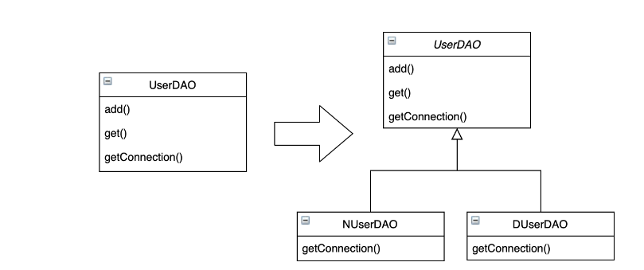
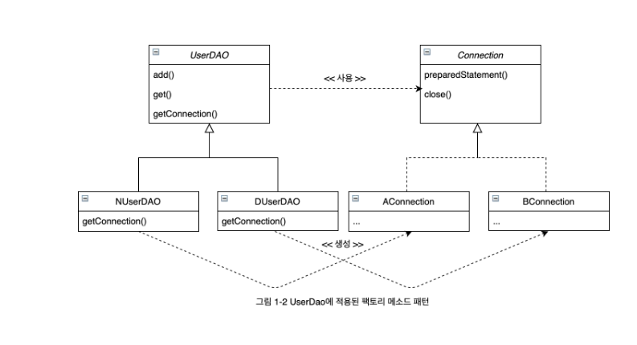
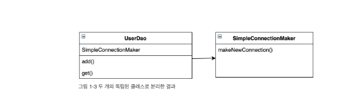
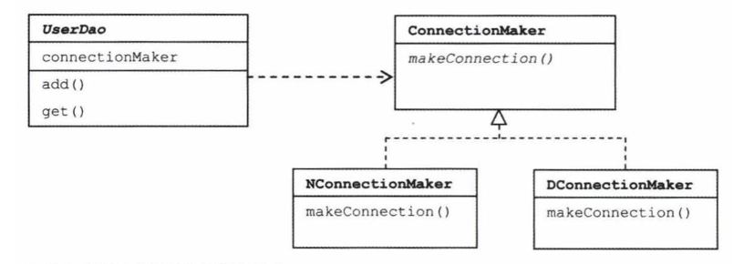
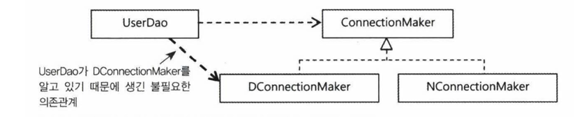
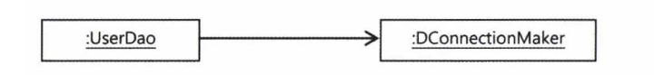
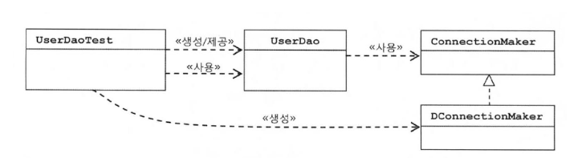

# 2024.07.22  p.53 ~ 87

# 1장 오브젝트와 의존관계
스프링은 자바를 기반으로 한 기술이다. 
스프링이 자바에서 가장 중요하게 가치를 두는 것은 바로 객체지향 프로그래밍이 가능한 언어라는 점이다.
자바 엔터프라이즈 기술의 혼란 속에서 잃어버렸던 객체지향 기술의 진정한 가치를 회복시키고, 
그로부터 객체지향 프로그래밍이 제공하는 폭넓은 혜택을 누릴 수 있도록 기본으로
돌아가자는 것이 스프링의 핵심 철학이다.

그래서 스프링이 가장 관심을 많이 두는 대상은 오브젝트이다.
스프링을 이해하려면 먼저 오브젝트에 깊은 관심을 가져야 한다. 
애플리케이션에서 오브젝트가 생성되고 다른 오브젝트와 관계를 맺고, 사용되고, 소멸하기까지의 전 과정을 진지하게 생각해볼 필요가 있다.
더 나아가서 오브젝트는 어떻게 설계돼야 하는지, 어떤 단위로 만들어지며 어떤 과정을 통해 자신의 존재를 드러내고 등장해야 하는지에 대해서도 
살펴봐야 한다.

결국 오브젝트에 대한 관심은 오브젝트의 기술적인 특징과 사용 방법을 
넘어서 오브젝트의 설계로 발전하게 된다. **객체 지향 설계** 의 기초와
원칙을 비롯해서, 다양한 목적을 위해 재활용 가능한 설계 방법인
디자인 패턴, 좀 더 깔끔한 구조가 되도록 지속적으로 개선해나가는 작업인
리팩토링, 오브젝트가 기대한 대로 동작하고 있는지를 효과적으로
검증하는 데 쓰이는 단위 테스트와 같은 오브젝트 설계와 구현에 관한
여러 가지 응용 기술과 지식이 요구된다.


스프링은 객체지향 설계와 구현에 관해 특정한 모델과 기법을 억지로 강요하지는 않는다.
하지만 오브젝트를 어떻게 효과적으로 설계하고 구현하고, 사용하고, 이를 개선해나갈 것인가에 대한 명쾌한 기준을 마련해준다.
동시에 스프링은 객체지향 기술과 설계 , 구현에 관한 실용적인 전략과 검증된 베스트 프랙티스를 평범한 개발자도 자연스럽고 손쉽게 적용할 수 있도록 
프레임워크 형태로 제공한다. 

## 1.1 초난감 DAO

사용자 정보를 JDBC API 를 통해 DB 에 저장하고 조회할 수 있는
간단한 DAO를 하나 만들어보자

> **DAO** <br/>
> DAO는 DB를 사용해 데이터를 조회하거나 조작하는 기능을 전담하도록 만든 오브젝트를 말한다.


### 1.1.1 User

사용자 정보를 저장할 때는 자바빈 규약을 따르는 오브젝트를 이용하면 편리하다.

사용자 정보를 저장할 User 클래스

`리스트 1-1 사용자 정보 저장용 자바빈 User 클래스`

```java
public class User {
	String id;
	String name;
	String password;
	
	public String getId() {
		return id;
	}
	public void setId(String id) {
		this.id = id;
	}
	public String getName() {
		return name;
	}
	public void setName(String name) {
		this.name = name;
	}
	public String getPassword() {
		return password;
	}
	public void setPassword(String password) {
		this.password = password;
	}
}
```

이제 User 오브젝트에 담긴 정보가 실제로 보관될 DB의 테이블을 하나 만들어보자.
테이블 이름은 USER로 프로퍼티는 User 클래스의 프로퍼티와 동일하게 구성한다.

> **자바빈** <br/>
> 자바빈(JavaBean) 은 원래 비주얼 툴에서 조작 가능한 컴포넌트를 말한다.
> 자바의 주력 개발 플랫폼이 웹 기반의 엔터프라이즈 방식으로 바뀌면서 비주얼 컴포넌트로서 자바빈은 인기를 잃어
> 갔지만, 자바빈의 몇 가지 코딩 관례는 JSP , 빈 , EJB 와 같은 표준 기술과 자바빈 스타일의 오브젝트를 사용하는 오픈소스 기술을 통해
> 계속 이어져 왔다. 이제는 자바빈이라고 말하면 비주얼 컴포넌트라기 보다는 다음 두 가지 관례를 따라 만들어진 오브젝트를 가리킨다.
> 간단히 빈이라고 부르기도 한다.
> - 디폴트 생성자 : 자바빈은 파라미터가 없는 디폴트 생성자를 갖고 있어야 한다. 툴이나 프레임워크에서 리플렉션을 이용해 오브젝트를 생성하기 때문에 필요하다.
> - 프로퍼티 : 자바빈이 노출하는 이름을 가진 속성을 프로퍼티라고 한다. 프로퍼티는 set 으로 시작하는 수정 메소드와 get으로 시작하는 접근자 메소드를 이용해 수정 또는 조회할 수 있다.


### 1.1.2 UserDao

사용자 정보를 DB에 넣고 관리할 수 있는 DAO 클래스를 만들어보자.

사용자 정보를 관리하는 DAO 이므로 UserDao라는 이름으로 클래스를 하나 생성한다.
사용자 정보의 등록, 수정, 삭제와 각종 조회 기능을 만들어야겠지만, 일단 새로운 사용자를 생성하고(add), 아이디를 가지고 사용자 정보를 
읽어오는 (get) 두 개의 메소드를 먼저 만들어보겠다.

JDBC를 이용하는 작업의 일반적인 순서는 다음과 같다.

- DB 연결을 위한 Connection 을 가져온다.
- SQL을 담은 Statement(또는 PreparedStatement) 를 만든다.
- 만들어진 Statement 를 실행한다.
- 조회의 경우 SQL 쿼리의 실행 결과를 ResultSet으로 받아서 정보를 저장할 오브젝트(여기서는 User)에 옮겨준다.
- 작업 중에 생성된 Connection , Statement , ResultSet 같은 리소스는 작업을 마친 후 반드시 닫아준다.
- JDBC API가 만들어내는 예외를 잡아서 직접 처리하거나, 메소드에 throws를 선언해서 예외가 발생하면 메소드 밖으로 던지게 한다.

일단 예외는 모두 멕소드 밖으로 던져버리는 편이 간단하다. 리스트 1-2 는 JDBC API 의 기본적인 사용 방법을 따라서 만든 UserDao 클래스다.


`리스트 1-2 JDBC 를 이용한 등록과 조회 기능이 있는 UserDao 클래스`

```java
public class UserDao {

    public void add(User user) throws ClassNotFoundException, SQLException {
        Class.forName("com.mysql.jdbc.Driver");
        Connection c = DriverManager.getConnection("jdbc:mysql://localhost/springbook", "spring", "book");

        PreparedStatement ps = c.prepareStatement("insert into users(id , name, password) values (?,?,?)");
        ps.setString(1,user.getId());
        ps.setString(2,user.getName());
        ps.setString(3,user.getPassword());

        ps.executeUpdate();

        ps.close();
        c.close();
    }

    public User get(String id) throws ClassNotFoundException, SQLException {
        Class.forName("com.mysql.jdbc.Driver");
        Connection c = DriverManager.getConnection("jdbc:mysql://localhost/springbook?characterEncoding=UTF-8", "spring",
                "book");
        PreparedStatement ps = c
                .prepareStatement("select * from users where id = ?");
        ps.setString(1, id);

        ResultSet rs = ps.executeQuery();
        rs.next();
        User user = new User();
        user.setId(rs.getString("id"));
        user.setName(rs.getString("name"));
        user.setPassword(rs.getString("password"));

        rs.close();
        ps.close();
        c.close();

        return user;
    }
}

```

### 1.1.3 main() 을 이용한 DAO 테스트 코드

만들어진 코드의 기능을 검증하고자 할 때 사용할 수 있는 가장 간단한 방법은 오브젝트 스스로 자신을 검증하도록 만들어주는 것이다.
모든 클래스에는 자신을 엔트리 포인트로 설정해 직접 실행이 가능하게 해주는 스태틱 메소드 main() 이 있지 않은가.


`리스트 1-3 테스트용 main() 메소드`


```java
public class Main {
    public static void main(String[] args) throws SQLException, ClassNotFoundException {
        UserDao dao = new UserDao();

        User user = new User();
        user.setId("cony");
        user.setName("박건희");
        user.setPassword("1234");

        dao.add(user);

        System.out.println(user.getId() +" 등록 성공");

        User user2 = dao.get(user.getId());
        System.out.println("user2.getName() = " + user2.getName());
        System.out.println("user2.getPassword() = " + user2.getPassword());

        System.out.println(user2.getId() + " 조회 성공");
    }
}
```

스프링은 기계적인 답변이나 성급한 결론을 주지 않는다. 최종 결론은 스프링을 이용해 개발자 스스로 만들어내는 것이지,
스프링이 덥석 줄 수 있는 게 아니기 때문이다.
스프링은 단지 그 과정에서 이런 고민을 제대로 하고 있는지 끊임없이 확인해주고, 좋은 결론을 내릴 수 있도록
객체지향 기술과 자바 개발의 선구자들이 먼저 고민하고 제안한 방법에 대한 힌트를 제공해줄 뿐이다.

## 1.2 DAO의 분리

### 1.2.1 관심사의 분리

세상에는 변하는 것과 변하지 않는 것이 있다. 하지만 객체지향의 세계에서는 모든 것이 변한다.
여기서 변한다는 것은 변수나 오브젝트 필드의 값이 변한다는 게 아니다.
오브젝트에 대한 설계와 이를 구현한 코드가 변한다는 뜻이다.

소프트웨어 개발에서 끝이란 개념은 없다. 사용자의 비즈니스 프로세스와
그에 따른 요구사항은 끊임없이 바뀌고 발전한다.

애플리케이션이 기반을 두고 있는 기술도 시간이 지남에 따라 바뀌고, 운영되는 환경도 변화한다. 
애플리케이션 더 이상 사용되지 않아 폐기처분될 때가 돼야 변화는 중지된다.

그래서 개발자가 객체를 설계할 때 가장 염두에 둬야 할 사항은 바로 미래의 변화를 어떻게 대비할 것인가이다.

변화는 먼 미래에만 일어나는 게 아니다. 며칠 내에, 때론 몇 시간 후에 변화에 대한 요구가 갑자기 발생할 수 있다.
객체지향 설계와 프로그래밍이 이전의 절차적 프로그래밍 패러다임에 비해
초기에 좀 더 많은, 번거로운 작업을 요구하는 이유는 객체지향 기술 자체가 지니는,
변화에 효과적으로 대처할 수 있다는 기술적인 특징 때문이다.

객체 지향 기술은 흔히 실세계를 최대한 가깝게 모델링해낼 수 있기 때문에
의미가 있다고 여겨진다. 하지만 그보다는 객체지향 기술이 만들어내는
가상의 추상세계 자체를 효과적으로 구성할 수 있고, 이를 자유롭고 편리하게 변경,
발전, 확장시킬 수 있다는 데 더 의미가 있다.

미래를 준비하는 데 있어 가장 중요한 과제는 변화에 어떻게 대비할 것인가이다. 가장 좋은 대책은 변화의 폭을 
최소한으로 줄여주는 것이다. 두 명의 개발자에게 동일한 기능 변경을 요청했다고 하자.

그러면 어떻게 변경이 일어날 때 필요한 작업을 최소화하고, 그 변경이 다른 곳에 문제를 일으키지 않게 할 수 있었을까?
그것은 **분리와 확장**을 고려한 설계가 있었기 때문이다.

먼저 분리에 대해 생각해보자.
변경에 대한 요청이 "DB를 오라클에서 MySQL로 바꾸면서, 웹 화면의 레이아웃을 다중 프레임 구조에서 단일 프레임에 Ajax 를 적용한 구조로 바꾸고,
매출이 일어날 때에 지난달 평균 매출액보다 많으면 감사 시스템의 정보가 웹 서비스로 전송되는 동시에 로그의 날짜 포맷을 6자리에서 Y2K를 고려해 
8자리로 바꿔라"는 식으로 발생하지는 않는다. 무슨 얘긴가 하면, 모든 변경과 발전은 한 번에 한 가지 관심사항에 집중해서 일어난다는 뜻이다.

문제는, 변화는 대체로 집중된 한 가지 관심에 대해 일어나지만 그에 따른 작업은 한 곳에 집중되지 않는 경우가 많다는 점이아.

변화가 한 번에 한 가지 관심에 집중 돼서 일어난다면, 우리가 준비해야 할 일은
한가지 관심이 한 군데에 집중되게 하는 것이다.
즉 관심이 같은 것끼리는 모으고, 관심이 다른 것은 따로 떨어져 있게 하는 것이다.

프로그래밍의 기초 개념 중에 관심사의 분리(Separation of Concerns)라는 게 있다. 
이를 객체지향에 적용해보면, 관심이 같은 것 끼리는 하나의 객체 안으로
또는 친한 객체로 모이게 하고, 관심이 다른 것은 가능한 따로 떨어져서 
서로 영향을 주지 않도록 분리하는 것이라고 생각할 수 있다.

모든 것을 뭉뚱그려서 한데 모으는 편이 처음엔 쉽고 편하다. 그런데 언젠가는 그 뭉쳐 있는 여러 종류의 관심사를 적절하게 구분하고 따로 분리하는 작업을 해줘야만 할
때가 온다. 관심사가 같은 것끼리 모으고 다른 것은 분리해줌으로써 같은 관심에 효과적으로 집중할 수 있게 만들어주는 것이다.

### 1.2.2 커넥션 만들기의 추출

#### UserDao 의 관심사항

- 첫째는 DB 와 연결을 위한 커넥션을 어떻게 가져올까라는 관심이다. 더 세분화해서 어떤 DB를 쓰고, 어떤 드라이버를 사용할 것이고, 어떤 로그인 정보를 쓰는데, 
그 커넥션을 생성하는 방법은 또 어떤 것이다라는 것까지 구분해서 볼 수도 있다.
- 둘째는 사용자 등록을 위해 DB에 보낼 SQL 문장을 담을 Statement 를 만들고 실행하는 것이다. 여기서의 관심은 파라미터로 넘어온 사용자 정보를 Statement 에 바인딩시키고, 
Statement 에 담긴 SQL 을 DB를 통해 실행시키는 방법이다. 파라미터를 바인딩하는 것과 어떤 SQL을 사용할지를 다른 관심사로 분리할 수도 있기도 하지만, 우선은 이것도 하나로 묶어서 생각하자.
- 셋째는 작업이 끝나면 사용한 리소스인 Statement 와 Connection 오브젝트를 닫아줘서 소중한 공유 리소스를 시스템에 돌려주는 것이다.

UserDao는 현재 초난감 상태이므로, 필요하지만 생략된 것이 많다.

가장 문제가 되는 것은 첫째 관심사인 DB 연결을 위한 Connection 오브젝트를 가져오는 부분이다.

현재 DB 커넥션을 가져오는 코드는 다른 관심사와 섞여서 같은 add()
메소드에 담겨 있다. 

더 큰 문제는 add() 메소드에 있는 DB 커넥션을 가져오는 코드와
동일한 코드가 get() 메소드에도 중복되어 있다는 점이다.

이렇게 하나의 관심사가 방만하게 중복되어 있고, 여기저기 흩어져 있어서
다른 관심의 대상과 얽혀 있으면, 변경이 일어날 때 엄청난 고통을 일으키는 원인이 된다.
지저분하게 꼬여 있는 스파게티 코드가 된다는 뜻이다.

#### 중복 코드의 메소드 추출

가장 먼저 할 일은 커넥션을 가져오는 중복된 코드를 분리하는 것이다.
중복된 DB 연결 코드를 getConnection() 이라는 이름의 독립적인 메소드로 만들어준다.

`리스트 1-4 getConnection() 메소드를 추출해서 중복을 제거한 UserDao`

```java
public class UserDao {

    public void add(User user) throws ClassNotFoundException, SQLException {
        Connection c = getConneciton();

        ...
    }


    public User get(String id) throws ClassNotFoundException, SQLException {
        Connection c = getConneciton();
        ...
    }

    private static Connection getConneciton() throws ClassNotFoundException, SQLException {
        Class.forName("com.mysql.jdbc.Driver");
        return DriverManager.getConnection("jdbc:mysql://localhost/springbook", "root", "1234");
    }
}
```

지금은 UserDao 클래스의 메소드가 두 개이지만 나중에 메소드가
2,000개쯤 된다고 상상해보자.

DB 연결과 관련된 부분에 변경이 일어났을 경우, 예를 들어 DB 종류와 접속 방법이
바뀌어서 드라이버 클래스와 URL 이 바뀌었다거나, 로그인 정보가 변경돼도 
앞으로는 getConnection() 이라는 한 메소드의 코드만 수정하면 된다.
관심의 종류에 따라 코드를 구분해놓았기 때문에 한 가지 관심에 대한 변경이 일어날 경우 그 관심이 집중되는 부분의 코드만 수정하면 된다.
관심이 다른 코드가 있는 메소드에는 영향을 주지도 않을 뿐더러, 관심 내용이 독립적으로 존재하므로 수정도 간단해졌다.


#### 변경사항에 대한 검증 : 리팩토링과 테스트

방금 한 작업은 UserDao 의 기능에는 아무런 변화를 주지 않았다.
여전히 사용자 정보를 등록하고 조회하는 조금 난감한 DAO 클래스 일뿐이다.

하지만 중요한 변화가 있었다. 앞에서 한 작업은 여러 메소드에 중복돼서
등장하는 특정 관심사항이 담긴 코드를 별도의 메소드로 분리해낸 것이다.
이 작업은 기능에는 영향을 주지 않으면서 코드의 구조만 변경한다.
기능이 추가되거나 바뀐 것은 없지만 UserDao는 이전보다 훨씬 깔끔해졌고
미래의 변화에 좀 더 손쉽게 대응할 수 있는 코드가 됐다.
이런 작업을 리팩토링이라고 한다.

리팩토링은 객체지향 개발자라면 반드시 익혀야 하는 기법이다.
초난감 DAO 코드를 개선해나가는 과정에서 우리는 기능을 추가하고 변경하기보다는, 겉으로 드러나는 기능은 그대로 이지만
코드 구조와 구현 방법을 바꿈으로써


> **리팩토링**
> <br/>
> 리팩토링은 기존의 코드를 외부의 동작방식에는 변화 없이 내부 구조를 변경해서 재구성하는 작업 또는 기술을 말한다.
> 리팩토링을 하면 코드 내부의 설계가 개선되어 코드를 이해하기가 더 편해지고, 변화에 효율적으로 대응할 수 있다.
> 결국 생산성은 올라가고, 코드의 품질은 높아지며, 유지보수하기 용이해지고, 견고하면서도 유연한 제품을 개발할 수 있다.
> 리팩토링이 절실히 필요한 코드의 특징을 나쁜 냄새라고 부르기도 한다. 대표적으로, 중복된 코드는 매우 흔하게 발견되는 
> 나쁜 냄새다. 이런 코드는 적절한 리팩토링 방법을 적용해 나쁜 냄새를 제거해줘야 한다.
> <br/>
> 리팩토링은 개발자가 직관적으로 수행할 수 있긴 하지만, 본격적으로 적용하자면 학습과 훈련이 필요하다.
> 나쁜 냄새에는 어떤 종류가 있고, 그에 다른 적절한 리팩토링 방법은 무엇인지 알아보고, 충분한 연습을 해두면 도움이 된다.
> 리팩토링을 공부할 때는 리팩토링에 관해 쳬게적으로 잘 정리한 책인 리팩토링 을 추천한다.


### 1.2.3 DB 커넥션 만들기의 독립

아주 초보적인 관심사의 분리 작업이지만, 메소드 추출만으로도 변화에 좀 더 유연하게
대처할 수 있는 코드를 만들었다. 이번엔 좀 더 나아가서 변화에 대응하는 수준이 아니라,
아예 변화를 반기는 DAO를 만들어보자.

N사와 D 사가 각기 다른 종류의 DB를 사용하고 있고, DB 커넥션을 가져오는 데
 있어 독자적으로 만든 방법을 적용하고 싶어한다는 점이다.
더욱 큰 문제는 UserDao를 구매한 이후에도 DB 커넥션을 가져오는 방법이
종종 변경될 가능성이 있다는 점이다.

#### 상속을 통한 확장

물론 방법은 있다. 기존 UserDao 코드를 한 단계 더 분리하면 된다.

일단 우리가 만든 UserDao 에서 메소드의 구현 코드를 제거하고
getConnection() 을 추상 메소드로 만들어놓는다. 

추상 메소드라서 메소드 코드는 없지만 메소드 자체는 존재한다.

따라서 add() , get() 메서드에서 getConnection() 을 호출하는 
코드는 그대로 유지할 수 있다.

추상 클래스인 UserDao를 N사와 D 사에게 판매한다.

UserDao 를 구입한 포탈사들은 UserDao 클래스를 상속해서
각각 NUserDao  와 DUserDao 라는 서브클래스를 만든다.

서브클래스에서는 UserDao 에서 추상 메소드로 선언했던 getConnection() 메소드를 원하는
방식대로 구현할 수 있다. 이렇게 UserDao 의 소스코드를 제공해서
수정해 쓰도록 하지 않아도 getConnection() 메소드를 원하는 방식으로
확장한 후에 UserDao 기능과 함께 사용할 수 있다.

기존에는 같은 클래스에 다른 메소드로 분리됐던 DB 커넥션 연결이라는 관심을 이번에는 상속을 통해
서브클래스로 분리해버리는 것이다.

`그림 1-1 상속을 통한 UserDao 확장 방법`




`리스트 1-5 상속을 통한 확장 방법이 제공되는 UserDao`

```java
public abstract class UserDao {

    public void add(User user) throws ClassNotFoundException, SQLException {
        Connection c = getConnection();

        PreparedStatement ps = c.prepareStatement("insert into users(id , name, password) values (?,?,?)");
        ps.setString(1, user.getId());
        ps.setString(2, user.getName());
        ps.setString(3, user.getPassword());

        ps.executeUpdate();

        ps.close();
        c.close();
    }


    public User get(String id) throws ClassNotFoundException, SQLException {
        Connection c = getConnection();
        PreparedStatement ps = c
                .prepareStatement("select * from users where id = ?");
        ps.setString(1, id);

        ResultSet rs = ps.executeQuery();
        rs.next();
        User user = new User();
        user.setId(rs.getString("id"));
        user.setName(rs.getString("name"));
        user.setPassword(rs.getString("password"));

        rs.close();
        ps.close();
        c.close();

        return user;
    }

    public abstract Connection getConnection() throws ClassNotFoundException, SQLException;
}

```

```java
public class NUserDao extends UserDao {
    @Override
    public Connection getConnection() throws ClassNotFoundException, SQLException {
       // N 사 DB connection 생성 코드
    }
}

public class DUserDao extends UserDao {
    @Override
    public Connection getConnection() throws ClassNotFoundException, SQLException {
        // D 사 DB connection 생성 코드
    }
}
```
DAO 의 핵심 기능인 어떻게 데이터를 등록하고 가져올것인가
(SQL 작성, 파라미터 바인딩 , 쿼리 실행 , 검색 정보 전달) 라는 관심을 담당하는 
UserDao 와 , DB 연결 방법은 어떻게 할 것인가라는 관심을 담고 있는
NUserDao, DUserDao 가 클래스 레벨로 구분이 되고 있다.

클래스 계층 구조를 통해 두 개의 관심이 독립적으로 분리되면서 변경 작업은 한층 용이해졌다.

슈퍼 클래스에 기본적인 로직의 흐름을 만들고
그 기능의 일부를 추상 메소드나 오버라이딩이 가능한 protected 메소드 등으로
만든 뒤 서브클래스에서 이런 메서드를 필요에 맞게 구현해서 사용하도록 하는 방법을
디자인 패턴에서 템플릿 메소드 패턴이라고 한다. 
템플릿 메소드 패턴은 스프링에서 애용되는 디자인 패턴이다.

UserDao 의 getConnection() 메소드는 Connection 타입 오브젝트를 
생성한다는 기능을 정의해놓은 추상 메소드다. 그리고 UserDao 의 서브클래스의
getConnection() 메소드는 어떤 Connection 클래스의 오브젝트를 어떻게
생성할 것인지를 결정하는 방법이라고도 볼 수 있다.

이렇게 서브클래스에서 구체적인 오브젝트 생성 방법을 결정하게 하는 것을 **팩토리 메서드 패턴(factory method pattern)**
그림 1-2에서 이를 다이어그램으로 표현해뒀다.

서브클래스에서 구현하는 getConnection() 메소드는 JDBC 가 정의한 Connection 인터페이스를 구현한 Connection 오브젝트를 각자의 생성
알고리즘을 이용해 만들어 낸다.
getConnection() 메소드에서 생성하는 Connection 오브젝트의 구현 클래스는 제각각이겠지만 UserDao는 Connection 인터페이스 타입의 
오브젝트라는 것 외에는 관심을 두지 않는다. 그저 Connection 인터페이스에 정의된 메소드를 사용할 뿐이다.

UserDao는 어떤 기능을 사용한다는 데에만 관심이 있고, NUserDao 나 DUserDao 에서는
어떤 식으로 Connection 기능을 제공하는지에 관심을 두고 있는 것이다.


또, 어떤 방법으로 Connection 오브젝트를 만들어내는지도 NUserDao 와 DUserDao 의 관심사항이다.

`그림 1-2 UserDao 에 적용된 팩토리 메소드 패턴`



스프링 개발자들 사이에 자주 언급되는 몇 가지 주요한 디자인 패턴이라도 틈틈이 공부해두면 좋을 것이다.


> **디자인 패턴**
> <br/> 
> 디자인 패턴은 소프트웨어 설계 시 특정 상황에서 자주 만나는 문제를
> 해결하기 위해 사용할 수 있는 재사용 가능한 솔루션을 말한다.
> 모든 패턴에는 간결한 이름이 있어서 잘 알려진 패턴을 적용하고자 할 때
> 간단히 패턴 이름을 언급하는 것만으로도 설계의 의도와 해결책을 함께 설명할 수 있다는 장점이 있다.
> 디자인 패턴은 주로 객체지향 설계에 관한 것이고, 대부분 객체지향적 설계 원칙을 이용해 문제를 해결한다.
> 패턴의 설계 구조를 보면 대부분 비슷한데, 그 이유는 객체지향적인 설계로부터 문제를 해결하기 위해 적용할 수 있는 확장성 추구 방법이 대부분 두 가지
> 구조로 정리되기 때문이다. 하나는 클래스 상속이고 다른 하나는 오브젝트 합성이다. 따라서 패턴의 결과로 나온 코드나 설계 구조만 보면 대부분 비슷해보인다.


------------------

> **템플릿 메소드 패턴** 
> <br/>
> 상속을 통해 슈퍼클래스의 기능을 확장할 때 사용하는 가장 대표적인 방법이다.
> 변하지 않는 기능은 슈퍼클래스에 만들어두고 자주 변경되며 확장할 기능은 서브클래스에서 만들도록 한다.
> 슈퍼클래스에서는 미리 추상 메소드 또는 오버라이드 가능한 메소드를 정의해두고 이를 활용해 코드의 기본 알고리즘을 담고 있는
> 템플릿 메소드를 만든다.
> 슈퍼 클래스에서 디폴트 기능을 정의해두거나 비워뒀다가 서브클래스에서 선택적으로 오버라이드할 수 있도록 만들어둔 메소드를 훅 메소드라고 한다.


-----------

> **팩토리 메소드 패턴**
> <br/>
> 팩토리 메소드 패턴도 템플릿 메소드 패턴과 마찬가지로 상속을 통해 기능을 확장하게 하는 패턴이다.
> 그래서 구조도 비슷하다. 슈퍼클래스 코드에서는 서브클래스에서 구현할 메소드를 호출해서 필요한 타입의 오브젝트를 가져와 사용한다.
>  이 메소드는 주로 인터페이스 타입으로 오브젝트를 리턴하므로 서브클래스에서 정확히 어떤 클래스의 오브젝트를 만들어 리턴할지는  슈퍼클래스에서는 알지 못한다.
> 사실 관심도 없다. 서브클래스는 다양한 방법으로 오브젝트를 생성하는 메소드르 재정의할 수 있다.
> 이렇게 서브 클래스에서 오브젝트 생성 방법과 클래스를 결정할 수 있도록 미리 정의해둔 메소드를 팩토리 메소드라고 하고, 
> 이 방식을 통해 오브젝트 생성 방법을 나머지 로직, 즉 슈퍼클래스의 기본 코드에서 독립시키는 방법을 팩토리 메소드 패턴이라고 한다.


상속 자체는 간단해 보이고 사용하기도 편리하게 느껴지지만
사실 많은 한계점이 있다.
만약 이미 UserDao 가 다른 목적을 위해 상속을 사용하고 있다면 어쩔 것인가?
자바는 클래스의 다중상속을 허용하지 않는다. 단지, 커넥션 객체를 가져오는 방법을 분리하기 위해 상속구조로 만들어버리면,
후에 다른 목적으로 UserDao 에 상속을 적용하기 힘들다.

또 다른 문제는 상속을 통한 상하위 클래스의 관계는 생각보다 밀접하다는 점이다.

서브클래스는 슈퍼클래스의 기능을 직접 사용할 수 있다. 그래서 슈퍼클래스 내부의 변경이 있을 때 모든 서브클래스를 함께 수정하거나
다시 개발해야 할 수도 있다. 
반대로 그런 변화에 따른 불편을 주지 않기 위해 슈퍼클래스가 더 이상 변화하지 않도록 제약을 가해야 할지도 모른다.

## 1.3 DAO의 확장
모든 오브젝트는 변한다고 했다. 그런데 오브젝트가 다 동일한 방식으로 변하는 건 아니다. 
관심사에 따라서 분리한 오브젝트들은 제각기 독특한 변화의 특징이 있다.
지금까지 데이터 엑세스 로직을 어떻게 만들 것인가와 DB 연결을 어떤 방법으로 할 것인가 라는 두 개의 관심을 상하위 클래스로 분리시켰다.
이 두 개의 관심은 변화의 성격이 다르다.

변화의 성격이 다르다는 것은 변화의 이유와 시기, 주기 등이 다르다는 뜻이다. 

UserDao 는 JDBC API를 사용할 것인가 DB 전용 API를 사용할 것인가, 어떤 테이블 이름과 필드 이름을 사용해 어떤 SQL을 만들 것인가,
어떤 오브젝트를 통해 DB에 저장할 정보를 전달받고, DB에서 꺼내온 정보를 저장해서 넘겨줄 것인가와 같은 관심을 가진 코드를 모아둔 것이다.
따라서 이런 관심사가 바뀌면 그때 변경이 일어난다. 
하지만 이때도 DB 연결 방법이 그대로라면 DB 연결 확장 기능을 담은 NUserDao 나 DUserDao 의 코드는 
변하지 않는다. DB 연결 방식이나 DB 커넥션을 가져오는 방법이 바뀌면, 그때는 UserDao 코드는 그대로인 채로 NUserDao 나 DUserDao 의 코드만
바뀐다.

### 1.3.1 클래스의 분리

이번에는 관심사가 다르고 변화의 성격이 다른 이 두 가지 코드를 좀 더 화끈하게 분리해볼 생각이다.
두 개의 관심사를 본격적으로 독립시키면서 동시에 손쉽게 확장할 수 있는 방법을 알아보자.

이번에는 아예 상속관계도 아닌 완전히 독립적인 클래스로 만들어 보겠다. 방법은 간단하다.
DB 커넥션과 관련된 부분을 서브클래스가 아니라, 아예 별도의 클래스에 담는다. 그리고 이렇게 만든 클래스를 UserDao가 이용하게 하면 된다.

`그림 1-3 두 개의 독립된 클래스로 분리한 결과`



그림 1-3에 나와 있는 것처럼 SimpleConnectionMaker 라는 새로운 클래스를 만들고 DB 생성 기능을 그 안에 넣는다.
그리고 UserDao 는 new 키워드를 사용해 SimpleConnectionMaker 클래스의 오브젝트를 만들어두고, 이를 add(), get() 메소드에서
사용하면 된다.

이렇게 수정한 UserDao 코드는 리스트 1-6과 같다. UserDao 는 상속을 통한 방법을 쓰지 않으니 더 이상 abstract 일 필요는 없다.
먼저 생성자에서 SimpleConnectionMaker 의 오브젝트를 만들어두고, add/get 메서드에서 이를 이용해 DB 커넥션을 가져오면 된다.


`리스트 1-6 독립된 SimpleConnectionMaker 를 사용하게 만든 UserDao`

```java
public class UserDao {
    private SimpleConnectionMaker simpleConnectionMaker;
    
    public UserDao() {
        simpleConnectionMaker = new SimpleConnectionMaker();
    }

    public void add(User user) throws ClassNotFoundException, SQLException {
        Connection c = simpleConnectionMaker.makeNewConnection();
        ....
    }


    public User get(String id) throws ClassNotFoundException, SQLException {
        Connection c = simpleConnectionMaker.makeNewConnection();
        ....
    }
    
}
```

DB 커넥션 생성 기능을 독립시킨 SimpleConnectionMaker

`리스트 1-7 독립시킨 DB 연결 기능인 SimpleConnectionMaker`

```java
public class SimpleConnectionMaker {
    public Connection makeNewConnection() throws ClassNotFoundException, SQLException {
        Class.forName("com.mysql.jdbc.Driver");
        return DriverManager.getConnection("jdbc:mysql://localhost/springbook", "root", "1234");
    }
}

```

기존 코드에 많은 수정을 했지만 기능에 변화를 준 것은 없다. 단지 내부 설계를 변경해서 좀 더 나은 코드로 개선했을 뿐이다. 
기능에 변화가 없다는 것은 이런 리팩토링 작업의 전제이기도 하지만, 사실은 검증 내용이기도 하다.
정말 기능의 변화가 없이 동일한지 누군가 확인해주지 않으면 안 된다 따라서 앞에 만들어둔 main() 메소드를
다시 실행해서 수정하기 전과 동일한 결과가 나오는지 확인해보자.

성격이 다른 코드를 화끈하게 분리하기는 잘 한 것 같은데, 이번엔 다른 문제가 발생했다.

N 사와 D 사에 UserDao 클래스만 공급하고 상속을 통해 DB 커넥션 기능을 확장해서 사용하게 했던 게 다시 불가능해졌다.
왜냐하면 UserDao 의 코드가 SimpleConnectionMaker 라는 특정 클래스에 종속되어 있기 때문에
상속을  사용했을 때 처럼 UserDao 코드의 수정 없이 DB 커넥션 생성 기능을 변경할 방법이 없다.


```java
this.simpleConnectionMaker = new SimpleConnectionMaker();
```

이렇게 클래스를 분리한 경우에도 상속을 이용했을 때와 마찬가지로 자유로운 확장이 가능하게 하려면 두 가지 문제를 해결해야 한다.

두 번째 문제는 DB 커넥션을 제공하는 클래스가 어떤 것인지를 UserDao 가 구체적으로 알고 있어야 한다는 점이다.
UserDao 에 SimpleConnectionMaker 라는 클래스 타입의 인스턴스 변수까지 정의해놓고 있으니, 
N사에서 다른 클래스를 구현하면 어쩔 수 없이 UserDao 자체를 다시 수정해야 한다.

이런 문제의 근본적인 원인은 UserDao 가 바뀔 수 있는 정보, 즉 DB 커넥션을 가져오는 클래스에 대해 너무 많이 알고 있기 때문이다.
어떤 클래스가 쓰일지, 그 클래스에서 커넥션을 가져오는 메소드는 이름이 뭔지까지 일일이 알고 있어야 한다.
UserDao 가 SimpleConnectionMaker 라는 특정 클래스에 종속적이기 떼문에 앞으로 납품 후에 고객이 DB 커넥션을 가져오는 방법을 자유롭게 확장하기가 힘들어졌다.

### 1.3.2 인터페이스의 도입

두 개의 클래스가 서로 긴밀하게 연결되어 있지 않도록 중간에 추상적은 느슨한 연결고리를 만들어주는 것이다.
추상화란 어떤 것들의 공통적인 성격을 뽑아내어 이를 따로 분리해내는 작업이다.
자바가 추상화를 위해 제공하는 가장 유용한 도구는 바로 인터페이스다.

인터페이스는 자신을 구현한 클래스에 대한 구체적인 정보는 모두 감춰버린다.
결국 오브젝트를 만들려면 구체적인 클래스 하나를 선택해야겠지만 인터페이스로 추상화해놓은 최소한의 통로를 통해 
접근하는 쪽에서는 오브젝트를 만들 때 사용하는 클래스가 무엇인지 몰라도 된다.
인터페이스를 통해 접근하게 되면 실제 구현 클래스를 바꿔도 신경 쓸 일이 없다.

그림 1-4는 인터페이스를 도입한 후 클래스의 관계를 표현한 것이다.

`그림 1-4 인터페이스를 도입한 결과`



인터페이스는 어떤 일을 하겠다는 기능만 정의해놓은 것이다.


`리스트 1-8 ConnectionMaker 인터페이스`

```java
public interface ConnectionMaker {

 public Connection makeConnection() throws ClassNotFoundException,
         SQLException;

}

```

고객에게 납품을 할 때는 UserDao 클래스와 함께 ConnectionMaker 인터페이스도 전달한다.
그리고 D사의 개발자라면 리스트 1-9와 같이 ConnectionMaker 인터페이스를 구현한 클래스를 만들고, 자신들의 DB 연결 기술을 이용해 
DB 커넥션을 가져오도록 메소드를 작성해주면 된다.

`리스트 1-9 ConnectionMaker 구현 클래스`

```java
public class DConnectionMaker implements ConnectionMaker {
	public Connection makeConnection() throws ClassNotFoundException,
			SQLException {
		Class.forName("com.mysql.jdbc.Driver");
		Connection c = DriverManager.getConnection(
				"jdbc:mysql://localhost/springbook?characterEncoding=UTF-8", "spring", "book");
		return c;
	}
}

```

리스트 1-10은 특정 클래스 대신 인터페이스를 사용해서 DB 커넥션을 가져와 사용하도록 수정한 UserDao 코드다.


`리스트 1-10 ConnectionMaker 인터페이스를 사용하도록 개선한 UserDao`

```java
public class UserDao {
    private ConnectionMaker connectionMaker;

    public UserDao() {
        connectionMaker = new DConnectionMaker();
    }

    public void add(User user) throws ClassNotFoundException, SQLException {
        Connection c = connectionMaker.makeConnection();
        ...
    }


    public User get(String id) throws ClassNotFoundException, SQLException {
        Connection c = connectionMaker.makeConnection();
        ...
    }

}
```

UserDao 의 다른 모든 곳에서는 인터페이스를 이용하게 만들어서 DB 커넥션을 제공하는 클래스에 대한 구체적인 정보는 모두 제거가 가능했지만,
초기에 한 번 어떤 클래스의 오브젝트를 사용할지를 결정하는 생성자의 코드는 제거되지 않고 남아 있다.
제거하고 싶은데 간단한 방법이 보이지 않는다. 클래스 이름을 넣어서 오브젝트를 만들지 않으면 어떻게 사용하란 말인가!


### 1.3.3 관계설정 책임의 분리
UserDao 와 ConnectionMaker라는 두 개의 관심을 인터페이스를 써가면서까지 거의 완벽하게 분리했는데도,
왜 UserDao 가 인터페이스뿐 아니라 구체적인 클래스까지 알아야 한다는 문제가 발생하는 것일까?
여전히 UserDao 에는 어떤 ConnecionMaker 구현 클래스를 사용할지를 결정하는 코드가 남아 있다.
이 때문에 인터페이스를 이용한 분리에도 불구하고 여전히 UserDao 변경 없이는
DB 커넥션 기능의 확장이 자유롭지 못한데, 그 이유는 UserDao 안에 분리되지 않은,
또 다른 관심 사항이 존재하기 때문이다.

UserDao 에는 어떤 ConnectionMaker 구현 클래스를 사용할지를 결정하는 new DConnectionMaker() 라는 코드가 있다.
이 코드는 기존 UserDao 의 관심사인 JDBC API 와 User 오브젝트를 이용해 DB에 정보를 넣고 빼는 것도 아니고, ConnectionMaker 
인터페이스로 대표되는 DB 커넥션을 어떻게 가져올 것인가라는 관심사도 아니다.


바로 UserDao 가 어떤 ConnectionMaker 구현 클래스의 오브젝트를 이용하게 할지를 결정 하는 것이다. 
간단히 말하자면 UserDao 와 UserDao 가 사용할 ConnectionMaker 의 특정 구현 클래스 사이의 관계를 설정해주는 것에 관한 관심이다.

이 관심사를 담은 코드를 UserDao 에서 분리하지 않으면 UserDao 는 결코 독립적으로 확장 가능한 클래스가 될 수 없다.

UserDao 를 사용하는 클라이언트가 적어도 하나는 존재할 것이다.
여기서 말하는 클라이언트는 거창하게 브라우저나 PC 같은 클라이언트 장비를 말하는 게 아니다.
두 개의 오브젝트가 있고 한 오브젝트가 다른 오브젝트의 기능을 사용한다면, 사용되는 쪽이 사용하는 쪽에게 서비스를 제공하는 셈이다.
따라서 사용되는 오브젝트를 서비스 , 사용하는 오브젝트를 클라이언트라고 부를 수 있다.
UserDao 의 클라이언트라고 하면 UserDao를 사용하는 오브젝트를 가리킨다.
UserDao 의 클라이언트 오브젝트가 바로 제 3의 관심사항인 UserDao 와 ConnectionMaker 구현 클래스의 관계를 결정해주는 기능을
분리해서 두기에 적절한 곳이기 때문이다.

UserDao의 클라이언트에서 UserDao 를 사용하기 전에, 먼저 UserDao가 어떤 ConnectionMaker의 구현 클래스를 
사용할지를 결정하도록 만들어보자.

즉 UserDao 오브젝트와 특정 클래스로부터 만들어진 ConnectionMaker 오브젝트 사이에 관계를 설정해주는 것이다.
사실 클래스 사이의 관계를 설정해주는 건 아니다. 클래스 사이에 관계가 만들어진다는 것은 한 클래스가 인터페이스 없이 다른 클래스를 직접 사용한다는
뜻이다. 따라서 클래스가 아니라 오브젝트와 오브젝트 사이의 관계를 설정해줘야 한다.

오브젝트 사이의 관계는 런타임 시에 한쪽이 다른 오브젝트의 레퍼런스를 갖고 있는 방식으로 만들어진다.
예를 들어 다음 코드는 DConnectionMaker 의 오브젝트의 레퍼런스를 UserDao 의 connectionMaker 변수에 넣어서 사용하게 함으로써, 
이 두개의 오브젝트가 '시용'이라는 관계를 맺게 해준다.

```java
connectionMaker = new DConnectionMaker();
```

오브젝트 사이의 관계가 만들어지려면 일단 만들어진 오브젝트가 있어야 하는데, 이 처럼 직접 생성자를 호출해서 직접 오브젝트를 만드는 방법도 있지만
외부에서 만들어 준 것을 가져오는 방법도 있다. UserDao도 동작하려면 하나의 오브젝트가 만들어 질 것이다.

UserDao 오브젝트가 다른 오브젝트와 관계를 맺으려면 관계를 맺을 오브젝트가 있어야 할 텐데, 이 오브젝트를 꼭 UserDao 의 코드 내에서
만들 필요는 없다.
오브젝트는 얼마든지 메소드 파라미터 등을 이용해 전달할 수 있으니 외부에서 만든 걸 가져올 수도 있다.

외부에서 만든 오브젝트를 전달받으려면 메소드 파라미터나 생성자 파라미터를 이용하면 된다.
이때 파라미터의 타입을 전달받을 오브젝트의 인터페이스로 선언해뒀다고 해보자.
이런 경우 파라미터로 전달되는 오브젝트의 클래스는 해당 인터페이스를 구현하기만 했다면 어떤 것이든지 상관없다.

`그림 1-5 클래스 사이에 불필요한 의존관계를 갖고 있는 구조 `



물론 UserDao 오브젝트가 동작하려면 특정 클래스의 오브젝트와 관계를 맺어야 한다. 
DB 커넥션을 제공하는 기능을 가진 오브젝트를 사용하기는 해야 하니 말이다. 
인터페이스 자체에는 기능이 없으니 이를 사용할 수도 없다. 결국 특정 클래스의 오브젝트와 관계를 맺게 된다.

하지만 클래스 사이에 관계가 만들어진 것은 아니고, 단지 오브젝트 사이에 다이내믹한 관계가 만들어지는 것이다.
이 차이를 잘 구분할 수 있어야 한다.
클래스 사이의 관계는 코드에 다른 클래스 이름이 나타나기 때문에 만들어지는 것이다. 
하지만 오브젝트 사이의 관계는 그렇지 않다.
코드에서는 특정 클래스를 전혀 알지 못하더라도 해당 클래스가 구현한 인터페이스를 사용했다면, 그 클래스의 오브젝트를 인터페이스 타입으로 받아서 사용할 수 있다.
바로 객체지향 프로그램에는 다형성이라는 특징이 있는 덕분이다.

UserDao 오브젝트가 DConnectionMaker 오브젝트를 사용하게 하려면 두 클래스의 오브젝트 사이에 런타임 사용관계 또는 링크, 또는 의존관계라고 불리는
관계를 맺어주면 된다. 그림 1-6은 이 두 오브젝트 사이에 의존관계가 만들어진 것을 보여준다.

런타임 시점의 오브젝트 간 관계를 나타내는 오브젝트 다이어그램임을 주의하자. 모델링 시에는 없었던, 그래서 코드에는 보이지 않던 관계가
오브젝트로 만들어진 후에 생성되는 것이다.

`그림 1-6 UserDao 오브젝트와 DConnectionMaker 오브젝트 사이의 관계가 만들어진 상태`




클라이언트는 자기가 UserDao 를 사용해야 할 입장이기 때문에 UserDao의 세부 전략이라고도 볼 수 있는 ConnectionMaker 의 구현 클래스를 선택하고,
선택한 클래스의 오브젝트를 생성해서 UserDao 와 연결해줄 수 있다.
기존의 UserDao 에서는 생성자에게 이 책임이 있었다. 자신이 사용할 오브젝트를 직접 만들어서, 자신과 관계를 만들어버리는 것이 기존 UserDao 생성자가 한 일이다.
다시 말하지만 이것은 UserDao 의 관심도 아니고 책임도 아니다. 다른 관심사가 함께 있으니
확장성을 떨어뜨리는 문제를 일으키는 것이다.

자, 이제 이 다른 관심을 분리해서 클라이언트에게 떠넘겨보자.

`리스트 1-11 수정한 생성자`

```java
	public UserDao(ConnectionMaker simpleConnectionMaker) {
		this.connectionMaker = simpleConnectionMaker;
	}

```
DConnectionMaker 는 왜 사라졌을까? DConnectionMaker 를 생성하는 코드는 UserDao 와 특정 ConnectionMaker 구현 클래스의 오브젝트 간 관계를 
맺는 책임을 담당하는 코드였는데, 그것을 UserDao 의 클라이언트에게 넘겨버렸기 때문이다.

`리스트 1-12 관계설정 책임이 추가된 UserDao 클라이언트인 main() 메소드`

```java
public class UserDaoTest {
	public static void main(String[] args) throws ClassNotFoundException, SQLException {
		ConnectionMaker connectionMaker = new DConnectionMaker();
		UserDao dao = new UserDao(connectionMaker);

		User user = new User();
		user.setId("whiteship");
		user.setName("��⼱");
		user.setPassword("married");

		dao.add(user);
			
		System.out.println(user.getId() + " ��� ����");
		
		User user2 = dao.get(user.getId());
		System.out.println(user2.getName());
		System.out.println(user2.getPassword());
			
		System.out.println(user2.getId() + " ��ȸ ����");
	}
}

```

UserDaoTest 는 UserDao 와 ConnectionMaker 구현 클래스와의 런타임 오브젝트 의존관계를 설정하는 책임을 담당해야 한다.

클라이언트인 UserDaoTest 가 이렇게 수고해준 덕분에 이제는 UserDao 의 변경 없이도 자유롭게 N 사와 D 사는 자신들을 위한 DB 접속 클래스를 만들어서
UserDao가 사용하게 할 수 있다. 

`리스트 1-13 클라이언트 역할의 UserDaoTest`


UserDao 는 자신의 관심사이자 책임인 사용자 데이터 엑세스 작업을 위해 SQL을 생성하고, 이를 실행하는 데만 집중할 수 있게 됐다.
더 이상 DB 생성 방법이나 전략에 대해서는 조금도 고민할 필요가 없다.
DB 커넥션을 가져오는 방법을 어떻게 변경하든 UserDao 코드는 아무런 영향을 받지 않는다.

DAO 가 아무리 많아져도 DB 접속 방법에 대한 관심은 오직 한 군데에 집중되게 할 수 있고, DB 접속 방법을 변경해야 할 때도 오직 한 곳의 코드만 수정하면 된다.

`그림 1-7 관계설정 책임을 담당한 클라이언트 UserDaoTest가 추가된 구조`



### 1.3.4 원칙과 패턴

#### 개방 폐쇄 원칙

'클래스나 모듈은 확장에는 열려 있어야 하고 변경에는 닫혀 있어야 한다.' 라고 할 수 있다.

UserDao 는 DB 연결 방법이라는 기능을 확장하는 데는 열려 있다. UserDao 에 전혀 영향을 주지 않고도 얼마든지 기능을 확장할 수 있게 되어 있다.
동시에 UserDao 자신의 핵심 기능을 구현한 코드는 그런 변화에 영향을 받지 않고 유지할 수 있으므로 변경에는 닫혀 있다고 말할 수 있다.

잘 설계된 객체지향 클래스의 구조를 살펴보면 바로 이 개발 폐쇄 원칙을 아주 잘 지키고 있다.
인터페이스를 사용해 확장 기능을 저의한 대부분의 API 는 바로 이 개발 폐쇄 원칙을 따른다고 볼 수 있다.

#### 높은 응집도와 낮은 결합도

개방 폐쇄 원칙은 높은 응집도와 낮은 결합도(high coherence and low coupling )라는 소프트웨어 개발의 고전적인 원리로도 설명이 가능하다.
응집도가 높다는 건 하나의 모듈, 클래스가 하나의 책임 또는 관심사에만 집중되어 있다는 뜻이다.
불필요하거나 직접 관련이 없는 외부의 관심과 책임이 얽혀 있지 않으며,
하나의 공통 관심사는 한 클래스에 모여 있다. 
높은 응집도는 클래스 레벨뿐 아니라, 패키지, 컴포넌트, 모듈에 이르기까지 그 대상의 크기가 달라도 동일한 원리로 적용될 수 있다.


`높은 응집도`

응집도가 높다는 것은 변화가 일어날 때 해당 모듈에서 변하는 부분이 크다는 것으로 설명할 수도 있다.
즉 변경이 일어날 때 모듈의 많은 부분이 함께 바뀐다면 응집도가 높다고 말할 수 있다.
만약 모듈의 일부분에만 변경이 일어나도 된다면, 모듈 전체에서 어떤 부분이 바뀌어야 하는지 파악해야 하고, 또 그 변경으로 인해 바뀌지 않는 부분에는 다른 영향을 
미치지는 않는지 확인해야 하는 이중의 부담이 생긴다.

ConnectionMaker 인터페이스를 이용해 DB 연결 기능을 독립시킨 경우라면, 그저 DB 커넥션 풀을
활용하는 ConnectionMaker 구현 클래스를 새로 만들기만 하면 된다. 
기존에 구현한 DConnectionMaker 를 일부 수정하더라도 마찬가지다. 
작업은 항상 전체적으로 일어나고 무엇을 변경할지 명확하며, 그것이 UserDao 등 다른 클래스의 수정을
요구하지 않을뿐더러, 기능에 영향을 주지 않는다는 사실을 손쉽게 확인할 수 있다.

`낮은 결합도`

낮은 결합도는 높은 응집도 보다 더 민감한 원칙이다. 책임과 관심사가 다른 오브젝트 또는 모듈과는 낮은 결합도, 
즉 느슨하게 연결된 형태를 유지하는 것이 바람직하다. 
느슨한 연결은 관계를 유지하는 데 꼭 필요한 최소한의 방법만 간접적인 형태로 제공하고, 나머지는 서로 독립적이고
알 필요도 없게 만들어주는 것이다.
결합도가 낮아지면 변화에 대응하는 속도가 높아지고, 구성이 깔끔해진다. 또한 확장하기에도 매우 편리하다.

여기서 결합도란 '하나의 오브젝트가 변경이 일어날 때에 관계를 맺고 있는 다른 오브젝트에게 변화를 요구하는 정도'
라고 설명할 수 있다.
낮은 결합도란 결국, 하나의 변경이 발생할 때 마치 파문이 이는 것처럼 여타 모듈과 객체로 변경에 대한 요구가
전파되지 않은 상태를 말한다. 

결합도가 높아지면 변경에 따르는 작업량이 많아지고, 변경으로 인해 버그가 발생할 가능성이 높아진다.

#### 전략 패턴

개선한 UserDaoTest-UserDao-ConnectionMaker 구조를 디자인 패턴의 시각으로 보면
**전략 패턴** 에 해당한다고 볼 수 있다. 전략 패턴은 디자인 패턴의 꽃이라고 불릴 만큼
다양하게 자주 사용되는 패턴이다.
개방 폐쇄 원칙의 실현에도 가장 잘 들어맞는 패턴이라고 볼 수 있다.

전략 패턴은 자신의 기능 맥락에서 ,필요에 따라 변경이 필요한 알고리즘을 인터페이스를 통해 통째로 외부로 분리시콕, 이를 구현한
구체적인 알고리즘 클래스를 필요에 따라 바꿔서 사용할 수 있게 하는 디자인 패턴이다.

여기서 말하는 알고리즘이란 거창한 수학적 알고리즘을 말하는 게 아니고, 독립적인
책임으로 분리가 가능한 기능을 뜻한다. 이를 대체 가능한 전략이라고 보기 때문에
패턴의 이름이 전략 패턴이다.

UserDao 는 전략 패턴의 컨텍스트에 해당한다. 컨텍스트는 자신의 기능을 수행하는 데
필요한 기능 중에서 변경 가능한, DB 연결 방식이라는 알고리즘을 ConnectionMaker 라는 인터페이스로 정의하고,
이를 구현한 클래스, 즉 전략을 바꿔가면서 사용할 수 있게 분리했다.
컨텍스트(UserDao) 를 사용하는 클라이언트(UserDaoTest)는 컨텍스트가 사용할 전략(ConnectionMaker 를 구현한 클래스, 예를 들어 DConnectionMaker)을
컨텍스트의 생성자를 통해 제공해주는 게 일반적이다.

스프링이란 바로 지금까지 설명한 객체지향적 설계 원칙과 디자인 패턴에 나타난 장점을 자연스럽게 개발자들이 활용할 수 있게 해주는 프레임워크이다.