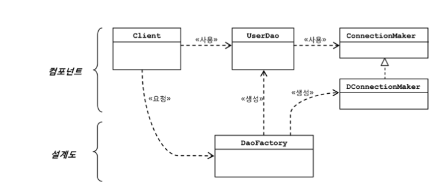

# 2일차 2024-07-23  p.88 ~ 102

## 1.4 제어의 역전 (IoC)

IoC 라는 약자로 많이 사용되는 제어의 역전(inversion of Control)이라는 용어가 있다. 스프링을 통해
일반 개발자들에게는 많이 알려진 용어이지만 , 이 제어의 역전이라는 개념은 상당히 오래전부터 있었다.
90년 중반에 출판된 [GoF 의 디자인 패턴] 책에서도 이 용어를 찾아볼 수 있다.

### 1.4.1 오브젝트 팩토리

지금까지는 문제가 많은 초난감 DAO 를 깔끔한 구조로 리팩토링하는 작업을 수행했다.
그런데 눈치 챘을지 모르겠지만, 사실 그 과정에서 얼렁뚱땅 넘긴 게 하나 있다. 바로 클라이언트인 UserDaoTest 다.

UserDaoTest 는 기존에 UserDao 가 직접 담당하던 기능, 
즉 어떤 ConnecionMaker 구현 클래스를 사용할지를 결정하는 기능을 엉겁결에 떠맡았다.
UserDao가 ConnectionMaker 인터페이스를 구현한 특정 클래스로부터 완벽하게 독립할 수 있도록 UserDao 의 클라이언트인 UserDaoTest 가
그 수고를 담당하게 된 것이다.

그런데 원래 UserDaoTest 는 UserDao 의 기능이 잘 동작하는지를 테스트하려고 만든 것이 아닌가?
그런데 지금은 또 다른 책임까지 떠맡고 있으니 뭔가 문제가 있다.
성격이 다른 책임이나 관심사는 분리해버리는 것이 지금까지 해왔던 주요한 작업이다.
그러니 이것도 분리하자.
이렇게 분리될 기능은 UserDao 와 ConnectionMaker 구현 클래스의 오브젝트를 
만드는 것과, 그렇게 만드러진 두 개의 오브젝트가 연결돼서 사용될 수 있도록 관계를 맺어주는 것이다.


#### 팩토리

분리시킬 기능을 담당할 클래스를 하나 만들어보자
이 클래스의 역할은 객체의 생성 방법을 결정하고 그렇게 만들어진 오브젝트를 돌려주는 것인데,
이런 일을 하는 오브젝트를 흔히 **팩토리** 라고 부른다.

이는 디자인 패턴에서 말하는 특별한 문제를 해결하기 위해 사용되는 추상 팩토리 패턴이나 팩토리 메소드 패턴과는 다르니
혼동하지 말자.
단지 오브젝트를 생성하는 쪽과 생성된 오브젝트를 사용하는 쪽의 역할과 책임을 깔끔하게 분리하려는 목적으로 사용하는 것이다.
어떻게 만들지와 어떻게 사용할지는 분명 다른 관심이다.

팩토리 역할을 맡을 클래스를 DaoFactory 라고 하자. 그리고 UserDaoTest 에 담겨 있던 UserDao, 
ConnectionMaker 관련 생성 작업을
DaoFactory 로 옮기고, UserDaoTest 에서는 DaoFactory 에 요청해서 미리 만들어진 UserDao 오브젝트를 가져와 사용하게 만든다.

리스트 1-14 는 이렇게 만들어진 DaoFactory 클래스다.

`리스트 1-14 UserDao 의 생성 책임을 맡은 팩토리 클래스`

```java
public class DaoFactory {
    public UserDao userDao() {
        ConnectionMaker connectionMaker = new DConnectionMaker();
        return new UserDao(connectionMaker);
    }
}
```

DaoFactory 의 userDao 메소드를 호출하면 DConnectionMaker 를 사용해 DB 커넥션을 가져오도록
이미 설정된 UserDao 오브젝트를 돌려준다.
UserDaoTest 는 이제 UserDao가 어떻게 만들어지는지 어떻게 초기화되어 있는지에 신경 쓰지 않고 팩토리로부터
UserDao 오브젝트를 받아다가,
자신의 관심사인 테스트를 위해 활용하기만 하면 그만이다.
이렇게 해서 각각이 자신의 책임에만 충실하도록 역할에 따라 분리하는 작업을 마쳤다. 

이렇게 수정된 UserDaoTest 의 코드는 리스트 1-15와 같다.

`리스트 1-15 팩토리를 사용하도록 수정한 UserDaoTest`

```java
public class UserDaoTest {
    public static void main(String[] args) {
        UserDao dao = new DaoFactory().userDao();
    }
}

```
리팩토링한 뒤에는 잊지 말고 테스트를 실행하자. 개선된 코드는 이전과 같이 동일하게 동작할 것이다.

#### 설계도로서의 팩토리

이렇게 분리된 오브젝트들의 역할과 관계를 분석해보자.
UserDao 와 ConnectionMaker 는 각각 애플리케이션의 핵심적인 데이터 로직과 기술 로직을 담당하고 있고,
DaoFactory 는 이런 애플리케이션의 오브젝트들을 구성하고 그 관계를 정의하는 책임을 맡고 있음을 알 수 있다.
전자가 실질적인 로직을 담당하는 컴포넌트라면, 후자는 애플리케이션을 구성하는 컴포넌트의 구조와 관계를 정의한 설계도 같은 역할을 한다고 볼 수 있다. 
설계도라고 하면 거창한 것 같지만 , 간단히 어떤 오브젝트가 어떤 오브젝트를 사용하는지를 정의해놓은 코드라고 생각하면 된다.
이런 작업이 애플리케이션 전체에 걸쳐 일어난다면 컴포넌트의 의존관계에 대한 설계도와 같은 역할을 하게 될 것이다.

`그림 1-8 오브젝트 팩토리를 활용한 구조`




이제 N 사와 D 사에 UserDao 를 공급할 때 UserDao , ConnectionMaker 와 함께
DaoFactory 도 제공한다. UserDao 와 달리 DaoFactory 는 소스를 제공한다.
새로운 ConnectionMaker 구현 클래스로 변경이 필요하면 DaoFactory 를 수정해서 변경된 클래스를 생성해
설정해주도록 코드를 수정해주면 된다.
여전히 우리의 핵심 기술이 담긴 UserDao 는 변경이 필요 없으므로 안전하게 소스코드를 보존할 수 있다.
동시에 DB 연결 방식은 자유로운 확장이 가능하다.

DaoFactory 를 분리했을 때 얻을 수 있는 장점은 매우 다양하다. 
그중에서도 애플리케이션의 컴포넌트 역할을 하는 오브젝트와 애플리케이션의 구조를
결정하는 오브젝트를 분리했다는 데 가장 의미가 있다.

### 1.4.2 오브젝트 팩토리의 활용

DaoFactory 에 UserDao 가 아닌 다른 DAO 의 생성 기능을 넣으면 어떻게 될까? 
AccountDao, MessageDao 등을 만들었다고 해보자 
이 경우에 UserDao 를 생성하는 useDao() 메소드를 복사해서 accountDao() , messageDao() 메소드로 만든다면 
새로운 문제가 발생한다.  ConnectionMaker 구현 클래스의 오브젝트를 생성하는  코드가 메소드마다 반복되는 것이다.
어떤 ConnectionMaker 구현 클래스를 사용할지를 결정하는 기능이 중복돼서 나타난다고 볼 수 있다.

여러 개의 DAO 를 생성하는 메소드가 추가 된 리스트 1-16을 살펴보자. 세 개의 DAO 를 만드는 팩토리 메소드 안에 모두
new DConnectionMaker 라는 ConnectionMaker 구현 클래스의 인스턴스를 만드는 부분이 반복돼서 나타난다.
이렇게 오브젝트 생성 코드가 중복되는 건 좋지 않은 현상이다. 
DAO가 더 많아지면 ConnectionMaker 의 구현 클래스를 바꿀 때마다 모든 메소드를 일일이 수정해야 하기 때문이다.

`리스트 1-16 DAO 생성 메소드의 추가로 인해 발생하는 중복`

```java
public class DaoFactory {
    public UserDao userDao() {
        ConnectionMaker connectionMaker = new DConnectionMaker();
        return new UserDao(connectionMaker);
    }

    public AccountDao accountDao() {
        ConnectionMaker connectionMaker = new DConnectionMaker();
        return new AccountDao(connectionMaker);
    }

    public MessageDao messageDao() {
        ConnectionMaker connectionMaker = new DConnectionMaker();
        return new MessageDao(connectionMaker);
    }
}
```

중복 문제를 해결하려면 역시 분리해내는 게 가장 좋은 방법이다. 
ConnectionMaker 의 구현 클래스를 결정하고 오브젝트를 만드는 코드를 별도의 메소드로 뽑아내자
DAO를 생성하는 각 메소드에서는 새로 만든 ConnectionMaker 생성용 메소드를 
이용하도록 수정한다. 초난감 DAO의 코드에서 getConnection 메소드를 따로 만들어
DB 연결 기능을 분리해낸 것과 동일한 리팩토링 방법이다.
이렇게 해두면  아무리 DAO 팩토리 메소드가 많아져도 문제가 없다.
ConnectionMaker 의 구현 클래스를 바꿀 필요가 있을 때도 리스트 1-17과 같이 딱 한 군데만 수정하면 모든 DAO 팩토리 메소드가 적용된다.

`리스트 1-17 생성 오브젝트 코드 수정`

```java
public class DaoFactory {
    public UserDao userDao() {
        return new UserDao(connectionMaker());
    }

    public AccountDao accountDao() {
        return new AccountDao(connectionMaker());
    }

    public MessageDao messageDao() {
        return new MessageDao(connectionMaker());
    }
    
    public ConnectionMaker connectionMaker() {
        return new DConnectionMaker(); // 분리해서 중복을 제거한 ConnectionMaker 타입 오브젝트 생성 코드
    }
}

```

### 1.4.3 제어권의 이전을 통한 제어관계 역전

이제 제어의 역전이라는 개념에 대해 알아보자.
제어의 역전이라는 건, 
간단히 프로그램의 제어 흐름 구조가 뒤바뀌는 것이라고 설명할 수 있다. <br/>
일반적으로 프로그램의 흐름은 main() 메소드와 같이 프로그램이 시작된느 지점에서
다음에 사용할 오브젝트를 결정하고, 결정한 오브젝트를 생성하고, 만들어진
오브젝트에 있는 메소드를 호출하고, 그 오브젝트 메소드 안에서 다음에 사용할 것을 결정하고
호출하는 식의 작업이 반복된다.
이런 프로그램 구조에서 각 오브젝트는 프로그램 흐름을 결정하거나 사용할 오브젝트를 
구성하는 작업에 능동적으로 참여한다.

초기 UserDao 를 보면 테스트용 main() 메소드는 UserDao 클래스의 오브젝트를
직접 생성하고, 만들어진 오브젝트의 메소드를 사용한다. UserDao 또한 자신이
사용할 ConnectionMaker 의 구현 클래스 (예를 들어 DConnectionMaker)를 자신이 결정하고,
그 오브젝트를 필요한 시점에서 생성해두고, 각 메소드에서 이를 사용한다.
모든 오브젝트가 능동적으로 자신이 사용할 클래스를 결정하고, 언제 어떻게 그 오브젝트를 만들지를 스스로 관장한다.
모든 종류의 작업을 사용하는 쪽에서 제어하는 구조다.
<br/>

제어의 역전이란 이런 제어 흐름의 개념을 거꾸로 뒤집는 것이다.
제어의 역전에서는 오브젝트가 자신이 사용할 오브젝트를 스스로 선택하지 않는다.
당연히 생성하지도 않는다. 또 자신도 어떻게 만들어지고 어디서 사용되는지를 알 수 없다. 모든 제어 권한을 자신이 아닌
다른 대상에게 위임하기 때문이다.
프로그램의 시작을 담당하는 main() 과 같은 엔트리 포인트를 제외하면 모든 오브젝트는 이렇게 위임받은 제어 권한을 갖는 특별한
오브젝트에 의해 결정되고 만들어진다.
<br/>

제어의 역전 개념은 사실 이미 폭넓게 적용되어 있다. 서블릿을 생각해보자. 
일반적인 자바 프로그램은 main() 메소드에서 시작해서 개발자가 미리 정한 순서를 따라 오브젝트가 생성되고 실행된다.
그런데 서블릿을 개발해서 서버에 배포할 수는 있지만 , 그 실행을 개발자가 직접 제어할 수 있는 방법은 없다.
서블릿 안에 main() 메소드가 있어서 직접 실행시킬 수 있는 것도 아니다. 
대신 서블릿에 대한 제어 권한을 가진 컨테이너가 적절한 시점에 서블릿 클래스의 오브젝트를
만들고 그 안의 메소드를 호출한다. 이렇게 서블릿이나 JSP , EJB 처럼 컨테이너 안에서 동작하는 구조는
간단한 방식이긴 하지만 제어의 역전 개념이 적용되어 있다고 볼 수 있다.
<br/>

제어의 역전 개념에 적용된 예를 디자인 패턴에서도 여럿 찾아 볼 수 있다.
초난감 DAO 개선 작업의 초기에 적용했던 템플릿 메소드 패턴을 생각해보자
추상 UserDao를 상속한 서브클래스는 getConnection() 을 구현한다.
하지만 이 메소드가 언제 어떻게 사용될지 자신은 모른다. 
서브클래스에서 결정되는 것이 아니다.  단지 이런 방식으로 DB 커넥션을 만든다는
기능만 구현해놓으면, 슈퍼클래스인 UserDao의 템플릿 메소드인 add() , get() 등에서
필요할 때 호출해서 사용하는 것이다.
즉 제어권을 상위 템플릿 메소드에 넘기고 자신은 필요할 때 호출되어 사용되도록 한다는,
제어의 역전 개념을 발견할 수 있다.
템플릿 메소드는 제어의 역전이라는 개념을 활용해 문제를 해결하는 디자인 패턴이라고 볼 수 있다.
<br/><br/>

프레임워크도 제어의 역전 개념이 적용된 대표적인 기술이다.
프레임워크는 라이브러리의 다른 이름이 아니다. 프레임워크는 단지 미리 만들어둔
반제품이나, 확장해서 사용할 수 있도록 준비된 추상 라이브러리의 집합이 아니다.
프레임워크가 어떤 것인지 이해하려면 라이브러리와 프레임워크가 어떻게 다른지 알아야 한다.
라이브러리를 사용하는 애플리케이션 코드는 애플리케이션 흐름을 직접 제어한다.
단지 동작하는 중에 필요한 기능이 있을 때 능동적으로 라이브러리를 사용할 뿐이다.
반면에 프레임워크는 거꾸로 애플리케이션 코드가 프레임워크에 의해 사용된다.
보통 프레임워크 위에 개발한 클래스를 등록해두고, 프레임워크가 흐름을 주도하는 중에
개발자가 만든 애플리케이션 코드를 사용하도록 만드는 방식이다. 
최근에는 툴킷,엔진, 라이브러리 등도 유행을 따라서 무작정 프레임워크라고 부르기도 하는데
이는 잘못된 것이다.
프레임워크에는 분명한 제어의 역전 개념이 적용되어 있어야 한다. 
애플리케이션 코드는 프레임워크가 짜놓은 틀에서 수동적으로 동작해야 한다.

<br/>
우리가 만든 UserDao 와 DaoFactory 에도 제어의 역전이 적용되어 있다.
원래 ConnectionMaker 의 구현 클래스를 결정하고 오브젝트를 만드는 제어권은 UserDao 에게
있었다.
그런데 지금은 DaoFactory 에게 있다.
자신이 어떤 ConnectionMaker 구현 클래스를 만들고 사용할지를 결정할 권한을 DaoFactory 에게
넘겼으니 UserDao는 이제 능동적이 아니라 수동적인 존재가 됐다.
UserDao 자신도 팩토리에 의해 수동적으로 만들어지고 자신이 사용할 오브젝트도 DaoFactory가
공급해주는 것을 수동적으로 사용해야 할 입장이 됐다.
UserDaoTest 는 DaoFactory가 만들고 초기화해서 자신에게 사용하도록 공급해주는 ConnectionMaker 를 사용할 수 밖에 없다.
더욱이 UserDao 와 ConnectionMaker 의 구현체를 생성하는 책임도 DaoFactory 가 맡고 있다.
바로 이것이 제어의 역전이 일어난 상황이다.
자연스럽게 관심을 분리하고 책임을 나누고 유연하게 확장 가능한 구조로 만들기 위해 DaoFactory 를 도입했던 과정이
바로 IoC를 적용하는 작업이었다고 볼 수 있다.

<br/>
그러고 보니, 우리는 대표적인 IoC 프레임워크라고 불리는 스프링 없이도 IoC 개념을 이미 적용한 셈이다.
IoC는 기본적으로 프레임워크만의 기술도 아니고 프레임워크가 꼭 필요한 개념도 아니다.
단순하게 생각하면 디자인 패턴에서도 발견할 수 있는 것처럼 상당히 폭넓게 사용되는
프로그래밍 모델이다. IoC를 적용함으로써 설계가 깔끔해지고 
유연성이 증가하며 확장성이 좋아지기 때문에 필요할 때면 IoC 스타일의 설계와 코드를 만들어 사용하면 된다.
<br/>

제어의 역전에서는 프레임워크 또는 컨테이너와 같이 애플리케잇견 컴포넌트의 생성과 관게 설정, 사용, 생명 주기 관리 등을
관장하는 존재가 필요하다.
DaoFactory 는 오브젝트 수준의 가장 단순한 IoC 컨테이너 내지는 IoC 프레임워크라고 불릴 수 있다.
단순한 적용이라면 DaoFactory와 같이 IoC 제어권을 가진 오브젝트를 분리해서 만드는 방법이면
충분하겠지만, IoC를 애플리케이션 전반에 걸쳐 본격적으로 적용하려면 스프링과 같은 
IoC 프레임워크의 도움을 받는 편이 훨씬 유리하다.
스프링은 IoC룰 모든 기능의 기초가 되는 기반 기술로 삼고 있으며, IoC를 극한까지 적용하고 있는 프레임워크다. 
이제 본격적으로 스프링이 제공하는 IoC에 대해 살펴보자.


## 1.5 스프링의 IoC

스프링은 여러 가지 얼굴을 가졌다. 애플리케이션 개발의 다양한 영역과 기술에 관여한다.
그리고 매우 많은 기능을 제공한다. 하지만 스프링의 핵심을 담당하는 건, 바로 빈 팩토리 또는
애플리케이션 컨텍스트라고 불리는 것이다.
이 두 가지는 우리가 만든 DaoFactory가 하는 일을 좀 더 일반화한 것이라고 설명할 수 있다.

### 1.5.1 오브젝트 팩토리를 이용한 스프링 IoC

#### 애플리케이션 컨텍스트와 설정정보

이제 DaoFactory 를 스프링에서 사용이 가능하도록 변신시켜보자.
스프링에서는  스프링이 제어권을 가지고 직접 만들고 관계를 부여하는 오브젝트를 빈(bean)이라고 부른다.
자바빈 또는 엔터프라이즈 자바빈(EJB)에서 말하는 빈과 비슷한 오브젝트 단위의 애플리케이션 컴포넌트를 말한다.

동시에 스프링 빈은 스프링 컨테이너가 생성과 관계 설정, 사용 등을 제어해주는 제어의 역전이 적용된 오브젝트를 가리키는 말이다.

스프링에서는 빈의 생성과 관계설정 같은 제어를 담당하는 IoC 오브젝트를 빈 팩토리(bean factory)라고 부른다. 
뒤에서 자세히 설명하겠지만 보통 빈 팩토리보다는 이를 좀 더 확장한 애플리케이션 컨텍스트(application context)를 주로 사용한다. 
애플리케이션 컨텍스트는 IoC 방식을 따라 만들어진 일종의 빈 팩토리라고 생각하면 된다.

앞으로 빈 팩토리와 애플리케이션 컨텍스트라는 용어를 함께 사용할 텐데, 두 가지가 동일하다고 생각하면 된다.
빈 팩토리라고 말할 때는 빈을 생성하고 관계를 설정하는 IoC 의 기본 기능에 초점을 맞춘 것이고,
애플리케이션 컨텍스트라고 말할 때는 애플리케이션 전반에 걸쳐 모든 구성요소의 제어 작업을
담당하는 IoC 엔진이라는 의미가 좀 더 부각된다고 보면 된다.

애플리케이션 컨텍스트는 별도의 정보를 참고해서 빈(오브젝트)의 생성, 관계설정 등의 제어 작업을 총괄한다.
기존 DaoFactory 코드에는 설정 정보, 예를 들어 어떤 클래스의 오브젝트를 생성하고
어디에서 사용하도록 연결해줄 것인가 등에 관한 정보가 평범한 자바 코드로 만들어져 있다.
애플리케이션 컨텍스트는 직접 이런 정보를 담고 있진 않다.
대신 별도로 설정정보를 담고 있는 무엇인가를 가져와 이를 활용하는 범용적인 IoC 엔진 같은 것이라고 볼 수 있다.

<br/>
빈 팩토리 또는 애플리케이션 컨텍스트가 사용하는 설정정보를 만드는 방법은 여러가지가 있는데,
우리가 앞에서 만든 오브젝트 팩토리인 DacFactory 도 조금만 손을 보면 설정정보로 사용할 수 있다.
앞에서는 DaoFactory 자체가 설정정보까지 담고 있는 IoC 엔진이었는데 여기서는 자바 코드로 만든 애플리케이션 컨텍스트의 설정정보로 활용될 것이다.

그림 1-8에서 애플리케이션의 로직을 담고 있는 컴포넌트와 설계도 역할을 하는 팩토리를 구분했었다. 
바로 이 설계도라는 게 바로 이런 애플리케이션 컨텍스트와 그 설정정보를 말한다고 보면 된다.
그 자체로는 애플리케이션 로직을 담당하지는 않지만 IoC 방식을 이용해 애플리케이션 컴포넌트를 생성하고, 사용할 관계를 맺어주는 등의 책임을 담당하는 것이다.
마치 건물이 설계도면을 따라서 만들어지듯이, 애플리케이션도 컨텍스트와 그 설정정보를 따라서 만들어지고
구성된다고 생각할 수 있다.

#### DaoFactory 를 사용하는 애플리케이션 컨텍스트

DaoFactory 를 스프링의 빈 팩토리가 사용할 수 있는 본격적인 설정정보로 만들어보자.
먼저 스프링이 빈 팩토리를 위한 오브젝트 설정을 담당하는 클래스라고 인식할 수 있도록 
@Configuration 이라는 애노테이션을 추가한다.

그리고 오브젝트를 만들어 주는 메소드에는 @Bean 이라는 애노테이션을 붙여준다.
userDao() 메소드는 UserDao 타입 오브젝트를 생성하고 초기화해서 돌려주는 것이니 당연히 @Bean 이 붙는다.
또한 ConnectionMaker 타입의 오브젝트를 생성해주는 connectionMaker() 메소드에도
@Bean 을 붙여준다. 그 외에는 수정할 코드가 없다. 
이 두가지 애노테이션 만으로 스프링 프레임워크의 빈 팩토리 또는 애플리케이션 컨텍스트가 IoC 방식의 기능을 
제공할 때 사용할 완벽한 설정정보가 된 것이다.

리스트 1-18은 이 두가지 애노테이션이 적용된 DaoFactory 클래스다. 자바 코드의 탈을 쓰고 있지만,
사실은 XML 과 같은 스프링 전용 설정정보라고 보는 것이 좋다.

`리스트 1-18 스프링 빈 팩토리가 사용할 설정 정보를 담은 DaoFactory 클래스`

```java
@Configuration // 애플리케이션 컨텍스트 또는 빈 팩토리가 사용할 설정정보라는 표시
public class DaoFactory {
    
    @Bean // 오브젝트 생성을 담당하는 IoC 용 메소드라는 표시
    public UserDao userDao() {
        return new UserDao(connectionMaker());
    }
    @Bean
    public ConnectionMaker connectionMaker() {
        return new DConnectionMaker();
    }
}

```

이제 DaoFactory 를 설정정보로 사용하는 애플리케이션 컨텍스트를 만들어보자.
애플리케이션 컨텍스트는 ApplicationContext 타입의 오브젝트다.
ApplicationContext 를 구현한 클래스는 여러 가지가 있는데 DaoFactory 처럼 @Configuration 이 붙은 자바 코드를 설정 정보로 
사용하려면 AnnotationConfigApplicationContext 를 이용하면 된다.

애플리케이션 컨텍스트를 만들 때 생성자 파라미터로 DaoFactory 클래스를 넣어 준다. 이제 이렇게 준빈된 ApplicationContext 의 getBean() 이라는 메소드를 이용해
UserDao 의 오브젝트를 가져올 수 있다. 리스트 1-19 는 애플리케이션 컨텍스트를 적용하도록 수정한 UserDaoTest 다.

`리스트 1-19 애플리케이션 컨텍스트를 적용한 UserDaoTest`

```java
public class UserDaoTest {
    public static void main(String[] args) {
        ApplicationContext context =
                new AnnotationConfigApplicationContext(DaoFactory.class);
        
        UserDao dao = context.getBean("userDao",UserDao.class);
    }
}
```

getBean() 메소드는 ApplicationContext 가 관리하는 오브젝트를 요청하는 메소드다. 
getBean() 의 파라미터인 "userDao" 는 ApplicationContext 에 등록된 빈의 이름이다.
DaoFactory 에서 @Bean 이라는 애노테이션을 userDao 라는 이름의 메소드에 붙였는데,
이 메소드 이름이 바로 빈의 이름이 된다.

userDao 라는 이름의 빈을 가져온다는 것은 DaoFactory 의 userDao() 메소드를 호출해서 그 결과를 가져온다고 생각하면 된다.
메소드의 이름을 myPreciousUserDao() 라고 했다면 getBean("myPreciousUserDao", UserDao.class)로 가져올 수 있다.

그런데 UserDao 를 가져오는 메소드는 하나뿐인데 왜 굳이 이름을 사용할까?
그것은 UserDao 를 생성하는 방식이나 구성을 다르게 가져가는 메소드를 추가할 수 있기 때문이다.
그때는 specialUserDao() 라는 메소드로 만들고 getBean("specialUserDao", UserDao.class) 로 가져오면 된다.

getBean() 은 기본적으로 Object 타입으로 리턴하게 되어 있어서 매번 리턴되는 오브젝트에 다시 캐스팅을 해줘야 하는 부담이 있다.

그런데 스프링을 적용하긴 했지만 사실 앞에서 만든 DaoFactory 를 직접 사용한 것과 기능적으로 다를 바 없다.
오히려 DaoFactory 를 만들어서 바로 사용한 것보다 좀 더 번거로운 준비작업과 코드가 필요하다.
스프링을 사용해 IoC를 적용했다고 해서 별로 장점이 없지 않을까 하는 의문이 들 수도 있다.
그렇다면 굳이 스프링을 사용하지 않고 그냥 DaoFactory 같은 오브젝트 팩토리를 만들어서 사용하면 되는 게 아닐까?
물론 그렇지 않다. 
스프링은 지금 우리가 구현했던 DaoFactory 를 통해서는 얻을 수 없는 방대한 기능과 활용 방법을 제공해준다.

### 1.5.2 애플리케이션 컨텍스트의 동작방식

기본에 오브젝트 팩토리를 이용했던 방식과 스프링의 애플리케이션 컨텍스트를 사용한 방식을 
비교해보자.
<br/>

오브젝트 팩토리에 대응되는 것이 스프링의 애플리케이션 컨텍스트다. 

스프링에서는 이 애플리케이션 컨텍스트를 IoC 컨테이너라 하기도 하고,
간단히 스프링 컨테이너라고 부르기도 한다. 또는 빈 팩토리라고 부를 수도 있다.

애프리케이션 컨텍스트는 ApplicationContext 인터페이스를 구현하는데, ApplicationContext는 빈 팩토리가 구현하는 
BeanFactory 인터페이스를 상속했으므로 애플리케이션 컨텍스트는 일종의 빈 팩토리인 셈이다.
애플리케이션 컨텍스트가 스프링의 가장 대표적인 오브젝트이므로, 애플리케이션 컨텍스트를 그냥
스프링이라고 부르는 개발자도 있다.


DaoFactory 가 UserDao 를 비롯한 DAO 오브젝트를 생성하고 DB 생성 오브젝트와 관계를 맺어주는 제한적인 역할을 하는 데 반해, 
애플리케이션 컨텍스트는 애플리케이션 IoC 를 적용해서 관리할 모든 오브젝트에 대한 생성과 관계설정을 담당한다.

대신 ApplicationContext 에는 DaoFactory 와 달리 직접 오브젝트를 생성하고 관계를 맺어 주는 코드가 없고. 그런 생성정보와 
연관관계 정보를 별도의 설정정보를 통해 얻는다.
때로는 외부의 오브젝트 팩토리에 그 작업을 위임하고 그 결과를 가져다가 사용하기도 한다.

@Configuration 이 붙은 DaoFactory 는 이 애플리케이션 컨텍스트가 활용하는 IoC 설정정보다. 
내부적으로는 애플리케이션 컨텍스트가 DaoFactory 의 userDao() 메소드를 호출해서 오브젝트를 가져온 것을 
클라이언트가 getBean() 으로 요청할 때 전달해준다.

그림 1-9는 이 애플리케이션 컨텍스트가 사용되는 방식을 보여준다.


`그림 1-9 애플리케이션 컨텍스트가 동작하는 방식`


애플리케이션 컨텍스트는 DaoFactory 클래스를 설정정보로 등록해두고 @Bean 이 붙은 메소드의 이름을 가져와
빈 목록을 만들어둔다. 

클라이언트가 애플리케이션 컨텍스트의 getBean() 메서드를 호출해서 자신의 빈 목록에서 요청한 이름이 있는지 찾고, 있다면
빈을 생성하는 메소드를 호출해서 오브젝트를 생성시킨 후 클라이언트에 돌려준다.

DaoFactory 와 같은 오브젝트 팩토리에서 사용했던 IoC 원리를 그대로 적용하는 데 애플리케이션 컨텍스트를 
사용하는 이유는 범용적이고 유연한 방법으로 IoC 기능을 확장하기 위해서다.

DaoFactory 를 오브젝트 팩토리로 직접 사용했을 때와 비교해서 
애플리케이션 컨텍스트를 사용했을 때 얻을 수 있는 장점은 다음과 같다.

- ####  **클라이언트는 구체적인 팩토리 클래스를 알 필요가 없다.**
<br/>
애플리케이션이 발전하면 DaoFactory 처럼 IoC를 적용한 오브젝트도 계속 추가될 것이다.
클라이언트가 필요한 오브젝트를 가져오려면 어떤 팩토리 클래스를 사용해야 할지 알아야 하고,
필요할 때마다 팩토리 오브젝트를 생성해야 하는 번거로움이 있다.
애플리케이션 컨텍스트를 사용하면 오브젝트 팩토리가 아무리 많아져도 이를 
알아야 하거나 직접 사용할 필요가 없다. 애플리케이션 컨텍스트를 잉요하면 일관된 방식으로
원하는 오브젝트를 가져올 수 있다. 또, DaoFactory 처럼 자바 코드를 작성하는 대신
XML 처럼 단순한 방법을 사용해 애플리케이션 컨텍스트가 사용할 IoC 설정정보를 만들 수도 있다.

- ####  **애플리케이션 컨텍스트는 종합 IoC 서비스를 제공해준다.**
<br/>
애플리케이션 컨텍스트의 역할은 단지 오브젝트 생성과 다른 오브젝트와의 관계설정만이 전부가 아니다.
오브젝트가 만들어지는 방식, 시점과 전략을 다르게 가져갈 수도 있고, 이에 부가적으로 자동생성,
오브젝트에 대한 후처리, 정보의 조합, 설정 방식의 다변화, 인터셉터 등 오브젝트를 효과적으로 활용할 수 있는 다양한 기능을 제공한다.
또 빈이 사용할 수 있는 기반기술 서비스나 외부 시스템과의 연동 등을 컨테이너 차원에서 제공해주기도 한다.

- #### **애플리케이션 컨텍스트는 빈을 검색하는 다양한 방법을 제공한다.**

애플리케이션 컨텍스트의 getBean() 메소드는 빈의 이름을 이용해 빈을 찾아준다.
타입만으로 빈을 검색하거나 특별한 애노테이션 설정이 되어 있는 빈을 찾을 수도 있다.

### 1.5.3 스프링 IoC 의 용어 정리

- #### 빈

빈 또는 빈 오브젝트는 스프링이 IoC 방식으로 관리하는 오브젝트라는 뜻이다. 
관리 되는 오브젝트라고 부르기도 한다.
주의할 점은 스프링을 사용하는 애플리케이션에서 만들어지는 모든 오브젝트가 다 빈은 아니라는 사실이다.
그중에서 스프링이 직접 그 생성과 제어를 담당하는 오브젝트만을 빈이라고 부른다.

- #### 빈 팩토리
스프링의 IoC를 담당하는 핵심 컨테이너를 가리킨다. 빈을 등록하고 , 생성하고, 조회하고 돌려주고, 
그 외에 부가적인 빈을 관리하는 기능을 담당한다.
보통은 이 빈 팩토리를 바로 사용하지 않고, 이를 확장한 애플리케이션 컨텍스트를 이용한다.
BeanFactory 라고 붙여쓰면 빈 팩토리가 구현하고 있는 가장 기본적인 인터페이스의 이름이 된다.
이 인터페이스에 getBean()과 같은 메소드가 정의되어 있다.


- #### 애플리케이션 컨텍스트

빈 팩토리를 확장한 IoC 컨테이너다. 빈을 등록하고 관리하는 기본적인 기능은 빈 팩토리와 동일하다.
여기에 스프링이 제공하는 각종 부가 서비스를 추가로 제공한다. 빈 팩토리라고 부를 때는 주로 빈의 생성과 제어의 관점에서 이야기하는 것이고,
애플리케이션 컨텍스트라고 할 때는 스프링이 제공하는 애플리케이션 지원 기능을 모두 포함해서 이야기하는 것이라고 보면 된다.
스프링에서는 애플리케이션 컨텍스트라는 용어를 빈 팩토리보다 더 많이 사용한다.


- #### 설정정보/설정 메타정보

스프링의 설정정보란 애플리케이션 컨텍스트 또는 빈 팩토리가 IoC 를 적용하기 위해 사용하는 메타정보를 말한다.
영어로 'configuration' 이라고 하는데, 이는 구성정보 내지는 형상정보라는 의미다.
실제로 스프링의 설정정보는 컨테이너에 어떤 기능을 세팅하거나 조정하는 경우에도 사용하지만,
그보다는 IoC 컨테이너에 의해 관리되는 애플리케이션 오브젝트를 생성하고 구성할 때 사용된다.
애플리케이션의 형상 정보라고 부르기도 한다.

- #### 컨테이너 또는 IoC 컨테이너

IoC 방식으로 빈을 관리한다는 의미에서 애플리케이션 컨텍스트나 빈 팩토리를 컨테이너 또는
IoC 컨테이너라고도 한다. 후자는 주로 빈 팩토리의 관점에서 이야기하는 것이고,
그냥 컨테이너 또는 스프링 컨테이너라고 할 때는 애플리케이션 컨텍스트를 가리키는 것이라고 보면 된다.

컨테이너라는 말 자체가 IoC 의 개념을 담고 있기 때문에 이름이 긴 애플리케이션 컨텍스트 대신에
스프링 컨테이너라고 부르는 걸 선호하는 사람들도 있다. 또 컨테이너라는 말은 애플리케이션 컨텍스트보다 추상적인 표현이기도 하다.
애플리케이션 컨텍스트는 그 자체로 ApplicationContext 인터페이스를 구현한 오브젝트를 가리키기도 하는데, 
애플리케이션 컨텍스트 오브젝트는 하나의 애플리케이션에서 보통 여러 개가 만들어져 사용된다. 
이를 통틀어서 스프링 컨테이너라고 부를 수 있다.

- #### 스프링 프레임워크

스프링 프레임워크는 IoC 컨테이너, 애플리케이션 컨텍스트를 포함해서 스프링이 제공하는 모든 기능을 통틀어 말할 때 주로 사용한다.

